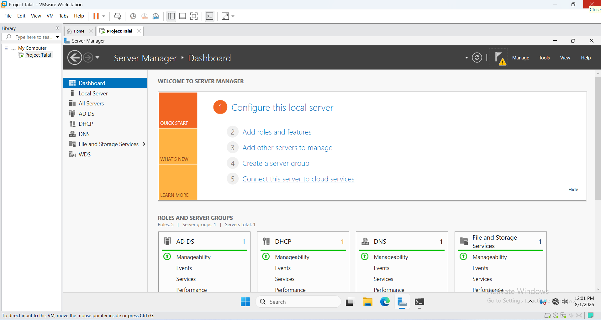
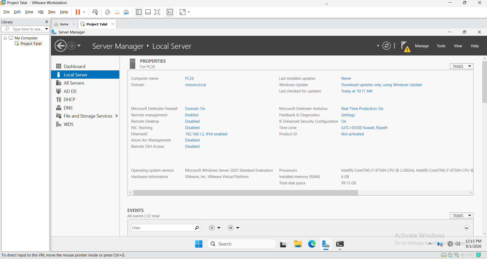
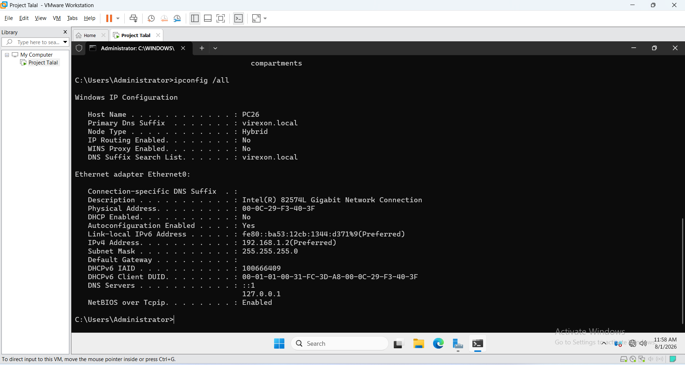
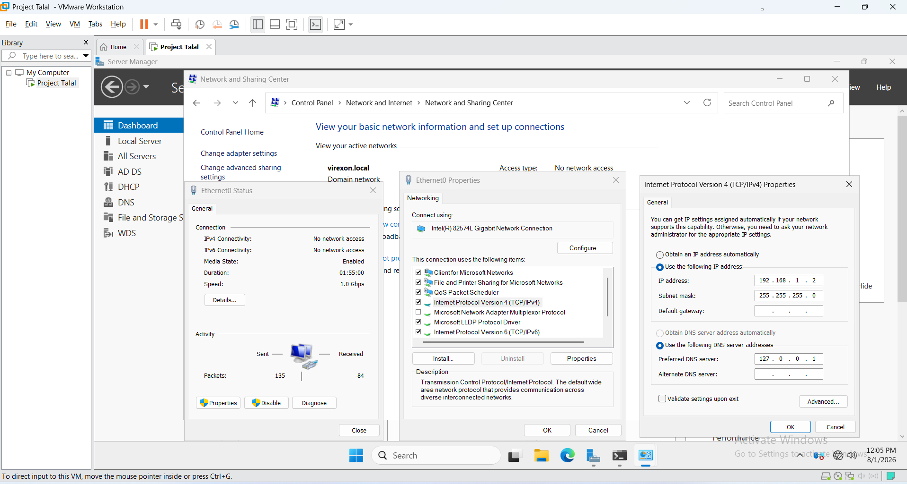
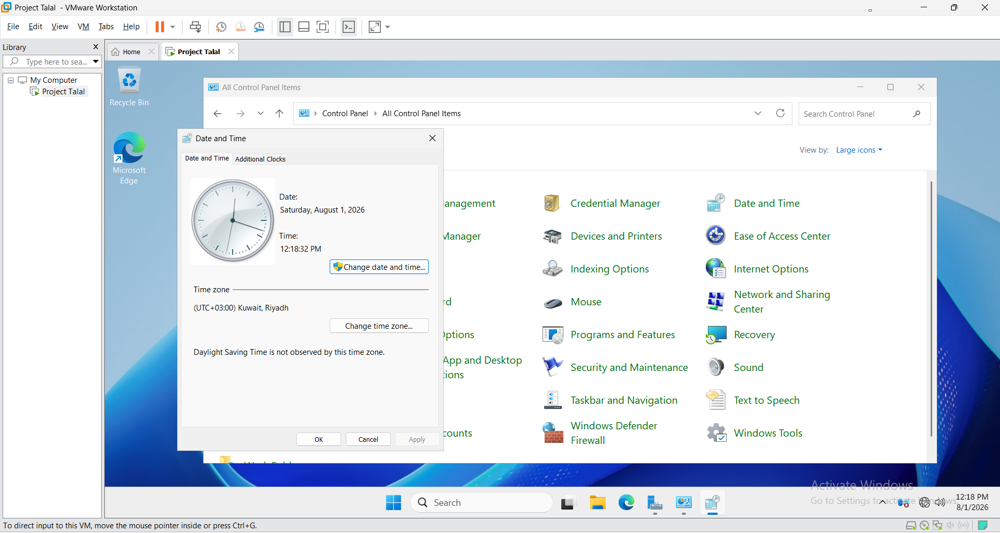
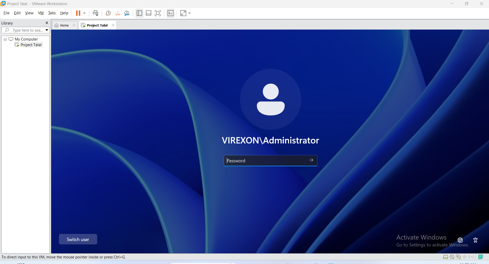

# 01 - Server Baseline and Environment Verification

## Purpose

This phase documents the stable server baseline used by the VIREXON lab: host identity, operating-system edition, network configuration, time zone, and domain sign-in. These checks establish the environment on which the later infrastructure phases depend.

## Evidence timing

> The screenshots were captured after the server had joined `virexon.local` and several server roles were present. They verify the resulting baseline; they are not presented as a chronological record of initial deployment. AD DS deployment is documented separately in [Phase 02](../02-Active-Directory).

## Verified baseline

| Item | Observed configuration |
| --- | --- |
| Server name | `PC26` |
| Operating system | Windows Server 2025 Standard Evaluation |
| Domain | `virexon.local` |
| IPv4 address | `192.168.1.2/24` (static) |
| Default gateway | None, by design on the isolated host-only network |
| DNS client | Local loopback (`::1` and `127.0.0.1` in the captured output) |
| DHCP on server NIC | Disabled |
| Time zone | `(UTC+03:00) Kuwait, Riyadh` |
| Virtualization | VMware Workstation Pro |

Server Manager also shows AD DS, DHCP, DNS, File and Storage Services, and WDS in the captured state. Their presence is an observation from the final baseline, not evidence that those roles were installed during this phase.

## Validation evidence

### 01 - Server Manager state

Server Manager confirms that `PC26` is reachable and shows the infrastructure roles present when the evidence was captured.

### 02 - System identity

System Properties records the server name, domain membership, operating-system edition, and system resources.

### 03 - Network interface details

The full `ipconfig /all` output records the static IPv4 configuration, local DNS entries, and disabled DHCP state on the server interface.

### 04 - IPv4 properties

The adapter properties confirm `192.168.1.2/24`, no default gateway, and local DNS configuration.

### 05 - Time-zone configuration

The server uses the UTC+03 time zone appropriate to the documented Riyadh lab location.

### 06 - Domain authentication

The captured sign-in confirms successful authentication using `VIREXON\Administrator`.

## Design note

The missing default gateway is intentional for this host-only exercise. It isolates the lab from external networks; it would not be an appropriate default for a production server that requires routed connectivity, updates, or external DNS resolution.

## Outcome

The evidence establishes a consistent server identity and static network baseline for the remaining phases. DNS service configuration and service-level validation are covered in [Phase 06](../06-DNS), rather than being claimed as complete here.

**Phase 01 - Server Baseline and Environment Verification: Completed**
