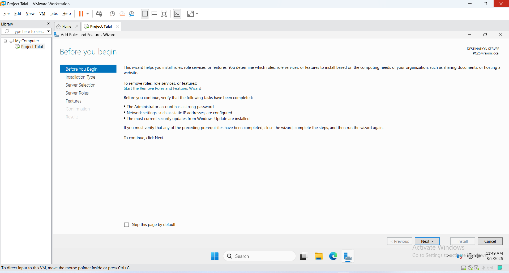
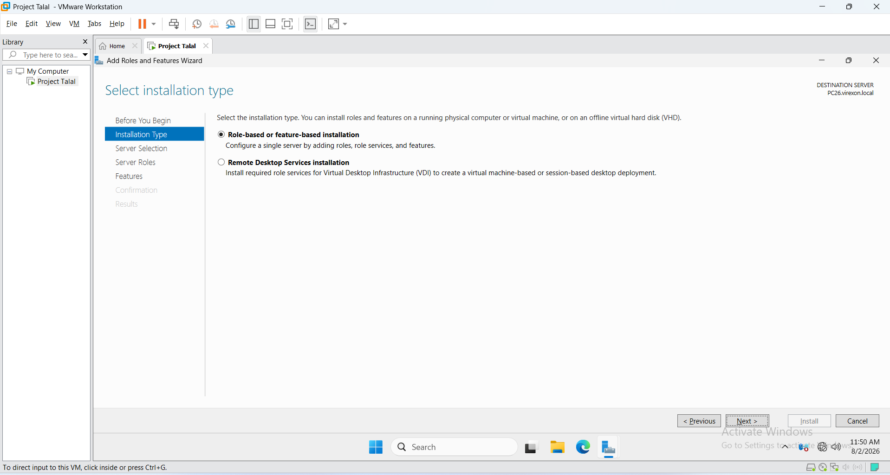
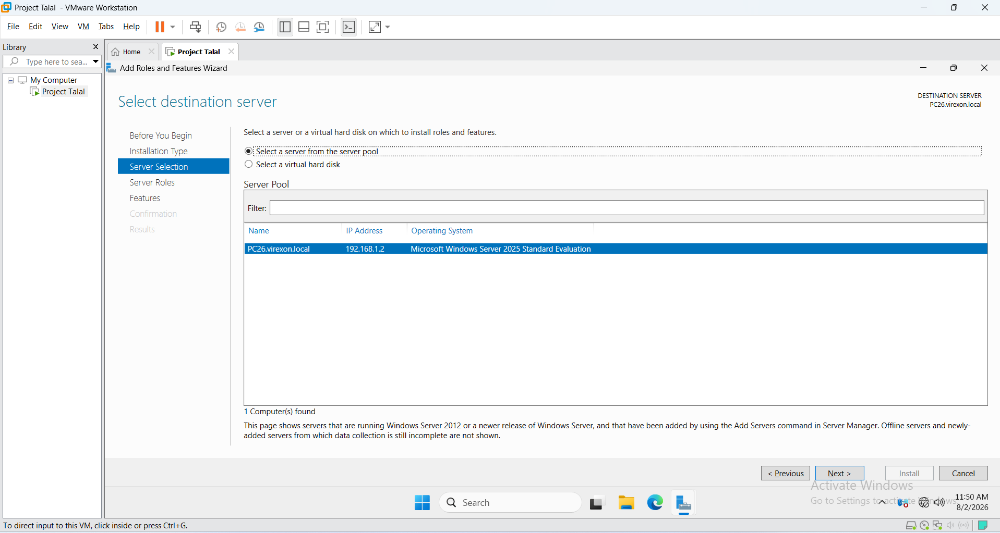
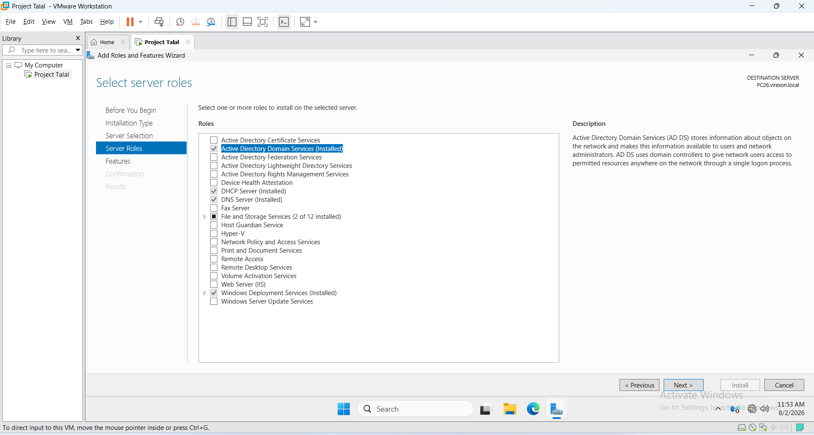
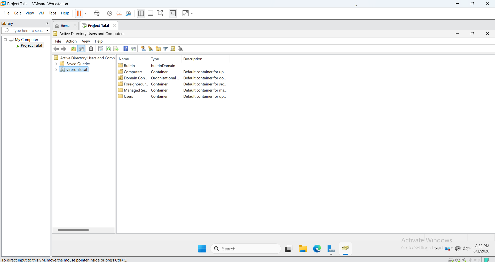

# 02 - Active Directory Domain Services

## Overview

This phase covers the deployment and verification of *Active Directory Domain Services (AD DS)* on the Windows Server. Active Directory provides centralized identity and access management, allowing administrators to manage users, computers, groups, and organizational resources within a domain environment.

After the role installation and domain-controller configuration were completed, the directory was verified in Active Directory Users and Computers. The captured final state shows that `PC26` operates in the `virexon.local` domain and is ready for the following identity-management phases.

---

## Verified deployment state

| Item | Verified value |
| --- | --- |
| Domain Controller | `PC26` |
| Active Directory domain | `virexon.local` |
| Installed role | Active Directory Domain Services (AD DS) |
| Administrative verification | Active Directory Users and Computers |

## Objectives

- Launch the Add Roles and Features Wizard.
- Select the appropriate installation type.
- Choose the target server for deployment.
- Select the Active Directory Domain Services (AD DS) server role.
- Verify the successful deployment using Active Directory Users and Computers.

---

## Screenshots

### 01 - Add Roles and Features Wizard

The Add Roles and Features Wizard was opened from Server Manager to begin the Active Directory deployment process.

---

### 02 - Installation Type

The *Role-based or feature-based installation* option was selected to install server roles on the local Windows Server.

---

### 03 - Server Selection

The local Windows Server was selected as the deployment target for the Active Directory installation.

---

### 04 - Server Roles

The *Active Directory Domain Services (AD DS)* server role was selected as part of the Active Directory deployment process.

---

### 05 - Active Directory Users and Computers

The Active Directory environment was verified using *Active Directory Users and Computers*, confirming that the domain was successfully deployed and that the default Active Directory containers were available for administration.

---

## Evidence boundary

Screenshots 01–04 document the role-installation workflow, while Screenshot 05 records the resulting directory in Active Directory Users and Computers. The available evidence confirms the deployed AD DS state, but it does not independently capture every page of the forest-promotion wizard or every reboot step.

## Result

Active Directory Domain Services (AD DS) was deployed and the resulting directory state was verified. The Windows Server now operates as a Domain Controller, providing a centralized directory service that is ready for the creation of Organizational Units (OUs), user accounts, security groups, Group Policy Objects (GPOs), and other enterprise infrastructure services in the following project phases.
