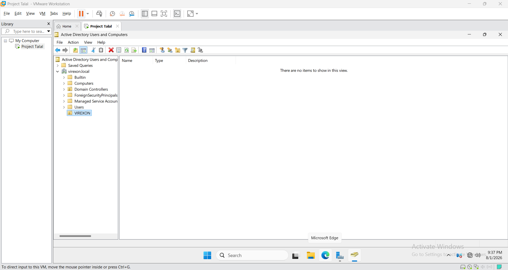
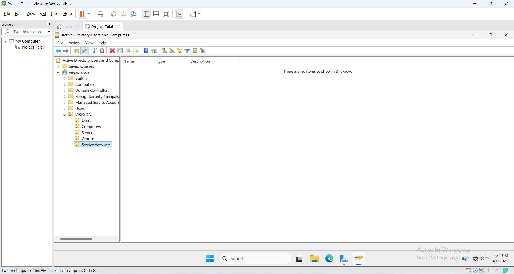
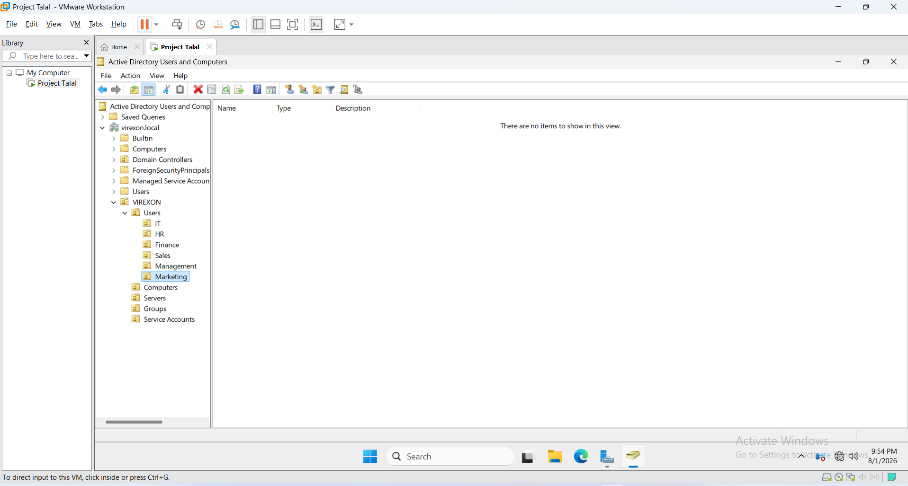
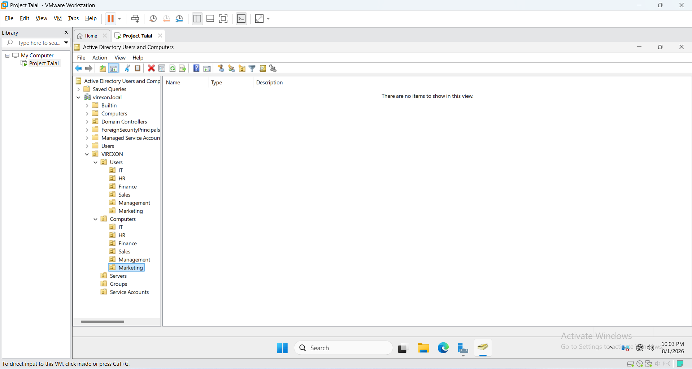

# 03 - Organizational Units

## Overview

This phase documents the Organizational Unit (OU) structure implemented in the `virexon.local` Active Directory environment. The design separates users, computers, servers, security groups, and service accounts so that administration and later Group Policy targeting can be managed by object type and department.

The structure is intentionally simple enough for a single-site lab while remaining clear to extend. It is a documented lab design, not a claim of formal Microsoft architecture validation.

## Implemented hierarchy

```text
virexon.local
└── VIREXON
    ├── Users
    │   ├── IT
    │   ├── HR
    │   ├── Finance
    │   ├── Sales
    │   ├── Management
    │   └── Marketing
    ├── Computers
    │   ├── IT
    │   ├── HR
    │   ├── Finance
    │   ├── Sales
    │   ├── Management
    │   └── Marketing
    ├── Servers
    ├── Groups
    └── Service Accounts
```

There is no `Corporate` OU in the verified directory structure. Later reports use the actual `VIREXON` root shown here.

## Implementation evidence

### 01 - Root OU

The custom `VIREXON` root OU provides a clear boundary between the lab's managed structure and the default Active Directory containers.



### 02 - Top-level OUs

The top-level structure separates Users, Computers, Servers, Groups, and Service Accounts according to administrative purpose.



### 03 - Departmental user OUs

The Users branch contains matching departmental OUs for IT, HR, Finance, Sales, Management, and Marketing. These OUs support user administration and user-side Group Policy scope.



### 04 - Departmental computer OUs

The Computers branch uses the same department names for workstation objects, allowing computer-side policy scope to remain separate from user policy scope.



## OU purpose

| Organizational Unit | Purpose |
| --- | --- |
| `VIREXON\Users\*` | Stores departmental user accounts and supports user-side policy targeting and delegated administration. |
| `VIREXON\Computers\*` | Stores departmental workstation objects and supports computer-side policy targeting independently of users. |
| `VIREXON\Servers` | Provides a separate location for member-server objects and server-specific administration. |
| `VIREXON\Groups` | Stores security groups used for role and permission management. |
| `VIREXON\Service Accounts` | Keeps service identities separate from standard user accounts. |

## Design principles

- Separate user accounts from computer objects.
- Use consistent department names under both Users and Computers.
- Keep servers outside workstation policy scope.
- Store security groups in a dedicated OU.
- Keep service accounts separate from interactive user accounts.
- Use a structure that supports later Group Policy links without adding unnecessary nesting.
- Keep object placement and naming consistent across phases.

## Naming convention

The departmental names are:

- IT
- HR
- Finance
- Sales
- Management
- Marketing

Each top-level OU has one primary administrative purpose. The names shown in this report match the visible directory evidence and are used consistently in the later project phases.

## Relationship to later phases

- [Phase 04](../04-Users-and-Groups) places users, groups, and the client computer into this structure.
- [Phase 05](../05-Group-Policy) links user and computer policies to the corresponding `VIREXON` branches.
- [Phase 08](../08-File-Server) extends the group design into a complete AGDLP-based resource authorization model.

## Outcome

The `VIREXON` OU hierarchy was created and documented with separate branches for identities, workstations, servers, groups, and service accounts. The resulting structure provides a consistent administrative foundation for the remaining lab phases.

**Phase 03 - Organizational Units: Completed**
