# 04 - Users and Groups

## Overview

This phase builds the identity structure used by the VIREXON lab. User accounts, departmental Global Security Groups, and the client computer object were created and organized according to the OU design documented in Phase 03.

---

## Objectives

- Create enterprise user accounts.
- Configure user account properties.
- Organize users by department.
- Create Global Security Groups.
- Assign users to the appropriate groups.
- Join a Windows 11 client to the Active Directory domain.
- Organize computer objects inside the correct Organizational Unit.
- Verify successful domain membership.

---

## User Management

User accounts were created using a consistent naming pattern, and the captured account options and user attributes were recorded for later administration.

> **Evidence note:** Screenshots 01 and 02 were captured while `VIREXON\Computers\IT` was selected. They document the user-creation workflow and account options, not the final OU location. Screenshot 04 is the retained evidence of the users in their final departmental locations under `VIREXON\Users`.

### Screenshot 01

*New User Wizard*

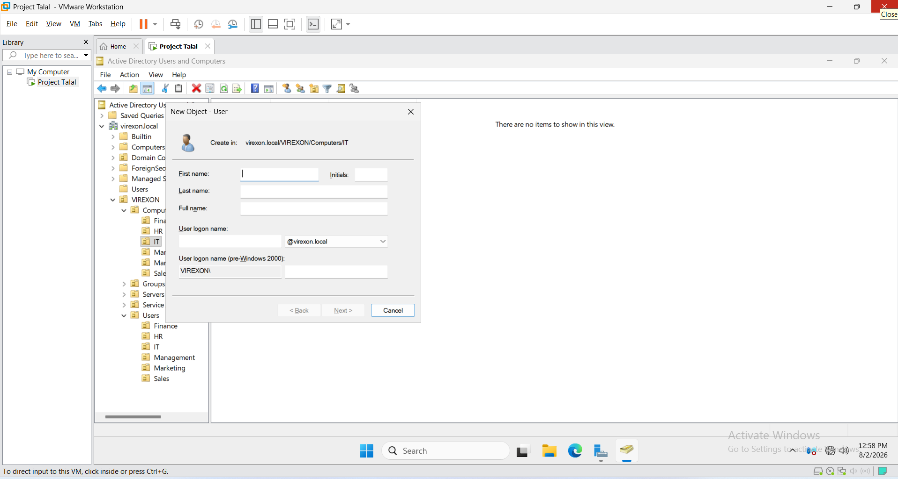

---

The account options shown in the wizard were selected during user creation. These are per-account settings; the domain password and lockout policies are configured and validated separately in [Phase 05](../05-Group-Policy).

### Screenshot 02

*User Password Configuration*

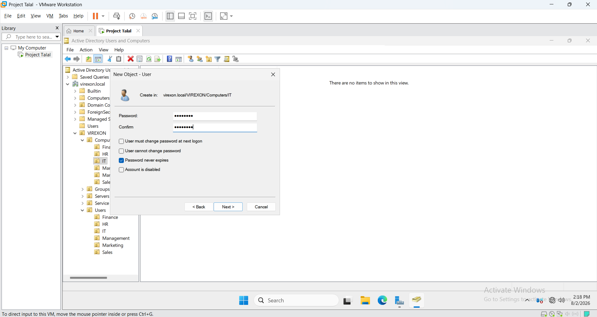

---

Additional user information such as department and job title was configured to improve administration and future Group Policy targeting.

### Screenshot 03

*User Properties*

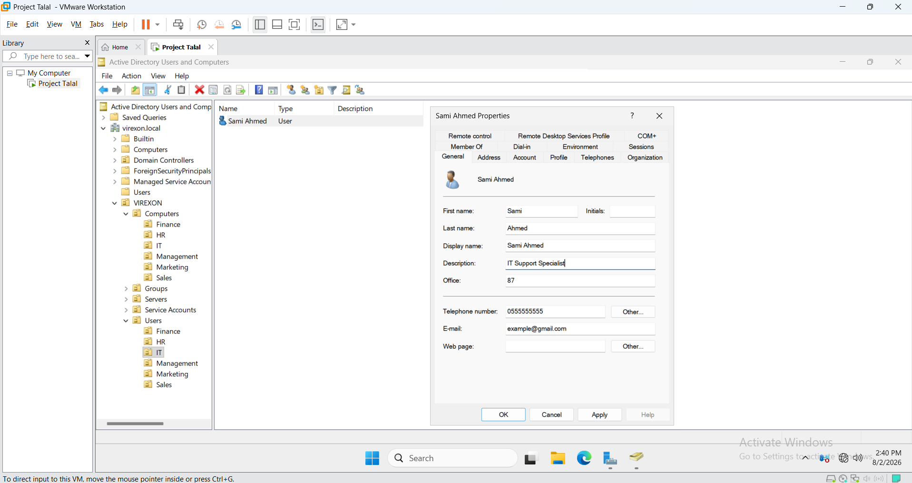

---

After completing user creation, all enterprise users were organized inside their corresponding Organizational Units.

### Screenshot 04

*Users Created and Organized*

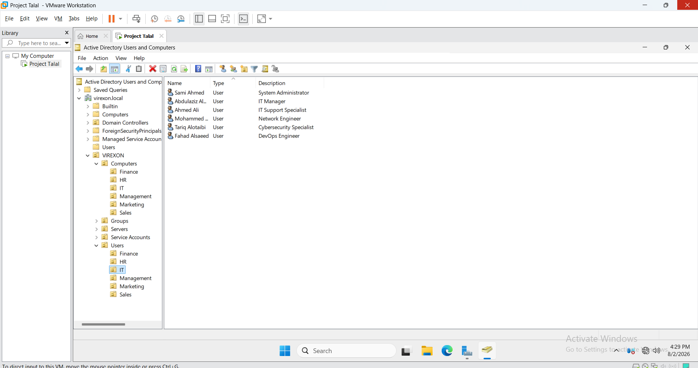

---

## Security Groups

Department-based Global Security Groups were created as the account-grouping layer. The complete AGDLP resource-authorization model, including Domain Local permission groups, is implemented and validated in [Phase 08](../08-File-Server).

### Screenshot 05

*New Security Group Wizard*

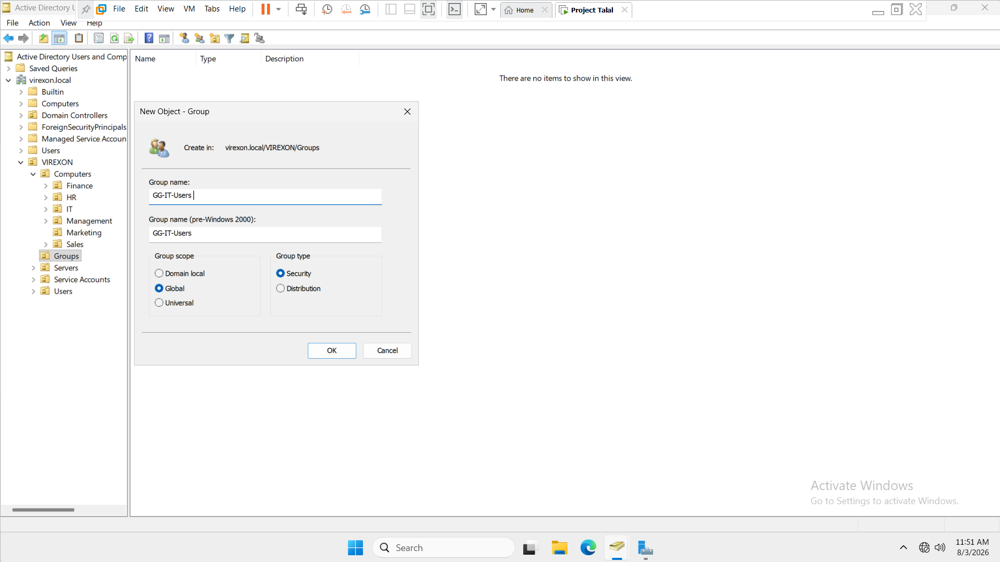

---

All required departmental security groups were successfully created.

### Screenshot 06

*Security Groups Created*

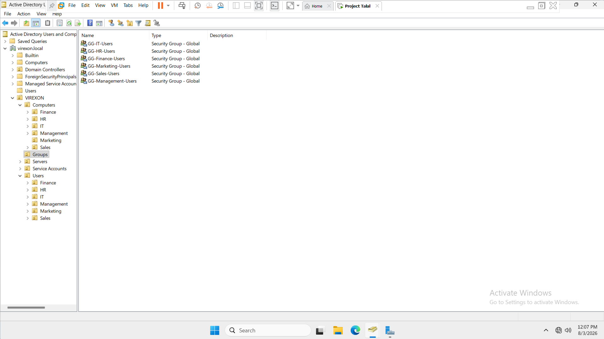

---

Before assigning users, group membership was verified to confirm that the newly created groups contained no members.

### Screenshot 07

*Group Membership Before Adding Users*

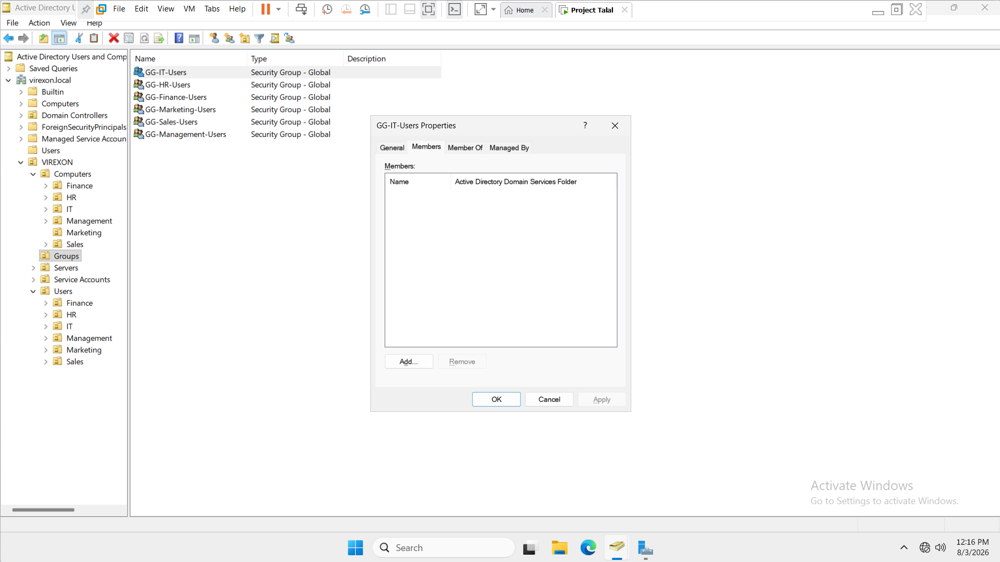

---

Users were then assigned to the appropriate departmental security groups based on their organizational roles.

### Screenshot 08

*Group Membership Configured*

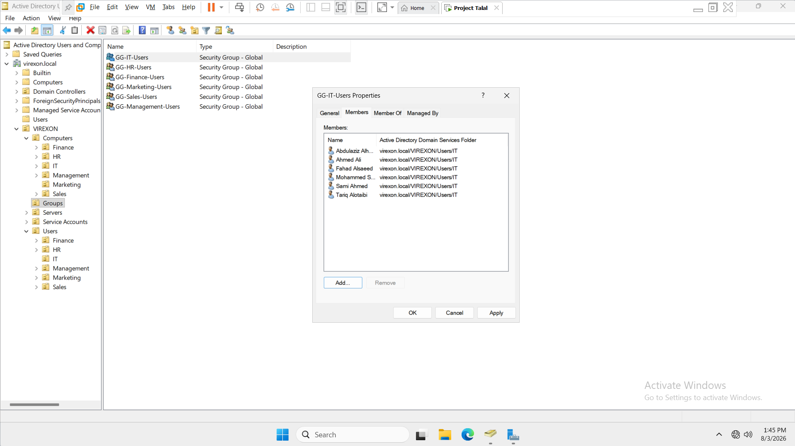

---

## Computer Management

A Windows 11 Pro client was integrated into the Active Directory environment.

The workstation was prepared, joined to the domain, and verified before being organized inside the enterprise OU structure.

### Screenshot 09

*Computer Information*

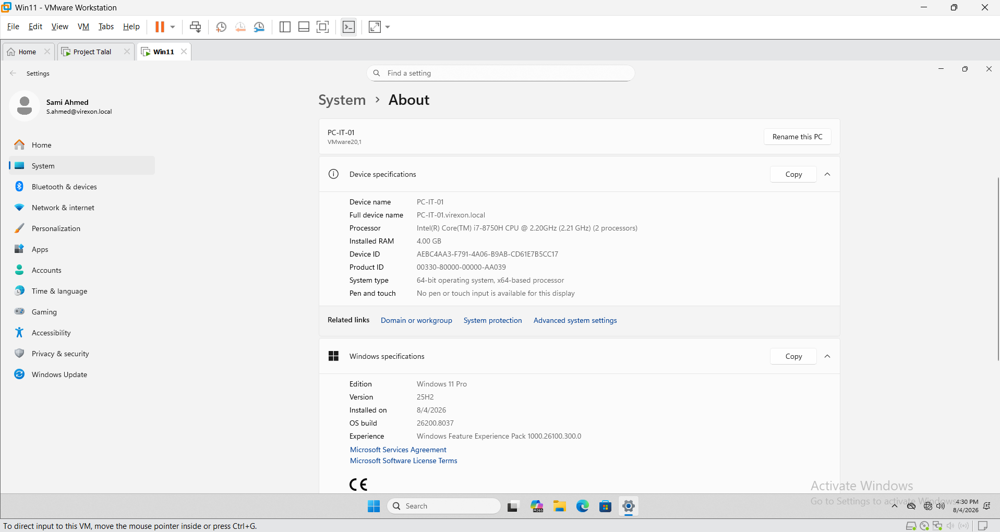

---

After joining the domain, the computer object was moved from the default *Computers* container into the dedicated *IT Computers OU*.

### Screenshot 10

*Computer Moved to IT OU*

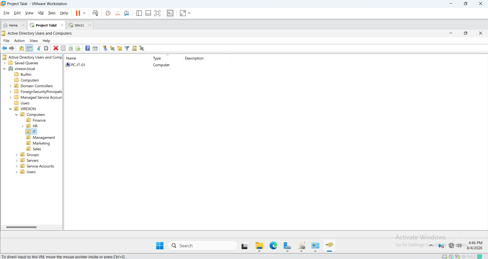

---

Finally, domain membership was verified from the client workstation to confirm successful integration with Active Directory.

### Screenshot 11

*Computer Domain Membership*

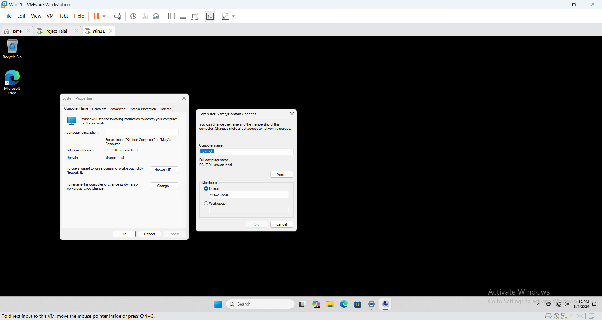

---

## Best Practices Applied

- Standardized naming convention
- Department-based Organizational Units
- Department-based Security Groups
- Enterprise user account structure
- Computer object organization
- Active Directory logical hierarchy
- Preparation for Group Policy deployment

---

## Result

The enterprise Active Directory environment now contains properly organized users, security groups, and managed computer objects. This structure provides the foundation for centralized authentication, group-based administration, later Group Policy deployment, and the resource-authorization work documented in Phase 08.
