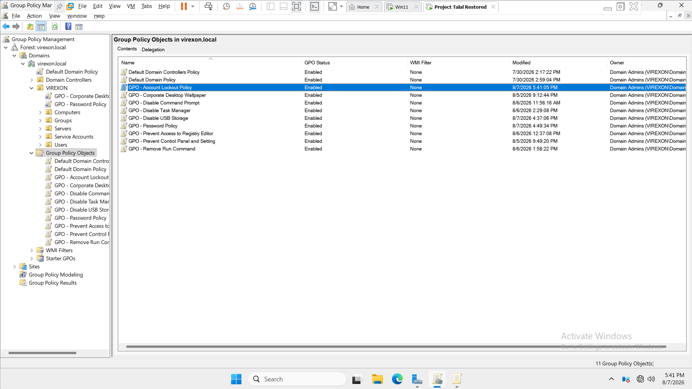
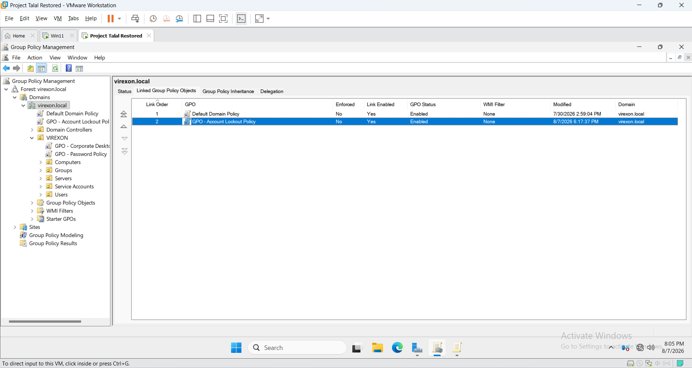
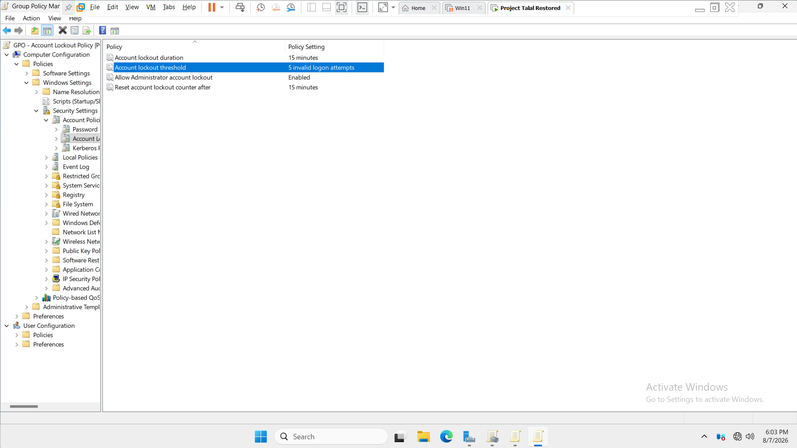
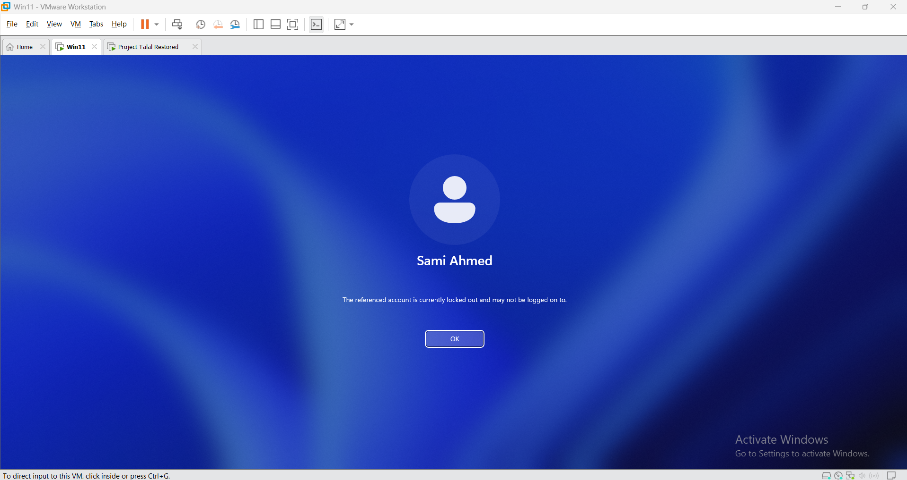

# 05 - Group Policy

## Overview

This section documents the implementation, configuration, testing, optimization, and final validation of Group Policy within the *VIREXON.LOCAL* Active Directory environment.

The objective of this phase was to implement practical Group Policy controls that reflect a structured corporate environment while maintaining a clear separation between:

- User-based policies
- Computer-based policies
- Domain-level security policies
- Department-specific user restrictions

The Group Policy implementation followed the following lifecycle:

*Create → Configure → Test → Review → Optimize → Validate*

The final environment contains *10 implemented Group Policy Objects (GPOs)*.

---

## Group Policy Architecture

The Group Policy design follows the Active Directory Organizational Unit structure established earlier in the project.

```text
virexon.local
└── VIREXON
    ├── Users
    │   ├── IT
    │   ├── HR
    │   ├── Finance
    │   ├── Marketing
    │   ├── Sales
    │   └── Management
    ├── Computers
    │   ├── IT
    │   ├── HR
    │   ├── Finance
    │   ├── Marketing
    │   ├── Sales
    │   └── Management
    ├── Groups
    ├── Servers
    └── Service Accounts
```


The final Group Policy structure separates policies according to their intended scope.

### User-Based Policies

User Configuration policies are associated with the appropriate user Organizational Units.

### Computer-Based Policies

Computer Configuration policies are associated with the `VIREXON\Computers` OU structure.

### Domain-Level Security Policies

Password and Account Lockout policies are maintained at the VIREXON.LOCAL domain level.

---

## Implemented Group Policies

### 1. Corporate Desktop Wallpaper

*GPO:* GPO - Corporate Desktop Wallpaper

*Configuration:* User Configuration

*Final Linking Location:* `VIREXON\Users`

The Corporate Desktop Wallpaper policy provides a standardized corporate desktop wallpaper for users within the `VIREXON\Users` OU structure.

The policy uses *User Configuration* because the wallpaper setting is associated with the user's environment.

During the optimization phase, the policy was moved to the `VIREXON\Users` scope.

This provides a more appropriate scope for a user-based corporate configuration and avoids applying the policy more broadly than necessary.

#### Documentation


---

### 2. Prevent Control Panel and Setting

*GPO:* GPO - Prevent Control Panel and Setting

*Configuration:* User Configuration

*Final Target OUs:*

- HR
- Finance
- Marketing
- Sales

This policy restricts access to Windows Control Panel and Settings for users within the selected departmental Organizational Units.

The policy uses *User Configuration* because the restriction is intended to follow the user account rather than the physical computer.

The final scope is limited to:

- HR
- Finance
- Marketing
- Sales

The IT and Management user OUs remain outside the current restriction scope.

#### Documentation


---

### 3. Disable Command Prompt

*GPO:* GPO - Disable Command Prompt

*Configuration:* User Configuration

*Final Target OUs:*

- HR
- Finance
- Marketing
- Sales

This policy restricts access to Command Prompt for users within the selected departmental Organizational Units.

The policy is configured as a user-based restriction and is limited to the intended departmental users.

The final scope prevents the restriction from being unnecessarily applied to the IT and Management user OUs.

#### Documentation


---

### 4. Prevent Access to Registry Editor

*GPO:* GPO - Prevent Access to Registry Editor

*Configuration:* User Configuration

*Final Target OUs:*

- HR
- Finance
- Marketing
- Sales

This policy restricts access to Windows Registry Editor for users within the selected departmental Organizational Units.

The policy uses *User Configuration* because the intended restriction is associated with the user's policy scope.

The restriction is limited to:

- HR
- Finance
- Marketing
- Sales

The IT and Management user OUs remain outside the current restriction scope.

#### Documentation


---

### 5. Remove Run Command

*GPO:* GPO - Remove Run Command

*Configuration:* User Configuration

*Final Target OUs:*

- HR
- Finance
- Marketing
- Sales

This policy removes access to the Windows Run command for users within the selected departmental Organizational Units.

The policy is configured under *User Configuration* because the restriction is intended to apply according to the user account's OU scope.

The final policy scope is limited to the selected departments.

IT and Management users remain outside the current restriction scope.

#### Documentation


---

### 6. Disable Task Manager

*GPO:* GPO - Disable Task Manager

*Configuration:* User Configuration

*Final Target OUs:*

- HR
- Finance
- Marketing
- Sales

This policy prevents users within the selected departmental Organizational Units from accessing Task Manager.

The policy uses *User Configuration* because the restriction is associated with the user's policy scope.

The final restriction scope includes:

- HR
- Finance
- Marketing
- Sales

The IT and Management user OUs remain outside the current restriction scope.

#### Documentation


---

### 7. Disable USB Storage

*GPO:* GPO - Disable USB Storage

*Configuration:* Computer Configuration

*Final Linking Location:* `VIREXON\Computers`

This policy restricts USB storage access on computers within the `VIREXON\Computers` OU structure.

Unlike the previous user-based restrictions, this policy uses *Computer Configuration* because the control is applied at the computer level.

The policy is therefore associated with the `VIREXON\Computers` scope rather than the Users scope.

This provides a clear separation between user-level restrictions and computer-level device controls.

#### Documentation


---

### 8. Password Policy

*GPO:* GPO - Password Policy

*Configuration:* Domain Security Policy

*Final Linking Location:* VIREXON.LOCAL

The Password Policy establishes the baseline password requirements for domain accounts.

The policy is maintained at the *domain root* because password policy is a domain-level account security configuration.

#### Configuration

| Setting | Value |
|---|---|
| Minimum password age | 30 days |
| Maximum password age | 90 days |
| Password history | 3 passwords |
| Password complexity | Enabled |
| Minimum password length | 8 characters |

The configured password requirements were tested from the Windows 11 client.

The client rejected a password-change request and displayed a message stating that the password did not satisfy the configured requirements. Screenshot 32 confirms that a configured password requirement affected the request, but the message does not identify which individual setting caused the rejection.

These values document the lab configuration; they are not presented as a universal production baseline. In particular, the 30-day minimum password age can prevent another password change during that interval and therefore requires an explicit operational justification. The account-creation example in Phase 04 also shows an account-level **Password never expires** selection, which must be reviewed separately from the domain maximum-password-age setting.

#### Documentation


---

### 9. Account Lockout Policy

*GPO:* GPO - Account Lockout Policy

*Configuration:* Domain Security Policy

*Final Linking Location:* VIREXON.LOCAL

The Account Lockout Policy provides protection against repeated invalid authentication attempts.

The policy is maintained at the *domain root* because account lockout is a domain-level account security configuration.

#### Configuration

| Setting | Value |
|---|---|
| Account lockout threshold | 5 invalid logon attempts |
| Account lockout duration | 15 minutes |
| Reset account lockout counter after | 15 minutes |
| Allow Administrator account lockout | Enabled |

The policy was validated from the Windows 11 client. Screenshot 36 records the functional result: the referenced account is reported as locked out. It is not `net accounts` output.

Allowing lockout of the built-in Administrator account changes the recovery and availability risk of the lab. A production adoption would require a tested administrative recovery path and an organization-approved lockout standard.

#### Documentation









---

### 10. Interactive Logon Message

*GPO:* GPO - Interactive-Logon-Message

*Configuration:* Computer Configuration

*Final Linking Location:* `VIREXON\Computers`

This policy displays an interactive logon message before authentication on computers within the targeted computer scope.

The policy uses *Computer Configuration* because the interactive logon message is associated with the computer's logon process.

The policy is therefore maintained within the `VIREXON\Computers` scope.

#### Documentation


---

## Group Policy Optimization

After the ten GPOs were created, configured, tested, and documented, the Group Policy structure was reviewed and optimized.

The optimization phase did *not* introduce additional GPOs.

Instead, the existing policies were reviewed and their linking locations were adjusted according to their intended configuration type and scope.

The optimization focused on:

- Separating User Configuration policies from Computer Configuration policies.
- Maintaining domain-level security policies at the domain root.
- Moving the corporate wallpaper to the `VIREXON\Users` scope.
- Limiting departmental user restrictions to the intended departmental OUs.
- Keeping computer-based policies within the `VIREXON\Computers` scope.
- Removing unnecessary use of *Enforced*.
- Validating the resulting policy behavior using representative users.

The purpose of this phase was to improve the organization and scope of the existing policies rather than simply adding more policies.

---

## Final Domain-Level GPO Linking

The following policies are linked directly to the VIREXON.LOCAL domain root:

- GPO - Password Policy
- GPO - Account Lockout Policy

These policies remain at the domain level because they represent domain-wide account security requirements.

The final domain-level configuration was reviewed after the optimization phase.


---

## Final VIREXON OU Architecture

The final Group Policy structure uses the verified `VIREXON` OU hierarchy to separate user and computer policy deployment. No `Corporate` OU exists in the captured directory structure.

The two primary policy scopes are:

### User Scope

`VIREXON\Users`

### Computer Scope

`VIREXON\Computers`

This structure provides a clear separation between user-based configuration and computer-based configuration.

It also provides an organized foundation for applying policies to the appropriate Organizational Units.


---

## Final User GPO Scope

The final user policy structure is intentionally scoped according to the requirements of the environment.

### `VIREXON\Users` Scope

The following policy is associated with the `VIREXON\Users` scope:

- GPO - Corporate Desktop Wallpaper

This provides the corporate desktop configuration for users within the `VIREXON\Users` OU structure.

## Departmental User OUs

The following five user restriction policies are associated with:

- HR
- Finance
- Marketing
- Sales

### Applied Policies

- GPO - Prevent Control Panel and Setting
- GPO - Disable Command Prompt
- GPO - Disable Task Manager
- GPO - Prevent Access to Registry Editor
- GPO - Remove Run Command

The IT and Management user OUs remain outside the current direct-link scope for these restrictions. The final link captures document this design; the last two client screenshots are interpreted separately under the evidence limitation below.


---

## Final Computer GPO Scope

The final computer-based policy structure is maintained at `VIREXON\Computers`, with child computer OUs inheriting the applicable links.

The following policies are linked to the `VIREXON\Computers` structure:

- GPO - Interactive-Logon-Message
- GPO - Disable USB Storage

This separates computer-level controls from the user-level restrictions.


---

## Final Policy Validation

The final policy links and the two retained client captures document two different kinds of evidence:

- Group Policy Management records the intended link scope.
- The client captures record visible restricted and unrestricted behavior.
- The client captures do not show the signed-in identity, so the department associated with each visible outcome cannot be independently verified from those images alone.

### Screenshot 45 - controls available

Screenshot 45 visibly shows that Control Panel and Run are available in the captured session.

The filename labels this as an HR restrictions test, but that label conflicts with the visible unrestricted outcome. Because the signed-in account is not shown, the report records only the behavior that can be seen and does not assign it to HR or IT.


---

### Screenshot 46 - restriction message

Screenshot 46 visibly shows a policy restriction message in the captured session.

The filename labels this as an IT exclusions test, but that label conflicts with the visible restricted outcome. Because the signed-in account is not shown, the report records only the behavior that can be seen and does not assign it to HR or IT.


### Validation method

The report applies the following evidence rules consistently:

1. A GPO creation capture proves that the object existed at the time of capture.
2. A policy-editor capture proves the documented setting shown in that editor.
3. A Group Policy Management capture proves the visible link and scope.
4. A client-result capture proves only the behavior and identity visible in that capture.
5. A filename is descriptive metadata; it does not override contradictory screen content.

These rules keep the 46-image implementation record intact while preventing the report from claiming more than the screenshots establish.

### Evidence conclusion

Together, the screenshots prove that unrestricted and restricted client behaviors were captured. They do not independently prove which session used an HR account and which used an IT account. Their filenames are therefore retained as legacy metadata, not treated as identity evidence.

A future evidence refresh should display `whoami` or `gpresult /r` together with the visible result in one capture for each test account. This limitation does not change the verified link architecture: the five restriction GPOs are linked to Finance, HR, Marketing, and Sales, while IT and Management remain outside those direct links.

---

## Final Group Policy Structure

The final Group Policy structure can be summarized as follows:

| GPO | Configuration Type | Final Linking / Target Scope |
|---|---|---|
| GPO - Corporate Desktop Wallpaper | User Configuration | `VIREXON\Users` |
| GPO - Prevent Control Panel and Setting | User Configuration | HR, Finance, Marketing, Sales |
| GPO - Disable Command Prompt | User Configuration | HR, Finance, Marketing, Sales |
| GPO - Prevent Access to Registry Editor | User Configuration | HR, Finance, Marketing, Sales |
| GPO - Remove Run Command | User Configuration | HR, Finance, Marketing, Sales |
| GPO - Disable Task Manager | User Configuration | HR, Finance, Marketing, Sales |
| GPO - Disable USB Storage | Computer Configuration | `VIREXON\Computers` |
| GPO - Password Policy | Domain Security Policy | VIREXON.LOCAL |
| GPO - Account Lockout Policy | Domain Security Policy | VIREXON.LOCAL |
| GPO - Interactive-Logon-Message | Computer Configuration | `VIREXON\Computers` |

---

## Final Design Summary

The final Group Policy architecture provides three primary policy scopes.

### Domain Level

Used for:

- GPO - Password Policy
- GPO - Account Lockout Policy

### `VIREXON\Users` Scope

Used for:

- GPO - Corporate Desktop Wallpaper

### Departmental Users

Used for:

- GPO - Prevent Control Panel and Setting
- GPO - Disable Command Prompt
- GPO - Prevent Access to Registry Editor
- GPO - Remove Run Command
- GPO - Disable Task Manager

Targeted departments:

- HR
- Finance
- Marketing
- Sales

### `VIREXON\Computers` Scope

Used for:

- GPO - Disable USB Storage
- GPO - Interactive-Logon-Message

This structure keeps the implemented policies organized according to whether they apply to the domain, users, specific departments, or computers.

---

## Final Status

### Group Policy — Completed

The Group Policy phase is complete.

The final environment contains *10 implemented GPOs* with defined configuration types, linking locations, intended scopes, testing, optimization, and final validation.

The completed implementation includes:

- Corporate desktop wallpaper
- Control Panel and Settings restriction
- Command Prompt restriction
- Registry Editor restriction
- Run command restriction
- Task Manager restriction
- USB storage restriction
- Domain password policy
- Domain account lockout policy
- Interactive logon message

The optimization phase established:

- Appropriate domain-level placement for account security policies.
- Appropriate user-level scope for user configuration policies.
- Appropriate computer-level scope for computer configuration policies.
- Department-specific targeting for standard user restrictions.
- Separation between user and computer policy scopes.
- Removal of unnecessary *Enforced* configuration.
- Final validation using representative HR and IT users.

---

## Documentation Summary

The Group Policy phase is documented using *46 screenshots*.

The screenshots cover:

- GPO creation
- GPO linking
- GPO configuration
- GPO application
- Password policy configuration and application
- Account lockout policy configuration and application
- Interactive logon message configuration
- Final domain-level GPO linking
- Final VIREXON OU architecture
- Final Users GPO scope
- Final Computers GPO scope
- Restricted and unrestricted client behavior, with the signed-in identity limitation documented

The 46 screenshots provide evidence of the implementation, optimization, and final validated state of the Group Policy environment.

---

## Group Policy Result

The final result is a structured Group Policy environment in which policies are organized according to their intended scope.

The final design distinguishes between:

*Domain Security Policies*

→ Password Policy  
→ Account Lockout Policy

*User Policies*

→ Corporate Desktop Wallpaper  
→ Departmental User Restrictions

*Computer Policies*

→ USB Storage Restriction  
→ Interactive Logon Message

The final configuration demonstrates the practical relationship between *Active Directory Organizational Units and Group Policy deployment*, while keeping the implemented policy structure organized and maintainable.

*Group Policy implementation, optimization, and validation completed.*
