# DNS Configuration & Validation

> *Project:* Windows Server Lab  
> *Domain:* VIREXON.LOCAL  
> *Platform:* Windows Server 2022  
> *DNS Server:* PC26.virexon.local  
> *DNS Server IPv4:* 192.168.1.2  
> *Windows 11 Client:* PC-IT-01  
> *Client IPv4:* 192.168.1.31  
> *Status:* ✅ Completed

---

## Table of Contents

- [1. Overview](#1-overview)
- [2. Lab Environment](#2-lab-environment)
- [3. DNS Architecture](#3-dns-architecture)
- [4. Forward Lookup Zone](#4-forward-lookup-zone)
- [5. Reverse Lookup Zone](#5-reverse-lookup-zone)
- [6. PTR Records](#6-ptr-records)
- [7. DNS Resolution Testing](#7-dns-resolution-testing)
- [8. DNS Diagnostic Validation](#8-dns-diagnostic-validation)
- [9. DNS Aging and Scavenging](#9-dns-aging-and-scavenging)
- [10. Secure Dynamic Updates](#10-secure-dynamic-updates)
- [11. Dynamic DNS Client Registration](#11-dynamic-dns-client-registration)
- [12. Reverse DNS Validation](#12-reverse-dns-validation)
- [13. DNS Zones Verification](#13-dns-zones-verification)
- [14. DNS A Records Verification](#14-dns-a-records-verification)
- [15. Active Directory SRV Records](#15-active-directory-srv-records)
- [16. DNS Server Service Status](#16-dns-server-service-status)
- [17. DNS Forwarders](#17-dns-forwarders)
- [18. Security and Design Considerations](#18-security-and-design-considerations)
- [19. DNS Validation Summary](#19-dns-validation-summary)
- [20. Screenshots](#20-screenshots)
- [21. Completion Status](#21-completion-status)

---

# 1. Overview

This section documents the deployment, configuration, testing, and validation of the Domain Name System (DNS) infrastructure for the VIREXON.LOCAL Windows Server Lab environment.

DNS is a critical component of the Active Directory infrastructure because domain services rely on DNS for hostname resolution, service discovery, and communication between domain members and the Domain Controller.

The DNS service is hosted on the Windows Server 2022 Domain Controller PC26.

The DNS implementation was designed around the following objectives:

- Provide reliable internal name resolution.
- Support Active Directory service discovery.
- Provide Forward and Reverse DNS resolution.
- Enable secure dynamic DNS registration.
- Manage stale DNS records using Aging and Scavenging.
- Validate DNS health and functionality.
- Maintain an isolated lab environment without requiring Internet connectivity.

---

# 2. Lab Environment

## 2.1 Domain Controller / DNS Server

| Property | Value |
|---|---|
| Hostname | PC26 |
| FQDN | pc26.virexon.local |
| Operating System | Windows Server 2022 |
| Domain | VIREXON.LOCAL |
| IPv4 Address | 192.168.1.2 |
| Primary Role | Domain Controller |
| DNS Role | DNS Server |

## 2.2 Windows 11 Client

| Property | Value |
|---|---|
| Hostname | PC-IT-01 |
| Operating System | Windows 11 |
| Domain | VIREXON.LOCAL |
| IPv4 Address | 192.168.1.31 |
| DNS Server | 192.168.1.2 |

---

# 3. DNS Architecture

The DNS infrastructure is integrated with Active Directory and hosted on the Domain Controller.

The main DNS components configured and validated in this project are:

- Forward Lookup Zone
- Reverse Lookup Zone
- Active Directory-integrated DNS
- A Records
- PTR Records
- Active Directory SRV Records
- Secure Dynamic Updates
- DNS Aging
- DNS Scavenging
- Dynamic DNS Client Registration
- DNS Diagnostic Validation

The overall DNS architecture is:

text
                         VIREXON.LOCAL
                                |
                                |
                    +-----------v-----------+
                    |         PC26          |
                    |  Domain Controller    |
                    |      DNS Server       |
                    |     192.168.1.2       |
                    +-----------+-----------+
                                |
                 +--------------+--------------+
                 |                             |
        +--------v---------+          +--------v---------+
        | Forward Lookup   |          | Reverse Lookup   |
        | Zone             |          | Zone             |
        | virexon.local    |          | 1.168.192...     |
        +--------+---------+          +--------+---------+
                 |                             |
             A Records                    PTR Records
                 |                             |
                 +--------------+--------------+
                                |
                       +--------v---------+
                       |    PC-IT-01      |
                       |    Windows 11    |
                       |   192.168.1.31    |
                       +------------------+

---

# 4. Forward Lookup Zone

The primary Forward Lookup Zone for the Active Directory domain is:

text
virexon.local

The zone is Active Directory-integrated.

This allows DNS information to be integrated with the Active Directory environment and supports the DNS requirements of the domain.

## Primary Host Records

| Host | Record Type | IPv4 Address |
|---|---|---|
| PC26 | A | 192.168.1.2 |
| PC-IT-01 | A | 192.168.1.31 |

The Forward Lookup Zone also contains Active Directory-related records required for domain functionality and service discovery.

---

# 5. Reverse Lookup Zone

A Reverse Lookup Zone was created for the 192.168.1.0/24 lab network.

The resulting reverse zone is:

text
1.168.192.in-addr.arpa

Reverse DNS provides the ability to resolve an IPv4 address back to its corresponding hostname.

This is the reverse operation of Forward DNS resolution.

## Screenshot

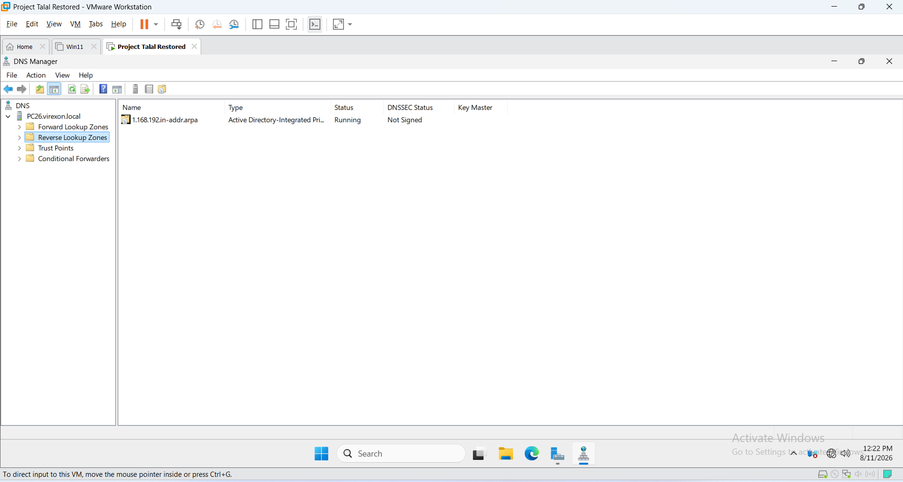

---

# 6. PTR Records

A PTR record was created for the Domain Controller.

The record provides the following reverse mapping:

text
192.168.1.2
     |
     v
pc26.virexon.local

This allows the DNS Server to resolve the server's IPv4 address back to its hostname.

## Screenshot

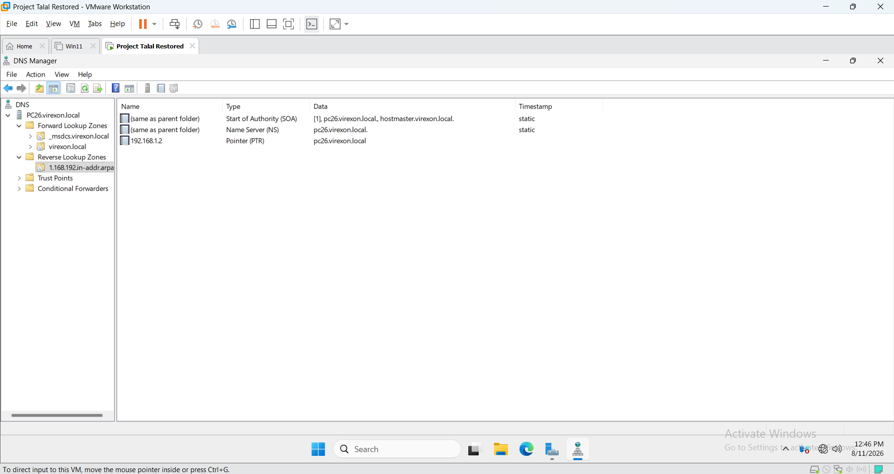

---

# 7. DNS Resolution Testing

DNS functionality was validated through Forward and Reverse DNS resolution tests.

## 7.1 Forward DNS Resolution

The Domain Controller hostname was tested using:

powershell
nslookup pc26.virexon.local 192.168.1.2

The hostname successfully resolved to:

text
192.168.1.2

## Screenshot

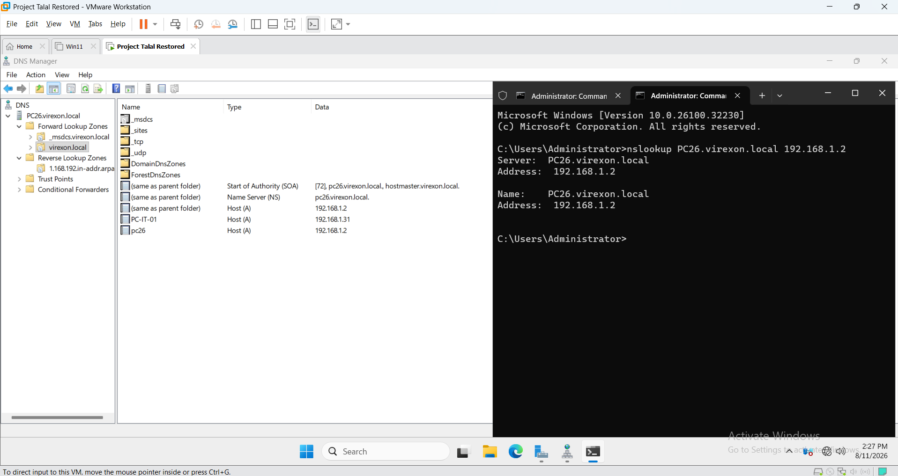

---

## 7.2 Reverse DNS Resolution

Reverse DNS resolution was tested by querying the server's IPv4 address.

The expected mapping was:

text
192.168.1.2
     |
     v
pc26.virexon.local

The reverse lookup completed successfully.

## Screenshot

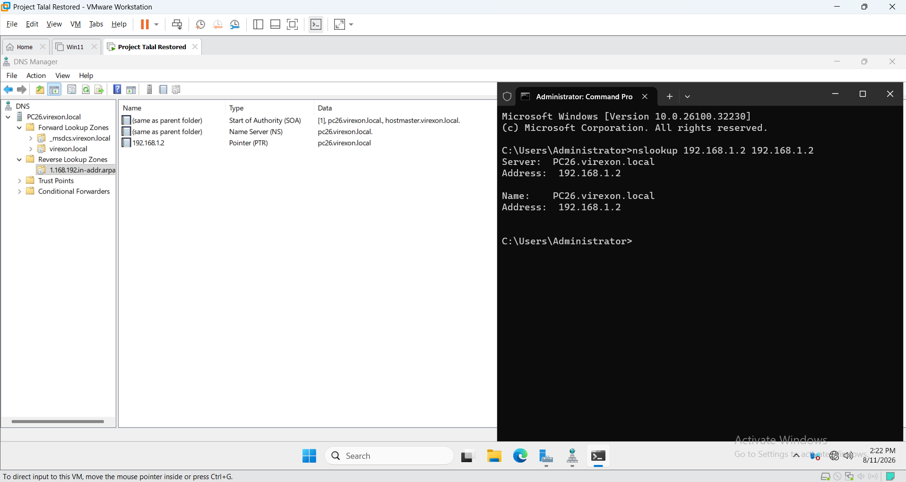

---

## 7.3 Client Forward DNS Resolution

The Windows 11 client was configured to use the DNS Server:

text
192.168.1.2

The client successfully resolved:

text
pc-it-01.virexon.local
     |
     v
192.168.1.31

## Screenshot

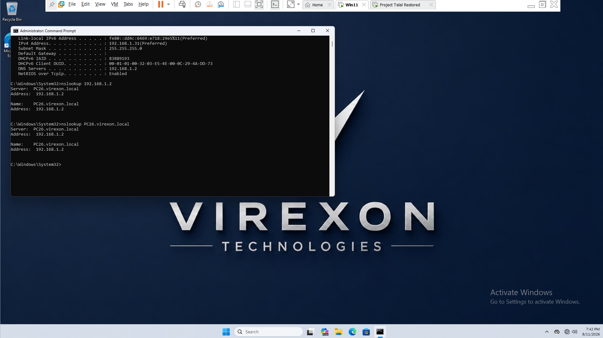

---

# 8. DNS Diagnostic Validation

The DNS configuration was validated using the Active Directory diagnostic tool:

powershell
dcdiag /test:dns

The diagnostic completed successfully.

The results confirmed:

text
PC26 passed test DNS
virexon.local passed test DNS

This provided an additional health validation of the DNS and Active Directory DNS configuration.

## Screenshot

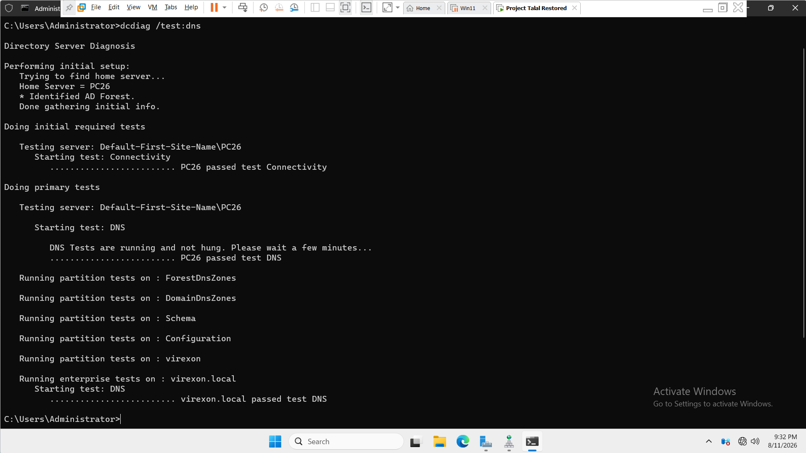

---

# 9. DNS Aging and Scavenging

DNS Aging and Scavenging were configured to help manage stale dynamic DNS records.

## 9.1 Aging Configuration

The configured intervals were:

| Setting | Value |
|---|---|
| No-Refresh Interval | 7 days |
| Refresh Interval | 7 days |

### No-Refresh Interval

During the No-Refresh interval, the timestamp of a dynamic DNS record is not refreshed.

### Refresh Interval

During the Refresh interval, a client can refresh the timestamp of its DNS record.

## Screenshot

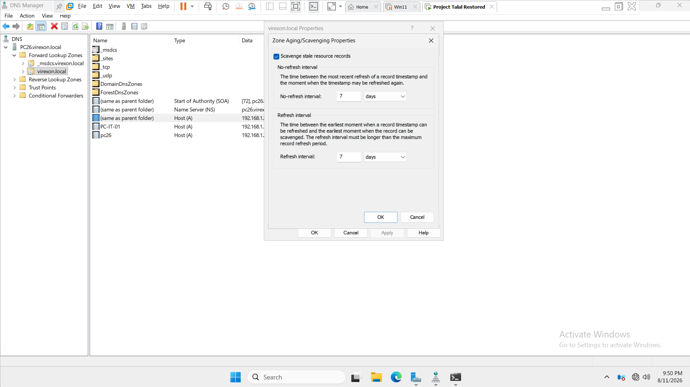

---

## 9.2 Scavenging

DNS Scavenging was enabled to allow stale DNS resource records to be removed after they become eligible for scavenging.

Aging and Scavenging work together:

text
DNS Record
    |
    v
No-Refresh Period
    |
    v
Refresh Period
    |
    v
Record Becomes Stale
    |
    v
Scavenging
    |
    v
Stale Record Removal

Scavenging does not remove a record simply because a DHCP lease expires. The record must become stale according to the configured DNS Aging process.

## Screenshot

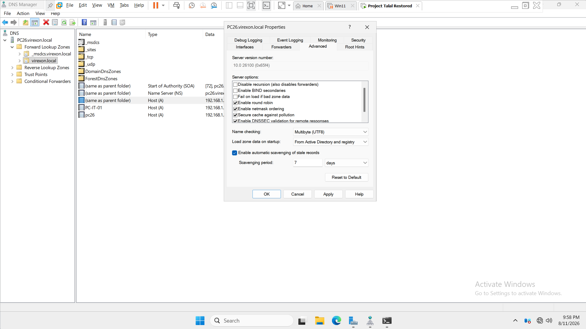

---

# 10. Secure Dynamic Updates

Dynamic DNS updates were configured as:

text
Secure only

The Secure only configuration allows authorized domain members to dynamically register and update their DNS records.

This is appropriate for an Active Directory-integrated DNS environment because it helps prevent unauthorized systems from modifying DNS records.

## Screenshot

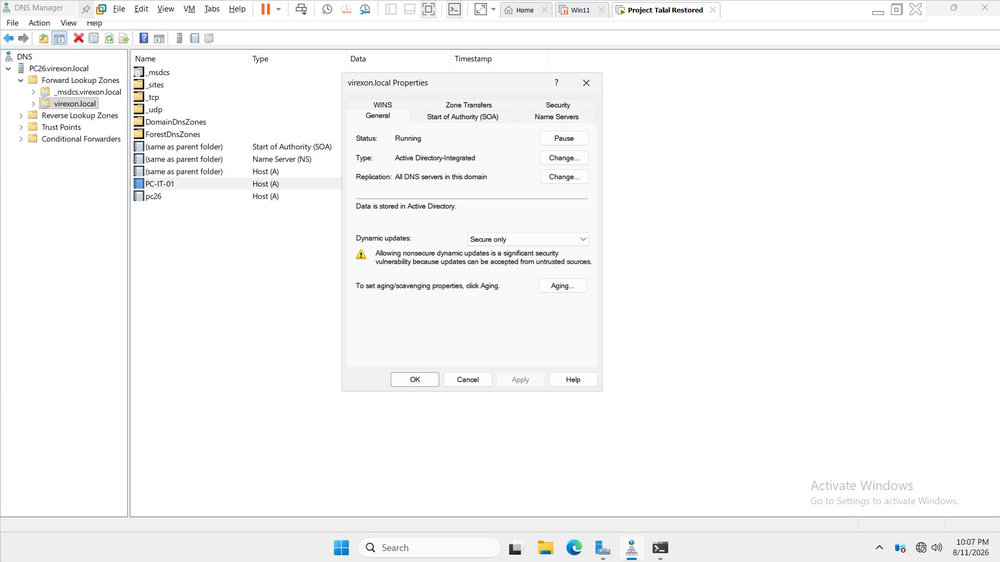

---

# 11. Dynamic DNS Client Registration

The Windows 11 client was dynamically registered in the DNS infrastructure.

The client successfully registered its DNS hostname:

text
PC-IT-01.virexon.local

with the corresponding IPv4 address:

text
192.168.1.31

The client registration was validated as part of the DNS configuration process.

## Screenshot

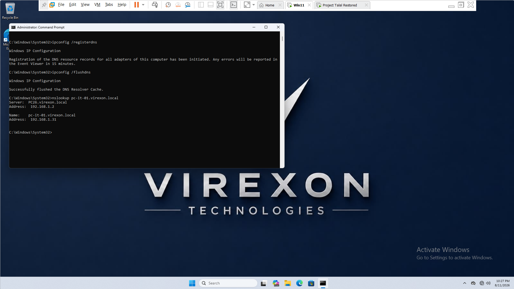

---

# 12. Reverse DNS Validation

Reverse DNS was independently validated from both the Domain Controller and the Windows 11 client.

This confirmed that the Reverse Lookup Zone and PTR records were functional from both sides of the lab environment.

## 12.1 Server-side Reverse DNS

The Domain Controller successfully resolved:

text
192.168.1.31
     |
     v
PC-IT-01.virexon.local

## Screenshot

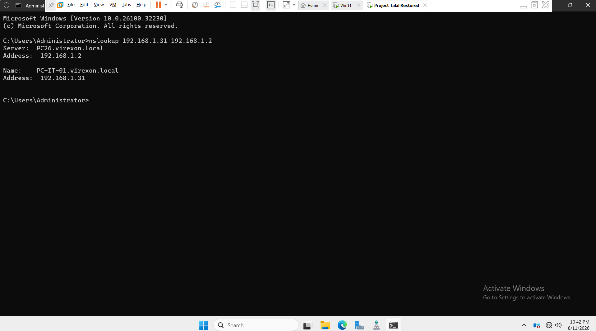

---

## 12.2 Client-side Reverse DNS

The Windows 11 client successfully resolved its own IPv4 address by explicitly querying the DNS Server:

powershell
nslookup 192.168.1.31 192.168.1.2

The result successfully returned:

text
PC-IT-01.virexon.local
192.168.1.31

This confirmed that the client could successfully perform Reverse DNS resolution through the configured DNS Server.

## Screenshot

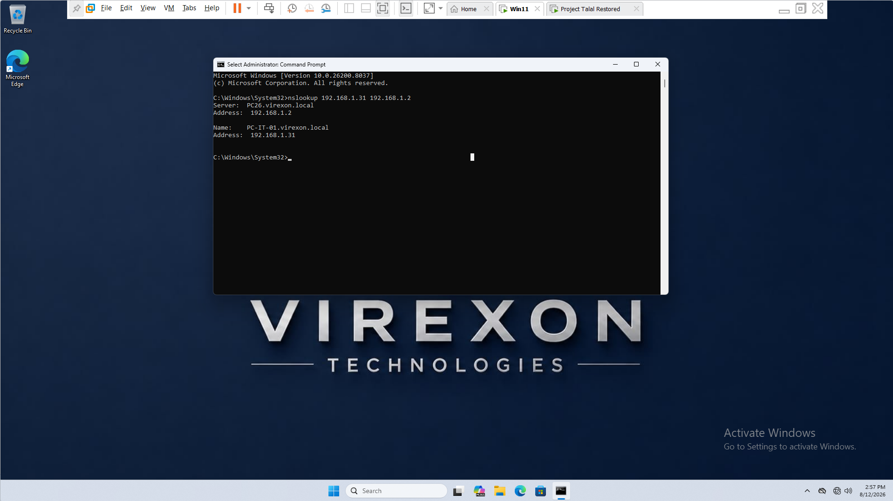

---

# 13. DNS Zones Verification

The final DNS zone configuration was reviewed on the Domain Controller using:

powershell
Get-DnsServerZone

The following important zones were confirmed:

text
virexon.local
_msdcs.virexon.local
1.168.192.in-addr.arpa

The Active Directory-integrated zones were confirmed with:

text
IsDsIntegrated = True

This confirms that the primary DNS zones are integrated with Active Directory.

## Screenshot

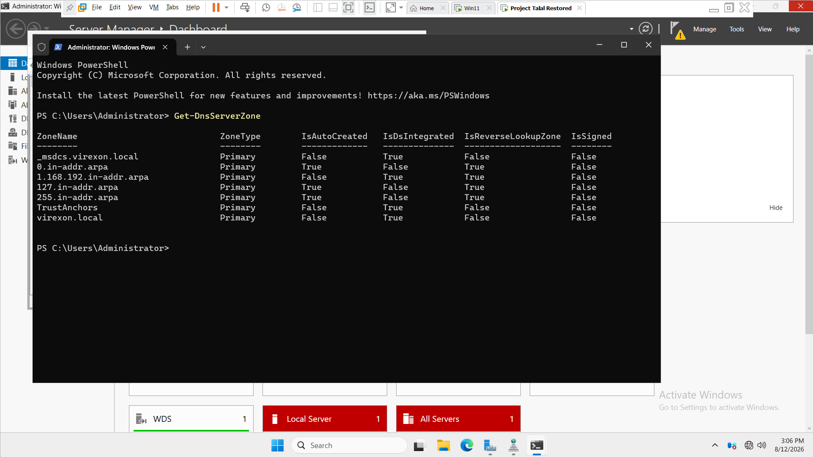

---

# 14. DNS A Records Verification

The A records within the virexon.local zone were verified using:

powershell
Get-DnsServerResourceRecord -ZoneName "virexon.local" -RRType A

The important host records were confirmed as:

| Host | Record Type | IPv4 Address |
|---|---|---|
| PC26 | A | 192.168.1.2 |
| PC-IT-01 | A | 192.168.1.31 |

Additional Active Directory-related records were also present, including records associated with:

- DomainDnsZones
- ForestDnsZones

## Screenshot

---

# 15. Active Directory SRV Records

Active Directory relies on DNS SRV records for service discovery.

SRV records allow domain members to locate services provided by the Domain Controller, including:

- Kerberos
- LDAP
- Global Catalog
- PDC
- Domain Controller services

The _msdcs.virexon.local zone was inspected using:

powershell
Get-DnsServerResourceRecord -ZoneName "_msdcs.virexon.local" -RRType SRV

The required Active Directory service records were present and pointed to:

text
pc26.virexon.local

Important service ports observed included:

| Service | Protocol | Port |
|---|---|---:|
| Kerberos | TCP | 88 |
| LDAP | TCP | 389 |
| Global Catalog | TCP | 3268 |

The presence of these records confirms that DNS is correctly supporting Active Directory service discovery.

## Screenshot

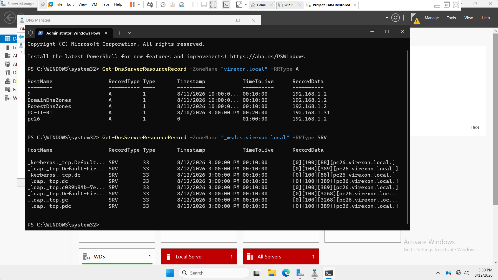

---

# 16. DNS Server Service Status

The DNS Server service was verified using:

powershell
Get-Service -Name DNS

The final state was:

text
Status        : Running
Name          : DNS
DisplayName   : DNS Server

This confirms that the DNS Server service is currently operational on PC26.

## Screenshot

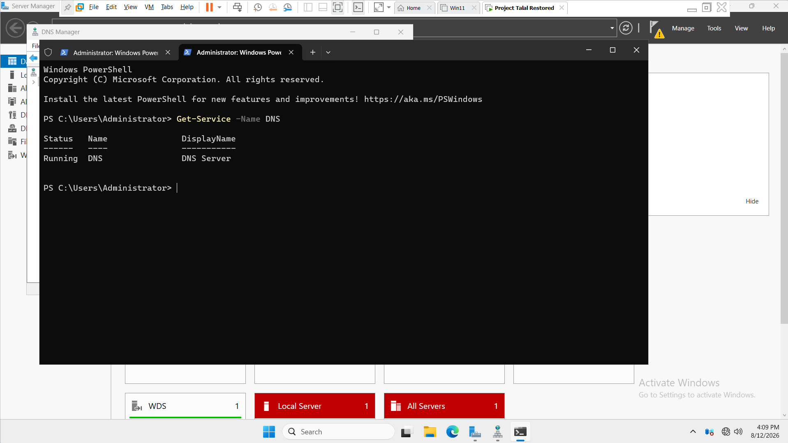

---

# 17. DNS Forwarders

DNS Forwarders were reviewed during the DNS configuration process.

A public DNS server such as:

text
8.8.8.8

was tested.

However, the lab environment intentionally operates without external Internet connectivity. Therefore, the DNS Server could not validate communication with the public Forwarder.

The lab was not switched to a bridged or Internet-connected network solely for the purpose of validating a Forwarder.

As a result:

- No external Forwarder was configured.
- The DNS Server remains isolated within the lab environment.
- This is an intentional lab design decision.
- The absence of a Forwarder is not considered a DNS failure within this isolated environment.

---

# 18. Security and Design Considerations

## 18.1 Active Directory Integration

The primary DNS zones are Active Directory-integrated.

This allows DNS data to be integrated with the Active Directory environment and supports the DNS requirements of the domain.

---

## 18.2 Secure Dynamic Updates

Dynamic updates were configured as:

text
Secure only

This restricts DNS updates to authorized domain members.

---

## 18.3 DNS Aging and Scavenging

DNS Aging and Scavenging were enabled to help prevent stale dynamic records from remaining indefinitely in the DNS database.

The configured intervals are:

- No-Refresh: 7 days
- Refresh: 7 days

---

## 18.4 Isolated Lab Network

The DNS Server operates within an isolated VMware lab environment.

Internet connectivity was intentionally not introduced simply to configure or validate external DNS Forwarders.

This keeps the lab focused on internal Active Directory and DNS functionality.

---

# 19. DNS Validation Summary

The DNS implementation was validated through configuration checks, functional tests, and service health verification.

| Component / Validation | Result |
|---|---|
| Forward Lookup Zone | ✅ Passed |
| Reverse Lookup Zone | ✅ Passed |
| A Records | ✅ Verified |
| PTR Records | ✅ Verified |
| Forward DNS Resolution | ✅ Passed |
| Reverse DNS Resolution | ✅ Passed |
| Client Forward DNS Resolution | ✅ Passed |
| Client Reverse DNS Resolution | ✅ Passed |
| Dynamic DNS Registration | ✅ Passed |
| Secure Dynamic Updates | ✅ Configured |
| DNS Aging | ✅ Configured |
| DNS Scavenging | ✅ Enabled |
| AD SRV Records | ✅ Verified |
| dcdiag /test:dns | ✅ Passed |
| DNS Zones | ✅ Verified |
| DNS Server Service | ✅ Running |
| External Forwarders | ℹ️ Not configured by design |

---

# 20. Screenshots

The DNS configuration and validation process is documented using the following screenshots.

| # | Screenshot | Description |
|---:|---|---|
| 01 | 01-Reverse-Lookup-Zone-Created.png | Reverse Lookup Zone creation |
| 02 | 02-PTR-Record-PC26.png | PTR record for PC26 |
| 03 | 03-Reverse-DNS-Resolution.png | Reverse DNS resolution |
| 04 | 04-Forward-DNS-Resolution.png | Forward DNS resolution |
| 05 | 05-Client-Forward-DNS-Resolution.png | Client Forward DNS resolution |
| 06 | 06-DNS-Diagnostic-Test-dcdiag.png | DNS diagnostic validation |
| 07 | 07-DNS-Aging-Scavenging-Configuration.png | DNS Aging configuration |
| 08 | 08-DNS-Server-Scavenging-Enabled.png | DNS Scavenging enabled |
| 09 | 09-Secure-Dynamic-Updates.png | Secure Dynamic Updates |
| 10 | 10-Dynamic-DNS-Client-Registration.png | Dynamic DNS client registration |
| 11 | 11-Server-Reverse-DNS-Resolution.png | Reverse DNS from Server |
| 12 | 12-Client-Reverse-DNS-Resolution.png | Reverse DNS from Client |
| 13 | 13-DNS-Zones-Configuration.png | DNS Zones verification |
| 14 | 14-DNS-A-Records-Verification.png | DNS A Records verification |
| 15 | 15-AD-SRV-Records-Verification.png | Active Directory SRV Records |
| 16 | 16-DNS-Service-Status.png | DNS Server service status |

---

# 21. Completion Status

The DNS infrastructure for the VIREXON.LOCAL Windows Server Lab has been successfully configured and validated.

The completed implementation includes:

- Active Directory-integrated DNS
- Forward Lookup Zone
- Reverse Lookup Zone
- A Records
- PTR Records
- Active Directory SRV Records
- Forward DNS Resolution
- Reverse DNS Resolution
- Client DNS Resolution
- Secure Dynamic Updates
- Dynamic DNS Client Registration
- DNS Aging
- DNS Scavenging
- DNS Diagnostic Validation
- DNS Zone Verification
- DNS Record Verification
- DNS Server Service Health Verification

All required DNS configuration and validation tasks for this project phase have been completed successfully.

## Final Status

*DNS — COMPLETED ✅*
