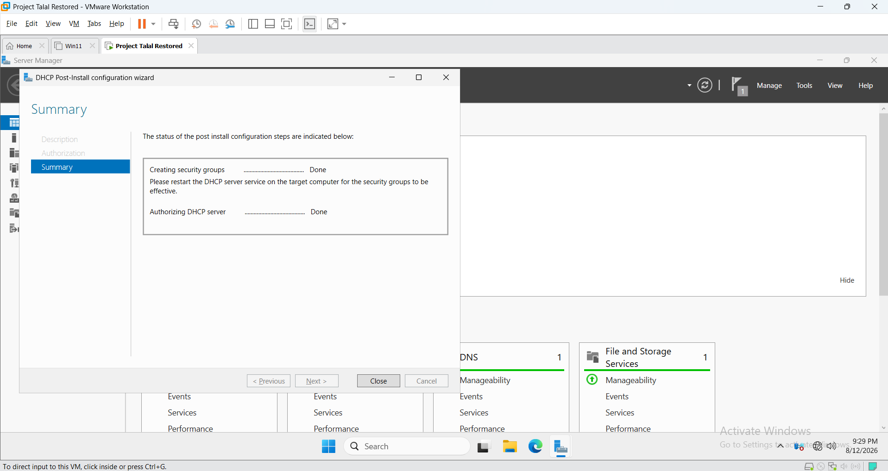
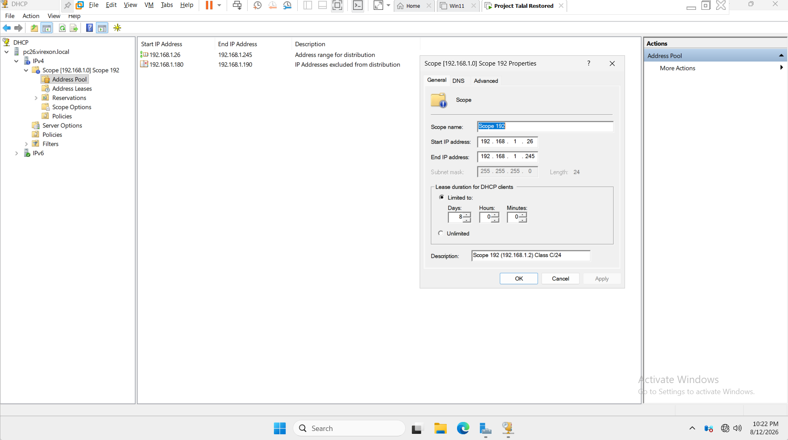
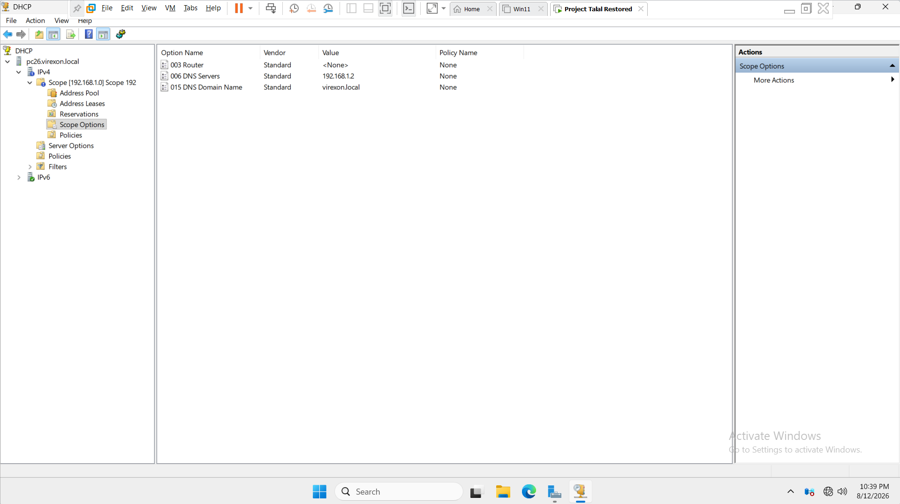
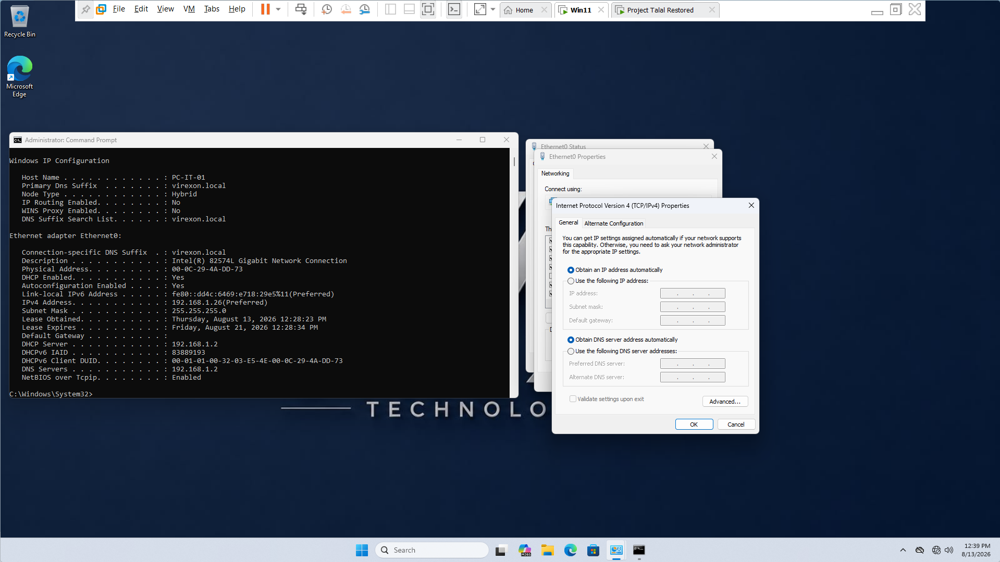
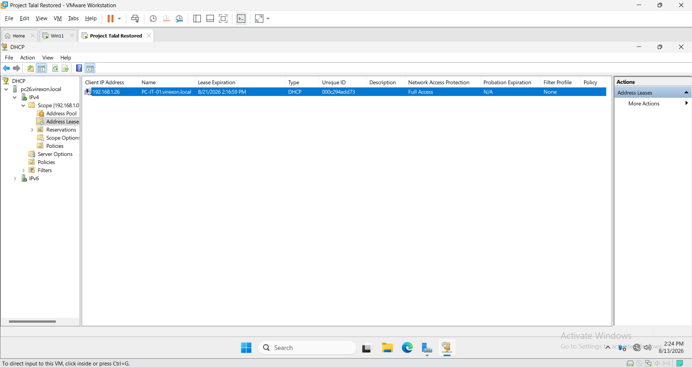
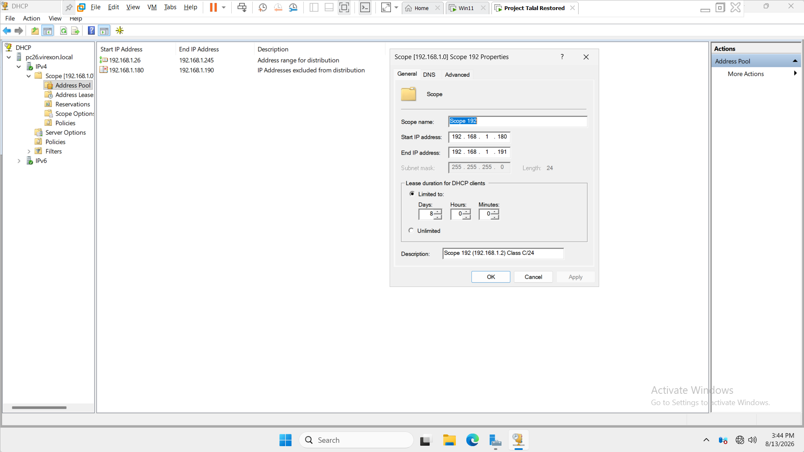
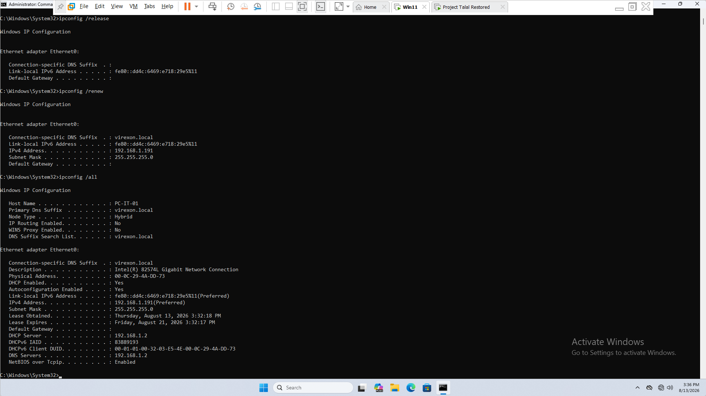
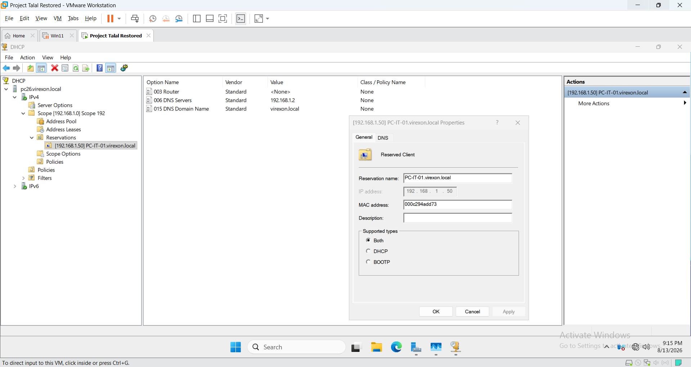
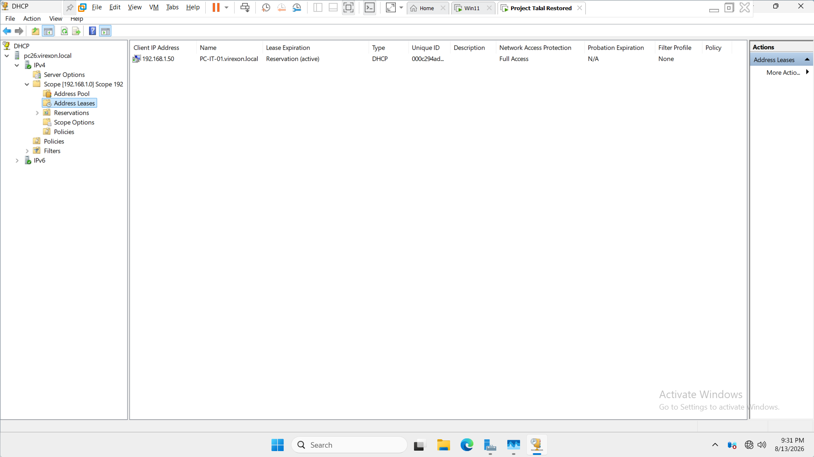

# DHCP Server Configuration

## Overview

This section documents the implementation, configuration, testing, and validation of the Dynamic Host Configuration Protocol (DHCP) service within the **VIREXON.LOCAL** Windows Server lab environment.

The DHCP Server was configured on Windows Server 2022 and validated using a Windows 11 client. The implementation demonstrates centralized IPv4 address management, DHCP Scope configuration, Scope Options, address exclusions, lease management, and DHCP Reservations.

The DHCP design was intentionally structured to simulate an enterprise-style network while remaining appropriate for the isolated VMware lab environment.

---

## Lab Environment

| Component | Configuration |
|---|---|
| Server OS | Windows Server 2022 |
| Client OS | Windows 11 |
| Domain | VIREXON.LOCAL |
| DHCP Server | PC26.virexon.local |
| DHCP Server IP | 192.168.1.2 |
| Network | 192.168.1.0/24 |
| Subnet Mask | 255.255.255.0 |
| DHCP Client | PC-IT-01.virexon.local |
| DHCP Scope | 192.168.1.26 – 192.168.1.245 |
| Exclusion Range | 192.168.1.180 – 192.168.1.190 |
| DNS Server | 192.168.1.2 |
| DNS Domain | virexon.local |
| Lease Duration | 8 Days |
| DHCP Reservation | 192.168.1.50 |

---

## Network Addressing Design

The `192.168.1.0/24` network was divided logically to separate infrastructure addressing from dynamically assigned client addresses.

| Address Range | Purpose |
|---|---|
| 192.168.1.1 – 192.168.1.25 | Static Infrastructure |
| 192.168.1.26 – 192.168.1.245 | DHCP Address Pool |
| 192.168.1.180 – 192.168.1.190 | DHCP Exclusion |
| 192.168.1.246 – 192.168.1.254 | Reserved Infrastructure / Emergency |

The DHCP Scope therefore provides a controlled address range while preserving dedicated areas of the subnet for infrastructure and future requirements.

---

# 1. DHCP Server Installation and Authorization

The DHCP Server role was installed on the Windows Server 2022 machine.

After installation, the DHCP Server was authorized within Active Directory so that it could provide DHCP services to clients in the `VIREXON.LOCAL` domain environment.

The DHCP Server service was subsequently verified to ensure that it was running correctly.

### Screenshot

**Screenshot:** `01-DHCP-Post-Install-Authorization.png`

---

# 2. DHCP IPv4 Scope Configuration

An IPv4 DHCP Scope was created for the `192.168.1.0/24` network.

The final DHCP Scope configuration was:

| Setting | Value |
|---|---|
| Start IP Address | 192.168.1.26 |
| End IP Address | 192.168.1.245 |
| Subnet Mask | 255.255.255.0 |
| Lease Duration | 8 Days |

The DHCP pool was intentionally separated from the static infrastructure range to provide centralized dynamic addressing for client devices.

The upper addresses of the subnet were also left outside the DHCP Scope for future infrastructure, emergency use, and controlled testing.

### Screenshot

**Screenshot:** `02-DHCP-Scope-Configuration.png`

---

# 3. DHCP Scope Options

DHCP Scope Options were configured to provide the network information required by clients.

## Option 006 — DNS Servers

The DHCP Server provides the following DNS Server address:

**192.168.1.2**

This points clients to `PC26`, which provides DNS services for the `VIREXON.LOCAL` Active Directory environment.

## Option 015 — DNS Domain Name

The DHCP Server provides the following DNS domain:

**virexon.local**

This allows DHCP clients to automatically receive the correct DNS suffix for the Active Directory environment.

## Option 003 — Router

No Default Gateway was configured.

The lab operates on an isolated internal VMware network and the Windows Server is not acting as a router or Internet gateway.

Therefore, no gateway was advertised to DHCP clients because there is no actual routing device required by the current lab design.

### Screenshot

**Screenshot:** `03-DHCP-Scope-Options.png`

---

# 4. DHCP Client Lease Verification

The Windows 11 client, `PC-IT-01`, was configured to obtain its IPv4 configuration automatically through DHCP.

The client successfully received an IPv4 address from the DHCP Server.

The client network configuration was then verified to confirm that DHCP was providing the expected network information.

The verification demonstrated that:

- DHCP was enabled on the client.
- The client received an IPv4 address dynamically.
- The DHCP Server was `192.168.1.2`.
- The DNS Server was `192.168.1.2`.
- The DNS domain was `virexon.local`.

This provides practical evidence that the DHCP Server is successfully assigning network configuration to clients.

### Screenshot

**Screenshot:** `04-DHCP-Client-Lease-Verification.png`

---

# 5. DHCP Server Lease Verification

The DHCP Management Console was used to verify the client's active lease from the server side.

The lease was located under:

`DHCP > IPv4 > Scope > Address Leases`

The Windows 11 client appeared in the Address Leases list, confirming that the DHCP Server successfully created and tracked the client's lease.

This server-side verification complements the client-side test and confirms that the DHCP Server is actively managing the assigned lease.

### Screenshot

**Screenshot:** `05-DHCP-Server-Address-Lease.png`

---

# 6. DHCP Address Exclusion

An address exclusion range was configured inside the DHCP Scope.

The exclusion range was:

**192.168.1.180 – 192.168.1.190**

The purpose of the exclusion is to prevent DHCP from dynamically assigning these addresses.

This provides a reserved block within the DHCP Scope that can remain available for controlled addressing requirements without removing the addresses from the overall network design.

## Practical Exclusion Validation

The exclusion was validated through an actual DHCP allocation test rather than only verifying that the exclusion existed in the DHCP console.

For the test, the DHCP Scope was temporarily adjusted so that the available range ended at:

**192.168.1.191**

while the exclusion remained:

**192.168.1.180 – 192.168.1.190**

The client then released its existing DHCP lease and requested a new lease.

Because `.180` through `.190` were excluded, DHCP skipped those addresses and assigned:

**192.168.1.191**

This demonstrated that the exclusion was functioning as intended.

### Screenshot

**Screenshot:** `06-DHCP-Exclusion-Range-Test.png`

---

# 7. DHCP Exclusion Verification

The exclusion behavior was verified from the Windows 11 client after the DHCP lease was released and renewed.

The client received:

**192.168.1.191**

instead of receiving an address from the excluded range:

**192.168.1.180 – 192.168.1.190**

This provides practical evidence that the DHCP Server skipped the excluded addresses during dynamic address allocation.

After completing the test, the DHCP Scope was restored to the final project configuration:

**192.168.1.26 – 192.168.1.245**

The exclusion remained:

**192.168.1.180 – 192.168.1.190**

### Screenshot

**Screenshot:** `07-DHCP-Exclusion-Verification.png`

---

# 8. DHCP Reservation Configuration

A DHCP Reservation was configured for the Windows 11 client `PC-IT-01`.

The purpose of the reservation is to allow the client to continue using DHCP while receiving a predictable IP address based on its MAC address.

The reservation was configured with the following values:

| Setting | Value |
|---|---|
| Reservation | PC-IT-01 |
| Reserved IP Address | 192.168.1.50 |
| Client MAC Address | Client-specific MAC address |
| Address Assignment | DHCP Reservation |

The reserved address `192.168.1.50` is within the DHCP Scope and is not part of the configured exclusion range.

This demonstrates a practical method for assigning a predictable IP address to a specific device while maintaining centralized DHCP management.

### Screenshot

**Screenshot:** `08-DHCP-Reservation-Configuration.png`

---

# 9. DHCP Reservation Verification

The DHCP Reservation was tested from the Windows 11 client.

The client released its existing DHCP lease and requested a new lease.

The client successfully received the reserved IP address:

**192.168.1.50**

The client-side network configuration was then verified to confirm that the reserved address was successfully assigned through DHCP.

This confirms that the DHCP Reservation is functioning correctly.

### Screenshot

**Screenshot:** `09-DHCP-Reservation-Verification.png`

---

# 10. DHCP Reservation Server-Side Verification

The DHCP Management Console was used to verify the reservation from the server side.

The client appeared in the DHCP Address Leases list with the reserved address:

**192.168.1.50**

The lease displayed the reservation as active.

The server-side verification demonstrated that:

- The reserved IP address was `192.168.1.50`.
- The client was associated with the DHCP Reservation.
- The reservation status was `Reservation (active)`.

This provides final server-side confirmation that the DHCP Reservation is functioning correctly.

### Screenshot

**Screenshot:** `10-DHCP-Reservation-Server-Lease.png`

---

# DHCP Validation Summary

The DHCP implementation was validated from both the Windows 11 client and the Windows Server DHCP Management Console.

| Validation | Result |
|---|---|
| DHCP Server Installation | Passed |
| DHCP Server Authorization | Passed |
| IPv4 DHCP Scope | Passed |
| DHCP Scope Options | Passed |
| Automatic Client IP Assignment | Passed |
| Client Lease Verification | Passed |
| Server-Side Lease Verification | Passed |
| DHCP Exclusion Configuration | Passed |
| DHCP Exclusion Practical Test | Passed |
| DHCP Exclusion Verification | Passed |
| DHCP Reservation Configuration | Passed |
| DHCP Reservation Client Verification | Passed |
| DHCP Reservation Server Verification | Passed |

---

# Final DHCP Configuration

The final DHCP configuration implemented in the lab is summarized below.

### Network

**Network:** `192.168.1.0/24`

**Subnet Mask:** `255.255.255.0`

### DHCP Server

**Hostname:** `PC26.virexon.local`

**IPv4 Address:** `192.168.1.2`

### DHCP Scope

**Start Address:** `192.168.1.26`

**End Address:** `192.168.1.245`

**Lease Duration:** `8 Days`

### DHCP Exclusion

**Start Address:** `192.168.1.180`

**End Address:** `192.168.1.190`

### DHCP Reservation

**Client:** `PC-IT-01`

**Reserved Address:** `192.168.1.50`

### DHCP Scope Options

**DNS Server:** `192.168.1.2`

**DNS Domain:** `virexon.local`

**Default Gateway:** Not configured

---

# Screenshots

The DHCP implementation is documented using the following screenshots:

1. `01-DHCP-Post-Install-Authorization.png`
2. `02-DHCP-Scope-Configuration.png`
3. `03-DHCP-Scope-Options.png`
4. `04-DHCP-Client-Lease-Verification.png`
5. `05-DHCP-Server-Address-Lease.png`
6. `06-DHCP-Exclusion-Range-Test.png`
7. `07-DHCP-Exclusion-Verification.png`
8. `08-DHCP-Reservation-Configuration.png`
9. `09-DHCP-Reservation-Verification.png`
10. `10-DHCP-Reservation-Server-Lease.png`

---

# Conclusion

The DHCP Server was successfully configured, tested, and validated within the `VIREXON.LOCAL` Windows Server lab environment.

The implementation demonstrates practical DHCP administration, including:

- DHCP Server authorization
- IPv4 Scope design
- Dynamic IP address allocation
- DHCP Scope Options
- DNS integration
- DHCP lease management
- DHCP address exclusions
- Practical exclusion validation
- DHCP Reservations
- Client-side DHCP validation
- Server-side DHCP validation

The DHCP configuration was tested from both sides of the service. The Windows 11 client was used to verify the actual configuration received through DHCP, while the Windows Server DHCP Management Console was used to verify leases, exclusions, and the active reservation.

The final DHCP design uses the `192.168.1.0/24` network with a dynamic address pool of `192.168.1.26 – 192.168.1.245`, an exclusion range of `192.168.1.180 – 192.168.1.190`, and a DHCP Reservation of `192.168.1.50` for `PC-IT-01`.

The DHCP phase is therefore considered **Completed and Verified**.
