# Windows Server File Server Implementation

## Overview

This phase documents the design, implementation, troubleshooting, redesign, and validation of an enterprise-style File Server environment within the VIREXON.LOCAL Active Directory domain.

The objective was not only to create shared folders, but to build a structured access-control model based on:

- Active Directory security groups
- AGDLP principles
- Role-based access
- NTFS permissions
- SMB share permissions
- Access-Based Enumeration (ABE)
- Effective Access validation
- SMB session monitoring
- DNS-based file access
- Group Policy-based network drive mapping

During the implementation, an initial permission design issue was discovered: departmental users were correctly isolated from other departments, but all users within the same department effectively received Modify access.

Instead of leaving the design in that state, the access model was redesigned to separate read-only users from users requiring modification privileges.

The final design follows the principle of least privilege and provides centralized, scalable access management.

---

## Environment

| Component | Configuration |
|---|---|
| Active Directory Domain | VIREXON.LOCAL |
| File Server | PC26 |
| File Server FQDN | PC26.virexon.local |
| File Server IP | 192.168.1.2 |
| Client Computer | PC-IT-01 |
| File Server Data Volume | F: |
| Department Root Path | F:\CompanyData\Departments |
| SMB Share Name | Departments |
| UNC Path | \\PC26\Departments |
| Mapped Drive | S: |
| Client OS | Windows 11 |
| Server OS | Windows Server |

---

# 1. File Server Role Verification

The File Server role was verified before configuring departmental storage.

This ensured that the server had the required file services capabilities before implementing SMB sharing and NTFS access controls.

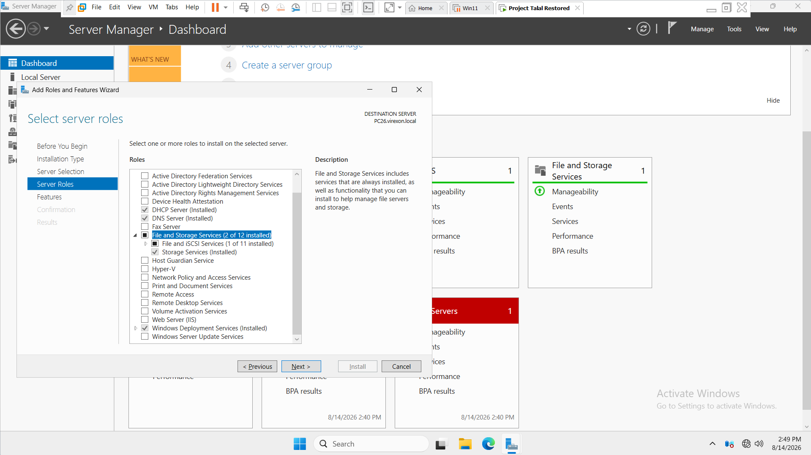

---

# 2. Dedicated File Server Data Volume

A dedicated F: volume was used for file server data instead of storing departmental data directly on the operating system volume.

This provides a cleaner separation between:

- Operating system files
- Active Directory services
- File server data
- Future storage management operations

The departmental data structure was created under:

text
F:\CompanyData

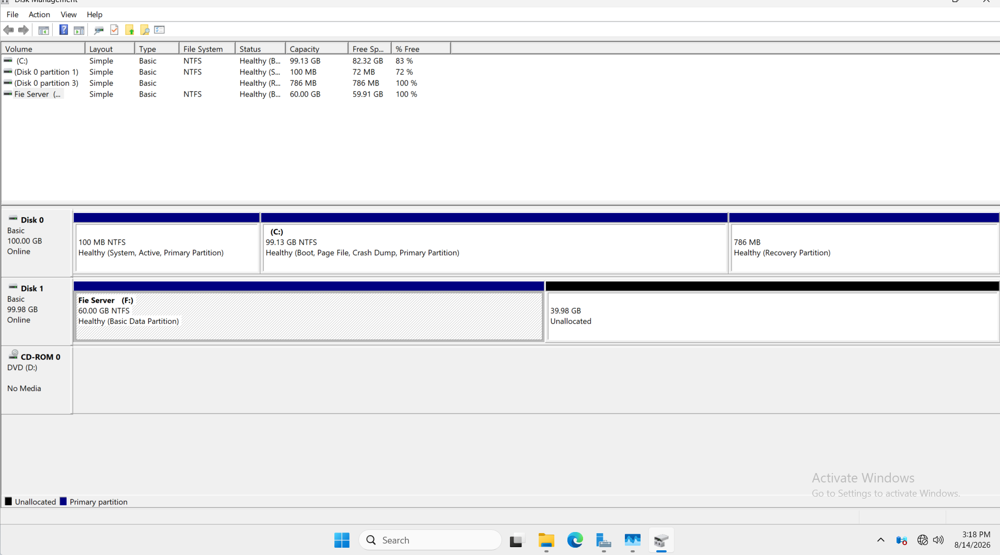

---

# 3. Department Folder Structure

A centralized departmental folder structure was created under:

text
F:\CompanyData\Departments

The structure contains the six company departments:

text
F:\CompanyData\Departments
│
├── Finance
├── HR
├── IT
├── Management
├── Marketing
└── Sales

This design provides one central SMB share while maintaining separate NTFS permissions for each department.

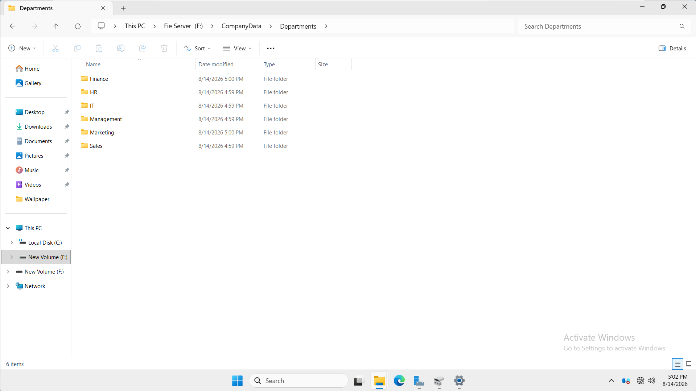

---

# 4. Initial AGDLP Implementation

The original access-control design used departmental Global Groups and Domain Local permission groups.

The initial concept followed:

text
User Account
      ↓
Department Global Group
      ↓
Domain Local Permission Group
      ↓
NTFS Permission

A sample group nesting configuration was implemented during the first version of the design.

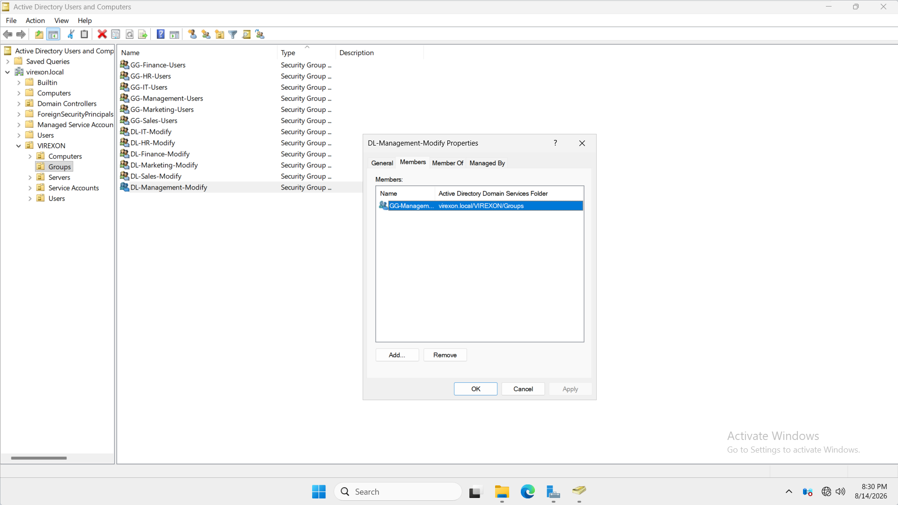

---

# 5. Initial NTFS Permission Configuration

NTFS inheritance was reviewed on department folders.

Broad inherited user permissions were removed so that departmental access could be explicitly controlled.

The initial HR configuration retained administrative principals while assigning department access through an Active Directory security group.

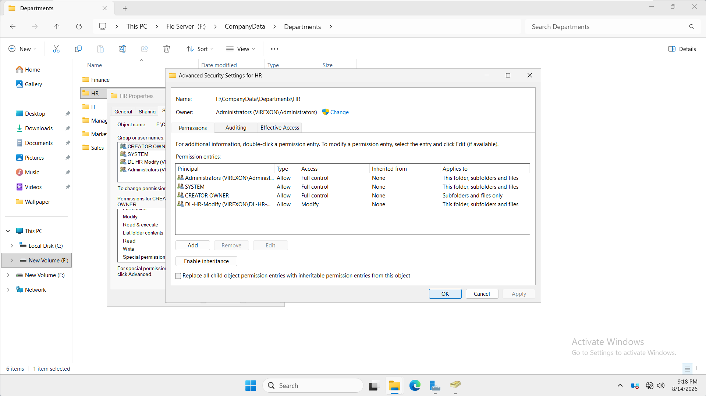

---

# 6. SMB Department Share

The complete departmental folder structure was shared through a single SMB share.

Physical path:

text
F:\CompanyData\Departments

Network path:

text
\\PC26\Departments

Using a single root share provides centralized administration while NTFS permissions control access to individual departments.

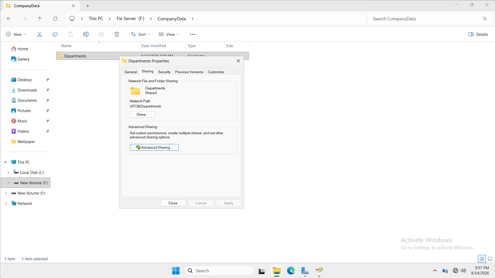

---

# 7. Initial Access Validation

The first access-control tests confirmed that department isolation was working.

An IT user attempted to access the HR department folder and was denied.

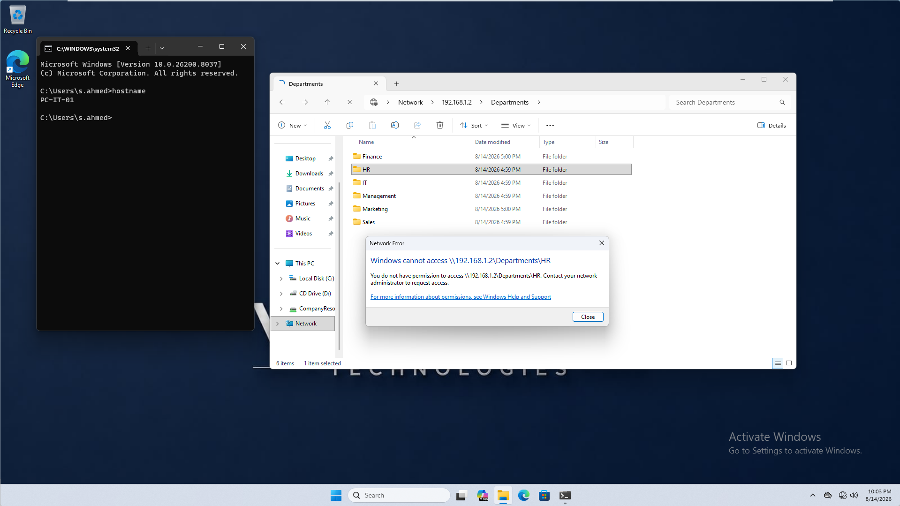

The same IT user was able to access and modify the IT folder.

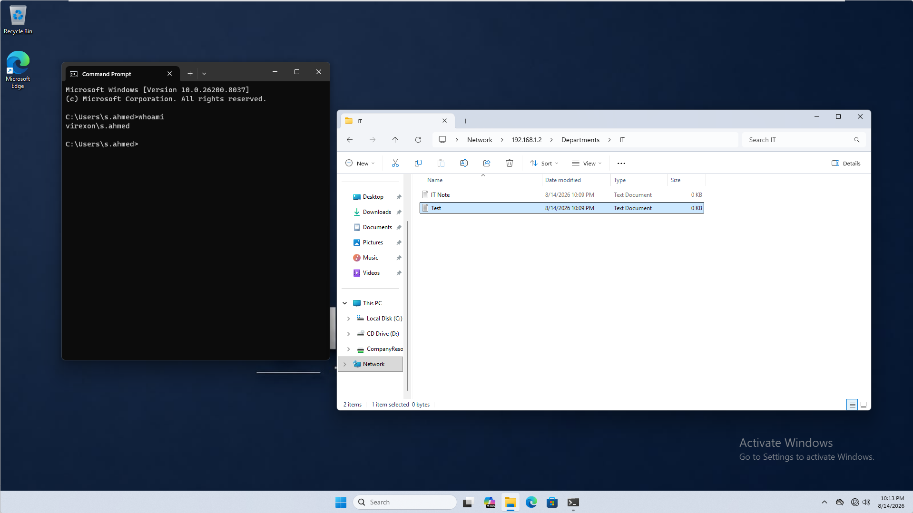

These tests confirmed that users could not access another department.

However, further review identified an important design problem.

---

# 8. Permission Design Issue Discovered

Although department isolation worked correctly, the first design granted excessive permissions inside each user's own department.

The original model effectively placed the entire departmental user group into a Modify permission path.

Conceptually:

text
All IT Users
      ↓
GG-IT-Users
      ↓
DL-IT-Modify
      ↓
Modify Permission

This meant that users who only required read access could also:

- Create files
- Modify files
- Create folders
- Delete files and folders

The design therefore worked technically, but did not satisfy the principle of least privilege.

Instead of accepting this configuration, the group and permission architecture was redesigned.

---

# 9. Active Directory Group Architecture Redesign

The Groups OU was reorganized into three separate organizational units:

text
VIREXON
└── Groups
    │
    ├── Department-Groups
    ├── Access-Role-Groups
    └── Resource-Permission-Groups

Each OU now has a specific responsibility.

### Department-Groups

Used to maintain general departmental identity groups.

### Access-Role-Groups

Used to classify users according to the level of access they require.

### Resource-Permission-Groups

Used to represent the actual permissions assigned to file system resources.

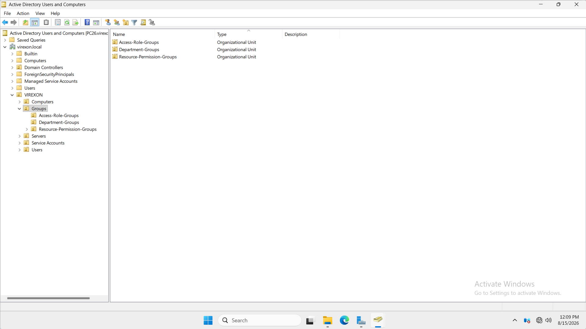

---

# 10. Access Role Groups

Two Global Security Groups were created for each department:

text
Readers
Editors

The final Access Role groups are:

text
GG-IT-Readers
GG-IT-Editors

GG-HR-Readers
GG-HR-Editors

GG-Finance-Readers
GG-Finance-Editors

GG-Marketing-Readers
GG-Marketing-Editors

GG-Sales-Readers
GG-Sales-Editors

GG-Management-Readers
GG-Management-Editors

These groups separate users according to their required access level.

Readers receive read-only access.

Editors receive modification access.

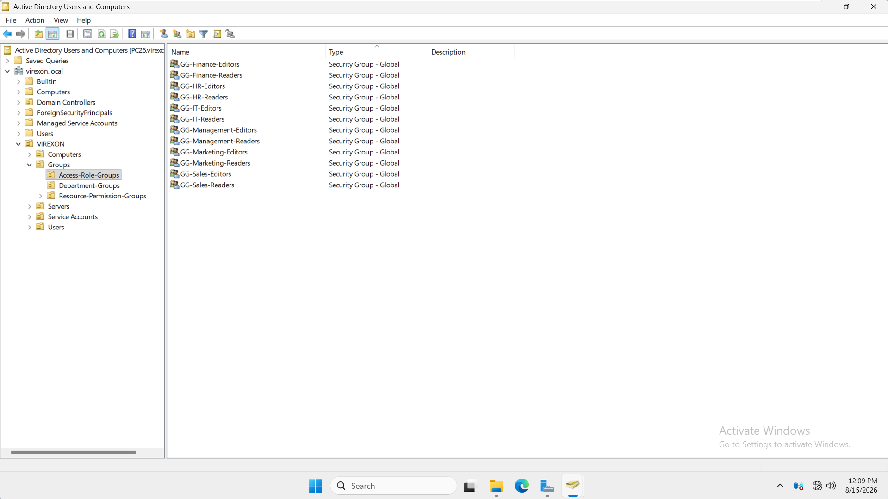

---

# 11. Resource Permission Groups

Two Domain Local Security Groups were created for every department:

text
Read
Modify

The complete permission group design is:

text
DL-IT-Read
DL-IT-Modify

DL-HR-Read
DL-HR-Modify

DL-Finance-Read
DL-Finance-Modify

DL-Marketing-Read
DL-Marketing-Modify

DL-Sales-Read
DL-Sales-Modify

DL-Management-Read
DL-Management-Modify

All resource permission groups were configured with:

text
Group Scope: Domain Local
Group Type:  Security

This is important because the Domain Local groups represent access to resources located inside the domain.

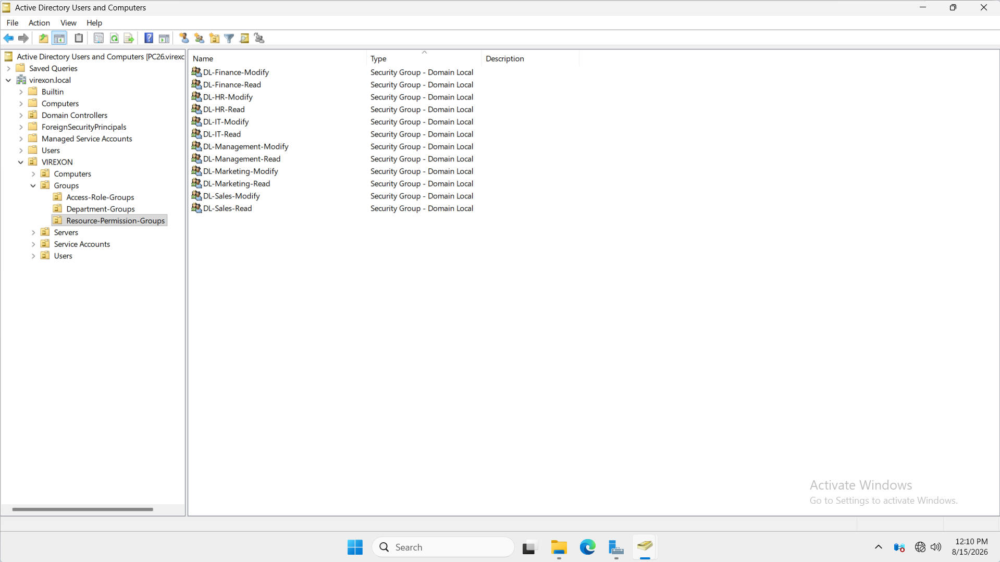

---

# 12. Department Global Groups

The original departmental Global Security Groups were retained for general department membership and identity.

text
GG-Finance-Users
GG-HR-Users
GG-IT-Users
GG-Management-Users
GG-Marketing-Users
GG-Sales-Users

These groups are separated from the new file-server role groups so that general departmental membership does not automatically grant resource modification rights.

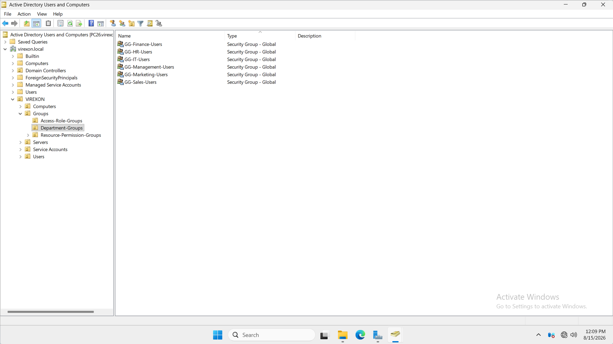

---

# 13. Role-Based User Membership

Users requiring modification access were assigned to the appropriate department Editors Global Group.

Example:

text
User
  ↓
GG-IT-Editors

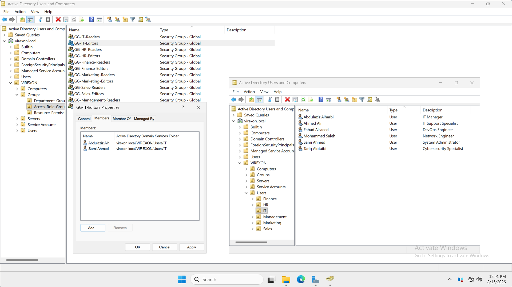

Users requiring read-only access were assigned to the appropriate department Readers Global Group.

Example:

text
User
  ↓
GG-IT-Readers

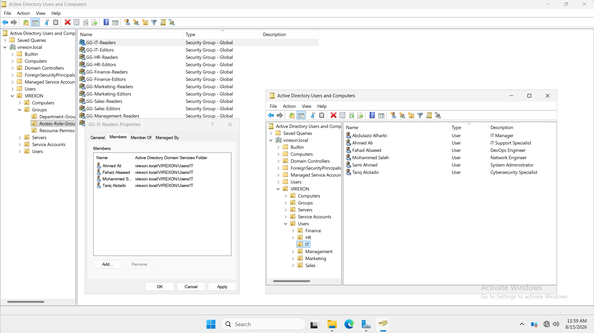

This corrected the original design by separating departmental membership from resource access level.

---

# 14. Final AGDLP Group Nesting

The final resource access chain follows the AGDLP principle:

text
A  → Accounts
G  → Global Groups
DL → Domain Local Groups
P  → Permissions

### Read Access Example

text
User Account
     ↓
GG-IT-Readers
     ↓
DL-IT-Read
     ↓
NTFS Read & Execute

### Modify Access Example

text
User Account
     ↓
GG-IT-Editors
     ↓
DL-IT-Modify
     ↓
NTFS Modify

The complete nesting of all twelve resource permission groups was verified using PowerShell.

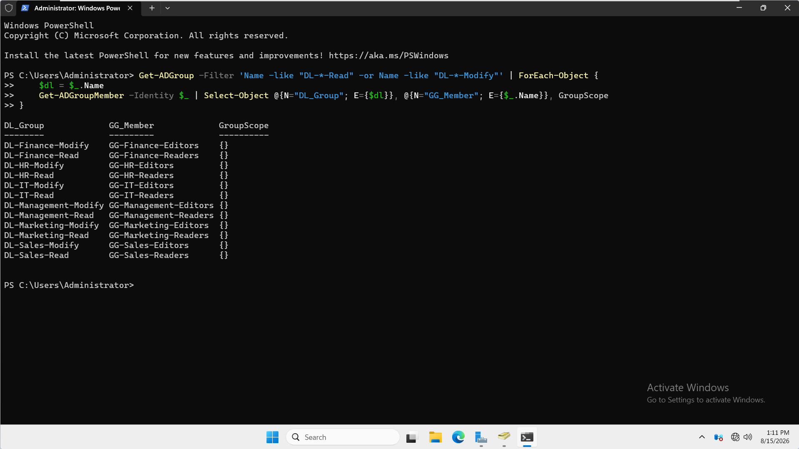

This verification confirmed that every department had the correct relationship:

text
DL-Department-Read   → GG-Department-Readers
DL-Department-Modify → GG-Department-Editors

---

# 15. Final NTFS Permission Model

Each departmental folder received explicit NTFS permissions using the Domain Local permission groups.

For example, the IT department folder uses:

text
Administrators      → Full Control
SYSTEM              → Full Control
CREATOR OWNER       → Full Control
DL-IT-Read          → Read & Execute
DL-IT-Modify        → Modify

The permission entries apply to:

text
This folder, subfolders and files

Broad inherited user access was removed from department folders.

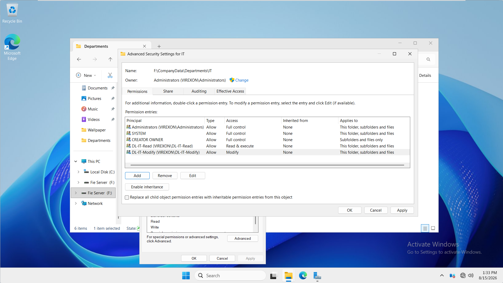

---

# 16. NTFS Permissions Across All Departments

PowerShell was used to verify the final NTFS access-control entries across all six departmental folders.

The validation confirmed:

text
Finance
  DL-Finance-Read   → ReadAndExecute
  DL-Finance-Modify → Modify

HR
  DL-HR-Read        → ReadAndExecute
  DL-HR-Modify      → Modify

IT
  DL-IT-Read        → ReadAndExecute
  DL-IT-Modify      → Modify

Management
  DL-Management-Read   → ReadAndExecute
  DL-Management-Modify → Modify

Marketing
  DL-Marketing-Read   → ReadAndExecute
  DL-Marketing-Modify → Modify

Sales
  DL-Sales-Read   → ReadAndExecute
  DL-Sales-Modify → Modify

The verification also confirmed:

text
Inherited = False

for the department permission entries.

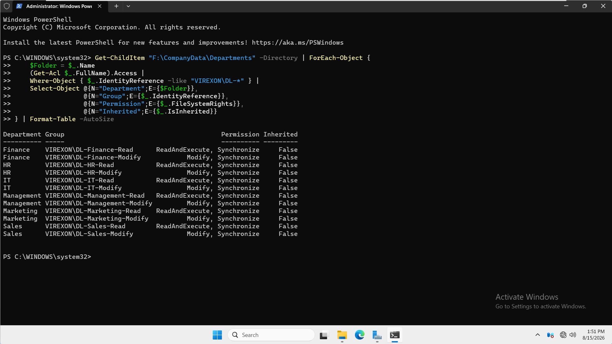

---

# 17. Reader Access Validation

An IT user assigned to the Reader role was tested from the Windows 11 client.

The user could:

text
Open the IT folder      → Allowed
View files              → Allowed
Read files              → Allowed

The same user could not:

text
Create folders          → Denied
Create files            → Denied
Modify content          → Denied
Delete content          → Denied

The test confirmed that the corrected Reader design was operating as intended.

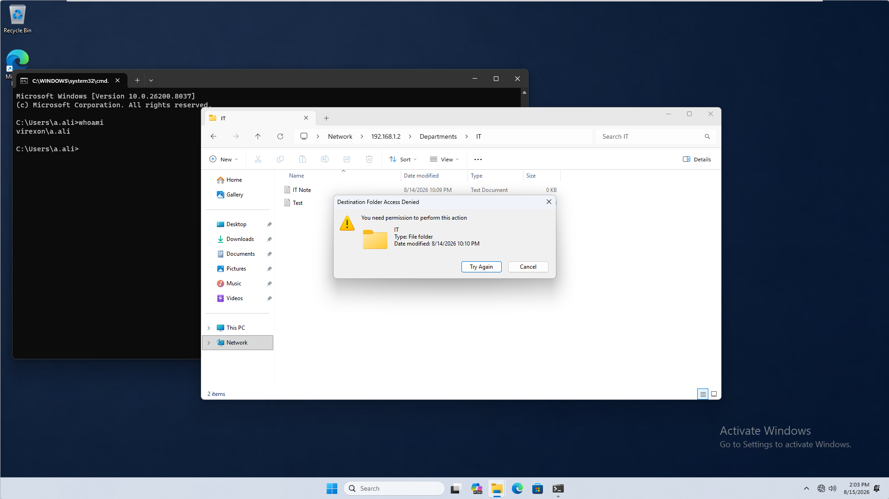

---

# 18. Editor Access Validation

An IT user assigned to the Editor role was tested against the same department folder.

The user successfully created content inside the IT folder.

This confirmed that:

text
GG-IT-Editors
      ↓
DL-IT-Modify
      ↓
NTFS Modify

was functioning correctly.

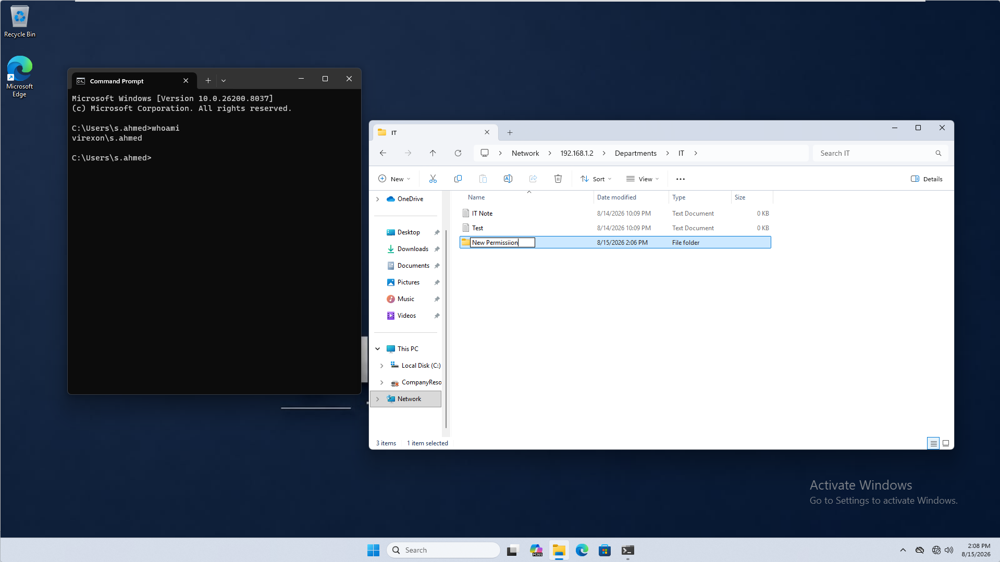

---

# 19. Access-Based Enumeration

Access-Based Enumeration (ABE) was enabled on the Departments SMB share.

ABE hides files and folders that a user does not have permission to access.

Without ABE, a user may see department folder names even if access is denied.

With ABE enabled:

text
IT User
   ↓
\\PC26\Departments
   ↓
IT

Other department folders are hidden if the user does not have access to them.

ABE does not replace NTFS permissions.

Its role is visibility control.

text
NTFS
→ Determines whether access is allowed

ABE
→ Determines whether unauthorized resources are visible

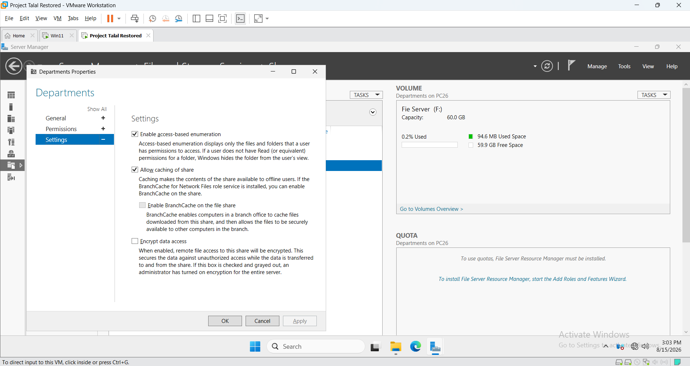

---

# 20. ABE Client Verification

The ABE configuration was validated from the Windows 11 client.

An IT user browsing:

text
\\192.168.1.2\Departments

could see only the IT department folder.

The remaining departments were hidden from the user's view.

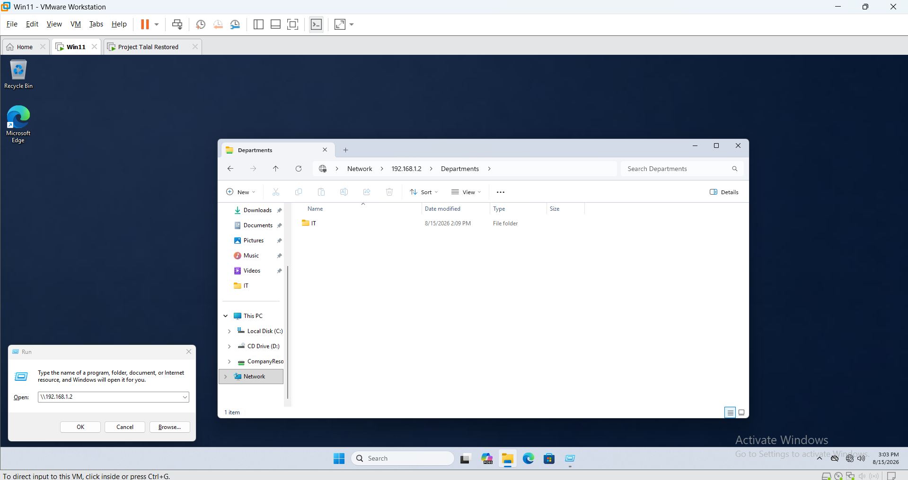

This demonstrates the combination of:

text
AGDLP
+
NTFS
+
ABE

for department-level access isolation.

---

# 21. SMB Share Permissions

The Departments SMB share uses:

text
Domain Users → Full Control

at the Share Permission level.

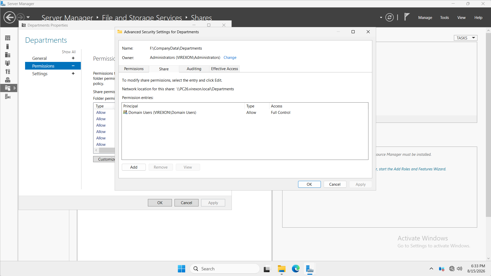

This configuration is intentional.

Detailed authorization is controlled through NTFS permissions rather than duplicating the same permission model at both Share and NTFS levels.

Example:

text
Share Permission:
Domain Users → Full Control

NTFS Permission:
DL-IT-Read → Read & Execute

Effective Network Access:
Read & Execute

Another example:

text
Share Permission:
Domain Users → Full Control

NTFS Permission:
DL-IT-Modify → Modify

Effective Network Access:
Modify

This keeps the permission architecture centralized in NTFS and Active Directory security groups.

---

# 22. Effective Access Validation — Reader

Windows Effective Access was used to calculate the final permissions of an IT Reader account on the IT department folder.

The result showed that the Reader account could:

text
Traverse folder / execute file
List folder / read data
Read attributes
Read extended attributes
Read permissions

but could not:

text
Create files
Create folders
Write attributes
Delete
Change permissions
Take ownership
Use Full Control

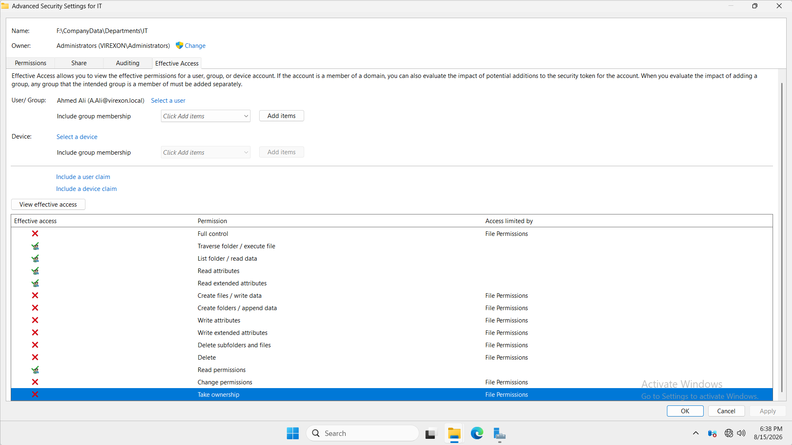

This provided an administrative validation of the effective result of the complete group and NTFS permission chain.

---

# 23. Effective Access Validation — Editor

Effective Access was also tested for an IT Editor account.

The Editor account received the required modification permissions while administrative permissions such as ownership and ACL modification remained restricted.

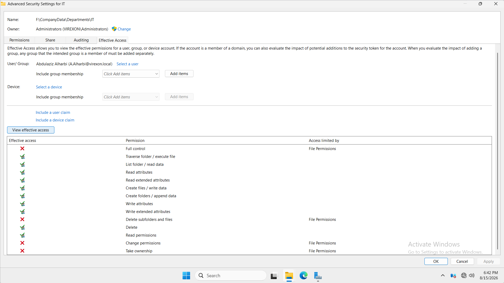

The comparison confirmed the intended role separation:

text
Reader → Read & Execute
Editor → Modify

---

# 24. SMB Active Session Monitoring

File Server administration also included monitoring active SMB connections.

Using:

text
Computer Management
→ Shared Folders
→ Sessions

the server can identify users currently connected to shared resources.

This is useful for:

- Troubleshooting locked files
- Monitoring active users
- Identifying SMB connections
- Supporting file server maintenance

An active SMB session from the client was successfully verified.

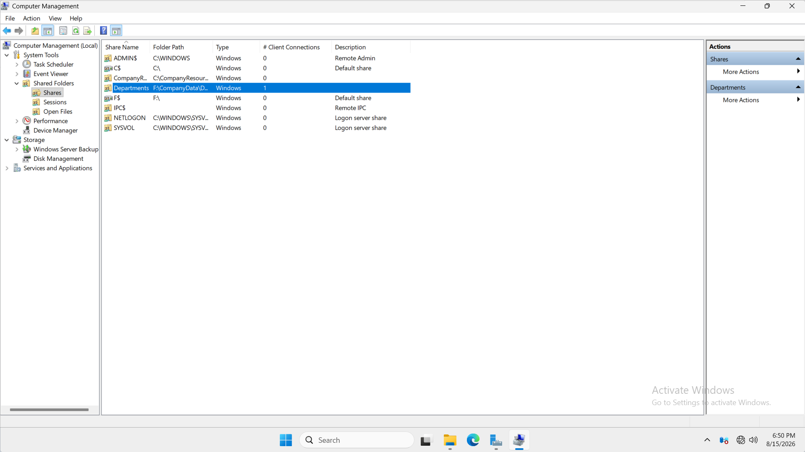

---

# 25. DNS-Based Share Access

The File Server share was tested using the server hostname instead of the IP address.

The client successfully accessed:

text
\\PC26\Departments

instead of relying on:

text
\\192.168.1.2\Departments

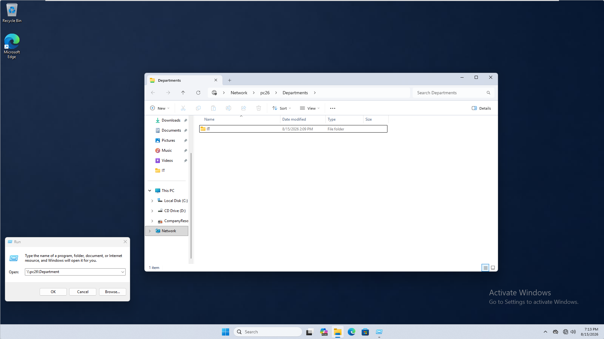

Using the server name provides a cleaner and more manageable enterprise access method and confirms integration between the File Server and the existing DNS infrastructure.

---

# 26. Centralized Network Drive Mapping with Group Policy

Manual drive mapping on every client computer was intentionally avoided.

Instead, Group Policy Preferences was used to centrally deploy the departmental share.

The Drive Map configuration uses:

text
Action:        Update
Drive Letter:  S:
Location:      \\PC26\Departments

The mapping is configured under:

text
User Configuration
└── Preferences
    └── Windows Settings
        └── Drive Maps

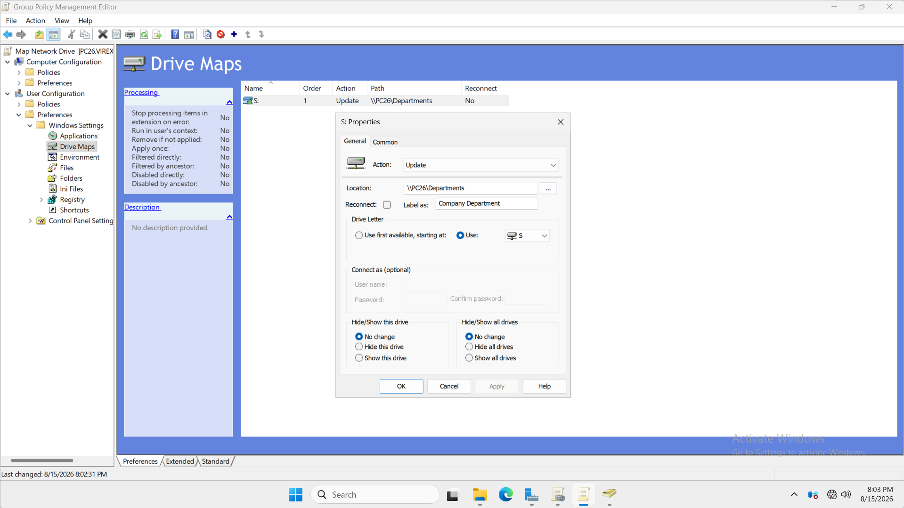

A single departmental drive was selected instead of creating one mapped drive for every department.

The complete access process is therefore:

text
User Sign-In
     ↓
Group Policy Preferences
     ↓
S: → \\PC26\Departments
     ↓
Access-Based Enumeration
     ↓
Only authorized departments are displayed
     ↓
NTFS Permissions
     ↓
Read or Modify access is enforced

---

# 27. GPO Drive Map Client Verification

The Group Policy was successfully applied to the Windows 11 client.

The mapped drive appeared automatically as:

text
Company Department (S:)

The gpresult validation also confirmed that the Map Network Drive GPO was included in the user's applied Group Policy Objects.

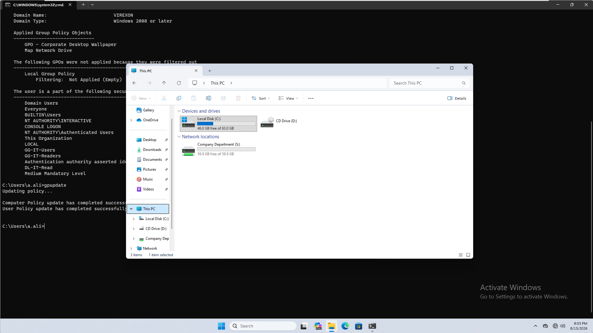

The mapped drive remained available after the user signed out and signed back in, confirming that the GPO configuration continues to manage the drive during user logon.

---

# Final File Server Architecture

The final access architecture can be summarized as:

text
Active Directory User
        │
        ▼
Role-Based Global Security Group
GG-Department-Readers
or
GG-Department-Editors
        │
        ▼
Domain Local Permission Group
DL-Department-Read
or
DL-Department-Modify
        │
        ▼
NTFS Permission
Read & Execute
or
Modify
        │
        ▼
Department Folder
        │
        ▼
SMB Share
\\PC26\Departments
        │
        ▼
Access-Based Enumeration
        │
        ▼
GPO Mapped Drive
S:

---

# Permission Model

| Role | NTFS Permission | Create Files | Modify Files | Delete | Read |
|---|---|---:|---:|---:|---:|
| Reader | Read & Execute | No | No | No | Yes |
| Editor | Modify | Yes | Yes | Yes | Yes |
| Administrators | Full Control | Yes | Yes | Yes | Yes |
| SYSTEM | Full Control | Yes | Yes | Yes | Yes |

---

# Department Permission Mapping

| Department | Reader Group | Read Permission Group | Editor Group | Modify Permission Group |
|---|---|---|---|---|
| IT | GG-IT-Readers | DL-IT-Read | GG-IT-Editors | DL-IT-Modify |
| HR | GG-HR-Readers | DL-HR-Read | GG-HR-Editors | DL-HR-Modify |
| Finance | GG-Finance-Readers | DL-Finance-Read | GG-Finance-Editors | DL-Finance-Modify |
| Marketing | GG-Marketing-Readers | DL-Marketing-Read | GG-Marketing-Editors | DL-Marketing-Modify |
| Sales | GG-Sales-Readers | DL-Sales-Read | GG-Sales-Editors | DL-Sales-Modify |
| Management | GG-Management-Readers | DL-Management-Read | GG-Management-Editors | DL-Management-Modify |

---

# Validation Summary

| Validation | Result |
|---|---|
| File Server role available | ✅ Passed |
| Dedicated data volume configured | ✅ Passed |
| Department folder structure created | ✅ Passed |
| SMB Departments share available | ✅ Passed |
| Unauthorized cross-department access blocked | ✅ Passed |
| Original over-permission issue identified | ✅ Resolved |
| Reader and Editor roles separated | ✅ Passed |
| Domain Local resource groups created | ✅ Passed |
| AGDLP nesting verified | ✅ Passed |
| Read NTFS permissions verified | ✅ Passed |
| Modify NTFS permissions verified | ✅ Passed |
| All six department ACLs verified | ✅ Passed |
| NTFS inheritance removed from department ACLs | ✅ Passed |
| Reader create/modify operation denied | ✅ Passed |
| Editor modification operation allowed | ✅ Passed |
| Access-Based Enumeration enabled | ✅ Passed |
| Unauthorized departments hidden by ABE | ✅ Passed |
| Share permissions validated | ✅ Passed |
| Reader Effective Access validated | ✅ Passed |
| Editor Effective Access validated | ✅ Passed |
| SMB active session monitoring validated | ✅ Passed |
| DNS hostname share access validated | ✅ Passed |
| GPO Drive Map configured | ✅ Passed |
| GPO Drive Map applied to client | ✅ Passed |
| Mapped drive available after user logon | ✅ Passed |

---

# Troubleshooting and Design Improvements

## Issue 1 — Excessive Modify Permissions

### Problem

The initial permission model placed entire departmental Global Groups into a Modify permission path.

This resulted in all users within the same department receiving modification privileges.

Although cross-department isolation worked, the design did not enforce least privilege within each department.

### Resolution

The access architecture was redesigned into separate role groups:

text
Readers
Editors

Users were assigned according to their required access level.

Resource permissions were then separated into:

text
DL-Department-Read
DL-Department-Modify

This changed the model from:

text
Department Membership
        ↓
Modify Access

to:

text
User
 ↓
Role-Based Global Group
 ↓
Domain Local Permission Group
 ↓
Required NTFS Permission

---

## Issue 2 — Domain Local Group Scope

During the redesign, the resource permission groups were reviewed and recreated using the correct:

text
Domain Local

group scope.

This aligned the resource permission layer with the intended AGDLP model.

---

## Issue 3 — Drive Map Path

During the GPO Drive Map configuration, the network location required the SMB UNC path rather than the server's local storage path.

The local path:

text
F:\CompanyData\Departments

is valid only on the File Server itself.

The correct client-accessible path is:

text
\\PC26\Departments

The mapping was corrected and successfully deployed through Group Policy.

---

# Key Technical Concepts Demonstrated

This phase demonstrates practical understanding of:

- Windows Server File Services
- Dedicated data volumes
- SMB file sharing
- UNC paths
- Share permissions
- NTFS permissions
- Explicit versus inherited permissions
- Active Directory Security Groups
- Global Groups
- Domain Local Groups
- AGDLP
- Role-Based Access Control
- Principle of Least Privilege
- Access-Based Enumeration
- Effective Access
- SMB session monitoring
- DNS-based resource access
- Group Policy Preferences
- Automatic network drive mapping
- Client-side permission validation
- Permission troubleshooting and redesign

---

# Security Design Principles

The final configuration follows several important security principles.

### Least Privilege

Users receive only the level of access required for their role.

text
Reader → Read & Execute
Editor → Modify

### Group-Based Permission Management

Permissions are assigned to Active Directory groups rather than individual users.

This makes access easier to manage, audit, and scale.

### Separation of Identity and Permission

Department membership is separated from file system permission roles.

A user can belong to a department without automatically receiving Modify permissions.

### Centralized Resource Administration

File access is controlled centrally using:

text
Active Directory
+
NTFS
+
SMB
+
ABE
+
Group Policy

### Centralized Client Configuration

Users do not need to manually configure network drives.

The S: drive is deployed centrally through Group Policy.

---

# Final Result

The final File Server implementation provides a centralized and scalable departmental storage environment for VIREXON.LOCAL.

The completed design supports:

text
Centralized Department Storage
        +
Role-Based Access Control
        +
AGDLP
        +
Least Privilege
        +
NTFS Security
        +
SMB Sharing
        +
Access-Based Enumeration
        +
Effective Access Validation
        +
SMB Session Monitoring
        +
DNS-Based Access
        +
Automatic GPO Drive Mapping

The original permission design was not simply left in place after testing.

A privilege-management weakness was identified, analyzed, and corrected through a complete redesign of the access-control structure.

This resulted in a cleaner architecture where departmental identity, access roles, resource permissions, and client connectivity are managed as separate layers.

The File Server phase was successfully implemented, tested, troubleshot, redesigned where necessary, and validated from both the server and client perspectives.

*Status: Completed ✅*
