# 09 - File Server Resource Manager (FSRM)

## Overview

This phase documents the implementation, configuration, and validation of **File Server Resource Manager (FSRM)** within the `VIREXON.LOCAL` Windows Server environment.

FSRM was implemented on the existing file server to provide centralized storage management and monitoring capabilities.

The implementation focused on three practical areas:

- **Quota Management** — controlling department storage capacity.
- **File Screening** — restricting prohibited file types.
- **Storage Reports** — analyzing storage usage and identifying large or inactive files.

The configuration was validated from both the Windows Server and Windows 11 client to ensure that the implemented controls worked as expected.

---

## Environment

| Component | Configuration |
|---|---|
| Domain | `VIREXON.LOCAL` |
| Server | `PC26` |
| Server OS | Windows Server 2022 |
| Client OS | Windows 11 |
| Data Volume | `F:` |
| Department Root | `F:\CompanyData\Departments` |
| Network Share | `\\PC26\Departments` |
| Client Mapped Drive | `S:` |
| Management Feature | File Server Resource Manager |

The existing department structure used during this phase was:

    F:\CompanyData\Departments
    │
    ├── Finance
    ├── HR
    ├── IT
    ├── Management
    ├── Marketing
    └── Sales

---

## Objectives

The objectives of this phase were to:

1. Install and verify File Server Resource Manager.
2. Implement independent storage quotas for department folders.
3. Automatically apply quotas to department subfolders.
4. Validate hard quota enforcement from a client computer.
5. Configure Active File Screening.
6. Prevent image files from being stored in department folders.
7. Verify that permitted files remain usable.
8. Configure Storage Reports.
9. Detect large files and identify their owners.
10. Configure scheduled storage reporting.

---

# 1. FSRM Role Installation

The **File Server Resource Manager** role service was installed on `PC26`.

FSRM provides centralized tools for managing and monitoring file server storage, including:

- Quota Management
- File Screening Management
- Storage Reports Management
- File Management capabilities

After installation, the FSRM management console was successfully opened and verified.

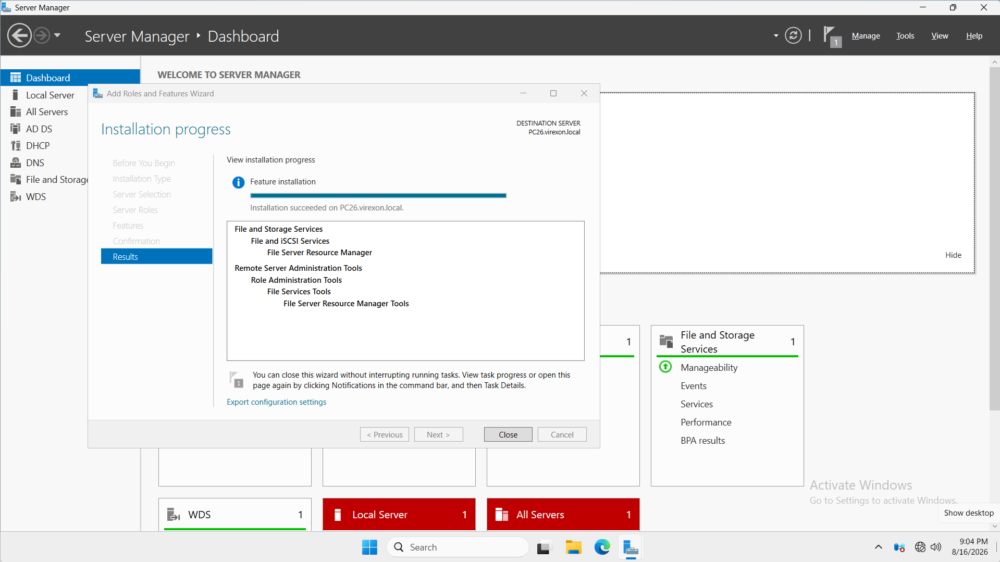

---

# 2. Quota Management

## Design Requirement

The objective was to provide each department with an independent storage limit.

The configured quota design was:

    Storage Limit: 5 GB
    Quota Type: Hard
    Application Method: Auto Apply

A single quota directly applied to the `Departments` root folder would create one shared storage limit for all departments.

That was not the desired design.

Instead, **Auto Apply Quotas** were used so that every department folder receives its own independent quota.

The resulting design is:

    Departments
    │
    ├── Finance      → 5 GB Hard Quota
    ├── HR           → 5 GB Hard Quota
    ├── IT           → 5 GB Hard Quota
    ├── Management   → 5 GB Hard Quota
    ├── Marketing    → 5 GB Hard Quota
    └── Sales        → 5 GB Hard Quota

This design also allows future subfolders created under the configured path to automatically receive the same quota policy.

---

## Quota Template

A reusable quota template was configured with:

    Template Name: 5 GB Limit
    Limit: 5 GB
    Quota Type: Hard

A **Hard Quota** was selected because the requirement was to enforce the storage limit rather than only monitor it.

### Hard Quota

A Hard Quota prevents additional data from being written after the configured storage limit is reached.

### Soft Quota

A Soft Quota monitors usage but does not prevent users from exceeding the configured limit.

For this implementation, enforcement was required, so a Hard Quota was appropriate.

---

# 3. Auto Apply Quota Configuration

The Auto Apply Quota was configured on:

    F:\CompanyData\Departments

The configuration was designed to automatically create quotas on existing and new subfolders.

This means each department receives its own quota rather than sharing the parent folder's storage allocation.

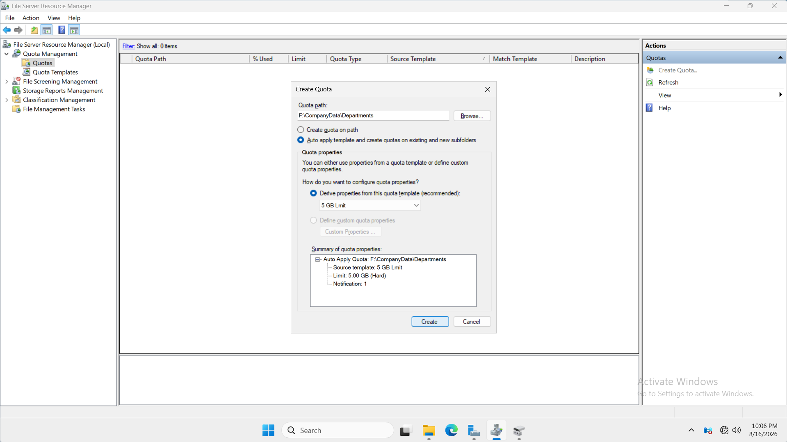

---

## Auto Apply Quota Verification

After configuration, FSRM successfully displayed the Auto Apply quota.

The configuration confirmed:

    Quota Path:
    F:\CompanyData\Departments\*

    Limit:
    5.00 GB

    Quota Type:
    Hard (Auto Apply)

    Source Template:
    5 GB Limit

The quota configuration matched the intended template.

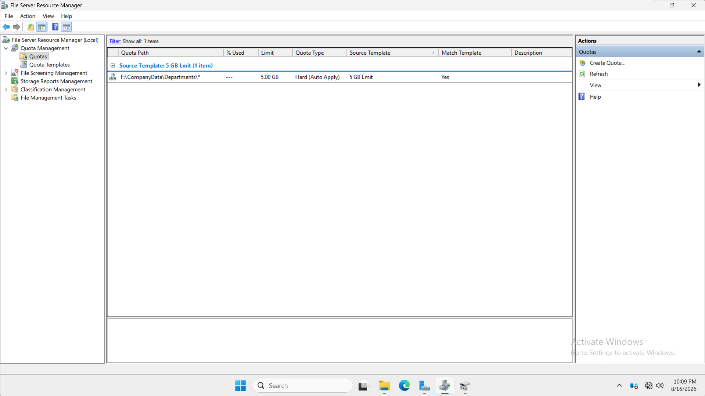

---

# 4. Hard Quota Client Verification

The quota was tested from the Windows 11 domain client.

The IT department was accessed through the mapped drive:

    S:\IT

Test data was copied into the department folder to increase storage consumption.

When the configured quota limit was reached, Windows prevented additional data from being written to the folder.

This provided client-side evidence that the Hard Quota was actively enforcing the configured storage limit.

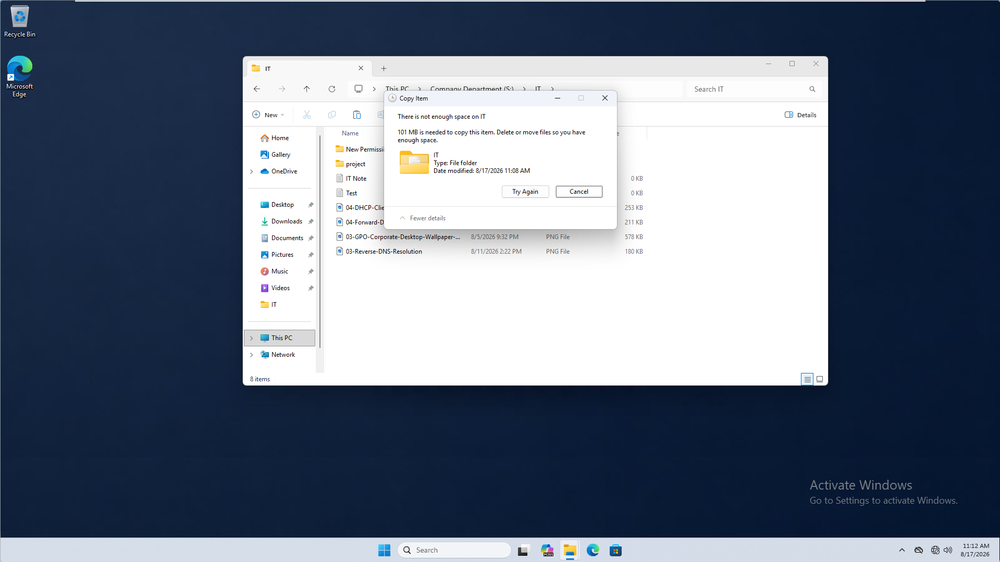

---

# 5. Quota Server Verification

The quota usage was then inspected from the FSRM console on `PC26`.

The IT department showed approximately:

    Used: 99%
    Limit: 5.00 GB
    Quota Type: Hard
    Source Template: 5 GB Limit

Other department folders remained at approximately zero usage.

This confirmed an important part of the design:

**Each department has an independent 5 GB quota.**

The departments are not sharing a single 5 GB quota.

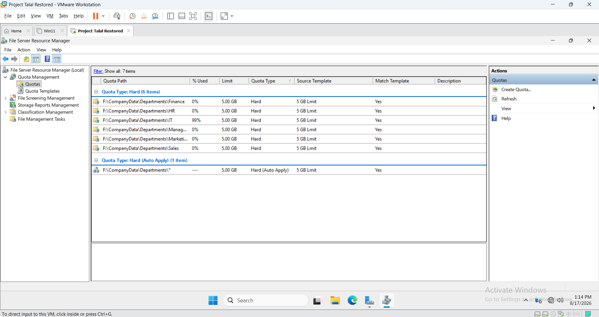

---

# 6. File Screening

## Design Requirement

The next objective was to control the types of files users could store inside the department shares.

The implemented policy was:

    Business files → Allowed
    Image files    → Blocked

Examples of allowed files include:

    .txt
    .docx
    .xlsx

Examples of image files targeted by the configured Image Files group include formats such as:

    .png
    .jpg
    .jpeg

---

## Active vs Passive Screening

FSRM provides two primary screening modes.

### Active Screening

Active Screening actively prevents prohibited file types from being stored.

Conceptually:

    User attempts to copy prohibited file
                    ↓
           FSRM checks file type
                    ↓
             File is blocked

### Passive Screening

Passive Screening can be used for monitoring without preventing the file from being stored.

Conceptually:

    User attempts to copy monitored file
                    ↓
           FSRM detects file type
                    ↓
              File remains allowed

Because this project required actual enforcement, **Active Screening** was selected.

---

# 7. File Screen Template Configuration

A reusable File Screen Template was configured.

The configuration used:

    Template:
    Block Images

    Screening Type:
    Active Screening

    File Group:
    Image Files

Using a template provides a reusable and consistent method for applying the same file restriction policy to storage locations.

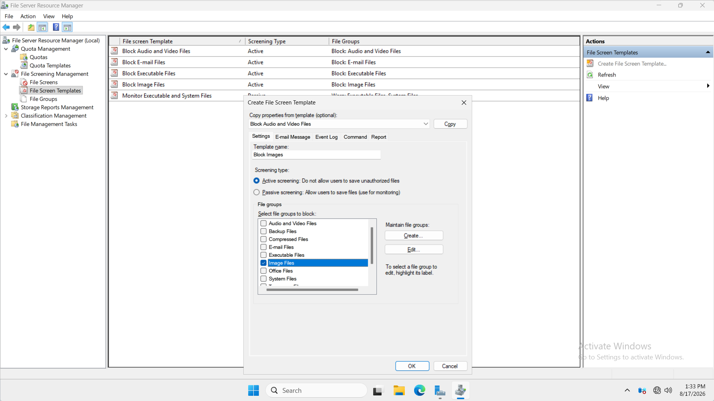

---

# 8. File Screen Configuration

The File Screen was applied to:

    F:\CompanyData\Departments

The screen was based on the configured `Block Images` template.

The resulting policy was:

    Path:
    F:\CompanyData\Departments

    Source Template:
    Block Images

    Screening Type:
    Active

    File Group:
    Image Files

This allowed the restriction to operate across the department storage structure.

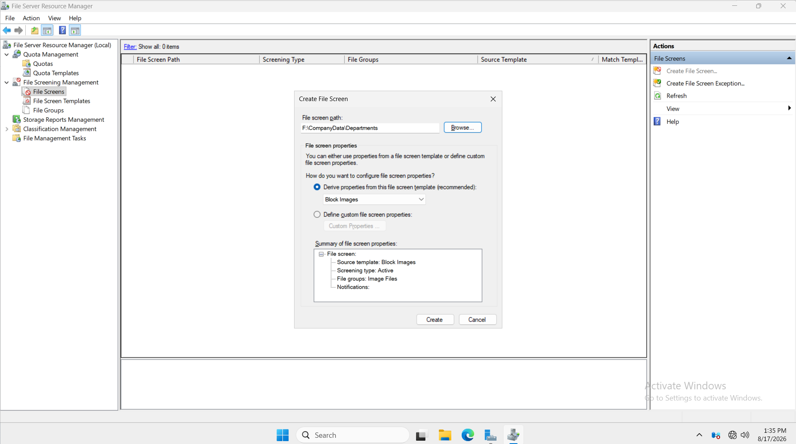

---

# 9. File Screening Client Verification

The File Screening policy was tested from the Windows 11 client.

The test was performed inside the IT department through:

    S:\IT

Two different types of files were tested.

## Allowed File Test

A normal text file was successfully created inside the folder.

This confirmed that:

- The user could still write to the IT folder.
- The SMB share remained operational.
- NTFS permissions were functioning.
- FSRM was not blocking normal file operations.

## Blocked Image Test

An image file was then copied into the same location.

Windows returned an access-denied result and the image was not stored.

Because a text file could be created successfully in the same folder, the result demonstrated that the restriction was associated with the configured File Screening policy rather than a general inability to write to the folder.

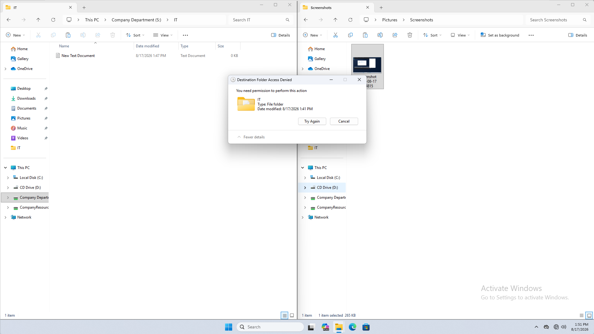

---

# 10. Storage Reports Management

The final implemented FSRM component was **Storage Reports Management**.

Storage Reports provide administrators with visibility into how storage is being consumed without manually inspecting every department folder.

For this lab, two useful report categories were selected:

- **Large Files**
- **Least Recently Accessed Files**

---

## Large Files Report

The Large Files report was configured with a minimum file size of:

    50 MB

The purpose of this report is to identify files consuming significant amounts of storage.

This can help administrators investigate unexpected storage growth and identify files that may require review.

---

## Least Recently Accessed Files Report

The second selected report was:

    Least Recently Accessed Files

The configured test parameter was:

    Minimum days since file was accessed: 3 Days

This type of report can help administrators identify files that have not been used recently.

Such files may later become candidates for:

- Administrative review
- Archiving
- Storage cleanup

No automatic deletion was configured as part of this phase.

---

# 11. Storage Reports Configuration

The Storage Reports task was configured against the department storage location.

Configuration:

    Scope:
    F:\CompanyData\Departments

    Selected Reports:
    Large Files
    Least Recently Accessed Files

    Large Files Minimum Size:
    50 MB

    Least Recently Accessed:
    3 Days

    Report Format:
    DHTML

The report was also configured with a schedule:

    Frequency:
    Weekly

    Day:
    Thursday

    Time:
    1:00 PM

This demonstrates how storage analysis can be automated instead of requiring administrators to manually generate reports every time.

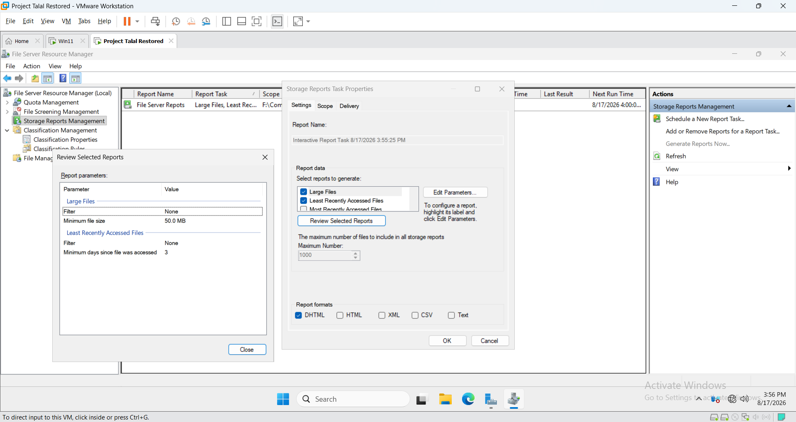

---

# 12. Large Files Report Validation

To validate the report configuration, a test file larger than the configured threshold was placed inside the IT department.

The test file was:

    large_file_60mb.txt

Its reported size was approximately:

    65.0 MB

Because the Large Files threshold was configured at `50 MB`, the file should appear in the generated report.

The report was then generated to validate the configuration.

---

# 13. Large Files Report Summary

FSRM successfully detected the test file.

The generated report showed:

    Machine:
    PC26

    Report Folder:
    F:\CompanyData\Departments

    Minimum File Size:
    50.0 MB

    Files Detected:
    1

    Total Size:
    65.0 MB

    Owner:
    VIREXON\S.ahmed

This confirmed that the Large Files report successfully scanned the configured scope and detected a file exceeding the defined threshold.

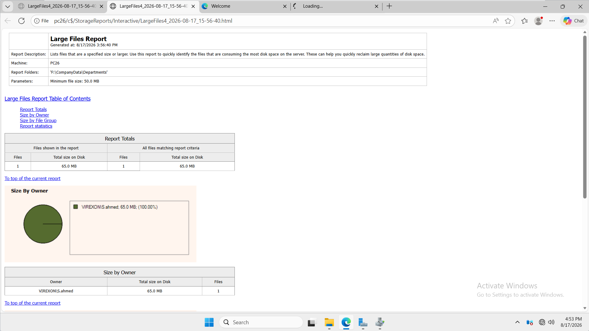

---

# 14. Large File Detailed Verification

The detailed section of the generated report identified the actual file.

The report showed:

    File:
    large_file_60mb.txt

    Folder:
    F:\CompanyData\Departments\IT

    Owner:
    VIREXON\S.ahmed

    Size:
    65.0 MB

The report also included last-access information.

This demonstrates that FSRM reporting can provide administrators with useful information such as:

- File name
- File location
- File owner
- File size
- File group
- Last-access information

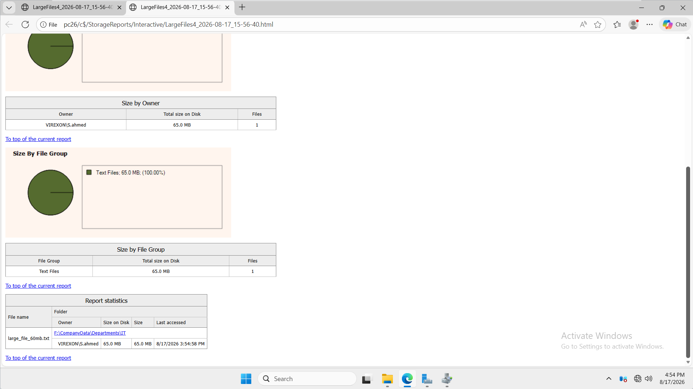

---

# FSRM Architecture

The completed FSRM implementation operates as an additional management layer on the existing VIREXON file server.

    Windows 11 Client
            │
            ▼
       Mapped Drive
            S:
            │
            ▼
    \\PC26\Departments
            │
            ▼
         SMB Share
            │
            ▼
    NTFS / AGDLP Permissions
            │
            ▼
    Department Folders
            │
            ▼
           FSRM
            │
            ├── Quota Management
            │      └── 5 GB Hard Auto Apply Quotas
            │
            ├── File Screening
            │      └── Active Image File Blocking
            │
            └── Storage Reports
                   ├── Large Files
                   └── Least Recently Accessed Files

FSRM complements the existing access-control architecture rather than replacing it.

---

# Validation Summary

| Component | Validation | Result |
|---|---|---|
| FSRM Role | Role installation verified | ✅ Passed |
| Quota Template | 5 GB Hard Quota configured | ✅ Passed |
| Auto Apply Quota | Applied to department subfolders | ✅ Passed |
| Department Quotas | Independent quotas verified | ✅ Passed |
| Hard Quota | Storage limit enforced | ✅ Passed |
| Client Quota Test | Additional writes blocked at limit | ✅ Passed |
| File Screen Template | Active image restriction configured | ✅ Passed |
| File Screen | Applied to Departments | ✅ Passed |
| Allowed File Test | Text file successfully created | ✅ Passed |
| Blocked File Test | Image file rejected | ✅ Passed |
| Storage Reports | Reporting task configured | ✅ Passed |
| Large Files Report | 50 MB threshold configured | ✅ Passed |
| Large File Detection | 65 MB test file detected | ✅ Passed |
| File Owner | Owner identified in report | ✅ Passed |
| Scheduled Reporting | Weekly schedule configured | ✅ Passed |

---

# Key Concepts Demonstrated

This phase demonstrated practical knowledge of:

- File Server Resource Manager
- Storage governance
- Quota Templates
- Hard Quotas
- Soft Quotas
- Auto Apply Quotas
- Independent department quotas
- Storage limit enforcement
- File Groups
- File Screen Templates
- Active File Screening
- Passive File Screening
- File type restrictions
- Client-side validation
- Server-side validation
- Storage Reports Management
- Large Files reporting
- Least Recently Accessed Files reporting
- Report scopes
- Report parameters
- DHTML reports
- Scheduled storage reports
- File ownership analysis
- Storage usage analysis

---

# Administrative Lessons Learned

## 1. Parent Quotas and Auto Apply Quotas Serve Different Designs

A quota directly applied to:

    F:\CompanyData\Departments

would control the parent folder as a single storage unit.

That would not provide an independent allocation for each department.

Using Auto Apply allows the design to behave as:

    Finance      → Independent 5 GB
    HR           → Independent 5 GB
    IT           → Independent 5 GB
    Management   → Independent 5 GB
    Marketing    → Independent 5 GB
    Sales        → Independent 5 GB

This is more appropriate for department-based storage management.

---

## 2. Templates Improve Consistency

Templates allow administrators to define a policy once and reuse it.

Instead of manually recreating identical settings for every department, FSRM can use templates to maintain consistent configuration.

This reduces administrative overhead and configuration inconsistencies.

---

## 3. Hard Quotas Enforce While Soft Quotas Monitor

The difference is important:

    Hard Quota
        ↓
    Storage limit reached
        ↓
    Additional writes prevented

Compared with:

    Soft Quota
        ↓
    Storage threshold reached
        ↓
    Usage continues

The project required actual enforcement, which is why a Hard Quota was selected.

---

## 4. File Screening and NTFS Permissions Solve Different Problems

NTFS permissions determine:

    WHO can access the data?

File Screening determines:

    WHAT types of files can be stored?

For example, a user may have NTFS Modify permission on:

    S:\IT

while FSRM can still prevent that user from storing a prohibited image file.

These technologies complement each other.

---

## 5. Configuration Alone Is Not Enough

A configuration screenshot only proves that a setting exists.

For this reason, the project also included functional validation.

Quota validation:

    Configure Hard Quota
            ↓
    Consume available storage
            ↓
    Attempt additional write
            ↓
    Write blocked
            ↓
    Verify usage from server

File Screening validation:

    Configure Active File Screen
            ↓
    Create allowed TXT file
            ↓
        Success
            ↓
    Attempt image file
            ↓
        Blocked

Storage Report validation:

    Configure 50 MB threshold
            ↓
    Place 65 MB test file
            ↓
    Generate report
            ↓
    File detected
            ↓
    Owner and location identified

This provides stronger evidence than configuration screenshots alone.

---

## 6. Storage Reports Provide Administrative Visibility

Storage Reports allow administrators to analyze file server usage without manually searching through the entire storage structure.

The Large Files report successfully identified:

    large_file_60mb.txt

and provided information about its:

- Size
- Location
- Owner
- File group
- Last-access information

This becomes particularly useful as the amount of organizational data grows.

---

# Screenshot Documentation

| # | Screenshot | Purpose |
|---:|---|---|
| 01 | `01-FSRM-Role-Installation-Verification.png` | Verifies FSRM installation |
| 02 | `02-FSRM-Auto-Apply-Quota-Configuration.png` | Documents Auto Apply quota configuration |
| 03 | `03-FSRM-Auto-Apply-Quota-Verification.png` | Verifies Auto Apply quota creation |
| 04 | `04-Quota-Limit-Client-Verification.png` | Proves quota enforcement from the client |
| 05 | `05-Quota-Usage-Server-Verification.png` | Verifies quota usage from the server |
| 06 | `06-File-Screen-Template-Configuration.png` | Documents the File Screen template |
| 07 | `07-File-Screen-Configuration.png` | Documents the applied File Screen |
| 08 | `08-File-Screening-Client-Verification.png` | Proves allowed and blocked file behavior |
| 09 | `09-Storage-Reports-Configuration.png` | Documents Storage Reports configuration |
| 10 | `10-Storage-Report-Large-Files-Summary.png` | Verifies Large Files report results |
| 11 | `11-Storage-Report-Large-File-Details.png` | Shows detected file details |

---

# Final Result

FSRM was successfully implemented and validated on the VIREXON file server.

The completed environment can now:

- Automatically assign storage limits to department folders.
- Maintain independent quotas for each department.
- Enforce a 5 GB Hard Quota.
- Prevent prohibited image files from being stored.
- Continue allowing permitted business files.
- Analyze department storage usage.
- Detect files exceeding a defined size threshold.
- Identify the owner and location of large files.
- Identify files based on recent access criteria.
- Generate scheduled storage reports.

The implementation was validated through actual client and server testing rather than relying solely on configuration screens.

---

## Phase Status

**09 - File Server Resource Manager (FSRM): Completed ✅**
