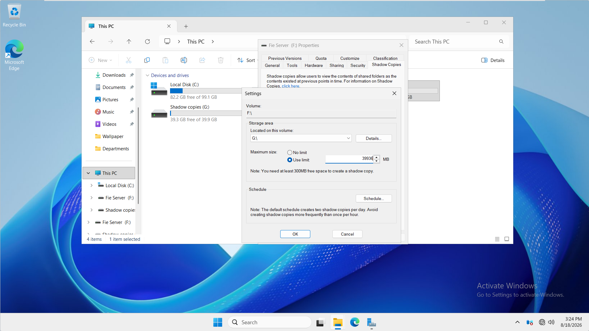
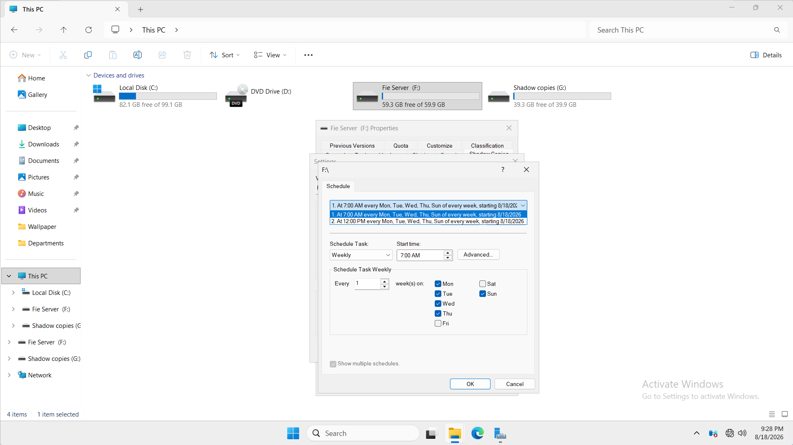
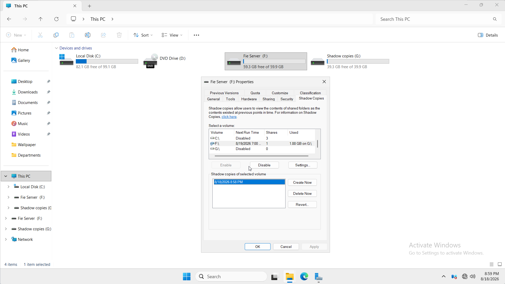
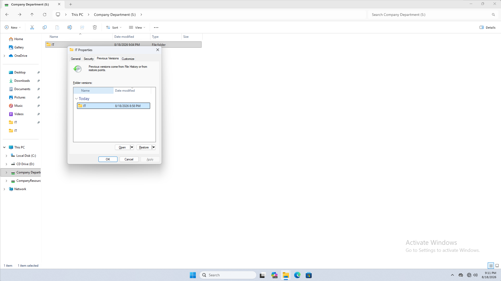
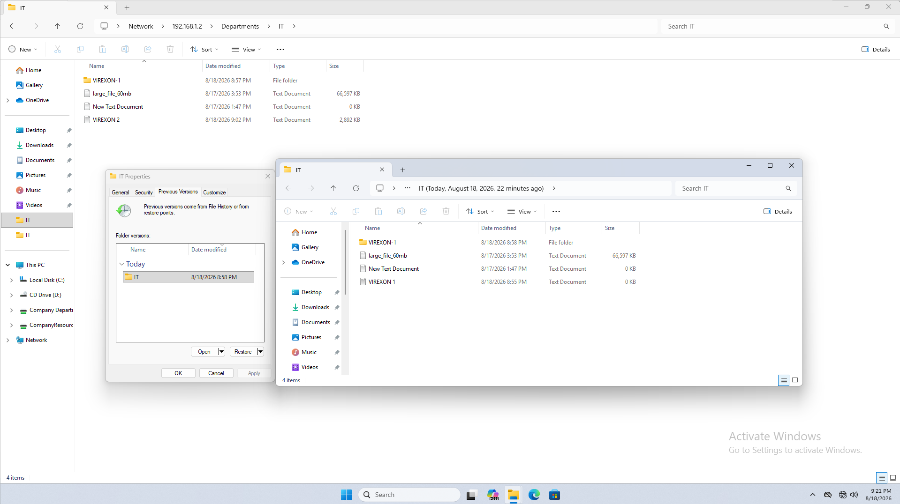
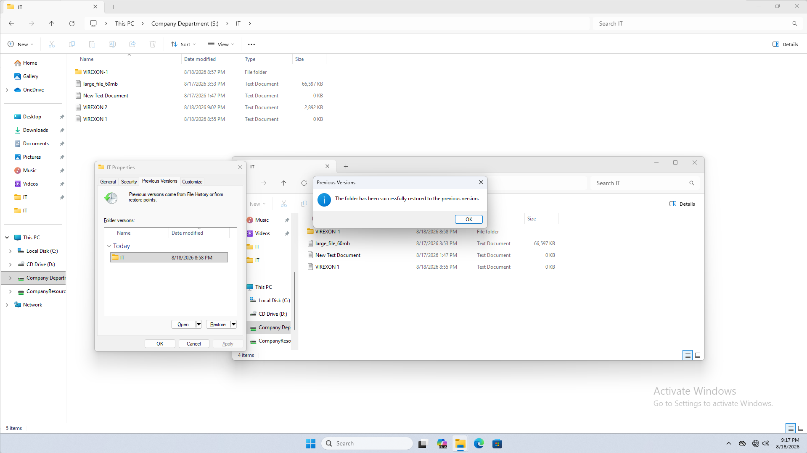

# Phase 10 — Shadow Copies / Previous Versions

## Overview

This phase documents the implementation and validation of **Shadow Copies** on the Windows Server file server within the `VIREXON.LOCAL` environment.

The objective was to provide users with a fast recovery mechanism for files and folders stored on departmental network shares when data is accidentally modified, renamed, or deleted.

Shadow Copies were configured on the volume hosting the company data and were validated from a Windows 11 domain client using the **Previous Versions** feature.

The implementation followed the workflow:

**Design → Configure → Schedule → Create Recovery Point → Modify Data → Access Previous Version → Restore → Verify**

---

## Business Requirement

Users working with shared departmental data may accidentally:

- Modify a file incorrectly.
- Overwrite an existing file.
- Rename a file.
- Delete a file or folder.
- Need access to an earlier state of departmental data.

Performing a full backup restoration for every minor user mistake would be inefficient.

The requirement was therefore to:

> Implement Shadow Copies on the data volume hosting departmental shared folders so that previous versions of files and folders can be recovered quickly without requiring a full server backup restoration.

---

## Environment

| Component | Configuration |
|---|---|
| Domain | `VIREXON.LOCAL` |
| Server | `PC26.virexon.local` |
| Server OS | Windows Server 2022 |
| Server IP | `192.168.1.2` |
| Client | `PC-IT-01` |
| Client OS | Windows 11 |
| File Server Volume | `F:` |
| Company Data Path | `F:\CompanyData\Departments` |
| Network Share | `\\PC26\Departments` |
| Mapped Drive | `S:` |
| Shadow Copy Storage Volume | `G:` |

---

## Shadow Copies Concept

Shadow Copies use the Windows **Volume Shadow Copy Service (VSS)** to maintain point-in-time representations of data stored on a volume.

The relationship can be summarized as:

**VSS → Shadow Copy → Previous Versions**

- **VSS** provides the underlying snapshot functionality.
- **Shadow Copy** represents the state of a volume at a specific point in time.
- **Previous Versions** allows users or administrators to access data from those recovery points.

An important design concept identified during this phase is that Shadow Copies are configured at the **volume level**, not directly on individual folders.

Because the company departmental data resides on:

`F:\CompanyData\Departments`

Shadow Copies were configured for the entire `F:` volume.

---

## Shadow Copies vs Backup

Shadow Copies provide convenient operational recovery, but they are **not a replacement for backup**.

### Shadow Copies

Primarily useful for:

- Accidental file modification.
- Accidental file deletion.
- File renaming.
- Recovering earlier folder states.
- Rapid user-level file recovery.

### Backup

Primarily required for:

- Disk failure.
- Server failure.
- Volume loss.
- Major data corruption.
- Disaster recovery.
- Long-term data protection.

In this lab, the Shadow Copy storage volume `G:` resides on the same underlying virtual disk as the data volume `F:`.

Therefore, separating Shadow Copy storage onto `G:` improves storage organization and prevents Shadow Copies from consuming the main file-server volume, but it does **not** protect the data against failure of the underlying disk.

Shadow Copies are therefore treated as a recovery convenience rather than a backup solution.

---

# Implementation

## 1. Shadow Copy Storage Design

The departmental data volume is:

`F:`

Instead of storing Shadow Copy data directly on the same volume, a dedicated volume was created:

`G:`

The resulting design is:

    F:
    └── CompanyData
        └── Departments
            ├── Finance
            ├── HR
            ├── IT
            ├── Management
            ├── Marketing
            └── Sales

    G:
    └── Shadow Copy Storage for F:

The Shadow Copy configuration for `F:` was configured to use:

- **Storage Area:** `G:`
- **Maximum Size:** approximately `39,936 MB`
- **Storage Policy:** Use Limit

This prevents Shadow Copy storage from consuming the available capacity of the main company-data volume.

### Configuration Evidence

---

## 2. Shadow Copy Schedule

A recovery schedule was designed around the working week used in the lab environment.

The selected business days are:

- Sunday
- Monday
- Tuesday
- Wednesday
- Thursday

Friday and Saturday were excluded.

Two Shadow Copies are scheduled during each working day:

| Schedule | Time | Days |
|---|---|---|
| Recovery Point 1 | 7:00 AM | Sunday–Thursday |
| Recovery Point 2 | 12:00 PM | Sunday–Thursday |

This provides two recovery points during each business day without creating unnecessary snapshots.

The morning recovery point provides a version near the beginning of the workday, while the midday recovery point provides another recovery opportunity after several hours of user activity.

### Schedule Evidence

---

## 3. Shadow Copies Enabled on the Data Volume

Shadow Copies were enabled on:

`F:`

The scheduled recovery configuration remained associated with the protected `F:` volume, while the Shadow Copy storage was maintained on `G:`.

This distinction is important:

- `F:` = protected data volume.
- `G:` = Shadow Copy storage location.

The Shadow Copy feature protects the state of data on `F:`; `G:` is only used to hold the associated Shadow Copy storage.

---

## 4. Manual Recovery Point Creation

For controlled testing, a manual Shadow Copy was created before modifying the test data.

A recovery point was successfully created for `F:`.

The server showed:

- An active Shadow Copy with a visible timestamp.
- Future scheduled execution still configured.
- Shadow Copy storage being consumed on `G:`.

During testing, approximately `1.88 GB` of Shadow Copy storage was shown as being used on `G:`.

This confirmed that Shadow Copies were operational and that the separate storage volume was actively being used.

### Shadow Copy Creation Evidence

---

# Client Recovery Test

## Test Scenario

A controlled test was performed from the Windows 11 domain client:

`PC-IT-01`

The test location was the mapped departmental share:

`S:\IT`

Before creating the Shadow Copy, a test file existed as:

`VIREXON 1`

After the recovery point was created, the file was modified and renamed to:

`VIREXON 2`

This created a clear difference between:

- The data stored in the Shadow Copy.
- The current state of the live departmental folder.

---

## 5. Previous Versions Verification from Client

The first recovery test was performed directly from `PC-IT-01`.

The **Previous Versions** tab was opened for the `IT` folder.

A previous version appeared with the same timestamp as the manually created Shadow Copy.

This verified the complete path:

**Windows Server Shadow Copy → SMB Share → Windows 11 Previous Versions**

The client was therefore able to discover the recovery point created on the server.

### Client Verification Evidence

---

## 6. Previous Version Content Verification

Before performing a restore, the previous version was opened in read-only browsing mode.

The live folder and the previous version showed different states:

### Current State

The live departmental folder contained:

`VIREXON 2`

### Previous State

The Shadow Copy contained:

`VIREXON 1`

This demonstrated that the recovery point preserved the earlier state of the departmental folder before the file was renamed and modified.

The previous version was inspected before restoration to verify that the correct recovery point had been selected.

### Previous Version Content Evidence

---

# Recovery Test

## 7. Restoring the Previous Version

The previous version of the `IT` folder was restored from the Windows 11 client.

Windows confirmed the operation with:

> The folder has been successfully restored to the previous version.

After the restore operation, the earlier file:

`VIREXON 1`

was again present in the current departmental folder.

This verified that the Shadow Copy recovery process was functional from the client.

### Restore Verification Evidence

---

## Important Test Observation

During this test, the original `VIREXON 1` text file was empty before the Shadow Copy was created.

Therefore, the recovery test specifically validates:

- Recovery of the previous folder state.
- Recovery of the earlier filename.
- Successful restoration from a Shadow Copy.
- Client access to Previous Versions.
- Restoration of the earlier file object.

The test does **not** claim recovery of earlier text content inside the file because the original version contained no text data.

This distinction is intentionally documented so that the project reflects only results that were actually tested.

---

# Troubleshooting Observation

During the client test, Previous Versions were initially checked directly on the renamed file:

`VIREXON 2`

No previous version appeared for that filename.

This was expected because the file was known as:

`VIREXON 1`

when the Shadow Copy was created.

The recovery point therefore contained the earlier folder state where `VIREXON 1` existed.

Checking **Previous Versions on the parent `IT` folder** exposed the correct Shadow Copy and allowed the older folder contents to be accessed.

This demonstrated an important recovery concept:

> When a file has been renamed or deleted after a Shadow Copy was created, recovering from the previous version of the parent folder may be more appropriate than checking the current file directly.

---

# Verification Summary

| Verification | Result |
|---|---|
| Correct data volume identified | ✅ Passed |
| Shadow Copies configured on `F:` | ✅ Passed |
| Dedicated Shadow Copy storage configured on `G:` | ✅ Passed |
| Maximum storage limit configured | ✅ Passed |
| Sunday–Thursday schedule configured | ✅ Passed |
| 7:00 AM recovery point scheduled | ✅ Passed |
| 12:00 PM recovery point scheduled | ✅ Passed |
| Manual Shadow Copy created | ✅ Passed |
| Shadow Copy storage consumed on `G:` | ✅ Passed |
| Previous Version visible from `PC-IT-01` | ✅ Passed |
| Previous folder state accessible | ✅ Passed |
| Earlier file state visible | ✅ Passed |
| Previous Version restored successfully | ✅ Passed |
| Restored file verified in current folder | ✅ Passed |

---

# Screenshot Documentation

| # | Screenshot | Purpose |
|---|---|---|
| 01 | `01-Shadow-Copies-Storage-Configuration.png` | Shows `F:` protected with Shadow Copy storage configured on `G:` |
| 02 | `02-Shadow-Copies-Schedule-Configuration.png` | Shows the two Sunday–Thursday recovery schedules |
| 03 | `03-Shadow-Copy-Creation-Verification.png` | Confirms successful creation of a Shadow Copy and storage usage on `G:` |
| 04 | `04-Previous-Versions-Client-Verification.png` | Confirms Previous Versions are available from `PC-IT-01` |
| 05 | `05-Previous-Version-Content-Verification.png` | Compares the current folder state with the older Shadow Copy state |
| 06 | `06-Previous-Version-Restore-Verification.png` | Confirms successful restoration of the previous folder version |

---

# Key Concepts Learned

This phase demonstrated several important Windows Server administration concepts:

- Shadow Copies operate at the **volume level**.
- Volume Shadow Copy Service (VSS) provides the underlying snapshot capability.
- Previous Versions exposes recovery points to users and administrators.
- Shadow Copy storage can be placed on another volume.
- The protected volume and Shadow Copy storage volume serve different purposes.
- Recovery schedules should reflect business operating hours.
- Multiple recovery points improve recovery granularity.
- A manual Shadow Copy is useful for controlled testing.
- Recovery should be verified from the client, not only from the server.
- Previous folder versions can recover files that were renamed or removed.
- Shadow Copies provide operational recovery but do not replace backups.

---

# Final Architecture

    PC26.virexon.local
    │
    ├── F: File Server Volume
    │   │
    │   └── CompanyData
    │       └── Departments
    │           ├── Finance
    │           ├── HR
    │           ├── IT
    │           ├── Management
    │           ├── Marketing
    │           └── Sales
    │
    └── G: Shadow Copy Storage
        └── Stores Shadow Copy data for F:

    Shadow Copy Schedule
    │
    ├── Sunday–Thursday
    │   ├── 7:00 AM
    │   └── 12:00 PM
    │
    └── Previous Versions
        └── Accessible from PC-IT-01

---

# Conclusion

Shadow Copies were successfully implemented and validated for the VIREXON departmental file server.

The `F:` data volume is protected by Shadow Copies, while the associated Shadow Copy storage is maintained on the dedicated `G:` volume.

Two recovery points are scheduled during each business day from Sunday through Thursday, providing users with multiple opportunities to recover earlier versions of shared data.

A controlled client-side recovery test demonstrated that a Windows 11 domain client could access a previous version of the `IT` departmental folder, inspect its earlier state, and successfully restore it.

The implementation provides a practical solution for recovering from common user mistakes such as file modifications, renaming, or deletion while maintaining the important distinction that **Shadow Copies are a recovery feature and not a replacement for a proper backup strategy**.

**Phase 10 — Shadow Copies: Completed ✅**
