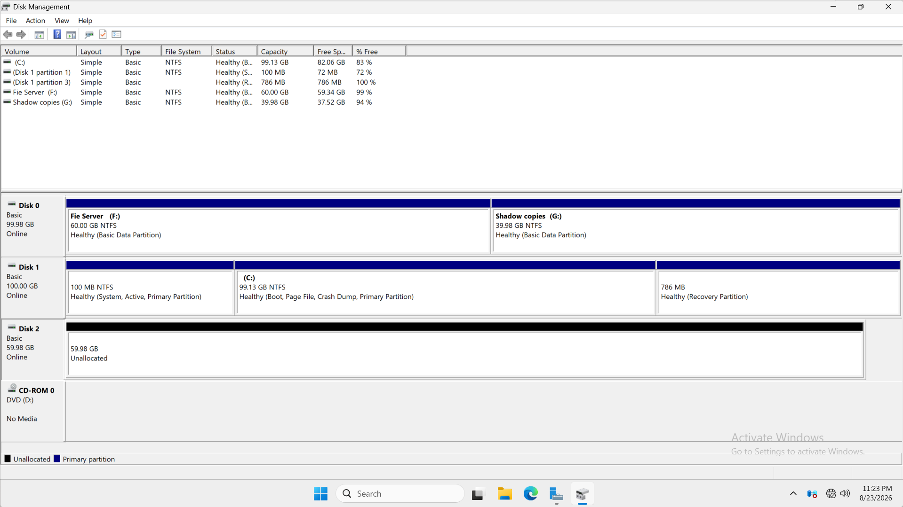
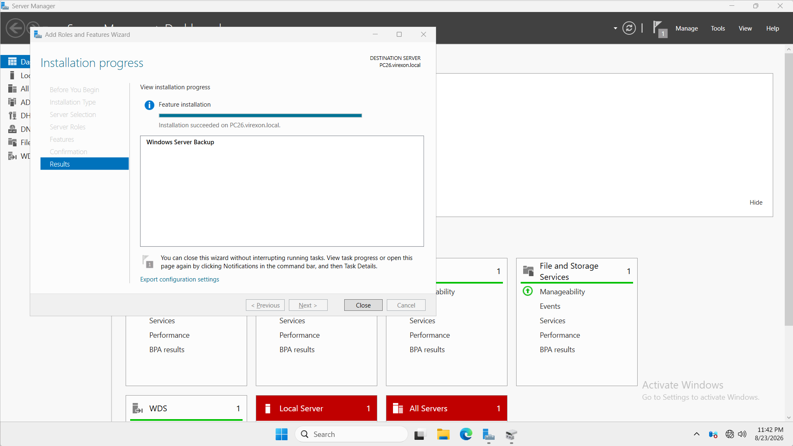
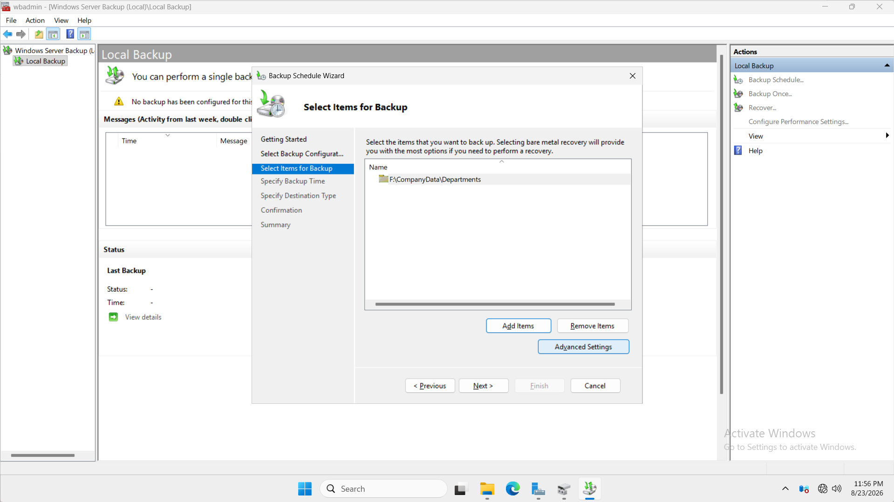
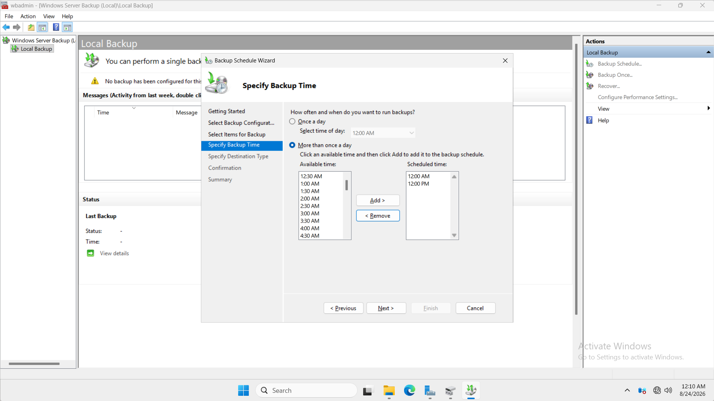
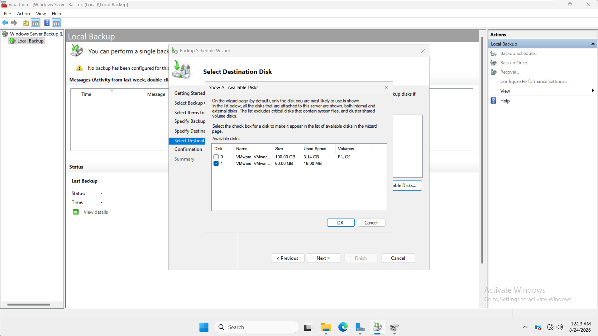
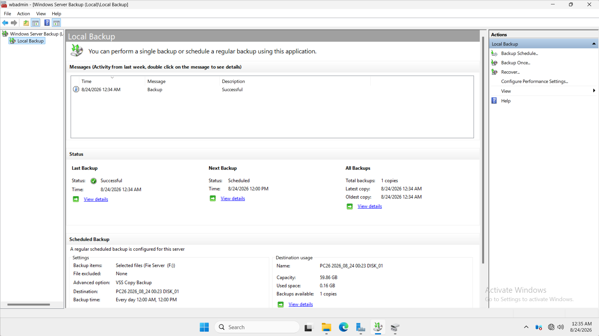
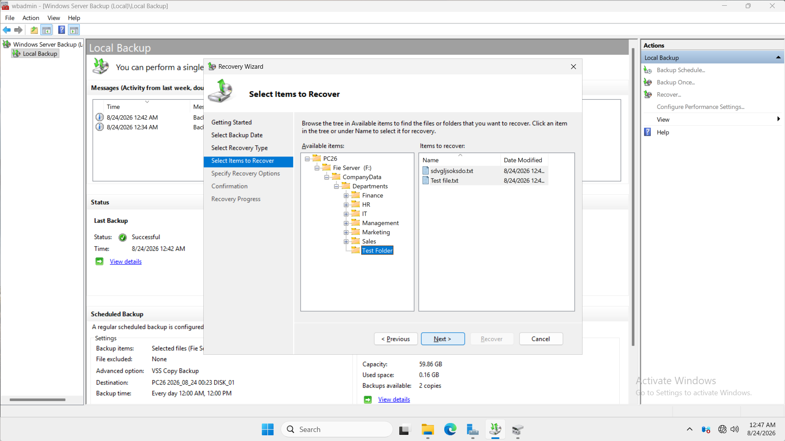
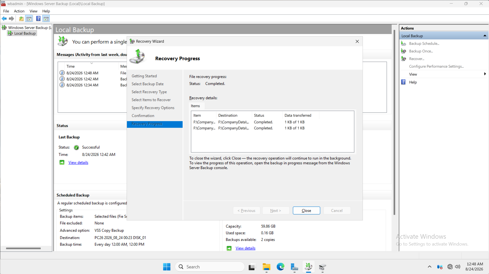

# 11 - Windows Server Backup

## Overview

This section documents the implementation, configuration, backup validation, and recovery testing of **Windows Server Backup (WSB)** within the `VIREXON.LOCAL` Windows Server environment.

The objective was to protect the company File Server data using a backup solution stored on a separate virtual disk from the production data and Shadow Copies storage.

The implementation followed this workflow:

**Design → Configure → Schedule → Backup → Verify → Simulate Data Loss → Recover → Validate**

---

## Environment

| Component | Configuration |
|---|---|
| Domain | `VIREXON.LOCAL` |
| Server | `PC26.virexon.local` |
| Server IP | `192.168.1.2` |
| Operating System | Windows Server 2022 |
| File Server Data | `F:\CompanyData\Departments` |
| Shadow Copies Storage | `G:` |
| Backup Solution | Windows Server Backup |
| Backup Destination | Dedicated 60 GB Virtual Disk |
| Hypervisor | VMware Workstation Pro |
| Network | Host-Only |

---

## Business Requirement

The company requires a backup solution for the departmental File Server data located at:

`F:\CompanyData\Departments`

The solution must:

- Protect the company File Server data independently from Shadow Copies.
- Store backups on a separate virtual disk from the production data disk.
- Run automatically according to a defined backup schedule.
- Allow files and folders to be recovered after accidental deletion or data loss.
- Be validated through an actual recovery test rather than relying only on a successful backup status.

The final design therefore separates production data, Shadow Copies, and Windows Server Backup storage.

---

## Backup Architecture

The storage design used in this lab is:

```text
PC26
│
├── System Virtual Disk
│   └── C: Windows Server
│
├── Data Virtual Disk
│   ├── F: Company Data
│   └── G: Shadow Copies
│
└── Dedicated Backup Virtual Disk
    └── 60 GB Windows Server Backup Storage
```

The dedicated backup disk is a separate VMware virtual disk from the virtual disk containing the production File Server data and Shadow Copies.

This provides separation between:

- Production data
- Shadow Copies
- Windows Server Backup storage

> **Important:** The backup destination is a separate virtual disk within the lab environment, but it still resides within the same virtual machine and underlying VMware host infrastructure. It is therefore not an off-host or offsite backup and would not protect against complete VMware host or underlying physical storage failure.

---

## 1. Dedicated Backup Disk

A new **60 GB virtual disk** was added to the `PC26` virtual machine specifically for Windows Server Backup.

The disk was kept separate from the virtual disk containing:

- `F:` — Company File Server data
- `G:` — Shadow Copies storage

The new disk was prepared as a dedicated backup destination rather than creating another partition on the existing production data disk.

### Evidence



---

## 2. Windows Server Backup Installation

The **Windows Server Backup** feature was installed successfully on `PC26`.

Windows Server Backup provides built-in backup and recovery functionality within Windows Server.

For this implementation, its primary purpose is to protect the company departmental File Server data.

### Evidence



---

## 3. Backup Scope Configuration

The backup scope was intentionally limited to the company departmental data rather than backing up the entire server.

### Protected Data

`F:\CompanyData\Departments`

This path contains the departmental File Server structure used throughout the lab.

Although users access the data through the network share:

`\\PC26\Departments`

the actual data is stored locally on `PC26` under:

`F:\CompanyData\Departments`

Windows Server Backup therefore protects the underlying local File Server data rather than the SMB share path itself.

### Evidence



---

## 4. Backup Schedule Configuration

A recurring backup schedule was configured to run twice every day.

### Schedule

| Backup | Time |
|---|---|
| Backup 1 | `12:00 AM` |
| Backup 2 | `12:00 PM` |

This creates a scheduled backup interval of approximately **12 hours**.

The schedule was selected to provide two backup opportunities per day rather than relying on a single daily backup.

The schedule was configured successfully, while the immediate backup validation in this lab was performed manually instead of waiting for the next scheduled execution.

### Evidence



---

## 5. Backup Destination Configuration

The dedicated **60 GB virtual disk** was selected as the Windows Server Backup destination.

The backup destination is separate from:

- `C:` — Windows Server operating system
- `F:` — Production File Server data
- `G:` — Shadow Copies storage

This prevents the Windows Server Backup repository from sharing the same virtual disk as the production File Server data.

### Evidence



---

## Backup Configuration Summary

| Setting | Configuration |
|---|---|
| Backup Source | `F:\CompanyData\Departments` |
| Backup Destination | Dedicated 60 GB Virtual Disk |
| Backup Frequency | Twice Daily |
| Backup Time 1 | `12:00 AM` |
| Backup Time 2 | `12:00 PM` |
| Files Excluded | None |
| VSS Setting | VSS Copy Backup |

---

## 6. Backup Execution and Verification

After the scheduled backup configuration was completed, a **Backup Once** operation was executed for immediate validation instead of waiting for the next scheduled backup window.

The backup completed successfully.

Windows Server Backup reported the operation as:

**Successful**

This verified that:

- The selected File Server data could be backed up.
- The dedicated backup destination was operational.
- Windows Server Backup could successfully complete a backup operation.
- The protected data was available for subsequent recovery testing.

The automatic backup schedule remained configured separately for:

- `12:00 AM`
- `12:00 PM`

The manual backup operation was used to validate the backup process immediately.

### Evidence



---

## 7. Recovery Test Scenario

A backup solution should not be considered validated only because a backup operation reports success.

A practical recovery test was therefore performed.

A dedicated test folder was created inside:

`F:\CompanyData\Departments`

The folder contained two test files.

A new backup was completed while the test folder and both files existed in the File Server data.

After the backup completed successfully, the test folder was deleted from the live data to simulate accidental data loss.

The recovery scenario was:

```text
Create Test Folder
        ↓
Create Two Test Files
        ↓
Run Backup
        ↓
Delete Test Folder
        ↓
Open Windows Server Backup Recovery
        ↓
Select Backup Version
        ↓
Locate Deleted Test Folder
        ↓
Recover Test Data
        ↓
Verify Recovery Completed
```

This provided a controlled recovery test without deleting actual departmental production data.

---

## 8. File Recovery Configuration

The Windows Server Backup **Recovery Wizard** was used to browse the available backup data.

The test folder and its two files were visible inside the backup under the original File Server hierarchy.

The recovery view confirmed that the test data had been captured successfully before deletion.

The deleted test folder and its files were then selected for recovery.

### Evidence



---

## 9. File Recovery Verification

The recovery operation was executed for the deleted test data.

Windows Server Backup completed the recovery successfully and displayed:

**Status: Completed**

The recovery results showed that both test files were successfully processed during the recovery operation.

This validated that the backup was not only successfully created but was also usable for file-level recovery.

### Evidence



---

## Shadow Copies vs Windows Server Backup

The File Server now uses two different recovery mechanisms for different purposes.

| Feature | Shadow Copies | Windows Server Backup |
|---|---|---|
| Primary Purpose | Previous-version recovery | Backup and data recovery |
| Protected Data | Volume-based snapshots | Selected backup data |
| Storage | `G:` | Dedicated 60 GB Virtual Disk |
| Disk Separation from `F:` | Same underlying virtual disk | Separate virtual disk |
| Previous Versions Integration | Yes | No |
| Recovery Interface | Previous Versions | Windows Server Backup Recovery |
| Tested in Lab | Yes | Yes |

### Shadow Copies

Shadow Copies provide fast access to previous versions of files and folders.

They are useful for situations such as:

- Accidental file modification
- Accidental deletion
- Returning to an earlier folder state

However, in this lab, `F:` and `G:` reside on the same underlying virtual disk.

A failure of that virtual disk could therefore affect both the production data and its Shadow Copies.

### Windows Server Backup

Windows Server Backup stores backup data on a separate virtual disk.

This provides an additional recovery layer beyond Shadow Copies and allows data to be recovered through the Windows Server Backup recovery process.

---

## File Server Protection Design

The final File Server protection architecture is:

```text
F:\CompanyData\Departments
        │
        ├── Shadow Copies
        │       ↓
        │      G:
        │
        └── Windows Server Backup
                ↓
        Dedicated 60 GB Virtual Disk
```

This creates two different recovery paths.

### Fast Previous-Version Recovery

**Shadow Copies / Previous Versions**

Used when a previous version of a file or folder needs to be recovered quickly.

### Backup Recovery

**Windows Server Backup**

Used when data needs to be restored from a stored backup copy.

---

## Validation Results

| Validation | Result |
|---|---|
| Dedicated Backup Virtual Disk Created | ✅ Passed |
| Windows Server Backup Installed | ✅ Passed |
| File Server Backup Scope Configured | ✅ Passed |
| Twice-Daily Backup Schedule Configured | ✅ Passed |
| Dedicated Backup Destination Configured | ✅ Passed |
| Manual Backup Operation | ✅ Passed |
| Backup Completion Verification | ✅ Passed |
| Test Data Captured in Backup | ✅ Passed |
| Deleted Test Data Located in Recovery Wizard | ✅ Passed |
| File Recovery Operation | ✅ Passed |
| Recovery Status | ✅ Completed |

---

## Screenshots

| # | Screenshot | Purpose |
|---|---|---|
| 01 | `01-WSB-Dedicated-Backup-Disk.png` | Dedicated backup disk verification |
| 02 | `02-WSB-Feature-Installation-Verification.png` | Windows Server Backup feature installation verification |
| 03 | `03-Backup-Scope-Configuration.png` | File Server backup scope configuration |
| 04 | `04-Backup-Schedule-Configuration.png` | Twice-daily backup schedule configuration |
| 05 | `05-Backup-Destination-Configuration.png` | Dedicated backup destination configuration |
| 06 | `06-Backup-Completion-Verification.png` | Successful backup operation verification |
| 07 | `07-File-Recovery-Configuration.png` | Backup data and deleted test folder selection |
| 08 | `08-File-Recovery-Verification.png` | Successful recovery operation verification |

---

## Key Technical Lessons

This implementation demonstrated several important backup and recovery concepts:

- Backup storage should be separated from the production disk being protected.
- Shadow Copies and Windows Server Backup serve different recovery purposes.
- Shadow Copies should not be treated as a replacement for an independent backup.
- Backup scope should be selected according to actual business requirements.
- Backup frequency influences the amount of recent data that could potentially be lost between successful backup points.
- A successful backup operation alone does not prove that data can actually be recovered.
- Recovery testing is an essential part of validating a backup solution.
- The SMB share path and the underlying local File Server path represent the same data from different access perspectives.
- A manual **Backup Once** operation can be used for immediate validation while the automatic backup schedule remains configured separately.
- A separate virtual backup disk improves separation within the lab, but it is not equivalent to an off-host, offsite, or fully disaster-resistant backup architecture.

---

## Final Result

Windows Server Backup was successfully implemented on `PC26` to protect:

`F:\CompanyData\Departments`

The final implementation includes:

- A dedicated 60 GB backup virtual disk
- Windows Server Backup installation
- Selected File Server data protection
- A twice-daily backup schedule configured for `12:00 AM` and `12:00 PM`
- A dedicated backup destination
- Successful manual backup validation
- Practical simulated data-loss testing
- File-level recovery through Windows Server Backup
- Successful recovery completion

The implementation confirms that the company File Server data can be successfully backed up and recovered using Windows Server Backup.

**11 - Windows Server Backup — Completed ✅**
