# 12 - Advanced Active Directory

## Overview

This phase extends the VIREXON Windows Server lab from basic Active Directory administration into enterprise-oriented identity management, delegated administration, privileged access separation, targeted password security, administrative workstation restrictions, directory object protection, and object recovery.

A role-based administrative model was implemented to separate Help Desk, AD Operator, privileged administrator, and standard daily-user responsibilities. Authorized and unauthorized operations were then tested to verify that each account received only its intended level of access.

| Item | Value |
|---|---|
| Status | Completed |
| Domain | `VIREXON.LOCAL` |
| Domain Controller | `PC26.virexon.local` |
| Domain Controller IP | `192.168.1.2` |
| Administrative Workstation | `PC-IT-01` |
| Workstation IP | `192.168.1.50` |
| Server Platform | Windows Server 2022 |
| Client Platform | Windows 11 |
| Remote Administration | RSAT |
| Evidence Count | 22 screenshots |

---

## Objectives

The objectives of this phase were to:

- Separate standard and administrative user accounts.
- Implement role-based administration through security groups.
- Delegate Help Desk responsibilities without granting unrestricted access.
- Delegate standard user and departmental group administration.
- Prevent delegated administrators from escalating their privileges.
- Validate privileged actions through a dedicated administrative account.
- Confirm that daily accounts remain nonprivileged.
- Configure a Fine-Grained Password Policy for privileged administrators.
- Verify the resultant password policy and actual enforcement.
- Restrict privileged sign-in to an authorized administrative workstation.
- Protect the administrative OU from accidental deletion.
- Enable Active Directory Recycle Bin.
- Recover a deleted user with its original OU location and group membership.

---

## Active Directory Structure

The following locations were used during this phase:

| Active Directory Location | Purpose |
|---|---|
| `VIREXON\Administrative-Accounts` | Dedicated administrative accounts |
| `VIREXON\Groups\Access-Role-Groups` | Administrative role groups |
| `VIREXON\Groups\Department-Groups` | Department membership groups |
| `VIREXON\Groups\Resource-Permission-Groups` | Resource authorization groups |
| `VIREXON\Users` | Parent OU for standard users |
| `VIREXON\Users\IT` | Standard IT department users |
| `VIREXON\Users\HR` | Standard HR department users |
| `VIREXON\Users\Finance` | Standard Finance department users |
| `VIREXON\Users\Management` | Standard Management users |
| `VIREXON\Users\Marketing` | Standard Marketing users |
| `VIREXON\Users\Sales` | Standard Sales users |

Administrative accounts were placed outside the standard `Users` hierarchy. This prevented delegated permissions on standard users from automatically applying to privileged accounts.

---

## Administrative Role Design

| Role | Account | Security Group | Responsibility |
|---|---|---|---|
| Help Desk | `hd-ahmed.ali` | `GG-HelpDesk-Operators` | Password resets, forced password changes, and account unlock |
| AD Operator | `adm-mohammed.saleh` | `GG-AD-Operators` | Standard user lifecycle and departmental group membership |
| Privileged AD Administrator | `adm-sami.ahmed` | `GG-AD-Admins` | Privileged Active Directory administration |
| Standard Daily User | `s.ahmed` | Standard user groups | Daily work without administrative privileges |

Permissions were assigned to role groups rather than directly to individual accounts. This provides centralized authorization and makes administrative access easier to review and manage.

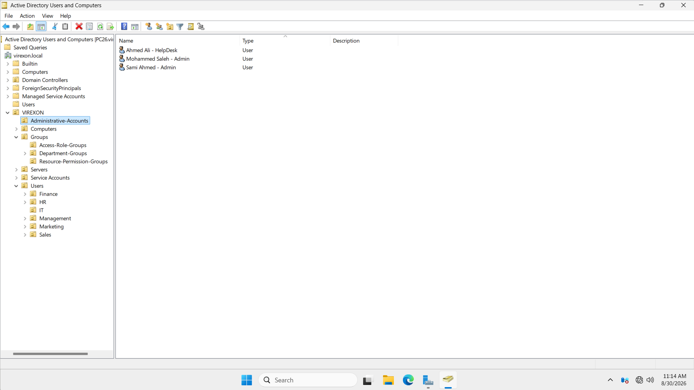

---

## RSAT Administrative Workstation

Remote Server Administration Tools were installed on `PC-IT-01`.

The installation provided the Active Directory management tools required to administer the domain remotely, including Active Directory Users and Computers and Active Directory Administrative Center.

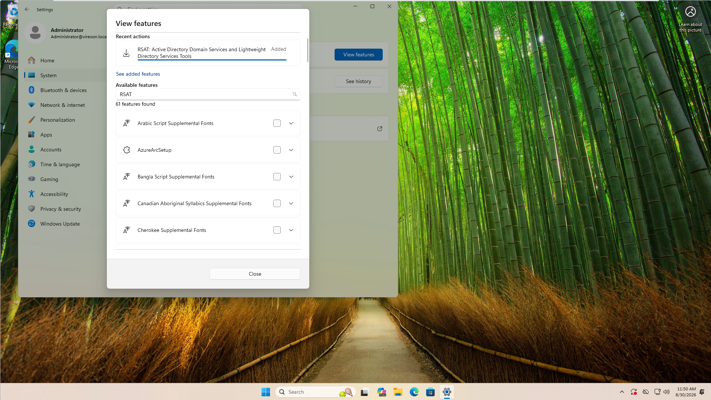

Remote administration of `VIREXON.LOCAL` was then verified from `PC-IT-01`. This allowed routine administrative work to be performed from a designated workstation instead of directly from the Domain Controller.

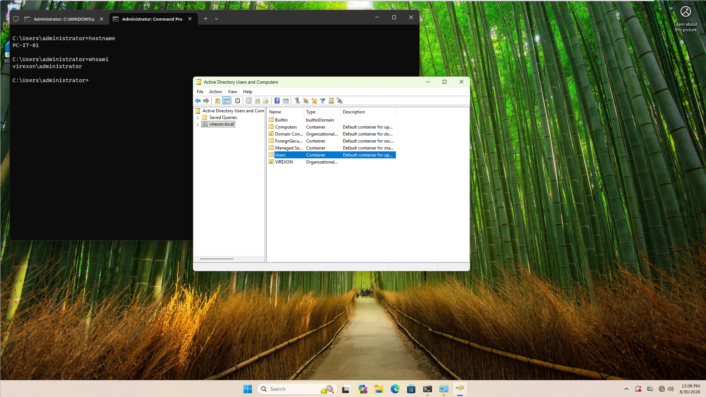

---

## Help Desk Delegation

### Delegated Scope

The `GG-HelpDesk-Operators` group received delegated permissions on:

`VIREXON\Users`

The permissions applied to descendant user objects under the departmental OUs.

### Configured Responsibilities

The Help Desk role was configured to:

- Reset passwords for standard users.
- Require a password change at the next sign-in.
- Read the `lockoutTime` attribute.
- Write the `lockoutTime` attribute for account unlock operations.

The delegation did not include `VIREXON\Administrative-Accounts`.

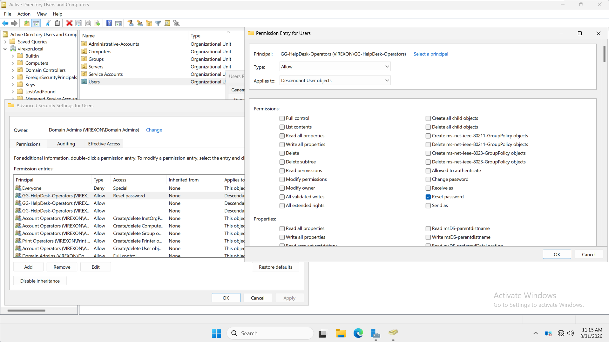

### Authorized Action Test

The Help Desk account successfully reset the password of a standard user under the delegated `Users` hierarchy.

This proved that the role could perform its intended support responsibility without receiving unrestricted Active Directory permissions.

### Administrative Boundary Test

The Help Desk account attempted to reset the password of an account inside `Administrative-Accounts`.

The operation returned `Access is denied`, confirming that the Help Desk delegation did not extend to privileged administrative accounts.

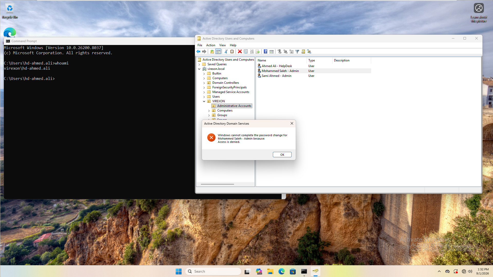

---

## AD Operator Delegation

The AD Operator role required two separate delegation scopes:

1. Standard user administration under `VIREXON\Users`.
2. Departmental group membership administration under `VIREXON\Groups\Department-Groups`.

### User Administration

The `GG-AD-Operators` group was delegated the ability to:

- Create standard user accounts.
- Delete standard user accounts.
- Manage standard user properties.
- Reset user passwords.
- Require password changes at the next sign-in.

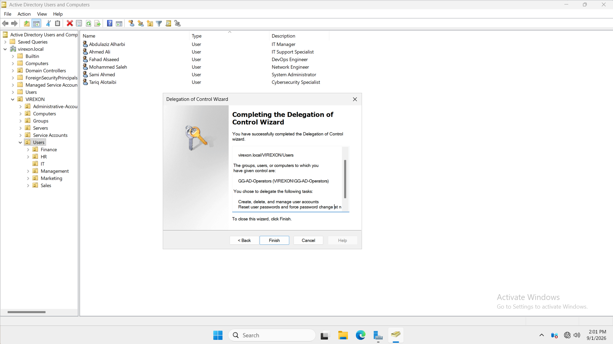

### Departmental Group Membership

A separate delegation was applied to:

`VIREXON\Groups\Department-Groups`

The delegated task was limited to:

`Modify the membership of a group`

This allowed AD Operators to manage departmental groups such as `GG-IT-Users` without granting control over administrative role groups.

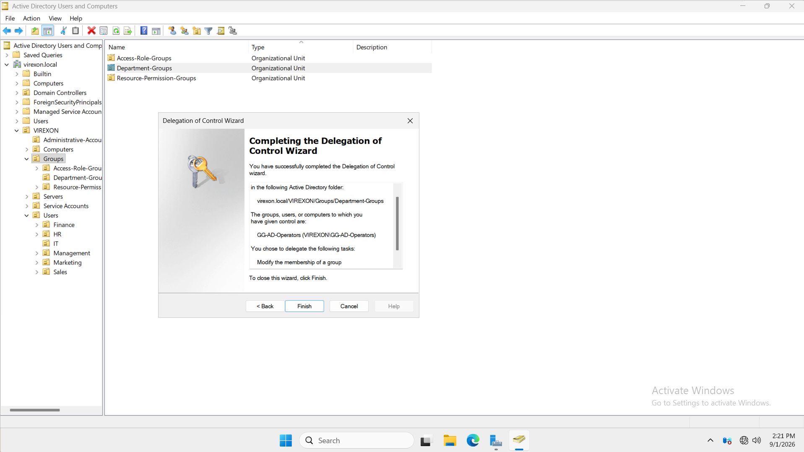

### Authorized Actions Test

The AD Operator account successfully created a temporary standard user and added it to the appropriate departmental group.

This verified both delegated user administration and departmental group membership management.

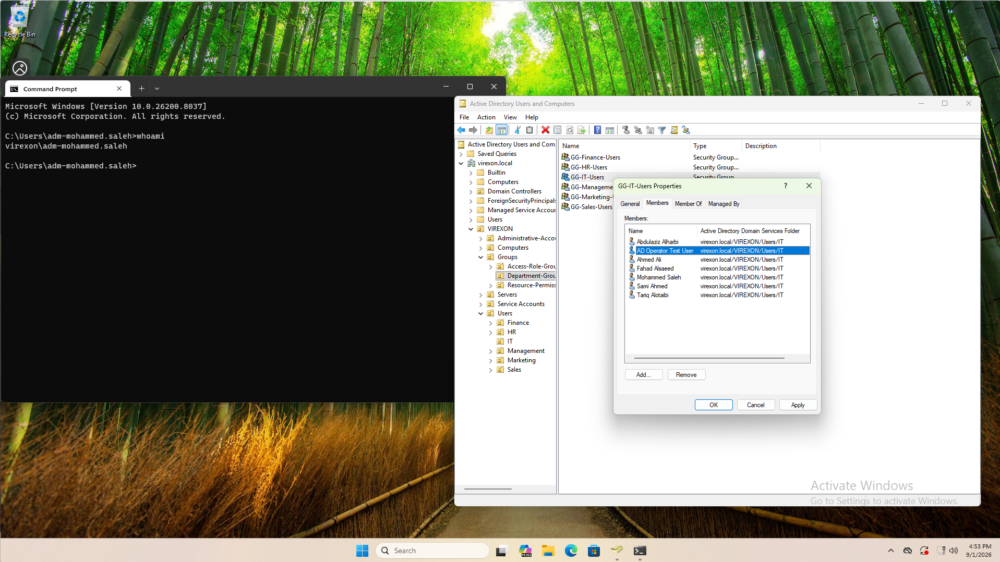

### Privilege Escalation Test

The AD Operator attempted to manage the membership of `GG-AD-Admins`.

The Add and Remove controls were unavailable, proving that the AD Operator could not add itself or another account to the privileged administrator role.

---

## Privileged AD Administrator

### Role Assignment

The `GG-AD-Admins` security group was assigned to the built-in `Domain Admins` group for the privileged administration scenario.

The account `adm-sami.ahmed` received privileged access through `GG-AD-Admins`, maintaining group-based role assignment instead of assigning multiple privileges directly to the user.

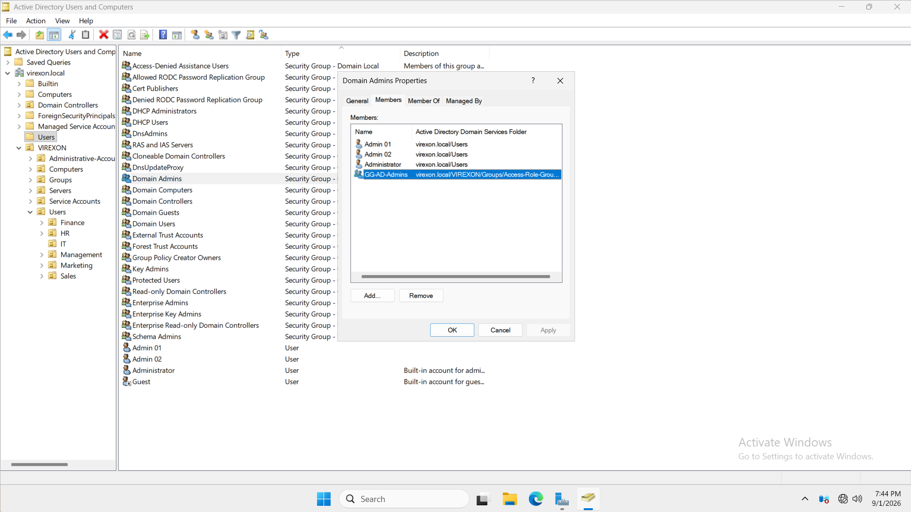

### Authorized Privileged Action

After signing in as `adm-sami.ahmed`, the administrator successfully created a temporary privileged test account inside:

`VIREXON\Administrative-Accounts`

This confirmed that the dedicated administrative account possessed the intended privileged authority.

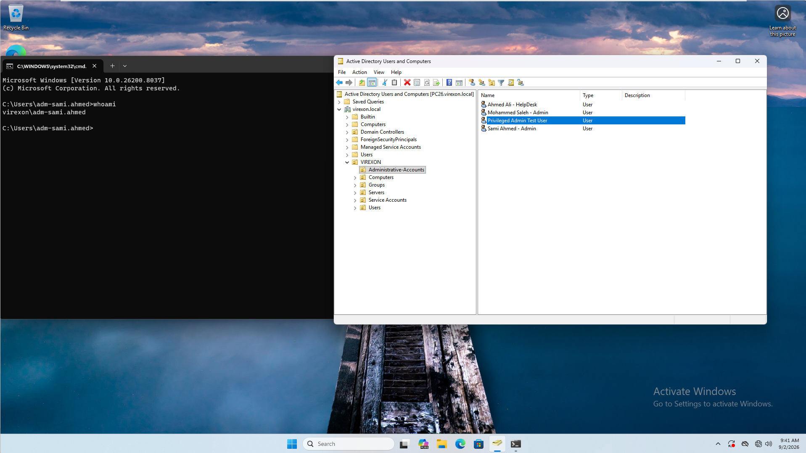

### Daily Account Separation

The standard account `s.ahmed` attempted to reset the password of the privileged test account.

The operation returned `Access is denied`.

This proved that administrative privileges belonged only to the dedicated administrative identity and were not available through the administrator's standard daily account.

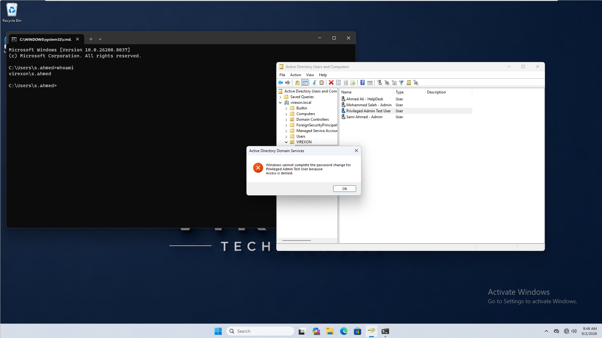

---

## Fine-Grained Password Policy

A Password Settings Object named `PSO-Privileged-Admins` was created in Active Directory Administrative Center.

Unlike the Default Domain Password Policy, a Fine-Grained Password Policy can target selected users or global security groups. The PSO was therefore applied directly to `GG-AD-Admins`.

### Configured Password Settings

| Setting | Value |
|---|---|
| Name | `PSO-Privileged-Admins` |
| Precedence | `1` |
| Directly Applies To | `GG-AD-Admins` |
| Minimum Password Length | 14 characters |
| Password History | 24 passwords |
| Password Complexity | Enabled |
| Reversible Encryption | Disabled |
| Minimum Password Age | 1 day |
| Maximum Password Age | 30 days |
| Failed Sign-in Threshold | 5 attempts |
| Reset Failed Attempt Counter | 15 minutes |
| Account Lockout Duration | 15 minutes |
| Accidental Deletion Protection | Enabled |

`Password never expires` was disabled on `adm-sami.ahmed` so that the configured maximum password age could be enforced.

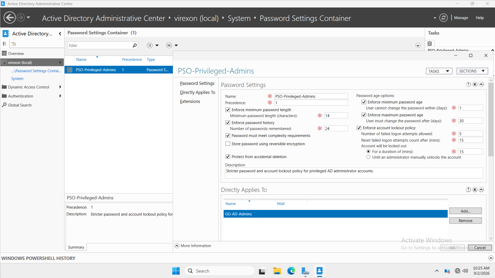

### Resultant Policy Verification

The `View resultant password settings` function was used against `adm-sami.ahmed`.

The effective policy was displayed as:

`PSO-Privileged-Admins`

This confirmed that the intended Password Settings Object was applied to the privileged administrator.

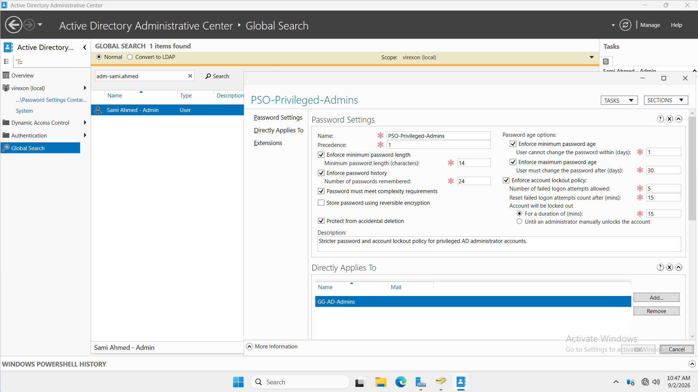

### Enforcement Test

A complex password containing only 13 characters was tested against the privileged account.

Active Directory rejected the password because it did not meet the effective minimum length of 14 characters. This validated actual policy enforcement rather than relying only on the saved configuration.

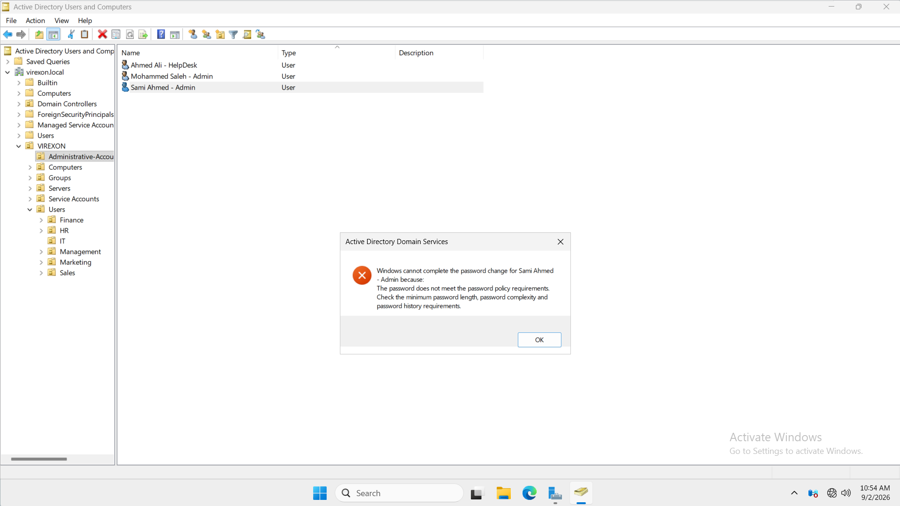

---

## Administrative Workstation Restriction

The privileged account `adm-sami.ahmed` was restricted to the designated administrative workstation:

`PC-IT-01`

This reduces the number of computers on which privileged credentials can be used.

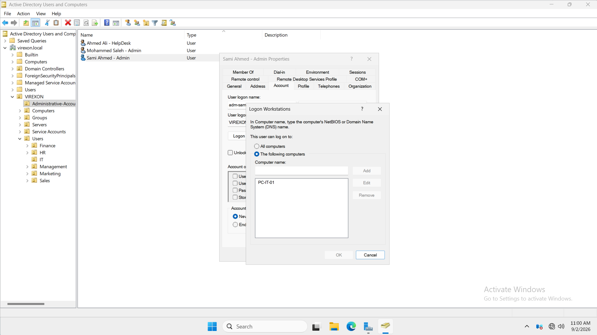

### Unauthorized Workstation Test

The privileged account successfully operated from `PC-IT-01`, but an interactive sign-in attempt on `PC26` was denied.

Windows displayed:

> Your account is configured to prevent you from using this PC. Please try another PC.

This confirmed that the workstation restriction was enforced.

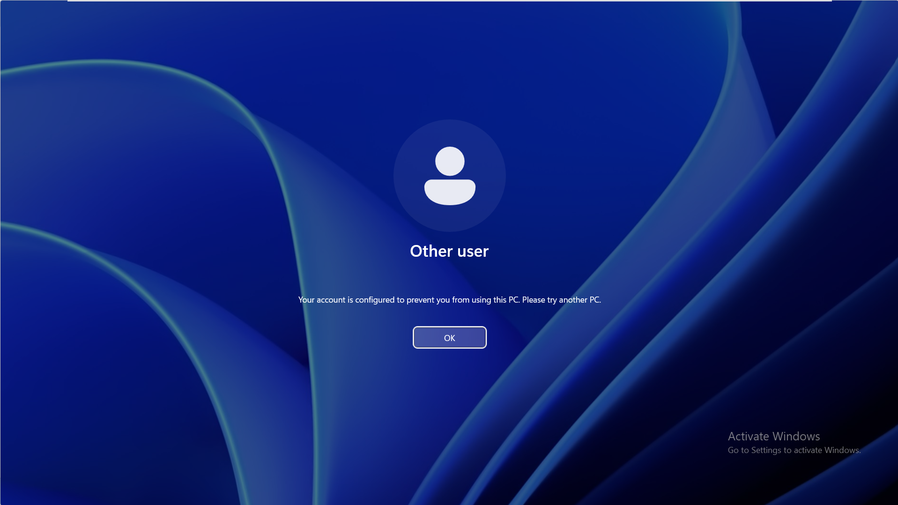

---

## Administrative OU Protection

The `Administrative-Accounts` OU contains privileged identities and was protected using:

`Protect object from accidental deletion`

The saved setting was verified from the OU's Object properties.

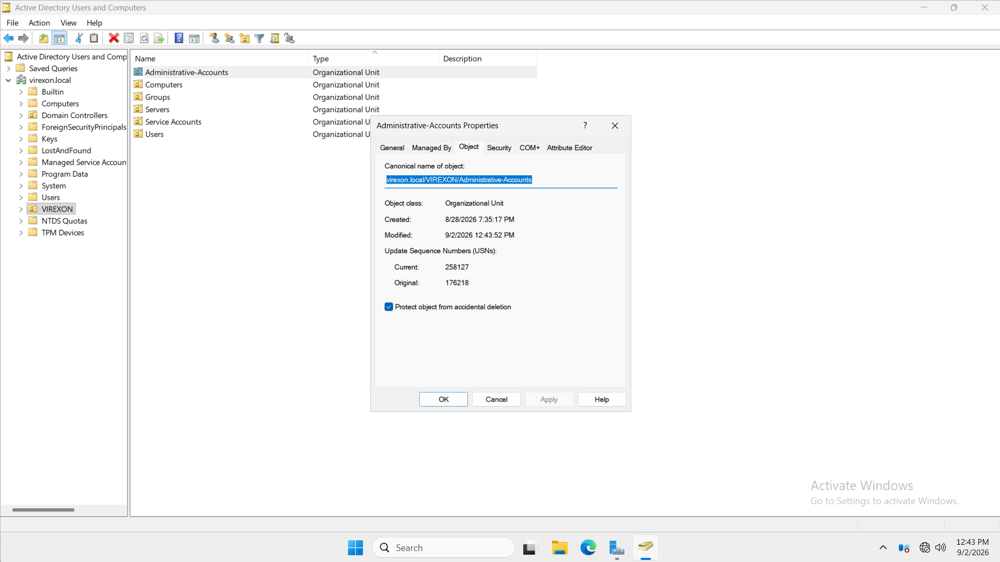

### Deletion Protection Test

A deletion attempt was performed against the protected `Administrative-Accounts` OU.

Active Directory denied the operation and the OU remained intact. Combined with the saved protection setting, this confirmed that accidental deletion protection was functioning correctly.

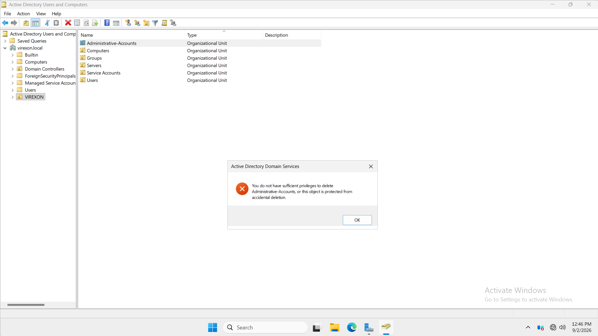

---

## Active Directory Recycle Bin

Accidental deletion protection is a preventive control. Active Directory Recycle Bin provides recovery after an object has already been deleted.

The feature was enabled and validated through a complete delete-and-restore test.

### Recovery Test

A temporary account named `test` was:

- Created inside `VIREXON\Users\IT`.
- Added to `GG-IT-Users`.
- Deleted after Active Directory Recycle Bin was enabled.
- Located inside the `Deleted Objects` container.
- Restored to its original OU.
- Verified for restoration of its previous group membership.

### Deleted Object Verification

The deleted account appeared in the Active Directory Administrative Center `Deleted Objects` container.

Its last known parent was retained, and the `Restore` and `Restore To` recovery options were available.

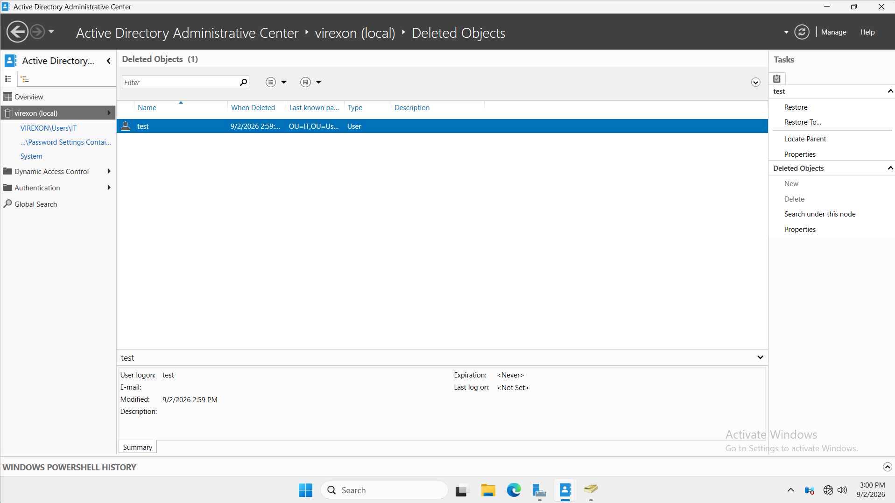

### Object Restoration Verification

After restoration:

- The account returned to `VIREXON\Users\IT`.
- Its default `Domain Users` membership remained present.
- Its previous `GG-IT-Users` membership was automatically restored.

This proved that the original directory object and its authorization membership were recovered instead of manually recreating a replacement account.

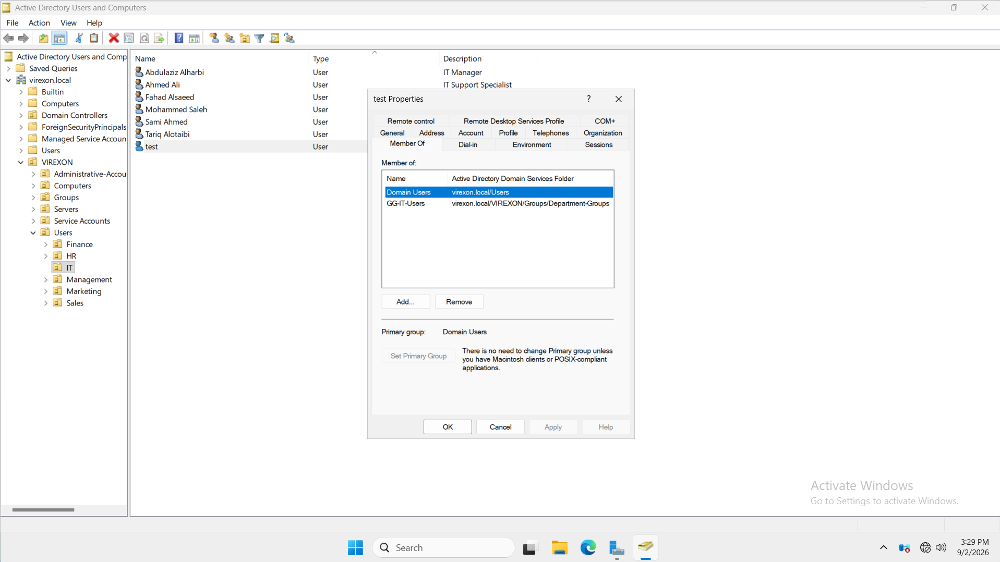

---

## Access Control Matrix

| Operation | Help Desk | AD Operator | Privileged AD Admin | Daily User |
|---|---:|---:|---:|---:|
| Read standard directory information | Allowed | Allowed | Allowed | Allowed |
| Reset standard user passwords | Allowed | Allowed | Allowed | Denied |
| Force password change at next sign-in | Allowed | Allowed | Allowed | Denied |
| Account unlock permission | Configured | Configured | Allowed | Denied |
| Create and manage standard users | Denied | Allowed | Allowed | Denied |
| Delete standard users | Denied | Allowed | Allowed | Denied |
| Modify departmental group membership | Denied | Allowed | Allowed | Denied |
| Modify administrative role membership | Denied | Denied | Allowed | Denied |
| Manage administrative accounts | Denied | Denied | Allowed | Denied |
| Perform domain-level privileged actions | Denied | Denied | Allowed | Denied |
| Restore deleted directory objects | Not delegated | Not delegated | Allowed | Denied |

Directory visibility does not equal administrative control. Authenticated domain users can read many standard directory objects by default, while modification, deletion, password management, and group membership changes remain controlled by permissions and delegation.

---

## Validation Summary

| Validation | Expected Result | Actual Result | Status |
|---|---|---|---|
| RSAT installation | AD DS tools available on `PC-IT-01` | Tools installed | Passed |
| Remote AD administration | Domain manageable from workstation | Connection successful | Passed |
| Help Desk password reset | Standard password reset succeeds | Operation succeeded | Passed |
| Help Desk administrative boundary | Privileged account reset denied | Access denied | Passed |
| AD Operator user management | Standard user can be managed | Operation succeeded | Passed |
| AD Operator departmental membership | Department membership can be modified | Operation succeeded | Passed |
| AD Operator privilege escalation | Admin role membership unavailable | Modification unavailable | Passed |
| Privileged administrator action | Administrative object can be created | Operation succeeded | Passed |
| Daily account separation | Daily account cannot administer AD | Access denied | Passed |
| Resultant PSO | Privileged PSO displayed | Correct PSO displayed | Passed |
| PSO minimum length | Password below 14 characters rejected | Password rejected | Passed |
| Authorized workstation | Admin account operates from `PC-IT-01` | Sign-in successful | Passed |
| Unauthorized workstation | Admin account denied on `PC26` | Sign-in denied | Passed |
| Administrative OU protection | Protected OU cannot be deleted | Deletion denied | Passed |
| Recycle Bin retention | Deleted user appears in Deleted Objects | Object retained | Passed |
| Recycle Bin restoration | OU and group membership restored | Recovery succeeded | Passed |

---

## Security Principles Demonstrated

### Least Privilege

Each administrative role received only the permissions necessary for its assigned responsibilities.

### Role-Based Access Control

Permissions were assigned through security groups rather than directly to individual administrators.

### Separation of Duties

Help Desk, AD Operator, privileged administrator, and daily-user responsibilities were separated.

### Administrative Account Separation

Privileged operations were performed through dedicated administrative accounts instead of standard daily accounts.

### Scoped Delegation

Permissions were limited to the appropriate OUs and object types.

### Positive and Negative Testing

Both authorized and unauthorized actions were tested to verify real permission boundaries.

### Targeted Password Security

A Fine-Grained Password Policy enforced stronger requirements for privileged accounts without affecting every domain user.

### Restricted Privileged Sign-in

The privileged account was limited to a designated administrative workstation.

### Preventive and Recovery Controls

Accidental deletion protection prevents unintended deletion, while Active Directory Recycle Bin supports recovery after deletion.

---

## Production Considerations

This lab assigned `GG-AD-Admins` to `Domain Admins` to demonstrate a fully privileged administrative role and test the separation between privileged and nonprivileged accounts.

In a production environment:

- Permanent `Domain Admins` membership should be minimized.
- Privileged access should be temporary or approval-based where possible.
- Privileged group membership changes should be audited.
- Administrative accounts should not be used for email, browsing, or routine productivity.
- Administrative workstations should receive additional security hardening.
- Emergency access accounts should be separately protected and monitored.
- Delegated permissions should be reviewed periodically.
- Active Directory Recycle Bin should not replace System State backup or forest recovery planning.
- Account-level workstation restrictions should form part of a wider privileged-access security design.
- Stronger authentication controls should be applied where the environment supports them.

---

## Skills Demonstrated

This phase demonstrates practical ability to:

- Design role-based Active Directory administration.
- Separate daily and privileged identities.
- Install and use RSAT.
- Delegate control at the correct OU scope.
- Configure extended rights and attribute-level permissions.
- Manage administrative access through security groups.
- Prevent privilege escalation.
- Validate both permitted and denied operations.
- Configure Fine-Grained Password Policies.
- Determine a user's resultant password policy.
- Verify password policy enforcement.
- Restrict privileged accounts to approved workstations.
- Protect critical OUs from accidental deletion.
- Enable and use Active Directory Recycle Bin.
- Restore deleted users with their original location and group membership.

---

## Evidence Index

| No. | Screenshot |
|---:|---|
| 01 | `01-Administrative-Role-Structure-Verification.png` |
| 02 | `02-RSAT-AD-DS-Tools-Installation-Verification.png` |
| 03 | `03-RSAT-Remote-AD-Administration-Verification.png` |
| 04 | `04-HelpDesk-Role-and-Delegation-Configuration.png` |
| 05 | `05-HelpDesk-Allowed-Action-Verification.png` |
| 06 | `06-HelpDesk-Administrative-Account-Access-Denied.png` |
| 07 | `07-AD-Operator-User-Delegation-Configuration.png` |
| 08 | `08-AD-Operator-Group-Membership-Delegation.png` |
| 09 | `09-AD-Operator-Allowed-Actions-Verification.png` |
| 10 | `10-AD-Operator-Privilege-Escalation-Denied.png` |
| 11 | `11-Privileged-AD-Admin-Role-Assignment.png` |
| 12 | `12-AD-Admin-Privileged-Action-Verification.png` |
| 13 | `13-Daily-Account-Administrative-Action-Denied.png` |
| 14 | `14-Privileged-PSO-Configuration.png` |
| 15 | `15-Privileged-PSO-Resultant-Policy.png` |
| 16 | `16-Privileged-PSO-Enforcement-Verification.png` |
| 17 | `17-Administrative-Workstation-Restriction-Configuration.png` |
| 18 | `18-Unauthorized-Workstation-Logon-Denied.png` |
| 19 | `19-Administrative-OU-Protection-Configuration.png` |
| 20 | `20-Accidental-Deletion-Protection-Verification.png` |
| 21 | `21-AD-Recycle-Bin-Deleted-Object-Verification.png` |
| 22 | `22-AD-Recycle-Bin-Object-Restoration-Verification.png` |

---

## References

- [Active Directory Administrative Center](https://learn.microsoft.com/en-us/windows-server/identity/ad-ds/get-started/adac/advanced-ad-ds-management-using-active-directory-administrative-center--level-200-)
- [Fine-Grained Password Policies](https://learn.microsoft.com/en-us/windows-server/identity/ad-ds/get-started/adac/fine-grained-password-policies)
- [Active Directory Recycle Bin](https://learn.microsoft.com/en-us/windows-server/identity/ad-ds/get-started/adac/active-directory-recycle-bin)
- [Best Practices for Securing Active Directory](https://learn.microsoft.com/en-us/windows-server/identity/ad-ds/plan/security-best-practices/best-practices-for-securing-active-directory)
- [Implementing Least-Privilege Administrative Models](https://learn.microsoft.com/en-us/windows-server/identity/ad-ds/plan/security-best-practices/implementing-least-privilege-administrative-models)

---

## Conclusion

The Advanced Active Directory phase successfully implemented an enterprise-oriented administrative model for the VIREXON domain.

The environment now includes separate administrative identities, group-based role assignment, scoped Help Desk and AD Operator delegation, verified privilege boundaries, a targeted privileged password policy, administrative workstation restrictions, OU deletion protection, and deleted-object recovery.

Testing confirmed that:

- Help Desk personnel can perform approved support actions without managing privileged accounts.
- AD Operators can manage standard users and departmental memberships without escalating their privileges.
- Privileged administration is performed through a separate administrative identity.
- Standard daily accounts remain nonprivileged.
- The privileged password policy is correctly applied and enforced.
- Privileged sign-in is restricted to the authorized administrative workstation.
- Critical administrative objects are protected against accidental deletion.
- Deleted directory objects can be restored with their original location and group membership.

This phase demonstrates practical understanding of secure Active Directory administration, least-privilege delegation, privileged identity separation, policy enforcement, access-boundary validation, and operational directory recovery.
