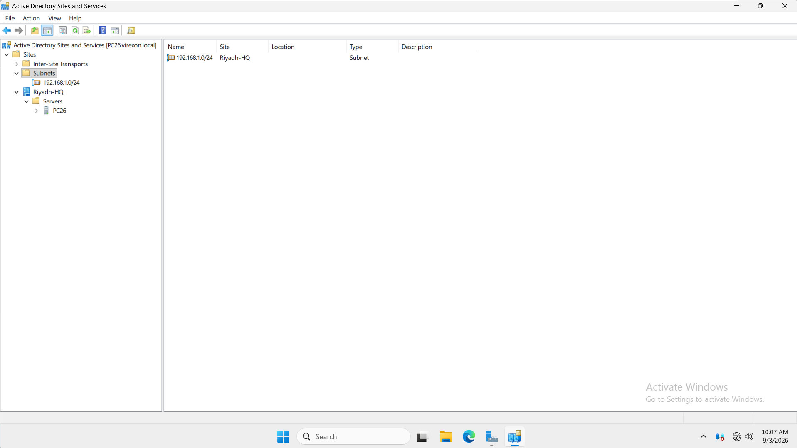
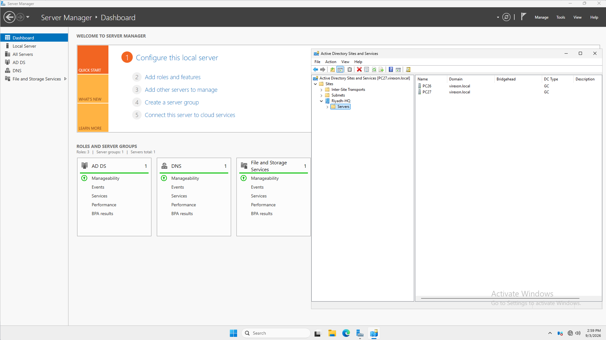
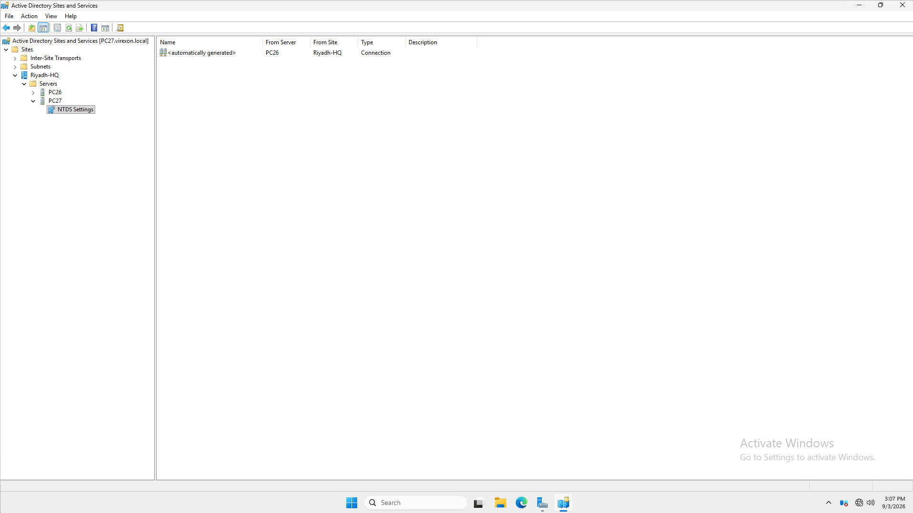
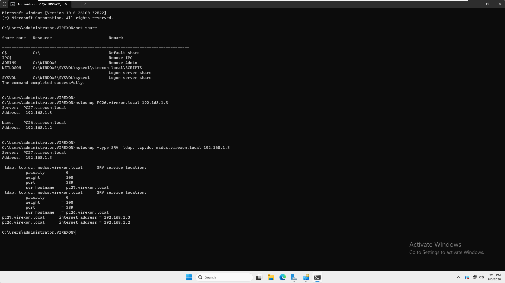
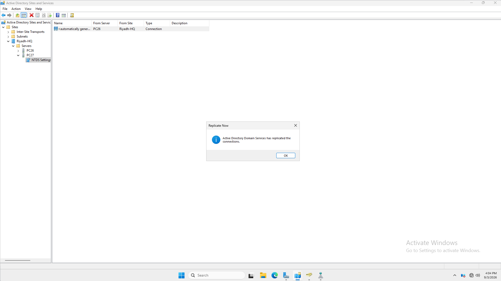
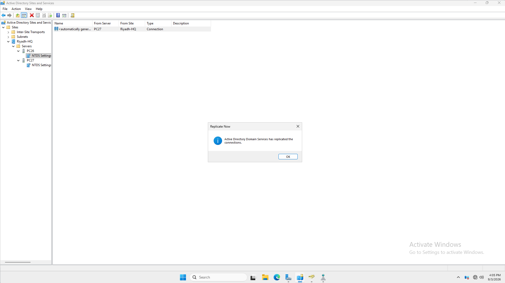
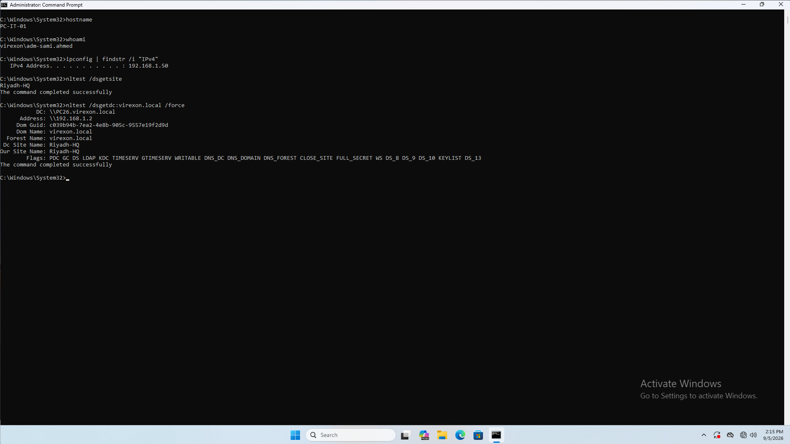
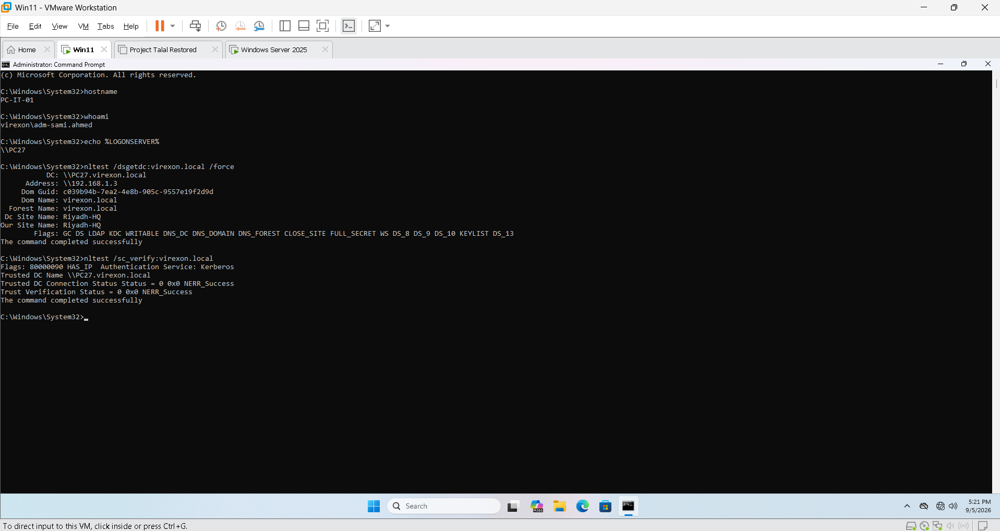
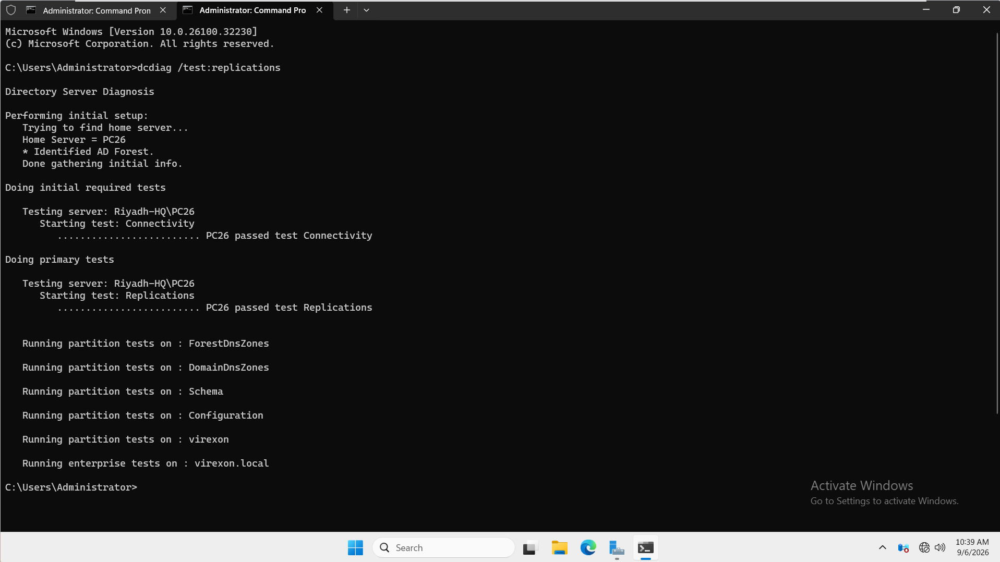

# 13 - Active Directory Sites and Services

## Overview

This phase extends the VIREXON domain by introducing a second writable Domain Controller, `PC27`, alongside the existing Domain Controller, `PC26`.

The implementation covers site and subnet configuration, additional Domain Controller deployment, DNS integration, replication topology, directory replication in both directions, client site detection, and domain authentication during a controlled outage of `PC26`.

Both Domain Controllers operate within the same Active Directory site, `Riyadh-HQ`.

| Item | Value |
|---|---|
| Status | Completed |
| Active Directory Domain | `virexon.local` |
| NetBIOS Domain Name | `VIREXON` |
| Active Directory Site | `Riyadh-HQ` |
| Site Subnet | `192.168.1.0/24` |
| Virtualization Platform | VMware Workstation Pro |
| Virtual Network | VMnet1 — Host-only |
| Evidence | 9 screenshots |

## Objectives

- Deploy an additional writable Domain Controller in the existing domain.
- Configure the relationship between the lab subnet and its Active Directory site.
- Verify DNS and Global Catalog functionality on the additional Domain Controller.
- Inspect the replication connections generated by the Knowledge Consistency Checker.
- Verify directory changes in both replication directions.
- Confirm that the client identifies its assigned site.
- Verify domain authentication through `PC27` while `PC26` is offline.
- Investigate replication errors and capture the final replication health result.

## Lab Environment

| System | IPv4 Address | Role |
|---|---|---|
| `PC26` | `192.168.1.2/24` | Existing writable Domain Controller, DNS server, and DHCP server |
| `PC27` | `192.168.1.3/24` | Additional writable Domain Controller, DNS server, and Global Catalog |
| `PC-IT-01` | `192.168.1.50/24` | Windows 11 domain client and RSAT administrative workstation |

The Domain Controllers use static IPv4 addresses. The client's normal addressing design uses a DHCP reservation for `192.168.1.50`.

During the authentication failover test, the client used a temporary static IPv4 configuration because the DHCP service was hosted on `PC26`, which was deliberately shut down.

All systems belong to the isolated `192.168.1.0/24` lab network. A default gateway is not required for communication between these systems on the same subnet.

---

## 01 - Site and Subnet Configuration

The Active Directory site was configured as `Riyadh-HQ`, and the subnet `192.168.1.0/24` was associated with it.

This subnet-to-site mapping allows domain members to identify their Active Directory site from their IP address. It also provides the location information used during Domain Controller discovery.

Both `PC26` and `PC27` were placed in `Riyadh-HQ`, matching their network location.

| Configuration | Value |
|---|---|
| Site Name | `Riyadh-HQ` |
| Subnet | `192.168.1.0/24` |
| Subnet Association | `Riyadh-HQ` |
| Domain Controllers in the Site | `PC26`, `PC27` |



---

## 02 - Additional Domain Controller Deployment

Active Directory Domain Services was installed on `PC27`, which was then promoted as an additional Domain Controller in the existing `virexon.local` domain.

The deployment included:

- A writable copy of the domain directory.
- The DNS Server role.
- Global Catalog functionality.
- Placement in the `Riyadh-HQ` site.

The Global Catalog designation was verified as part of the deployment checks.

Adding `PC27` provides another Domain Controller that can participate in directory replication, support domain discovery, and authenticate domain users.



---

## 03 - KCC Replication Connection Verification

The replication connections between `PC26` and `PC27` were inspected in **Active Directory Sites and Services**.

The Knowledge Consistency Checker, or **KCC**, automatically creates the connection objects used to maintain the replication topology.

A connection object beneath a Domain Controller's **NTDS Settings** represents an inbound replication connection from another Domain Controller. The connections were checked to verify the replication relationship between the two servers.

| Destination Domain Controller | Replication Source |
|---|---|
| `PC26` | `PC27` |
| `PC27` | `PC26` |

Both servers reside in the same site, so this implementation uses **intrasite replication**.



---

## 04 - DNS, SYSVOL, and NETLOGON Verification

The additional Domain Controller was checked for the DNS information and shared resources required to support domain operations.

The verification covered:

- Replicated Active Directory-integrated DNS information.
- DNS records used to locate Domain Controllers.
- Availability of the `SYSVOL` share.
- Availability of the `NETLOGON` share.

`SYSVOL` contains domain policy and script files. The `NETLOGON` share exposes the domain scripts location.

These checks established the additional Domain Controller's readiness to support domain clients, alongside the separate directory replication checks.



### Domain Controller DNS Client Settings

After deployment and initial replication validation, the following IPv4 DNS client settings were configured on the Domain Controllers:

| Domain Controller | Preferred DNS Server | Alternate DNS Server |
|---|---|---|
| `PC26` | `192.168.1.2` | `192.168.1.3` |
| `PC27` | `192.168.1.3` | `192.168.1.2` |

These are the DNS resolver settings on the servers' network adapters. Both configured addresses belong to internal DNS servers hosting the domain's DNS information.

---

## 05 - Directory Replication from PC26 to PC27

A controlled directory change made on `PC26` was verified from `PC27`.

The verification used the destination Domain Controller's view of Active Directory to confirm that the change had reached `PC27`.

**Result:** Directory changes originating on `PC26` were successfully received by `PC27`.



---

## 06 - Directory Replication from PC27 to PC26

The reverse direction was also tested.

A controlled directory change made on `PC27` was verified from `PC26`, confirming that the additional Domain Controller could originate changes and replicate them to the existing Domain Controller.

**Result:** Directory changes originating on `PC27` were successfully received by `PC26`.

Together, these tests verified replication in both directions between the two writable Domain Controllers.



---

## 07 - Client Site Detection Verification

Client-side verification was performed from `PC-IT-01` using the domain account `VIREXON\adm-sami.ahmed`.

Domain Controller discovery identified the client's site as `Riyadh-HQ`. The discovered Domain Controller was also located in `Riyadh-HQ`.

| Verification Item | Observed Result |
|---|---|
| Client Hostname | `PC-IT-01` |
| Domain Account | `VIREXON\adm-sami.ahmed` |
| Client Site | `Riyadh-HQ` |
| Discovered Domain Controller | `PC26` |
| Domain Controller Site | `Riyadh-HQ` |

The matching client and Domain Controller site names confirmed that site detection was consistent with the configured subnet association.



---

## 08 - Secondary Domain Controller Authentication Failover

A controlled outage was used to verify that the client could authenticate through `PC27` while `PC26` was unavailable.

### Test Conditions

- `PC26` was shut down.
- `PC27` remained running.
- `PC-IT-01` retained network connectivity through a temporary static IPv4 configuration.
- DNS resolution through the remaining Domain Controller was available.
- A fresh sign-in was performed using `VIREXON\adm-sami.ahmed`.

The static client configuration was necessary because DHCP was hosted on `PC26`. This kept the test focused on domain authentication during a Domain Controller outage.

### Client Verification

The following commands were used from the client:

```cmd
hostname
whoami
echo %LOGONSERVER%
nltest /dsgetdc:virexon.local /force
nltest /sc_verify:virexon.local
```

The verification showed:

| Check | Observed Result |
|---|---|
| Client Identity | `PC-IT-01` |
| Signed-in Account | `VIREXON\adm-sami.ahmed` |
| Logon Server | `\\PC27` |
| Discovered Domain Controller | `\\PC27.virexon.local` |
| Domain Controller Address | `192.168.1.3` |
| Client and Domain Controller Site | `Riyadh-HQ` |
| Secure Channel Verification | `0x0 NERR_Success` |

A fresh sign-in allowed the logon server to be verified for the new session. Domain Controller discovery and secure channel verification provided additional confirmation of communication with `PC27`.

**Result:** Domain authentication through `PC27` was successfully verified while `PC26` was offline.



---

## 09 - Final AD Replication Health Verification

After the authentication failover test, both Domain Controllers were brought online for replication validation.

The checks included:

```cmd
repadmin /replsummary
repadmin /showrepl PC27 /verbose
dcdiag /test:replications
```

### Replication Issue Encountered

During validation, replication from `PC26` to `PC27` reported error **8524**:

> The DSA operation is unable to proceed because of a DNS lookup failure.

A separate replication latency warning also appeared during the checks on `PC26`:

> Expected notification link is missing.

DNS investigation checked the GUID-based replication alias for `PC26` against both DNS servers. The alias resolved to `PC26.virexon.local` at `192.168.1.2`, and connectivity to that address was verified.

### Recovery and Revalidation

DNS refresh and replication recovery were performed on both Domain Controllers. The recovery sequence included clearing the DNS client cache, requesting DNS record registration, restarting the DNS service, and synchronizing the directory.

The CMD sequence was:

```cmd
ipconfig /flushdns
ipconfig /registerdns
net stop dns && net start dns
repadmin /syncall /A /e /P /d
dcdiag /test:replications
```

The synchronization command covered the directory partitions held by each Domain Controller:

| Directory Partition | Purpose |
|---|---|
| `DC=virexon,DC=local` | Domain directory objects |
| `CN=Configuration,DC=virexon,DC=local` | Forest configuration, including sites and replication configuration |
| `CN=Schema,CN=Configuration,DC=virexon,DC=local` | Object class and attribute definitions |
| `DC=DomainDnsZones,DC=virexon,DC=local` | Domain-scoped Active Directory-integrated DNS data |
| `DC=ForestDnsZones,DC=virexon,DC=local` | Forest-scoped Active Directory-integrated DNS data |

The recovery is documented as a sequence of actions followed by successful verification. The results do not isolate one command as the sole cause of recovery.

### Final Captured Result

The final retained `dcdiag` output on `PC26` showed:

| Test | Result |
|---|---|
| Connectivity | Passed |
| Replications | Passed |
| Previously Reported Notification-Link Warning | Absent from the final output |

The command completed and returned to the command prompt without the earlier replication latency warning.



---

## Scope and Design Boundaries

This phase implements an additional Domain Controller and validates directory services within a **single Active Directory site**.

The demonstrated outcomes are:

- Site and subnet association.
- Additional writable Domain Controller deployment.
- DNS and Global Catalog availability on `PC27`.
- KCC replication connections.
- Directory replication in both directions.
- Client site detection.
- Domain authentication through `PC27` during a controlled outage of `PC26`.
- Successful final replication diagnostics on `PC26`.

The implementation has the following boundaries:

- **Single-site design:** Intersite replication, multiple-site routing preferences, and site-link cost or schedule testing were outside this implementation.
- **Service coverage:** DHCP and the existing departmental file services remained on `PC26`. The authentication test did not demonstrate failover of those services.
- **Shared physical host:** Both Domain Controllers run as virtual machines on the same VMware host. This lab demonstrates a Domain Controller VM outage scenario; it does not provide protection against failure of the physical host.

## Conclusion

The VIREXON domain was successfully extended with `PC27` as an additional writable Domain Controller, DNS server, and Global Catalog in `Riyadh-HQ`.

The documented tests verified site configuration, directory replication in both directions, client site detection, and domain authentication through `PC27` while `PC26` was offline.

Replication issues encountered during validation were investigated, followed by DNS refresh and directory resynchronization. The final captured replication diagnostic on `PC26` passed without the previously reported notification-link warning.

The nine screenshots document the implementation and its verification within the defined single-site lab scope.

## References

- [Microsoft Learn — Active Directory Replication Concepts](https://learn.microsoft.com/en-us/windows-server/identity/ad-ds/get-started/replication/active-directory-replication-concepts)
- [Microsoft Learn — DCDiag](https://learn.microsoft.com/en-us/windows-server/administration/windows-commands/dcdiag)
- [Microsoft Learn — Troubleshoot Active Directory Replication Error 8524](https://learn.microsoft.com/en-us/troubleshoot/windows-server/active-directory/replication-error-8524)
