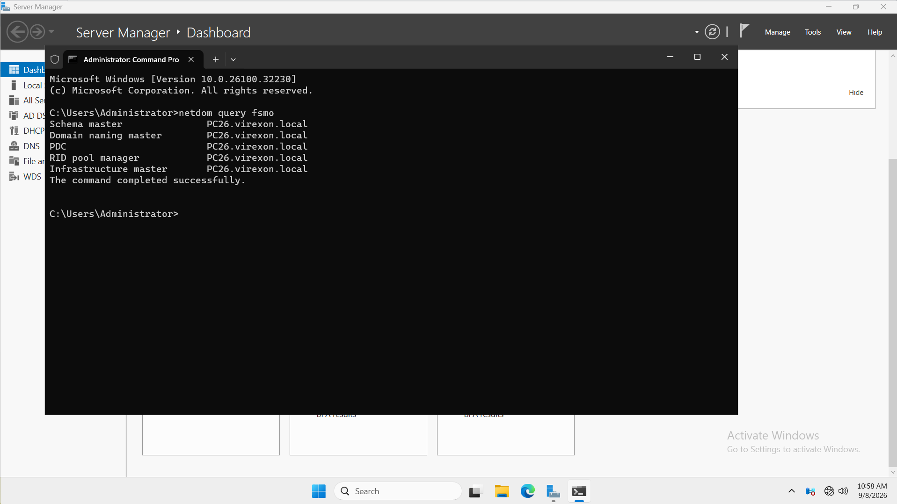
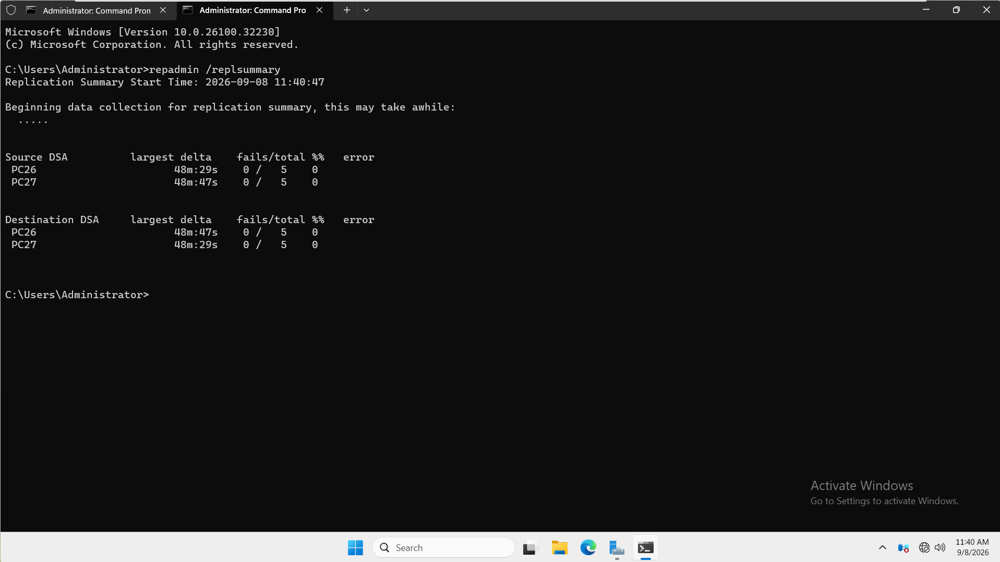
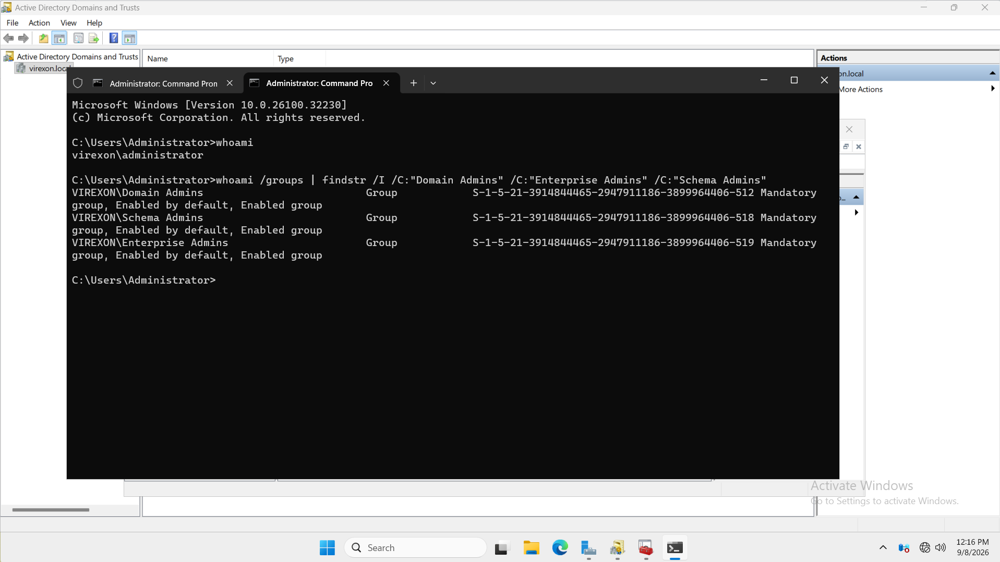
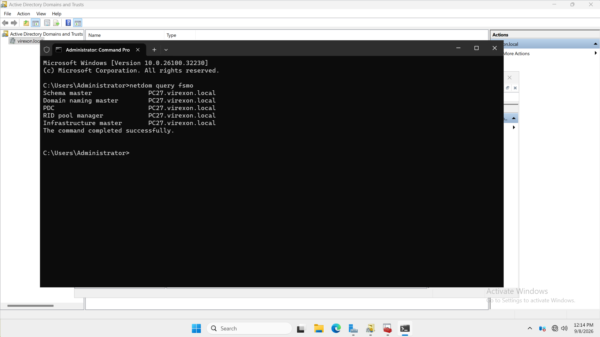
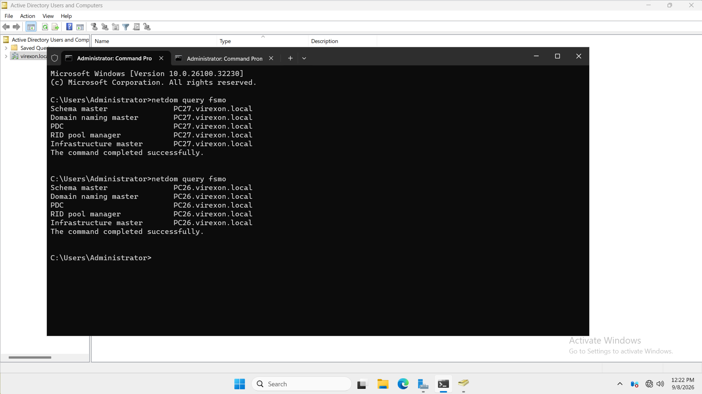
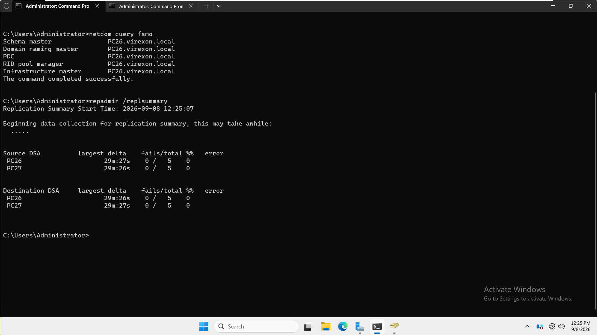

# 14 - FSMO Roles

## Purpose

This phase demonstrates a planned transfer of all five Flexible Single Master Operations (FSMO) roles between two healthy writable Domain Controllers. The roles move from `PC26` to `PC27` for validation and then return to `PC26`, preserving the intended final lab design.

## Verified environment

| Component | Configuration |
| --- | --- |
| Domain | `virexon.local` |
| Active Directory site | `Riyadh-HQ` |
| Original and final role holder | `PC26.virexon.local` — `192.168.1.2` |
| Temporary transfer target | `PC27.virexon.local` — `192.168.1.3` |
| Transfer type | Planned, graceful transfer |
| Verification | `netdom`, `repadmin`, and `whoami` |
| Evidence | 6 screenshots |

Both Domain Controllers remained online during the transfer cycle. No seizure, demotion, or metadata cleanup was performed.

## FSMO role model

| Scope | Role | Primary responsibility |
| --- | --- | --- |
| Forest | Schema Master | Authorizes schema changes |
| Forest | Domain Naming Master | Authorizes domain and application-partition additions or removals |
| Domain | PDC Emulator | Handles priority password updates, lockout coordination, time hierarchy, and preferred Group Policy operations |
| Domain | RID Master | Allocates RID pools used to create unique security identifiers |
| Domain | Infrastructure Master | Maintains cross-domain object references |

Because this forest contains one domain, it has two forest-wide roles and three domain-wide roles.

## Transfer tools

| Management console | Roles transferred |
| --- | --- |
| Active Directory Users and Computers | RID Master, PDC Emulator, Infrastructure Master |
| Active Directory Domains and Trusts | Domain Naming Master |
| Active Directory Schema MMC snap-in | Schema Master |

The Schema snap-in was registered with:

```cmd
regsvr32 schmmgmt.dll
```

Registration exposes the management snap-in; it does not modify the directory schema.

## Readiness and authorization

The initial `netdom query fsmo` result placed all five roles on `PC26.virexon.local`. Before any transfer, `repadmin /replsummary` showed both Domain Controllers with `0 / 5` source failures and `0 / 5` destination failures.

The active session was `VIREXON\Administrator`. Its token included `Domain Admins`, `Enterprise Admins`, and `Schema Admins`, supporting the required domain-, forest-, and schema-level operations.

An earlier readiness attempt recorded one DNS-related replication failure. The transfer was paused until both DCs were available and the retained pre-transfer check reported zero failures. No unsupported root cause is assigned to that transient result.

## Transfer cycle

All five roles were transferred through the native graphical consoles while connected to `PC27`. A command-line query then confirmed the temporary state.

The same consoles were subsequently used to return all five roles to `PC26`.

| Stage | Schema | Domain Naming | PDC | RID | Infrastructure |
| --- | --- | --- | --- | --- | --- |
| Initial | `PC26` | `PC26` | `PC26` | `PC26` | `PC26` |
| Temporary | `PC27` | `PC27` | `PC27` | `PC27` | `PC27` |
| Final | `PC26` | `PC26` | `PC26` | `PC26` | `PC26` |

The final `netdom query fsmo` and `repadmin /replsummary` capture shows the intended ownership restored and zero source or destination replication failures on both DCs.

## Transfer versus seizure

| Characteristic | Transfer | Seizure |
| --- | --- | --- |
| Use case | Planned maintenance or role placement | Emergency recovery from a permanently unavailable owner |
| Existing owner | Online and reachable | Unrecoverable or not returning to service |
| Method | Graceful handover | Forced reassignment |
| Used here | Yes | No |

FSMO ownership does not automatically move when a Domain Controller is powered off. The temporary ownership on `PC27` resulted from explicit administrative transfers, not failover.

## Evidence index

| # | Evidence | What it proves |
| ---: | --- | --- |
| 01 | [Initial FSMO Ownership](Screenshots/01-Current-FSMO-Role-Ownership.png) | All five roles initially belong to `PC26.virexon.local`. |
| 02 | [Pre-Transfer Replication](Screenshots/02-Pre-Transfer-AD-Replication-Health.png) | Both DCs report `0 / 5` source and destination failures before transfer. |
| 03 | [Transfer Authorization](Screenshots/03-FSMO-Transfer-Authorization-Verification.png) | The active administrator token contains the required privileged groups. |
| 04 | [Temporary FSMO Ownership](Screenshots/04-Selected-FSMO-Role-Transfer.png) | All five roles have been transferred to `PC27.virexon.local`. |
| 05 | [Restored FSMO Ownership](Screenshots/05-Final-FSMO-Role-Ownership-Verification.png) | The recorded transition ends with all five roles back on `PC26`. |
| 06 | [Final Ownership and Replication](Screenshots/06-Post-Transfer-AD-Replication-Health.png) | `PC26` owns all roles and both DCs report zero replication failures. |

## Design boundaries

- This was a controlled transfer between healthy DCs, not an emergency-recovery exercise.
- `PC27` remains a writable additional Domain Controller after the roles return to `PC26`; it is not a passive backup server.
- No permanent role distribution, role seizure, forced demotion, metadata cleanup, schema modification, or RID-recovery scenario was performed.
- The exercise validates administrative control of role placement, not automatic FSMO failover.


## Screenshot evidence

The screenshots below follow the documented evidence order. Each image links to its original file.

### 01 - Initial FSMO Ownership

[](Screenshots/01-Current-FSMO-Role-Ownership.png)

### 02 - Pre-Transfer Replication

[](Screenshots/02-Pre-Transfer-AD-Replication-Health.png)

### 03 - Transfer Authorization

[](Screenshots/03-FSMO-Transfer-Authorization-Verification.png)

### 04 - Temporary FSMO Ownership

[](Screenshots/04-Selected-FSMO-Role-Transfer.png)

### 05 - Restored FSMO Ownership

[](Screenshots/05-Final-FSMO-Role-Ownership-Verification.png)

### 06 - Final Ownership and Replication

[](Screenshots/06-Post-Transfer-AD-Replication-Health.png)

## Outcome

The five FSMO roles were identified, transferred to `PC27`, verified, and restored to `PC26`. The final documented state is unambiguous: `PC26.virexon.local` owns all five roles, and the final replication summary reports zero failures for both Domain Controllers.

**14 - FSMO Roles — Completed ✅**
