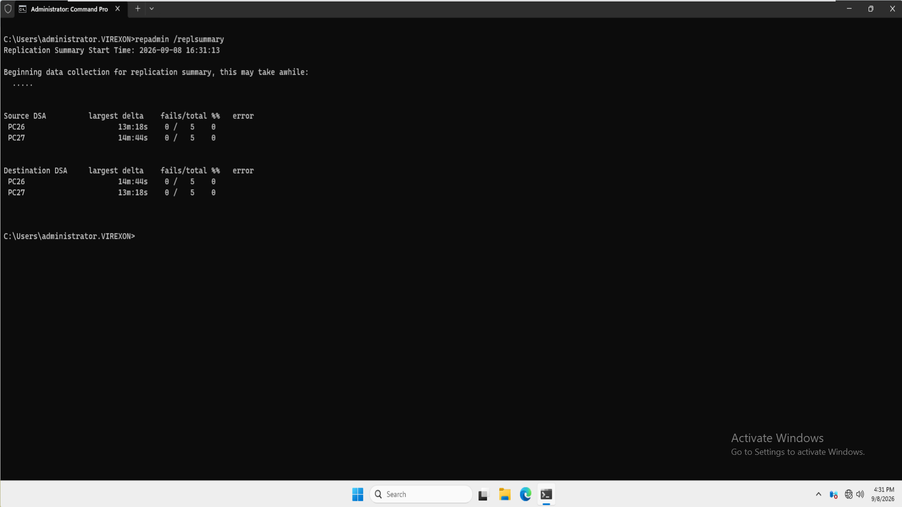
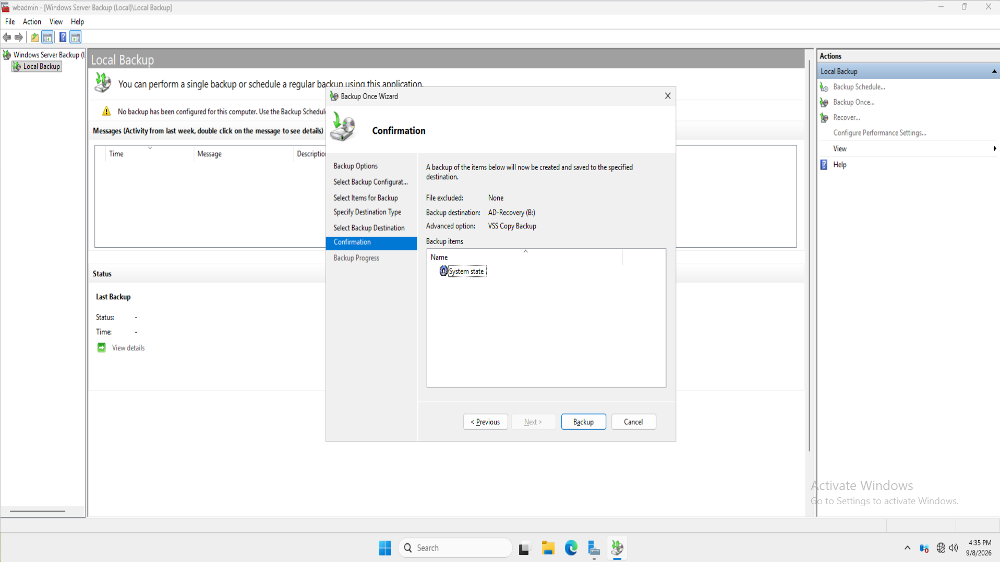
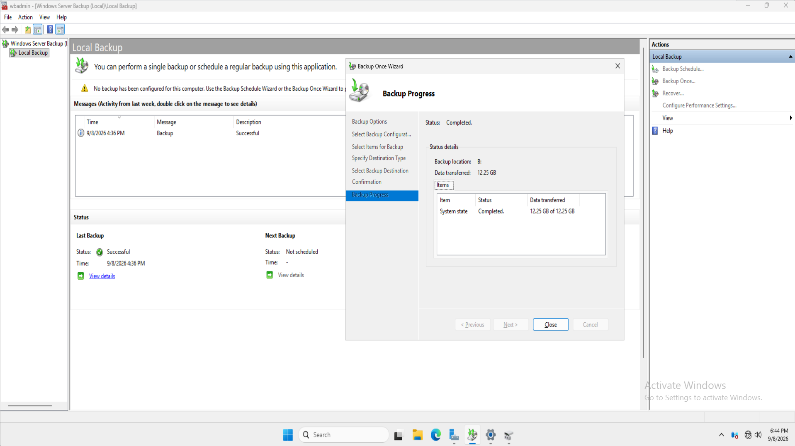
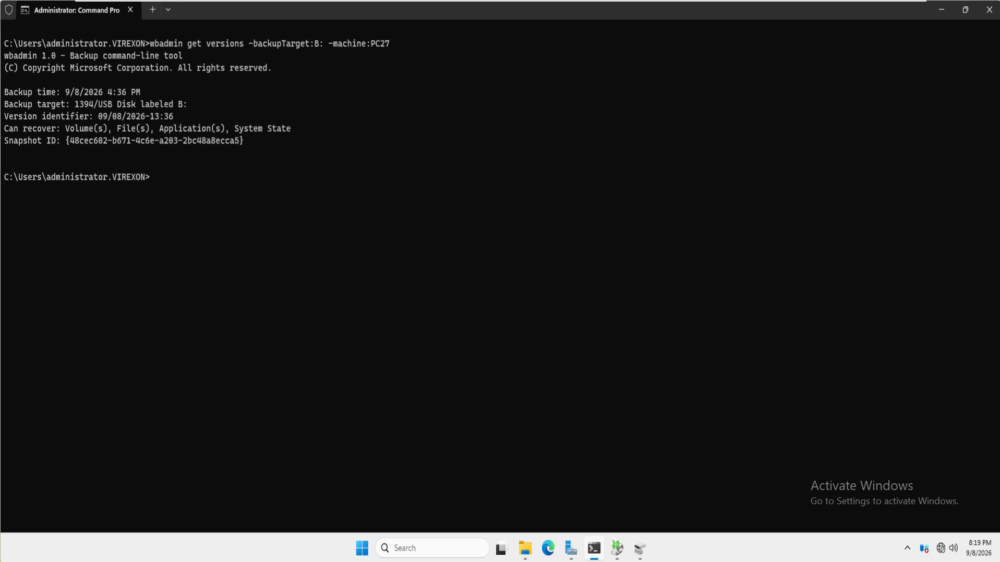
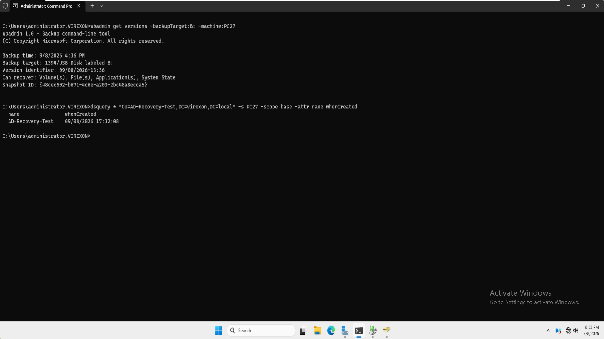
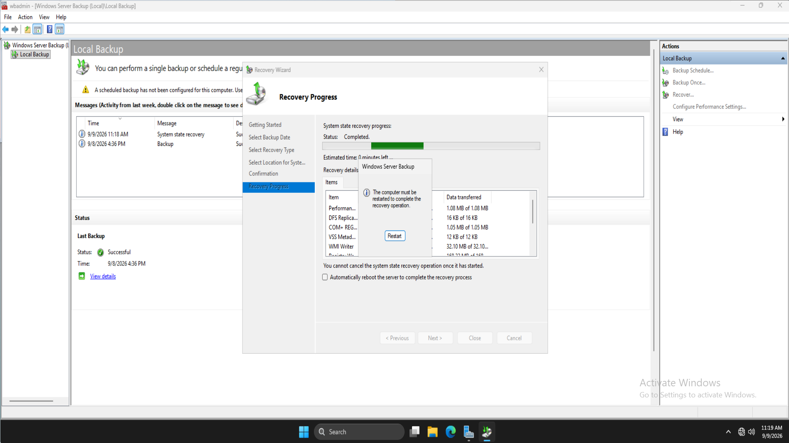
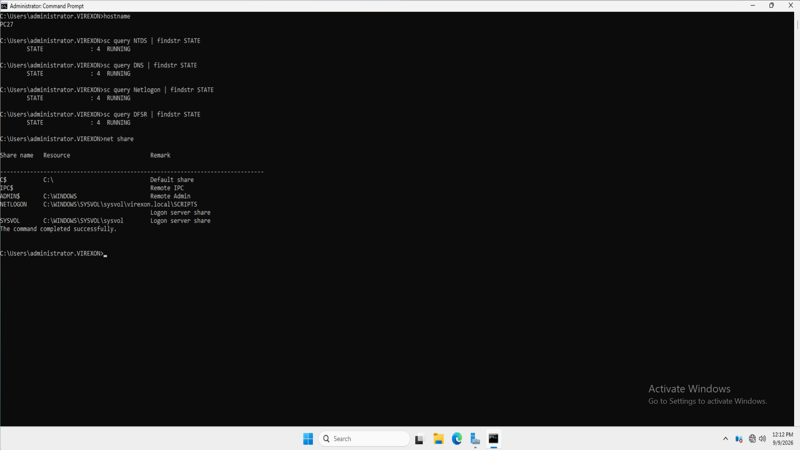
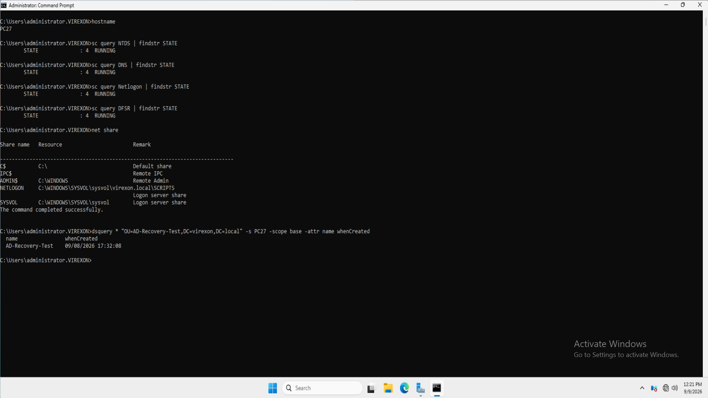
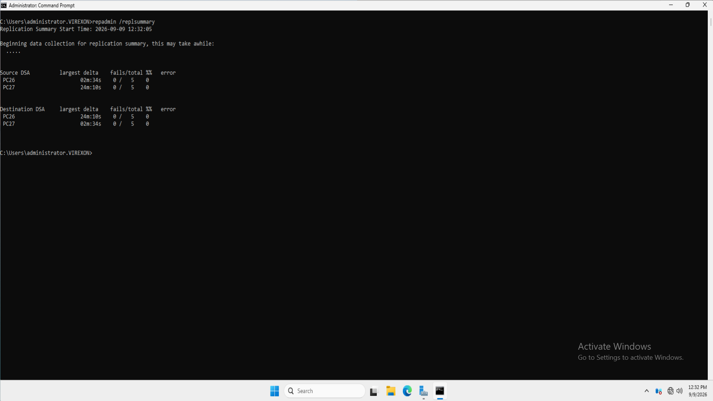

# 15 - Active Directory Backup and Recovery

## Purpose

This phase backs up and recovers `PC27` with Windows Server Backup. A System State backup is taken before a controlled directory change, then restored non-authoritatively so the recovered Domain Controller can receive newer directory data from `PC26`.

## Verified environment

| Component | Configuration |
| --- | --- |
| Domain | `virexon.local` |
| Active Directory site | `Riyadh-HQ` |
| Replication partner | `PC26.virexon.local` — `192.168.1.2` |
| Backup and recovery target | `PC27.virexon.local` — `192.168.1.3` |
| Recovery target platform | Windows Server 2025 |
| Backup scope | System State |
| Backup destination | Dedicated `AD-Recovery (B:)` volume |
| Recovery method | Non-authoritative System State restore in DSRM |
| Evidence | 9 screenshots |

`PC26` remained online as the replication partner, and all five FSMO roles remained on `PC26` throughout this phase.

## Recovery design

The test separates the backup point from a newer directory change:

1. Confirm healthy replication.
2. Back up the System State of `PC27`.
3. Create `AD-Recovery-Test` after the backup and verify it on `PC27`.
4. Restore the earlier backup to the same DC in Directory Services Restore Mode (DSRM).
5. Return `PC27` to normal operation.
6. Verify core services, domain shares, the newer OU, and final replication health.

Because the restore is non-authoritative, objects newer than the backup should be received from an available replication partner instead of being intentionally overwritten with the older copy.

## Backup and test condition

The pre-recovery `repadmin /replsummary` capture shows `PC26` and `PC27` with `0 / 5` source failures and `0 / 5` destination failures.

Windows Server Backup was configured as follows:

| Setting | Captured value |
| --- | --- |
| Operation | One-time backup |
| Selection | System State |
| Destination | `AD-Recovery (B:)` |
| VSS option | VSS Copy Backup |
| Completion | Successful |
| Data transferred | `12.25 GB` |

The backup was then queried with:

```cmd
wbadmin get versions -backupTarget:B: -machine:PC27
```

`wbadmin` returned version identifier `09/08/2026-13:36` and listed System State among the available recovery types.

After the backup, the OU `AD-Recovery-Test` was created. A query sent directly to `PC27` returned:

| Attribute | Captured value |
| --- | --- |
| `name` | `AD-Recovery-Test` |
| `whenCreated` | `09/08/2026 17:32:08` |

This establishes that the object was newer than the backup and had reached the recovery target before restoration.

## Non-authoritative recovery

`PC27` was started in DSRM and the selected System State was restored to its original location. The authoritative-restore option was left unselected as part of the documented procedure.

The retained Windows Server Backup capture shows the System State recovery at **Completed** and states that a restart is required. It does not display every earlier wizard selection, so the completion claim is kept separate from the documented DSRM procedure.

After the Safe boot setting was cleared, `PC27` restarted in normal mode.

## Post-recovery verification

The server identity and essential services were checked on `PC27`:

```cmd
hostname
sc query NTDS | findstr STATE
sc query DNS | findstr STATE
sc query Netlogon | findstr STATE
sc query DFSR | findstr STATE
net share
```

`NTDS`, `DNS`, `Netlogon`, and `DFSR` each reported `RUNNING`. The `SYSVOL` and `NETLOGON` shares were also present.

The same direct OU query returned `AD-Recovery-Test` with the original `whenCreated` value. Since that object was created after the backup, its presence on the recovered `PC27` is consistent with receipt of newer replicated directory data from `PC26`.

The final `repadmin /replsummary` capture shows both DCs with `0 / 5` source and destination failures.

## Evidence index

| # | Evidence | What it proves |
| ---: | --- | --- |
| 01 | [Pre-Recovery Replication Health](Screenshots/01-Pre-Recovery-AD-Replication-Health.png) | Both DCs report zero replication failures before backup. |
| 02 | [System State Backup Configuration](Screenshots/02-System-State-Backup-Configuration.png) | System State, `B:`, and VSS Copy Backup are selected. |
| 03 | [System State Backup Completion](Screenshots/03-System-State-Backup-Completion.png) | The backup completes successfully with `12.25 GB` transferred. |
| 04 | [Backup Version Verification](Screenshots/04-System-State-Backup-Version-Verification.png) | The stored version is discoverable and supports System State recovery. |
| 05 | [Post-Backup Directory Change](Screenshots/05-Post-Backup-Directory-Change-Verification.png) | The newer test OU exists on `PC27` before recovery. |
| 06 | [Non-Authoritative Recovery](Screenshots/06-DSRM-Non-Authoritative-System-State-Recovery.png) | Windows Server Backup reports the System State recovery as completed. |
| 07 | [DC Services and Shares](Screenshots/07-Post-Recovery-DC-Service-Verification.png) | Core DC services are running and `SYSVOL`/`NETLOGON` are published. |
| 08 | [Post-Recovery Directory Data](Screenshots/08-Post-Recovery-Directory-Replication-Verification.png) | The post-backup OU is present on the recovered `PC27`. |
| 09 | [Final Replication Health](Screenshots/09-Final-AD-Replication-Health.png) | Both DCs report zero final source and destination failures. |

## Recovery boundaries

- The exercise restores an existing DC while another writable DC remains available; it is not a forest-recovery or last-DC scenario.
- The test validates one retained post-backup OU, not every directory object or application dependency.
- The backup volume is a separate virtual disk attached within the same lab infrastructure; it is not an off-host or off-site copy.
- A production recovery plan also requires protected credentials, retention, monitoring, recovery objectives, and repeated restore testing.
- An authoritative restore was intentionally not performed.


## Screenshot evidence

The screenshots below follow the documented evidence order. Each image links to its original file.

### 01 - Pre-Recovery Replication Health

[](Screenshots/01-Pre-Recovery-AD-Replication-Health.png)

### 02 - System State Backup Configuration

[](Screenshots/02-System-State-Backup-Configuration.png)

### 03 - System State Backup Completion

[](Screenshots/03-System-State-Backup-Completion.png)

### 04 - Backup Version Verification

[](Screenshots/04-System-State-Backup-Version-Verification.png)

### 05 - Post-Backup Directory Change

[](Screenshots/05-Post-Backup-Directory-Change-Verification.png)

### 06 - Non-Authoritative Recovery

[](Screenshots/06-DSRM-Non-Authoritative-System-State-Recovery.png)

### 07 - DC Services and Shares

[](Screenshots/07-Post-Recovery-DC-Service-Verification.png)

### 08 - Post-Recovery Directory Data

[](Screenshots/08-Post-Recovery-Directory-Replication-Verification.png)

### 09 - Final Replication Health

[](Screenshots/09-Final-AD-Replication-Health.png)

## Outcome

`PC27` completed a System State backup and non-authoritative recovery. After restart, its core directory services and domain shares were available, the newer test OU was present, and the final replication summary reported zero failures between `PC26` and `PC27`.

**15 - Active Directory Backup and Recovery — Completed ✅**
