# 16 — Security / Server Hardening

## Overview

This phase focused on applying controlled security hardening to the VIREXON Domain Controllers while maintaining the availability and functionality of the existing infrastructure.

A dedicated Group Policy Object was used to configure the hardening controls. The deployment followed a staged approach: PC27 was used as the pilot Domain Controller before the same configuration was extended to PC26.

The implementation included SMB signing requirements, stronger NTLM authentication settings, protection of sign-in information, Print Spooler service hardening, SMB1 verification, client service validation, RSAT verification, and final Active Directory health checks.

---

## Objectives

The objectives of this phase were to:

- Verify Active Directory replication health before applying security changes.
- Create a dedicated GPO for Domain Controller hardening.
- Use PC27 as the initial pilot Domain Controller.
- Require SMB digital signing for both SMB client and server communication.
- Require NTLMv2 and refuse legacy LM and NTLM authentication.
- Prevent the previously signed-in username from being displayed.
- Disable the Print Spooler service on the Domain Controllers.
- Verify that SMB1 is disabled on both Domain Controllers.
- Validate the pilot configuration before expanding the policy to PC26.
- Confirm that DNS and DHCP continue to operate after hardening.
- Confirm that file access remains operational.
- Confirm that the hardening GPO does not apply to PC-IT-01.
- Confirm that RSAT-based Active Directory administration continues to work.
- Confirm that critical Domain Controller services remain operational.
- Confirm that Active Directory replication remains healthy after the final deployment.

---

## Environment

| Component | Configuration |
|---|---|
| Domain | `virexon.local` |
| NetBIOS Name | `VIREXON` |
| Active Directory Site | `Riyadh-HQ` |
| Network | `192.168.1.0/24` |
| Domain Controller 1 | `PC26.virexon.local` |
| PC26 IP Address | `192.168.1.2` |
| Domain Controller 2 | `PC27.virexon.local` |
| PC27 IP Address | `192.168.1.3` |
| Administrative / Test Client | `PC-IT-01` |
| Client Reserved IP Address | `192.168.1.50` |
| Virtualization Platform | VMware Workstation Pro |

PC26 provides Active Directory Domain Services and infrastructure services including DNS and DHCP and holds the FSMO roles.

PC27 operates as an additional writable Domain Controller, DNS server, and Global Catalog.

PC-IT-01 was used for client-side validation and remote Active Directory administration through RSAT.

---

## Deployment Strategy

The hardening configuration was deployed using a pilot-first approach.

The implementation sequence was:

1. Verify Active Directory replication health before any changes.
2. Create the hardening GPO.
3. Link the GPO to the `Domain Controllers` OU.
4. Restrict the initial GPO Security Filtering to PC27.
5. Configure the required Security Options.
6. Configure the Print Spooler service as disabled.
7. Apply and verify the policy on PC27.
8. Verify the operational effect of the hardening controls on PC27.
9. Verify Active Directory replication after the PC27 pilot.
10. Expand Security Filtering to include PC26.
11. Apply and verify the policy on PC26.
12. Verify the operational effect of the hardening controls on PC26.
13. Validate DNS and DHCP from PC-IT-01.
14. Validate file access and GPO scope from PC-IT-01.
15. Validate RSAT remote Active Directory administration.
16. Perform final Domain Controller service and replication health checks.

This approach allowed the configuration to be tested on the additional Domain Controller before applying it to PC26.

---

# 1. Pre-Hardening Active Directory Replication Health

Before applying any security changes, Active Directory replication health was checked using:

```cmd
repadmin /replsummary
```

The result showed successful replication between PC26 and PC27.

Both Domain Controllers reported:

- `0 / 5` failures as replication sources.
- `0 / 5` failures as replication destinations.
- `0%` replication failure rate.

This established a healthy baseline before the hardening configuration was applied.

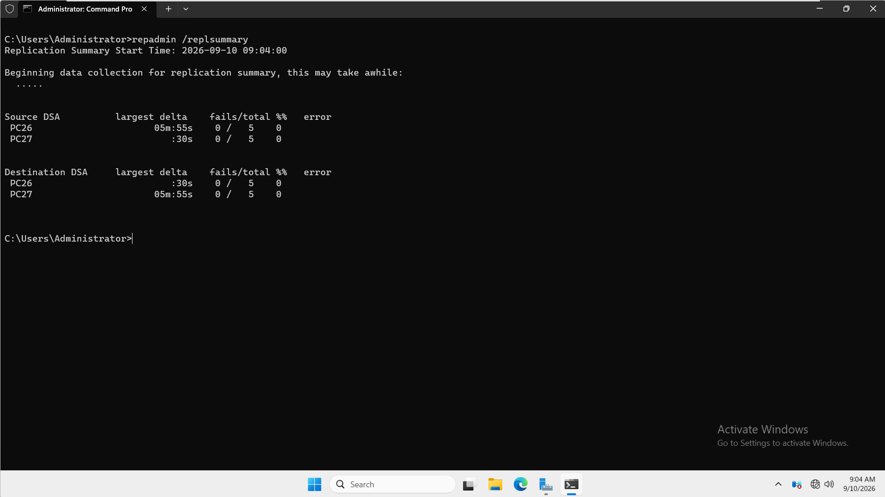

---

# 2. Hardening GPO Pilot Scope

A dedicated Group Policy Object was created:

`GPO - DC Disable Print Spooler`

The GPO was linked to:

`virexon.local/Domain Controllers`

During the pilot stage, Security Filtering was limited to:

`PC27$`

This ensured that the initial hardening configuration applied only to PC27 while PC26 remained outside the pilot scope.

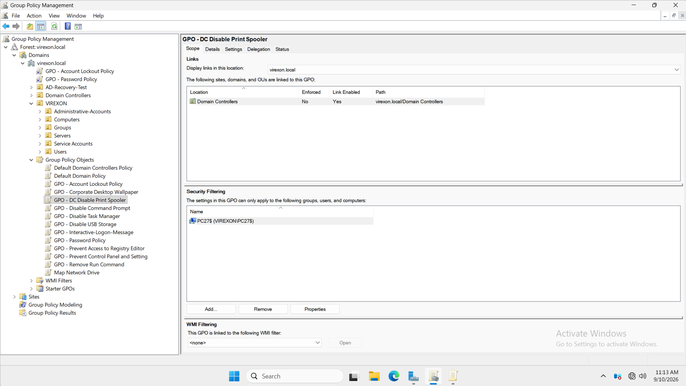

---

# 3. Security Options Configuration

The required Security Options were configured under:

`Computer Configuration → Policies → Windows Settings → Security Settings → Local Policies → Security Options`

The following policies were configured:

| Policy | Setting |
|---|---|
| Interactive logon: Don't display last signed-in | Enabled |
| Microsoft network client: Digitally sign communications (always) | Enabled |
| Microsoft network server: Digitally sign communications (always) | Enabled |
| Network security: LAN Manager authentication level | Send NTLMv2 response only. Refuse LM & NTLM |

### Interactive Logon Protection

The following policy was enabled:

`Interactive logon: Don't display last signed-in`

This prevents the previously signed-in username from being displayed on the Windows sign-in screen.

### SMB Client Signing

The following policy was enabled:

`Microsoft network client: Digitally sign communications (always)`

This requires SMB signing when the Domain Controller operates as an SMB client.

### SMB Server Signing

The following policy was enabled:

`Microsoft network server: Digitally sign communications (always)`

This requires SMB signing for SMB connections accepted by the Domain Controller.

### LAN Manager Authentication Level

The following value was configured:

`Send NTLMv2 response only. Refuse LM & NTLM`

This prevents the use of legacy LM and NTLM authentication while allowing NTLMv2.

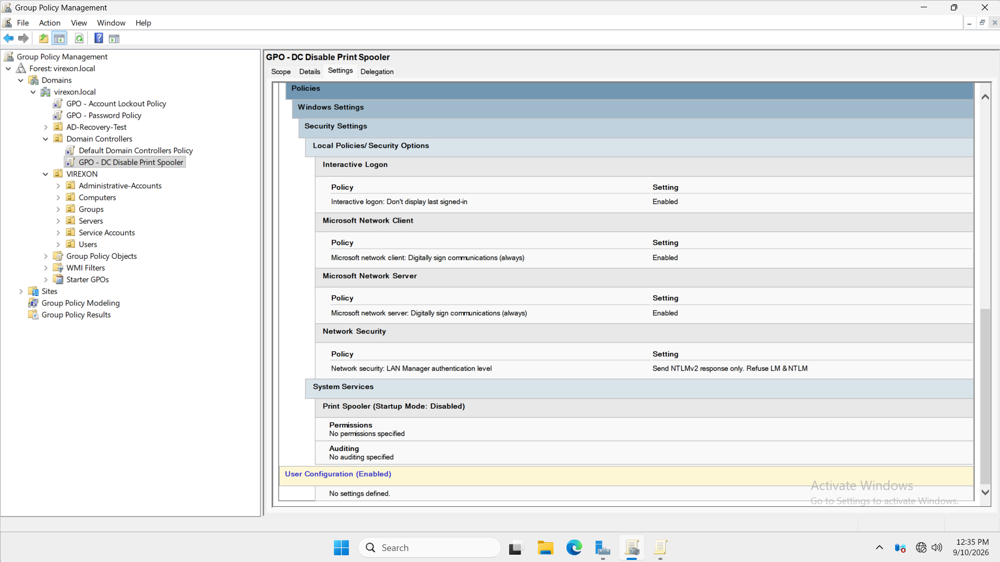

---

# 4. Print Spooler Service Hardening

The Print Spooler service was configured through:

`Computer Configuration → Policies → Windows Settings → Security Settings → System Services`

The following service was defined:

`Print Spooler`

The configured startup mode was:

`Disabled`

This reduced unnecessary service exposure on the Domain Controllers.

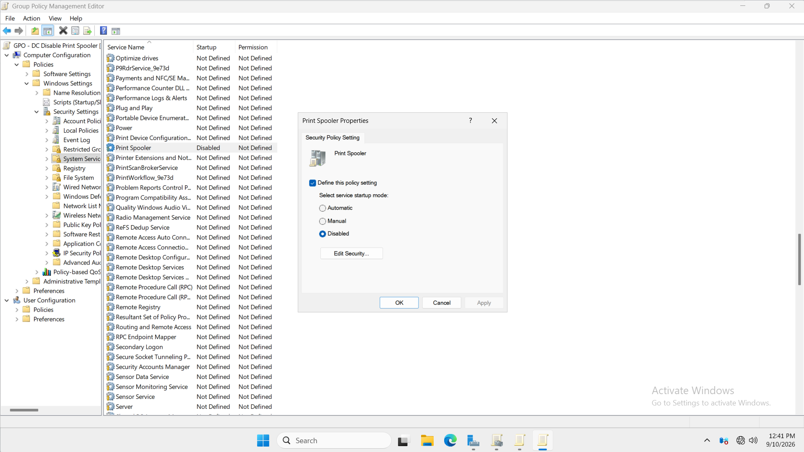

---

# PC27 Pilot Validation

## 5. PC27 Group Policy Application

After the hardening configuration was prepared, Group Policy was refreshed on PC27.

The applied computer policies were checked using:

```cmd
gpresult /r /scope computer
```

The result showed:

`GPO - DC Disable Print Spooler`

under:

`Applied Group Policy Objects`

This confirmed that the hardening GPO was successfully applied to PC27.

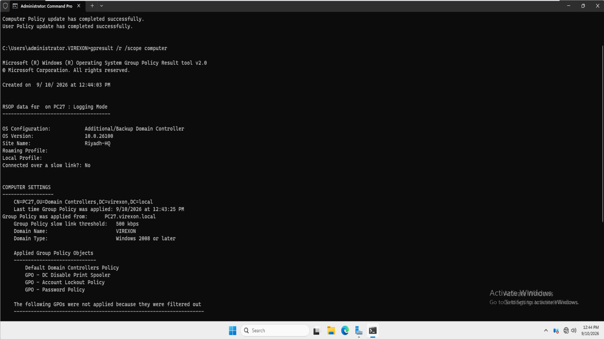

---

## 6. PC27 Print Spooler and SMB1 Verification

The Print Spooler startup configuration was checked using:

```cmd
sc qc spooler | findstr "START_TYPE"
```

The result showed:

```text
START_TYPE : 4 DISABLED
```

The Print Spooler service state was checked using:

```cmd
sc query spooler | findstr "STATE"
```

The result showed:

```text
STATE : 1 STOPPED
```

A manual attempt was then made to start the service:

```cmd
net start spooler
```

Windows returned:

```text
System error 1058 has occurred.
```

The system also reported that the service could not be started because it was disabled.

This confirmed the operational effect of the Print Spooler hardening policy.

SMB1 status was then checked using:

```cmd
dism /online /Get-FeatureInfo /FeatureName:SMB1Protocol
```

The result showed:

```text
State : Disabled
```

SMB1 was therefore confirmed to be disabled on PC27.

No SMB1 configuration change was required during this phase because the feature was already disabled.

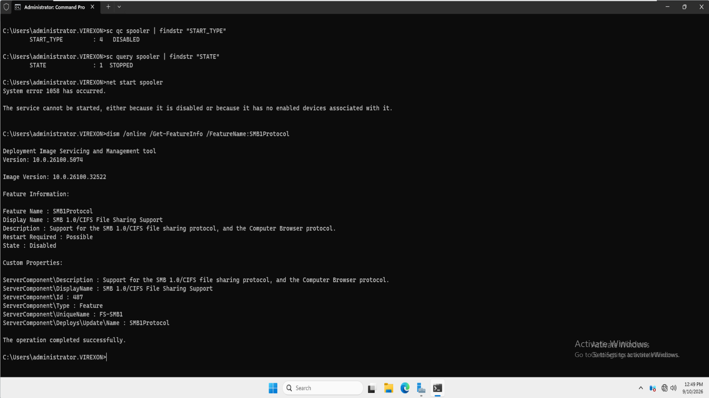

---

## 7. PC27 Sign-In Protection Verification

PC27 was signed out after the hardening GPO was applied.

The Windows sign-in screen displayed:

`Other user`

The username and password fields were empty, and the previously signed-in account was not displayed.

The screen also showed:

`Sign in to: VIREXON`

This verified the operational effect of:

`Interactive logon: Don't display last signed-in = Enabled`

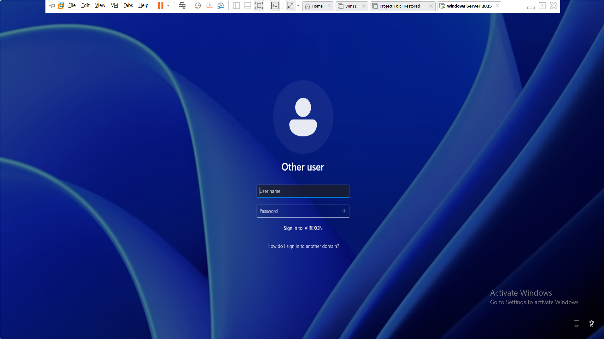

---

## 8. PC27 Pilot Active Directory Replication Health

After the hardening configuration had been applied and validated on PC27, Active Directory replication health was checked again.

The following command was used:

```cmd
repadmin /replsummary
```

The result showed:

- PC26 source: `0 / 5` failures.
- PC27 source: `0 / 5` failures.
- PC26 destination: `0 / 5` failures.
- PC27 destination: `0 / 5` failures.
- Replication failure percentage: `0%`.

This confirmed that the pilot hardening configuration did not disrupt Active Directory replication.

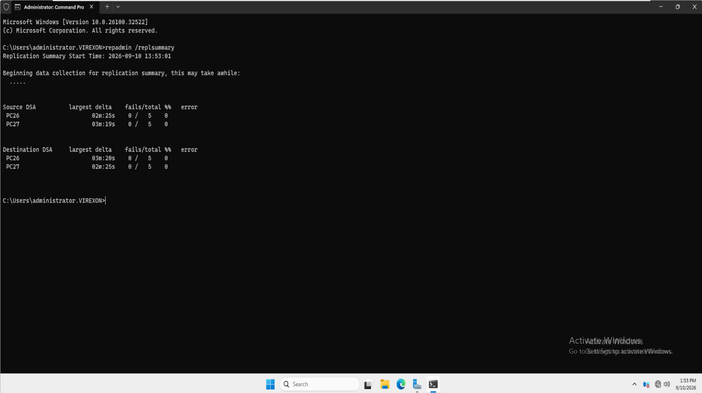

---

# Final GPO Deployment

## 9. Final Domain Controller Hardening Scope

After the PC27 pilot validation completed successfully, the GPO Security Filtering was expanded.

The final Security Filtering contained:

- `PC26$`
- `PC27$`

The GPO remained linked to:

`virexon.local/Domain Controllers`

This established the final intended scope for the hardening configuration.

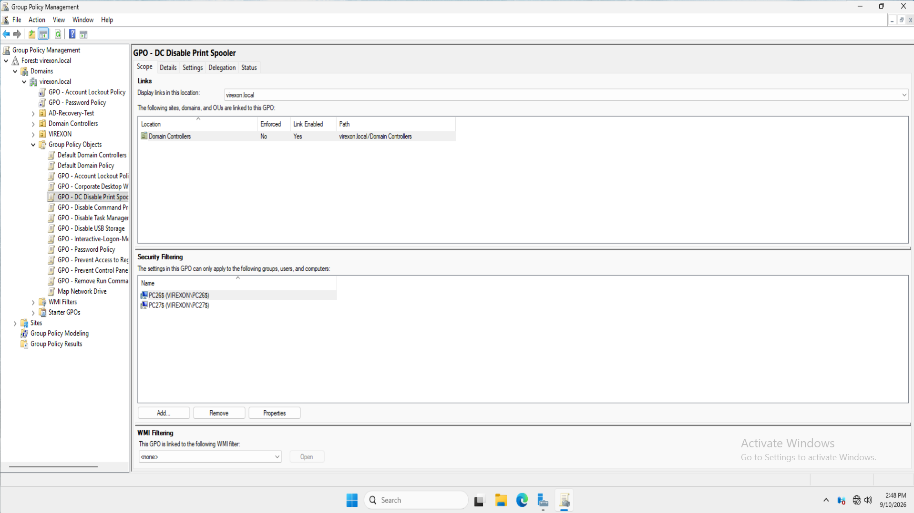

---

# PC26 Validation

## 10. PC26 Group Policy Application

Group Policy was refreshed on PC26.

The resulting computer policies were checked using:

```cmd
gpresult /r /scope computer
```

The result showed:

`GPO - DC Disable Print Spooler`

under:

`Applied Group Policy Objects`

This confirmed that the hardening GPO was successfully applied to PC26.

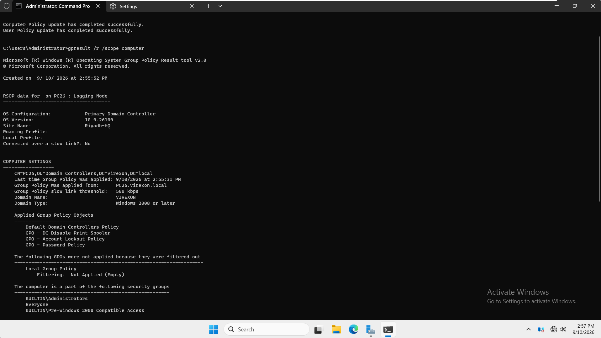

---

## 11. PC26 Print Spooler and SMB1 Verification

The Print Spooler startup configuration was checked using:

```cmd
sc qc spooler | findstr "START_TYPE"
```

The result showed:

```text
START_TYPE : 4 DISABLED
```

The service state was checked using:

```cmd
sc query spooler | findstr "STATE"
```

The result showed:

```text
STATE : 1 STOPPED
```

A manual attempt was then made to start the Print Spooler service:

```cmd
net start spooler
```

Windows returned:

```text
System error 1058 has occurred.
```

The service could not be started because it was disabled.

SMB1 status was also checked using:

```cmd
dism /online /Get-FeatureInfo /FeatureName:SMB1Protocol
```

The result showed:

```text
State : Disabled
```

SMB1 was therefore confirmed to be disabled on PC26.

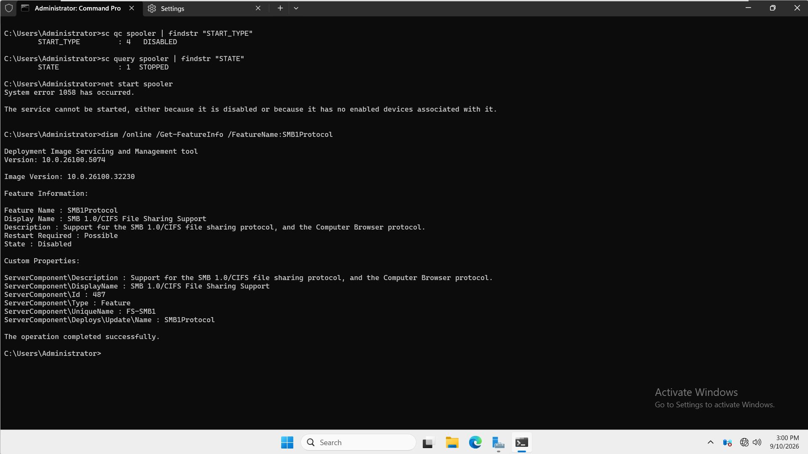

---

## 12. PC26 Sign-In Protection Verification

PC26 was signed out after the hardening GPO was applied.

The Windows sign-in screen displayed:

`Other user`

The previously signed-in username was not displayed.

The sign-in interface required the username and password to be entered manually and showed:

`Sign in to: VIREXON`

This confirmed that the interactive sign-in protection setting was successfully applied to PC26.

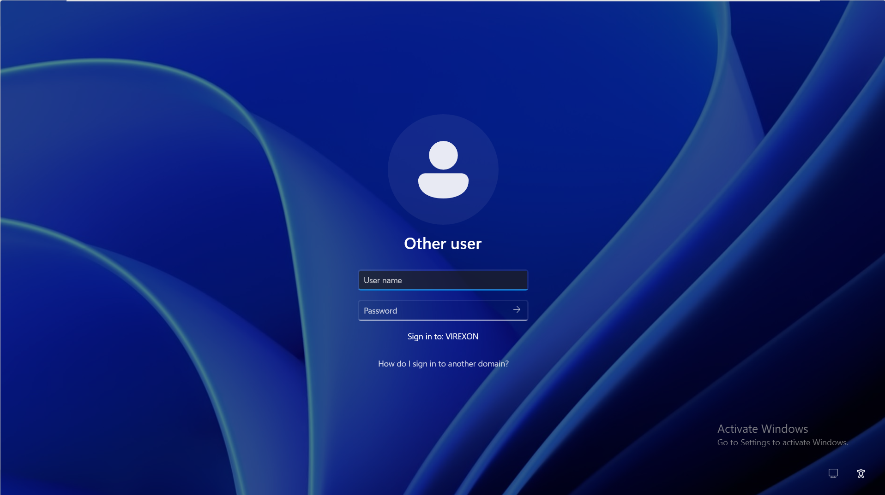

---

# Client Service Continuity Validation

## 13. DNS and DHCP Verification from PC-IT-01

After the hardening configuration had been applied to both Domain Controllers, PC-IT-01 was used to verify that DNS and DHCP continued to operate.

The network configuration showed:

```text
Connection-specific DNS Suffix : virexon.local
DHCP Enabled                   : Yes
IPv4 Address                   : 192.168.1.50
Subnet Mask                    : 255.255.255.0
DHCP Server                    : 192.168.1.2
DNS Servers                    : 192.168.1.2
                                 192.168.1.3
```

The client retained its DHCP reservation:

`192.168.1.50`

DNS resolution was tested using:

```cmd
nslookup virexon.local
```

The query was answered by:

`PC26.virexon.local`

at:

`192.168.1.2`

The `virexon.local` domain name successfully resolved to:

- `192.168.1.3`
- `192.168.1.2`

This confirmed continued DNS and DHCP functionality after the Domain Controller hardening changes.

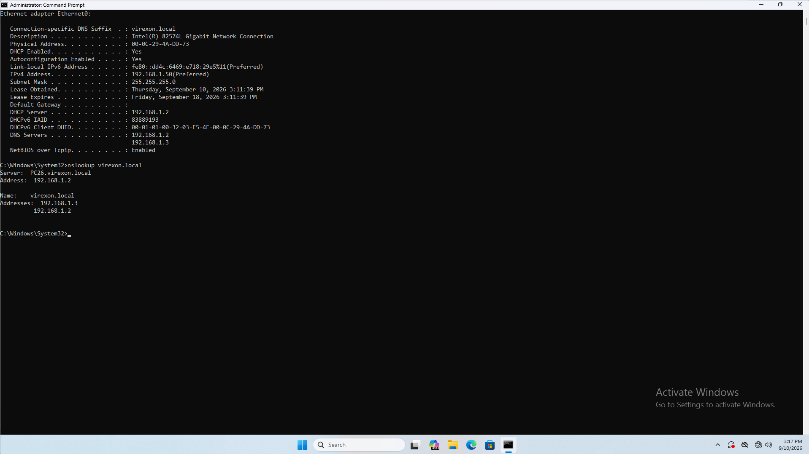

---

## 14. File Access and Client GPO Verification

PC-IT-01 was then used to confirm continued departmental file access.

The client successfully accessed:

`\\192.168.1.2\Departments\IT`

The IT department folder contents remained visible and accessible.

Computer Group Policy results were checked using:

```cmd
gpresult /r /scope computer
```

The output confirmed that PC-IT-01 continued to receive its normal computer policies.

The Domain Controller hardening GPO:

`GPO - DC Disable Print Spooler`

was not listed under the client's:

`Applied Group Policy Objects`

This verified that the hardening GPO remained limited to the intended Domain Controllers and did not apply to PC-IT-01.

The successful file access also demonstrated that the implemented SMB-related hardening settings did not prevent the existing departmental file access scenario from functioning.

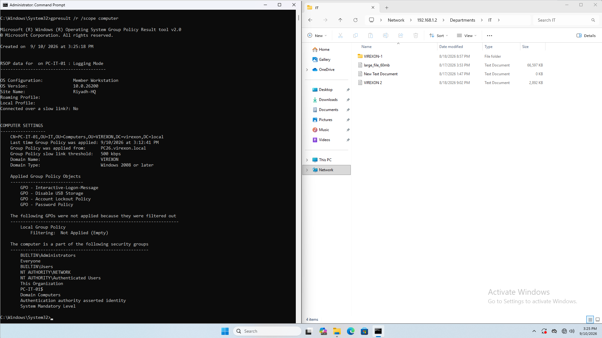

---

## 15. RSAT Remote Active Directory Administration Verification

Remote Active Directory administration was validated from PC-IT-01 using:

`Active Directory Users and Computers`

The console successfully connected to:

`PC26.virexon.local`

The `virexon.local` directory structure was successfully displayed.

The VIREXON Organizational Unit structure remained accessible, including:

- Administrative-Accounts
- Computers
- Groups
- Servers
- Service Accounts
- Users

The `Administrative-Accounts` OU was opened successfully, and the administrative accounts were visible.

This confirmed that RSAT-based Active Directory administration remained operational after the Domain Controller hardening configuration was applied.

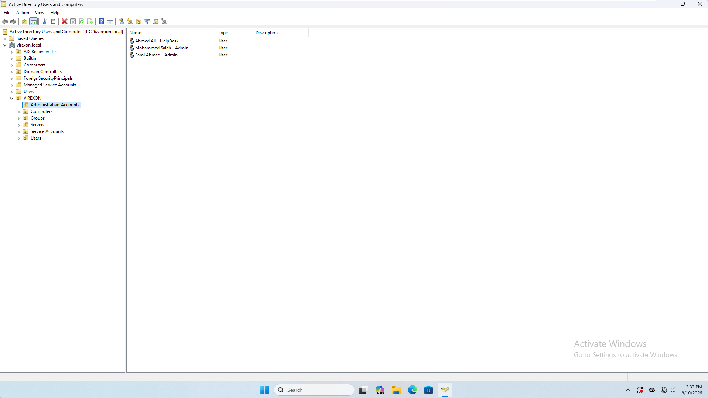

---

# 16. Final Domain Controller Services and Replication Health

A final health validation was performed after the hardening configuration had been applied to both Domain Controllers.

## PC26 Service Verification

The following services were checked locally on PC26:

```cmd
sc query ntds | findstr "STATE"
sc query dns | findstr "STATE"
sc query netlogon | findstr "STATE"
sc query dfsr | findstr "STATE"
```

The results showed:

```text
NTDS      : RUNNING
DNS       : RUNNING
Netlogon  : RUNNING
DFSR      : RUNNING
```

---

## PC27 Remote Service Verification

The same critical services were checked remotely on PC27 from PC26:

```cmd
sc \\PC27 query ntds | findstr "STATE"
sc \\PC27 query dns | findstr "STATE"
sc \\PC27 query netlogon | findstr "STATE"
sc \\PC27 query dfsr | findstr "STATE"
```

The results showed:

```text
NTDS      : RUNNING
DNS       : RUNNING
Netlogon  : RUNNING
DFSR      : RUNNING
```

This confirmed that all four validated Domain Controller services were running on both servers.

---

## Final Active Directory Replication Verification

Active Directory replication health was checked one final time using:

```cmd
repadmin /replsummary
```

The final replication results showed:

| Direction | Domain Controller | Result |
|---|---|---|
| Source | PC26 | `0 / 5` failures |
| Source | PC27 | `0 / 5` failures |
| Destination | PC26 | `0 / 5` failures |
| Destination | PC27 | `0 / 5` failures |

The replication failure percentage remained:

`0%`

This confirmed that the Domain Controllers remained synchronized after the complete hardening deployment.

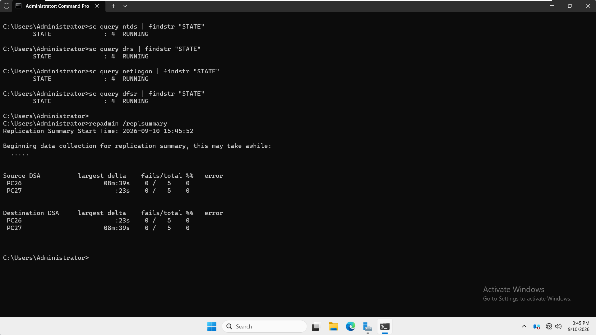

---

# Final Configuration Summary

| Security Control | Final Result |
|---|---|
| Hardening GPO | Implemented |
| GPO Link | `Domain Controllers` OU |
| Pilot Target | PC27 |
| Final Targets | PC26 and PC27 |
| Interactive logon: Don't display last signed-in | Enabled |
| Microsoft network client: Digitally sign communications (always) | Enabled |
| Microsoft network server: Digitally sign communications (always) | Enabled |
| LAN Manager authentication level | Send NTLMv2 response only. Refuse LM & NTLM |
| Print Spooler startup mode | Disabled |
| Print Spooler service state | Stopped |
| Manual Print Spooler start | Blocked with System error 1058 |
| SMB1 on PC27 | Disabled |
| SMB1 on PC26 | Disabled |
| PC27 pilot replication | 0 failures |
| PC26 policy application | Successful |
| PC27 policy application | Successful |
| PC-IT-01 DHCP reservation | `192.168.1.50` |
| DHCP service continuity | Verified |
| DNS service continuity | Verified |
| File access | Verified |
| PC-IT-01 excluded from DC hardening GPO | Verified |
| RSAT Active Directory administration | Verified |
| NTDS on PC26 and PC27 | Running |
| DNS on PC26 and PC27 | Running |
| Netlogon on PC26 and PC27 | Running |
| DFSR on PC26 and PC27 | Running |
| Final AD replication | 0 failures |

---

# Evidence Summary

| # | Screenshot | Evidence |
|---|---|---|
| 01 | [01-Pre-Hardening-AD-Replication-Health.png](Screenshots/01-Pre-Hardening-AD-Replication-Health.png) | Confirms healthy Active Directory replication before the hardening changes. |
| 02 | [02-DC-Hardening-GPO-Pilot-Scope.png](Screenshots/02-DC-Hardening-GPO-Pilot-Scope.png) | Shows the hardening GPO linked to the Domain Controllers OU and initially filtered to PC27. |
| 03 | [03-DC-Hardening-Security-Options.png](Screenshots/03-DC-Hardening-Security-Options.png) | Shows the four configured Security Options. |
| 04 | [04-DC-Hardening-Print-Spooler-Policy.png](Screenshots/04-DC-Hardening-Print-Spooler-Policy.png) | Shows the Print Spooler service explicitly configured with Disabled startup mode. |
| 05 | [05-PC27-Hardening-Policy-Result.png](Screenshots/05-PC27-Hardening-Policy-Result.png) | Confirms the hardening GPO was successfully applied to PC27. |
| 06 | [06-PC27-Service-and-SMB1-Verification.png](Screenshots/06-PC27-Service-and-SMB1-Verification.png) | Confirms the Print Spooler is disabled and stopped, manual startup is blocked, and SMB1 is disabled on PC27. |
| 07 | [07-PC27-Sign-In-Protection-Verification.png](Screenshots/07-PC27-Sign-In-Protection-Verification.png) | Confirms that the previously signed-in user is not displayed on PC27. |
| 08 | [08-PC27-Pilot-AD-Replication-Health.png](Screenshots/08-PC27-Pilot-AD-Replication-Health.png) | Confirms healthy Active Directory replication after the PC27 pilot deployment. |
| 09 | [09-DC-Hardening-GPO-Final-Scope.png](Screenshots/09-DC-Hardening-GPO-Final-Scope.png) | Shows the final GPO Security Filtering containing both PC26 and PC27. |
| 10 | [10-PC26-Hardening-Policy-Result.png](Screenshots/10-PC26-Hardening-Policy-Result.png) | Confirms the hardening GPO was successfully applied to PC26. |
| 11 | [11-PC26-Service-and-SMB1-Verification.png](Screenshots/11-PC26-Service-and-SMB1-Verification.png) | Confirms the Print Spooler is disabled and stopped, manual startup is blocked, and SMB1 is disabled on PC26. |
| 12 | [12-PC26-Sign-In-Protection-Verification.png](Screenshots/12-PC26-Sign-In-Protection-Verification.png) | Confirms that the previously signed-in user is not displayed on PC26. |
| 13 | [13-Client-DNS-and-DHCP-Verification.png](Screenshots/13-Client-DNS-and-DHCP-Verification.png) | Confirms continued DHCP and DNS operation from PC-IT-01. |
| 14 | [14-Client-File-Access-and-GPO-Verification.png](Screenshots/14-Client-File-Access-and-GPO-Verification.png) | Confirms continued departmental file access and verifies that the Domain Controller hardening GPO does not apply to PC-IT-01. |
| 15 | [15-RSAT-Remote-AD-Administration-Verification.png](Screenshots/15-RSAT-Remote-AD-Administration-Verification.png) | Confirms continued remote Active Directory administration through RSAT. |
| 16 | [16-Final-DC-Services-and-Replication-Health.png](Screenshots/16-Final-DC-Services-and-Replication-Health.png) | Confirms that critical services are running on both Domain Controllers and final Active Directory replication has zero failures. |

---

# Validation Commands

The primary commands used during validation were:

```cmd
repadmin /replsummary
```

```cmd
gpresult /r /scope computer
```

```cmd
sc qc spooler | findstr "START_TYPE"
sc query spooler | findstr "STATE"
net start spooler
```

```cmd
dism /online /Get-FeatureInfo /FeatureName:SMB1Protocol
```

```cmd
nslookup virexon.local
```

```cmd
sc query ntds | findstr "STATE"
sc query dns | findstr "STATE"
sc query netlogon | findstr "STATE"
sc query dfsr | findstr "STATE"
```

```cmd
sc \\PC27 query ntds | findstr "STATE"
sc \\PC27 query dns | findstr "STATE"
sc \\PC27 query netlogon | findstr "STATE"
sc \\PC27 query dfsr | findstr "STATE"
```

---

# Rollback Considerations

The implemented hardening settings were contained within a dedicated GPO rather than being added directly to the default Domain Controller policies.

This provides a controlled rollback path if one of the implemented security settings causes an operational issue.

The appropriate rollback process would be:

1. Identify the specific hardening setting causing the issue.
2. Modify or revert that setting within the dedicated GPO.
3. Refresh Group Policy on the affected Domain Controller.
4. Revalidate the affected service or function.
5. Confirm Active Directory replication health.
6. Confirm that the remaining infrastructure services continue to operate normally.

The pilot-first deployment further reduced change risk because PC27 was validated before PC26 was added to the final GPO scope.

SMB1 was verified as disabled during this phase and was not modified because it was already disabled on both Domain Controllers.

---

# Results

The security hardening deployment completed successfully.

The implementation achieved the following:

- A dedicated Domain Controller hardening GPO was deployed.
- PC27 was successfully used as the pilot Domain Controller.
- The policy was later extended to PC26.
- SMB signing was required for SMB client and server communication.
- NTLMv2 was required while LM and NTLM were refused.
- The previously signed-in username was hidden from the Windows sign-in screen.
- The Print Spooler service was disabled and stopped on both Domain Controllers.
- Attempts to manually start the disabled Print Spooler service were blocked.
- SMB1 was verified as disabled on both Domain Controllers.
- Active Directory replication remained healthy during the pilot deployment.
- Active Directory replication remained healthy after the final deployment.
- DNS continued to function.
- DHCP continued to function.
- PC-IT-01 retained its reserved IP address.
- Departmental file access continued to work.
- PC-IT-01 remained outside the Domain Controller hardening GPO scope.
- RSAT-based Active Directory administration remained functional.
- NTDS, DNS, Netlogon, and DFSR remained running on both Domain Controllers.
- Final Active Directory replication showed zero failures.

---

# Conclusion

Phase 16 successfully implemented and validated a controlled security hardening configuration for the VIREXON Domain Controllers.

The deployment used a staged change-management approach. PC27 was hardened and validated first before the same configuration was extended to PC26. This reduced deployment risk and provided a clear validation point before the hardening configuration was applied to both Domain Controllers.

The implemented controls strengthened SMB communication, restricted legacy authentication, protected interactive sign-in information, and reduced service attack surface by disabling the Print Spooler.

SMB1 was also verified as disabled on both Domain Controllers.

The post-hardening validation confirmed that the security changes did not disrupt the existing VIREXON infrastructure. DNS, DHCP, departmental file access, Group Policy processing, RSAT administration, Active Directory Domain Services, DNS Server, Netlogon, DFS Replication, and Active Directory replication all remained operational.

The final Active Directory replication check reported zero failures for both PC26 and PC27.

**Phase 16 — Security / Server Hardening: Completed.**
