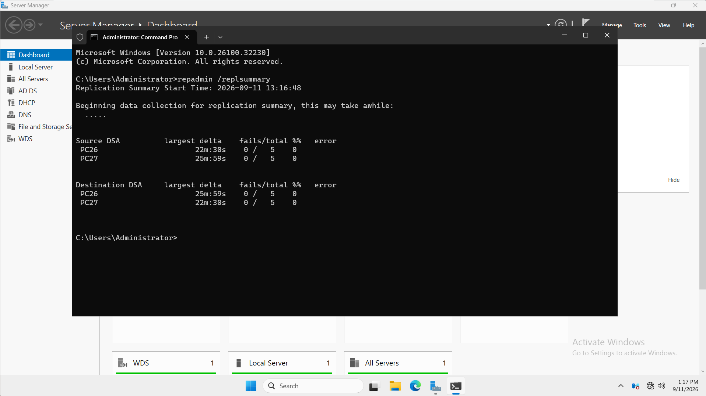
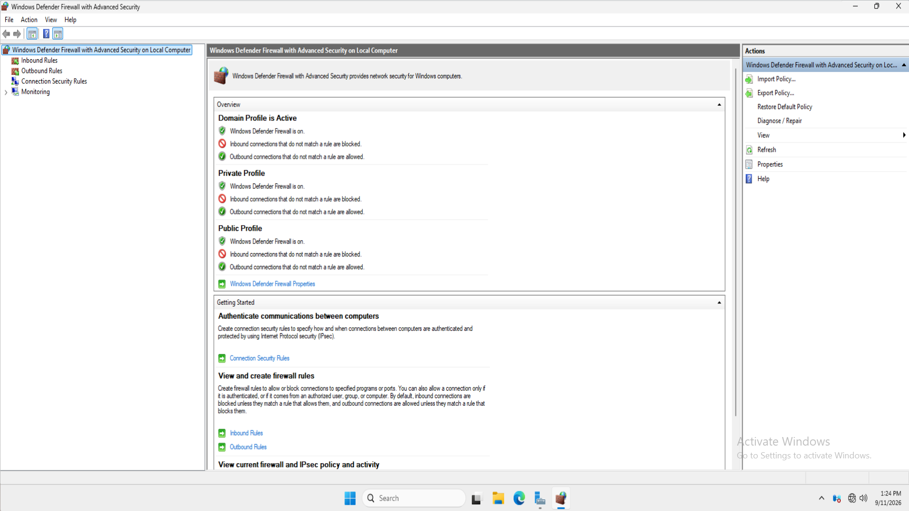
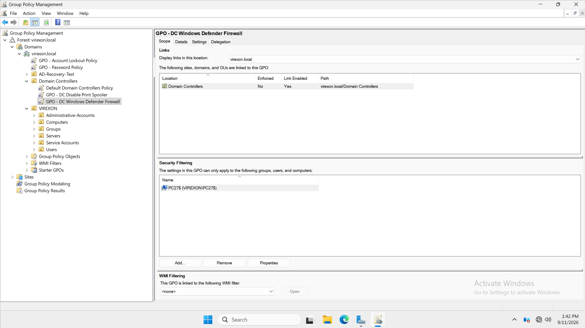
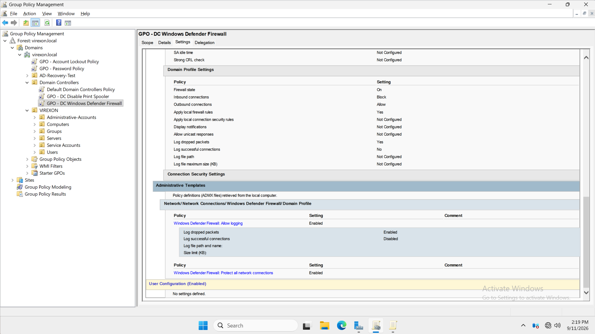
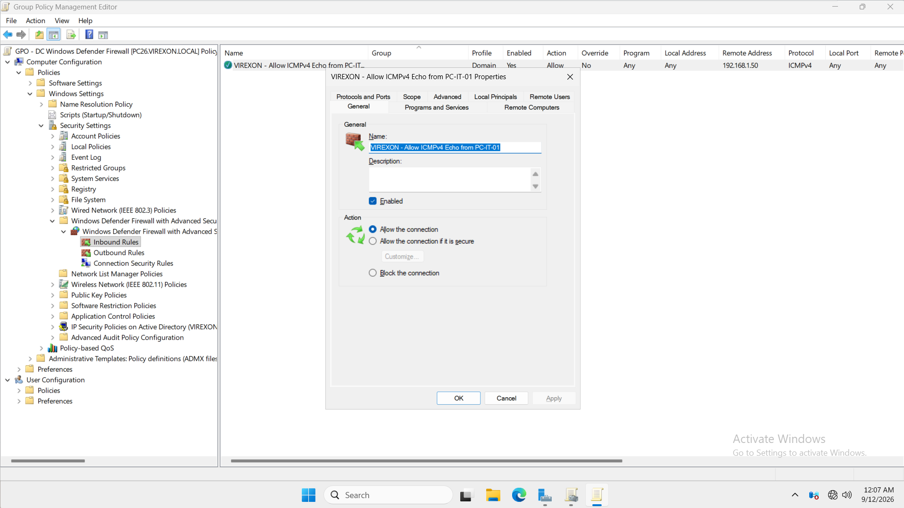
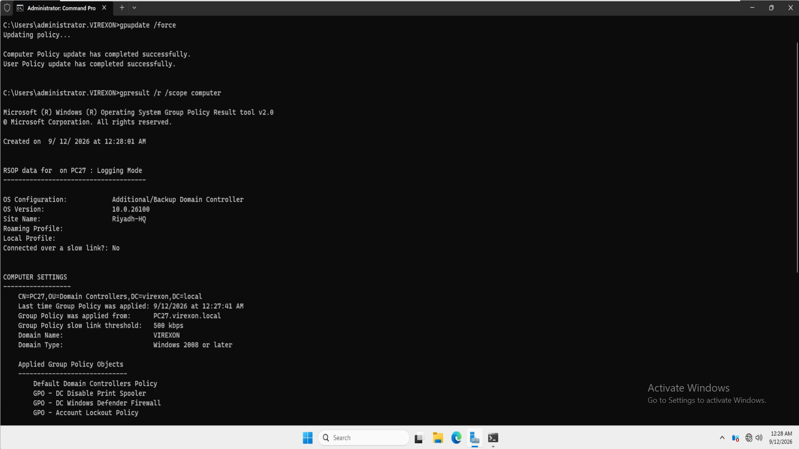
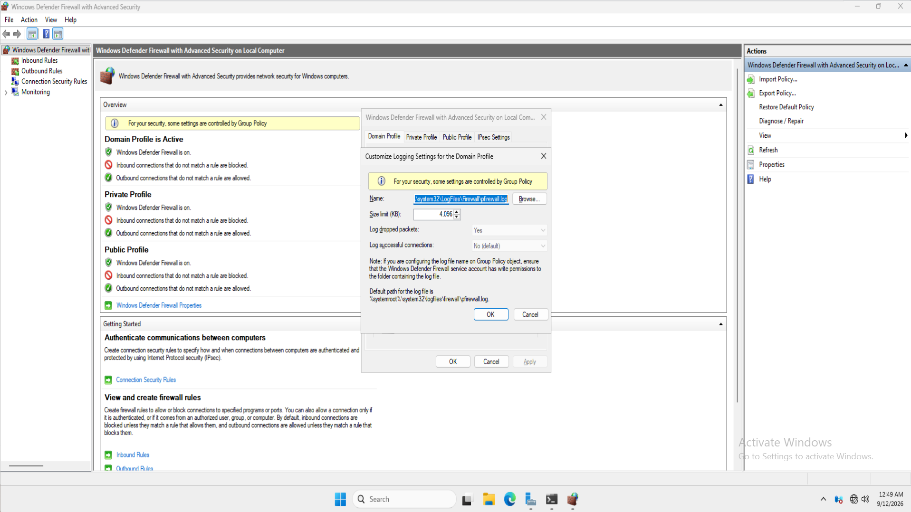
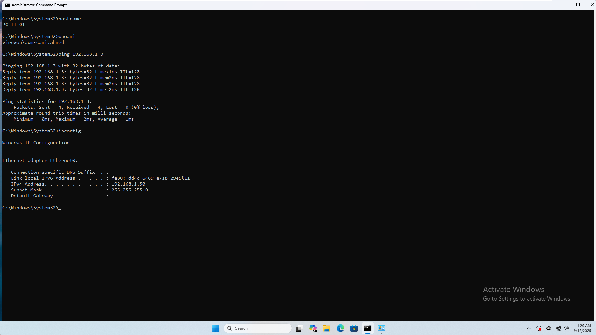
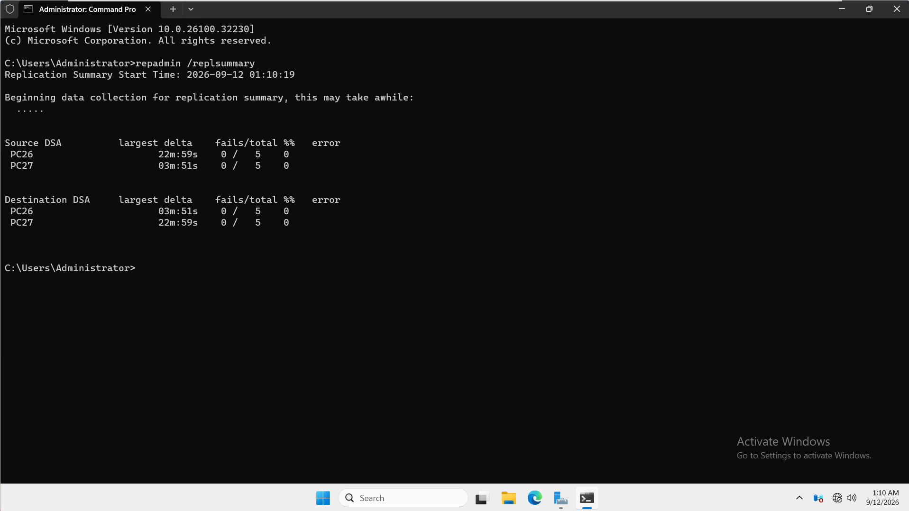

# 17 — Windows Defender Firewall

## Overview

This phase implemented centralized Windows Defender Firewall management for the VIREXON Domain Controller environment through Group Policy.

A dedicated firewall GPO was created and deployed using a controlled pilot approach. The policy was linked to the Domain Controllers OU but initially scoped only to **PC27**, allowing the firewall configuration to be validated without immediately affecting both Domain Controllers.

The implementation focused on enforcing the required Domain Profile configuration, preserving existing Windows firewall rules, enabling dropped-packet logging, and creating a restricted management ICMP rule for the designated IT workstation.

The phase was intentionally completed as a **pilot implementation on PC27**. Full deployment to PC26 and advanced blocked-port validation were deferred for future firewall study and testing.

---

## Environment

| Component | Details |
|---|---|
| Domain | `virexon.local` |
| Active Directory Site | `Riyadh-HQ` |
| Network | `192.168.1.0/24` |
| Primary Domain Controller | `PC26.virexon.local` |
| PC26 IP Address | `192.168.1.2` |
| Additional Domain Controller | `PC27.virexon.local` |
| PC27 IP Address | `192.168.1.3` |
| Management Workstation | `PC-IT-01` |
| PC-IT-01 Reserved IP | `192.168.1.50` |
| Firewall Management | Group Policy |
| Pilot Target | `PC27` |

---

## Business Requirement

VIREXON required centralized Windows Defender Firewall management for its Domain Controllers.

The implementation needed to:

- Keep Windows Defender Firewall enabled.
- Centrally enforce the Domain firewall profile.
- Block unsolicited inbound traffic by default.
- Allow outbound traffic by default.
- Preserve legitimate existing Windows and server-role firewall rules.
- Provide a controlled management exception for ICMP testing.
- Enable dropped-packet logging.
- Use a pilot deployment before broader firewall rollout.
- Maintain Active Directory replication after the firewall policy was applied.

---

## Technical Objectives

The following objectives were implemented:

- Create a dedicated firewall GPO.
- Link the GPO to the Domain Controllers OU.
- Restrict the initial deployment to PC27.
- Configure the Domain Profile.
- Keep Windows Defender Firewall enabled.
- Configure default inbound traffic as blocked.
- Configure default outbound traffic as allowed.
- Preserve local firewall rule merging.
- Enable logging for dropped packets.
- Disable logging for successful connections.
- Create a restricted ICMPv4 management rule.
- Allow ICMP Echo Requests from `PC-IT-01`.
- Apply and verify the GPO on PC27.
- Validate management connectivity.
- Confirm Active Directory replication remained healthy.

---

## Pre-Change Validation

Before changing the firewall configuration, Active Directory replication was checked using:

```cmd
repadmin /replsummary
```

Both Domain Controllers reported:

- `0 / 5` replication failures as Source DSAs.
- `0 / 5` replication failures as Destination DSAs.
- `0%` replication error rate.

This provided a healthy replication baseline before the firewall policy was introduced.



---

## PC27 Firewall Baseline

The local Windows Defender Firewall console on PC27 was reviewed before the new GPO was configured.

The active firewall profile was:

**Domain Profile**

The existing state already showed:

- Windows Defender Firewall: **On**
- Unmatched inbound connections: **Blocked**
- Unmatched outbound connections: **Allowed**

Because this behavior already existed before the new GPO, the purpose of the Phase 17 policy was to **centrally enforce and standardize** the required configuration rather than claim that these settings were enabled for the first time.



---

## Dedicated Firewall GPO

A new Group Policy Object was created:

```text
GPO - DC Windows Defender Firewall
```

The GPO was linked to:

```text
virexon.local
└── Domain Controllers
```

A controlled pilot deployment was used.

Initial Security Filtering contained only:

```text
PC27$
```

PC26 was intentionally excluded from the pilot policy.

This prevented the firewall configuration from being introduced to both Domain Controllers simultaneously.



---

## Domain Profile Configuration

The following Windows Defender Firewall Domain Profile configuration was defined through Group Policy:

| Setting | Configuration |
|---|---|
| Firewall State | On |
| Inbound Connections | Block |
| Outbound Connections | Allow |
| Apply Local Firewall Rules | Yes |
| Log Dropped Packets | Yes |
| Log Successful Connections | No |

Private and Public firewall profiles were not configured by this GPO.

The existing Windows and server-role firewall rules were preserved by allowing local firewall rule merging.

This was important because the Domain Controllers already depended on legitimate Windows firewall rules associated with services such as Active Directory Domain Services, DNS, SMB, RPC, DFSR, and other Windows infrastructure components.

No attempt was made to manually recreate the complete Active Directory firewall rule set.



---

## Management ICMP Rule

One dedicated inbound management rule was created:

```text
VIREXON - Allow ICMPv4 Echo from PC-IT-01
```

The rule was configured with the following scope:

| Setting | Value |
|---|---|
| Direction | Inbound |
| Action | Allow the connection |
| Protocol | ICMPv4 |
| ICMP Type | Echo Request |
| Local Address | Any |
| Remote Address | `192.168.1.50` |
| Profile | Domain |
| Enabled | Yes |

The purpose of the rule was to allow controlled ICMP reachability testing from the designated management workstation rather than enabling unrestricted ping access from any source.

The configured source address corresponds to:

```text
PC-IT-01
192.168.1.50
```



---

## Pilot Policy Application

The policy was refreshed on PC27 using:

```cmd
gpupdate /force
```

The update completed successfully.

The effective computer policies were then reviewed using:

```cmd
gpresult /r /scope computer
```

The following GPO appeared under **Applied Group Policy Objects**:

```text
GPO - DC Windows Defender Firewall
```

This confirmed that the pilot firewall policy had been successfully applied to PC27.



---

## Effective Firewall State

The effective Windows Defender Firewall configuration was reviewed locally on PC27 after Group Policy application.

The Domain Profile was active and showed:

- Windows Defender Firewall enabled.
- Unmatched inbound traffic blocked.
- Unmatched outbound traffic allowed.
- Firewall configuration controlled through Group Policy.
- Dropped packet logging enabled.
- Successful connection logging disabled.
- Standard Windows firewall log location retained.

The effective local configuration therefore matched the intended pilot policy.



---

## Management Connectivity Validation

Management connectivity was tested from:

```text
PC-IT-01
```

The workstation was using:

```text
IPv4 Address: 192.168.1.50
Subnet Mask: 255.255.255.0
```

ICMP connectivity was then tested to:

```text
PC27
192.168.1.3
```

The test completed successfully:

```text
Packets: Sent = 4, Received = 4, Lost = 0
0% packet loss
```

This confirmed that ICMP connectivity from the designated management workstation remained operational after the firewall GPO was applied.

Because local Windows firewall rule merging remained enabled, this validation confirms successful management connectivity from the approved workstation but does not claim that the custom rule was necessarily the only rule capable of permitting ICMP traffic.



---

## Post-Change Active Directory Validation

After the firewall policy was applied to PC27, Active Directory replication was checked again using:

```cmd
repadmin /replsummary
```

The final result showed:

### Source DSA

| Domain Controller | Failures | Error Rate |
|---|---:|---:|
| PC26 | 0 / 5 | 0% |
| PC27 | 0 / 5 | 0% |

### Destination DSA

| Domain Controller | Failures | Error Rate |
|---|---:|---:|
| PC26 | 0 / 5 | 0% |
| PC27 | 0 / 5 | 0% |

No replication failures were present after the firewall pilot deployment.

This confirmed that the PC27 firewall configuration did not disrupt Active Directory replication.



---

## Validation Summary

| Validation | Result |
|---|---|
| Pre-change AD replication healthy | Passed |
| Domain Profile identified on PC27 | Passed |
| Dedicated firewall GPO created | Passed |
| Pilot scope limited to PC27 | Passed |
| Firewall state centrally configured | Passed |
| Default inbound traffic configured as Block | Passed |
| Default outbound traffic configured as Allow | Passed |
| Local firewall rule merging preserved | Passed |
| Dropped-packet logging configured | Passed |
| Successful connection logging disabled | Passed |
| Restricted ICMPv4 management rule created | Passed |
| GPO successfully applied to PC27 | Passed |
| Effective firewall state verified | Passed |
| PC-IT-01 management connectivity verified | Passed |
| Post-change AD replication healthy | Passed |

---

## Scope Decision

The original design considered a broader two-Domain-Controller firewall rollout and additional negative traffic testing.

During implementation, the phase was intentionally concluded as a **controlled firewall pilot on PC27**.

The following items were therefore not implemented in this phase:

- Firewall GPO deployment to PC26.
- Full two-Domain-Controller firewall rollout.
- Controlled unused TCP port DROP validation.
- Advanced firewall log analysis using generated blocked TCP traffic.
- Final DHCP, DNS, SMB, SYSVOL, and RSAT validation after a two-DC deployment.
- IPsec or Connection Security Rules.
- Advanced firewall troubleshooting.

These items are not claimed as completed.

The pilot configuration remains isolated to PC27 through Security Filtering.

---

## Design Considerations

The implementation deliberately avoided aggressive firewall restrictions.

The following actions were not performed:

- Windows Defender Firewall was not disabled.
- The Windows Defender Firewall service was not stopped.
- Default outbound traffic was not changed to Block.
- `Block all connections` was not configured.
- Existing Windows server-role rules were not disabled.
- Active Directory service ports were not manually recreated.
- Dynamic RPC restrictions were not introduced.
- IPsec was not configured.
- Connection Security Rules were not configured.

This approach reduced the risk of disrupting the existing Active Directory infrastructure while still demonstrating centralized Windows Defender Firewall administration through Group Policy.

---

## Rollback Strategy

Because the firewall configuration uses an independent GPO:

```text
GPO - DC Windows Defender Firewall
```

rollback can be performed without modifying the Default Domain Policy or Default Domain Controllers Policy.

If the PC27 pilot causes an infrastructure problem, the intended rollback process is:

1. Remove PC27 from the Phase 17 GPO Security Filtering or temporarily disable the GPO link.
2. Refresh Group Policy on PC27.
3. Verify the affected service.
4. Verify the Domain firewall profile.
5. Verify Active Directory replication.
6. Identify the specific firewall configuration responsible before introducing any new exception.

Stopping the Windows Defender Firewall service is not considered an appropriate rollback method.

---

## Evidence

The following screenshots document this phase:

1. `01-Pre-Firewall-AD-Replication-Health.png`
   - Healthy Active Directory replication before firewall changes.

2. `02-Pre-Firewall-PC27-Profile-State.png`
   - Baseline Windows Defender Firewall state on PC27.

3. `03-DC-Firewall-GPO-Pilot-Scope.png`
   - Dedicated firewall GPO linked to the Domain Controllers OU and scoped only to PC27.

4. `04-DC-Firewall-Profile-Configuration.png`
   - Domain Profile configuration, rule merging, and logging settings.

5. `05-DC-Firewall-Management-ICMP-Rule.png`
   - Dedicated ICMPv4 management rule for PC-IT-01.

6. `06-PC27-Firewall-Policy-Result.png`
   - Group Policy result confirming the firewall GPO was applied to PC27.

7. `07-PC27-Firewall-Effective-State.png`
   - Effective PC27 Domain Profile and firewall logging configuration.

8. `08-PC27-Management-ICMP-Verification.png`
   - Successful ICMP management connectivity from PC-IT-01 to PC27.

9. `09-PC27-Post-Firewall-AD-Replication-Health.png`
   - Healthy Active Directory replication after the firewall pilot.

---

## Outcome

Phase 17 successfully introduced centralized Windows Defender Firewall management into the VIREXON lab using a controlled pilot deployment.

The dedicated Group Policy:

```text
GPO - DC Windows Defender Firewall
```

was successfully applied to PC27.

The Domain Profile was centrally standardized with:

- Firewall enabled.
- Default inbound traffic blocked.
- Default outbound traffic allowed.
- Existing local firewall rules preserved.
- Dropped-packet logging enabled.
- Successful connection logging disabled.

A restricted ICMPv4 management rule was created for the designated management workstation at `192.168.1.50`.

Management connectivity from PC-IT-01 to PC27 remained operational, and Active Directory replication remained healthy with **0 failures** after the firewall policy was applied.

The phase was intentionally closed as a **successful controlled pilot implementation** rather than a full production-style rollout to both Domain Controllers.

---

## Conclusion

The VIREXON environment now includes a documented Windows Defender Firewall pilot managed through Group Policy.

This phase demonstrated:

- Centralized firewall administration.
- Domain Profile management.
- Safe pilot deployment.
- Security Filtering.
- Default inbound and outbound firewall behavior.
- Local firewall rule preservation.
- Firewall logging configuration.
- Scoped inbound rule creation.
- Management connectivity validation.
- Post-change Active Directory health validation.

The configuration was introduced without disrupting Active Directory replication, and the broader firewall rollout was intentionally deferred until further firewall knowledge and testing are completed.

**Phase 17 — Windows Defender Firewall: Completed as Controlled Pilot Deployment.**
