# Phase 18 — Advanced Auditing

## Overview

This phase implements a controlled Windows Server auditing configuration for the VIREXON Active Directory environment.

The objective was not to build a complete SOC, SIEM, or enterprise-wide security monitoring platform. Instead, the phase focused on practical auditing capabilities expected from a Windows System Administrator:

- Centrally configuring selected Advanced Audit Policy subcategories through Group Policy.
- Verifying the effective audit policy on the target Domain Controllers.
- Generating controlled Active Directory account-management activity.
- Validating Security events through Event Viewer.
- Using a pilot-first deployment model before expanding the configuration.
- Confirming that Active Directory replication remained healthy after deployment.

The implementation followed this validation flow:

**Group Policy → Advanced Audit Policy → Effective Audit Policy → Security Event → Event Viewer Verification**

---

## Environment

| Component | Configuration |
|---|---|
| Domain | `virexon.local` |
| NetBIOS Name | `VIREXON` |
| Active Directory Site | `Riyadh-HQ` |
| Network | `192.168.1.0/24` |
| Primary Domain Controller | `PC26.virexon.local` |
| PC26 IP Address | `192.168.1.2` |
| Additional Domain Controller | `PC27.virexon.local` |
| PC27 IP Address | `192.168.1.3` |
| Administrative Workstation | `PC-IT-01` |
| PC-IT-01 Reserved IP | `192.168.1.50` |
| Virtualization Platform | VMware Workstation Pro |

---

## Business Requirement

VIREXON required important security-related activity on its Domain Controllers to be recorded consistently and managed centrally.

The required auditing visibility included:

- Successful and failed logon activity.
- User account management activity.
- Active Directory user-account creation.
- Active Directory user-account deletion.

The implementation also needed to avoid unnecessary high-volume auditing and preserve Domain Controller and Active Directory replication health.

---

## 1. Pre-Change Active Directory Replication Health

Before implementing the auditing configuration, Active Directory replication health was verified using:

`repadmin /replsummary`

The result showed:

- PC26 Source: `0 / 5` failures.
- PC27 Source: `0 / 5` failures.
- PC26 Destination: `0 / 5` failures.
- PC27 Destination: `0 / 5` failures.
- Failure percentage: `0%`.

This established a clean replication baseline before Phase 18 changes.

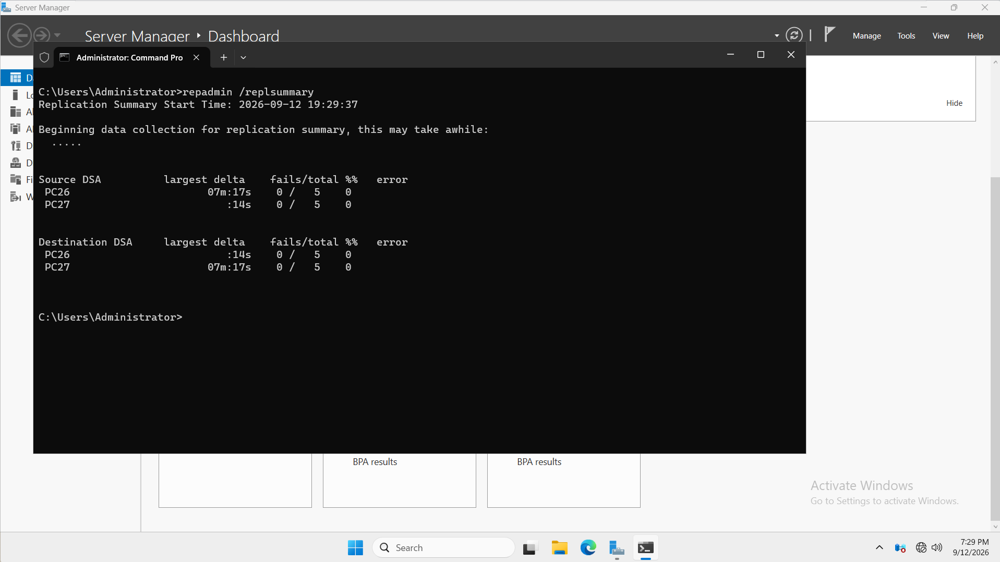

---

## 2. Existing Audit Policy Baseline

Before applying the dedicated auditing GPO to PC27, the existing effective audit policy was reviewed using `auditpol`.

The baseline showed:

| Subcategory | Baseline State |
|---|---|
| Audit Logon | Success and Failure |
| Audit User Account Management | Success |

This was baseline evidence only.

Phase 18 does not claim that all audit settings were previously unconfigured.

The dedicated auditing GPO was created to centrally enforce the required configuration and ensure that User Account Management auditing included both Success and Failure.

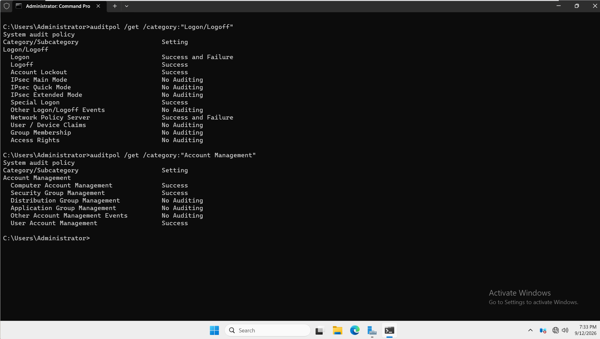

---

## 3. Dedicated Auditing GPO — Pilot Scope

A dedicated Group Policy Object was created:

`GPO - DC Advanced Auditing`

The GPO was linked to:

`virexon.local/Domain Controllers`

The initial Security Filtering contained only:

`PC27$`

This made PC27 the pilot Domain Controller while PC26 remained outside the Phase 18 GPO.

The following existing policies were not modified:

- Default Domain Policy
- Default Domain Controllers Policy
- `GPO - DC Disable Print Spooler`
- `GPO - DC Windows Defender Firewall`

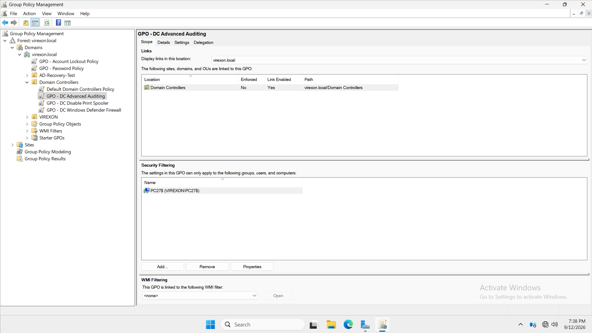

---

## 4. Advanced Audit Policy Configuration

Only two Advanced Audit Policy subcategories were configured.

### Audit Logon

Path:

`Computer Configuration → Policies → Windows Settings → Security Settings → Advanced Audit Policy Configuration → Audit Policies → Logon/Logoff`

Configured:

- Success: Enabled
- Failure: Enabled

### Audit User Account Management

Path:

`Computer Configuration → Policies → Windows Settings → Security Settings → Advanced Audit Policy Configuration → Audit Policies → Account Management`

Configured:

- Success: Enabled
- Failure: Enabled

No additional Advanced Audit Policy subcategories were configured as part of Phase 18.

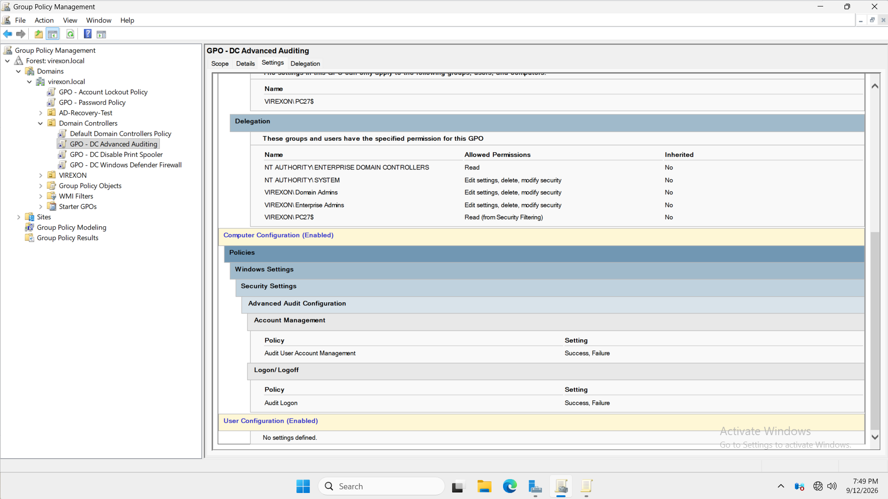

---

## 5. Advanced Audit Policy Subcategory Override

The following Security Option was enabled:

**Audit: Force audit policy subcategory settings (Windows Vista or later) to override audit policy category settings**

Value:

`Enabled`

This ensures that the configured Advanced Audit Policy subcategories are used instead of being unintentionally overridden by legacy/basic audit-policy category settings.

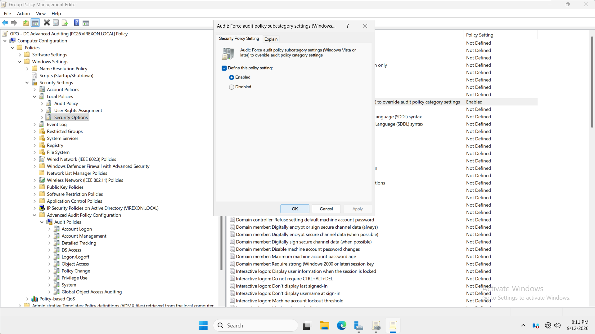

---

## 6. PC27 Pilot — Group Policy Application

After configuring the dedicated auditing GPO, Group Policy was refreshed on PC27.

`gpresult` confirmed that:

`GPO - DC Advanced Auditing`

appeared under:

`Applied Group Policy Objects`

This verified that the pilot Domain Controller successfully received the Phase 18 GPO.

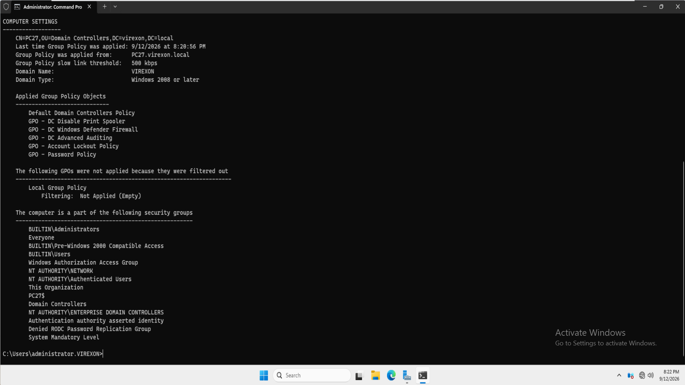

---

## 7. PC27 Effective Audit Policy Verification

The effective audit policy on PC27 was verified using `auditpol`.

The result showed:

- `Logon = Success and Failure`
- `User Account Management = Success and Failure`

This confirmed that the required Advanced Audit Policy configuration was effective on PC27.

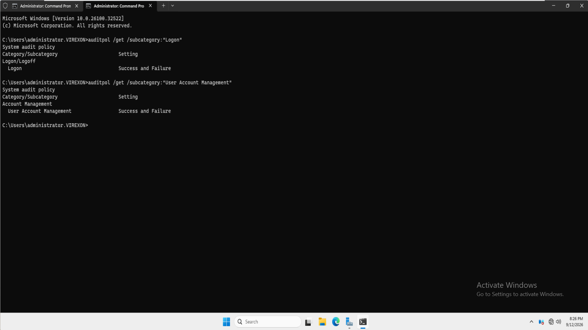

---

## 8. Controlled User Creation Audit Test

A temporary non-privileged Active Directory account was created for functional validation.

### Temporary Account

Display Name:

`Audit Test User`

Logon Name:

`audit.test`

The account was:

- Created only for Phase 18 validation.
- Not granted administrative privileges.
- Not added to privileged groups.
- Deleted after the test was completed.

The account operation was performed through Active Directory Users and Computers while explicitly targeting:

`PC27.virexon.local`

After creation, the Security log on PC27 was reviewed.

The following event was successfully located:

**Event ID 4720 — A user account was created**

The event confirmed:

- Computer: `PC27.virexon.local`
- Account Name: `audit.test`
- Security ID: `VIREXON\audit.test`
- Display Name: `Audit Test User`
- Task Category: User Account Management
- Keywords: Audit Success

This provided functional evidence that the User Account Management audit configuration recorded the account-creation action.

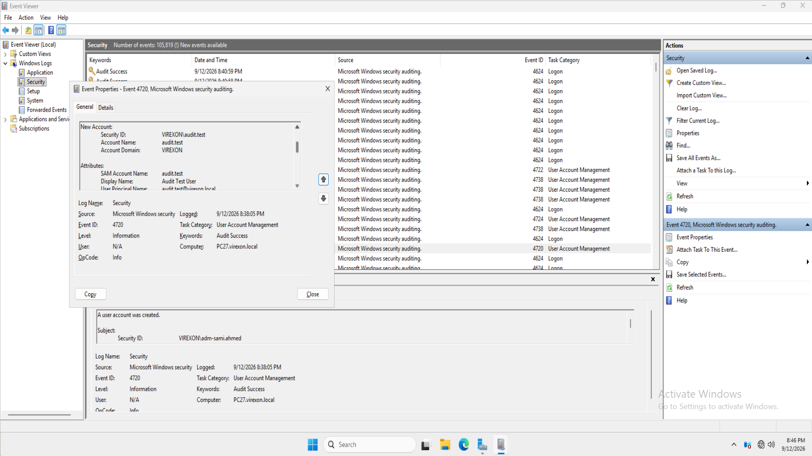

---

## 9. Controlled User Deletion Audit Test

The temporary account:

`audit.test`

was then deleted while ADUC remained targeted to PC27.

The Security log on PC27 was reviewed again.

The following event was successfully located:

**Event ID 4726 — A user account was deleted**

The event confirmed:

- Computer: `PC27.virexon.local`
- Target Account: `audit.test`
- Security ID: `VIREXON\audit.test`
- Task Category: User Account Management
- Keywords: Audit Success

The temporary test account was removed after validation.

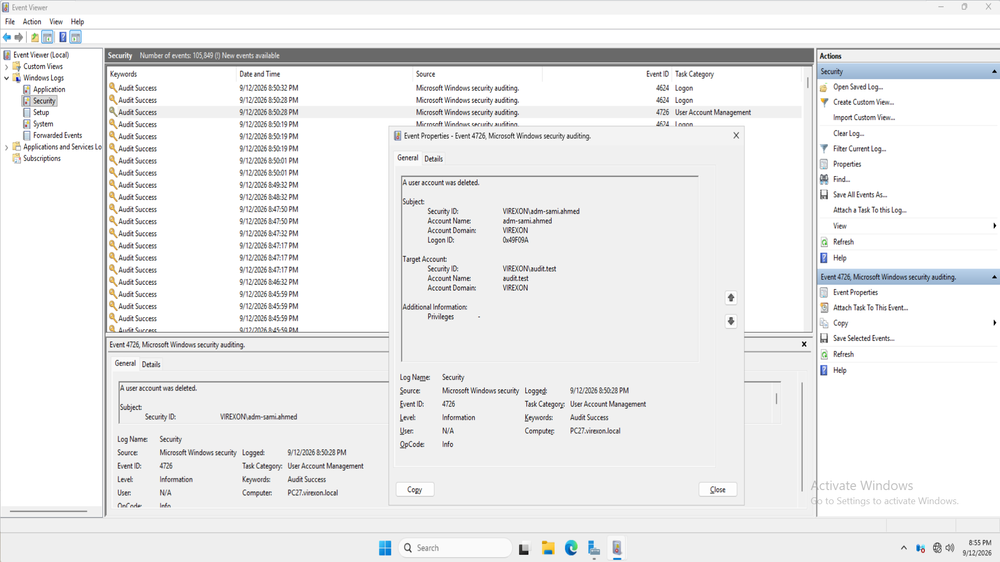

---

## 10. PC27 Pilot Replication Validation

After completing the PC27 pilot, Active Directory replication health was checked again.

During the initial post-pilot validation, a temporary replication issue was observed:

`1722 — The RPC server is unavailable`

The issue affected part of the replication path from PC26 toward PC27.

Additional inspection using:

`repadmin /showrepl`

showed that some naming contexts were successfully replicating while the Configuration and Schema naming contexts had recorded RPC failures.

The Phase 18 rollout was stopped at that point and PC26 was not added to the auditing GPO while replication was unhealthy.

The replication condition later returned to a healthy state.

A subsequent `repadmin /replsummary` showed:

- PC26 Source: `0 / 5` failures.
- PC27 Source: `0 / 5` failures.
- PC26 Destination: `0 / 5` failures.
- PC27 Destination: `0 / 5` failures.
- Failure percentage: `0%`.

No root cause for the temporary RPC replication failure was proven.

Therefore, this phase does not claim that the auditing configuration caused the replication issue.

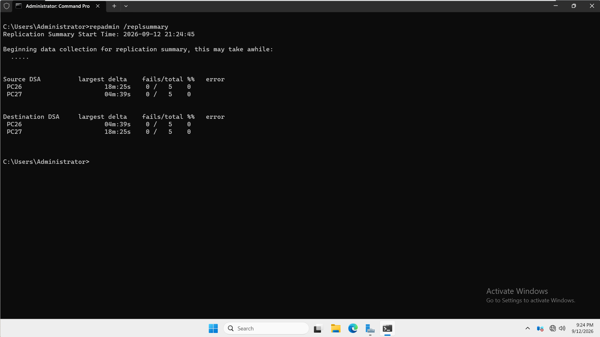

---

## 11. Final Auditing GPO Scope

After the PC27 pilot was successfully validated and Active Directory replication returned to a healthy state, PC26 was added to the Security Filtering.

Final Security Filtering:

- `PC26$`
- `PC27$`

The GPO remained linked to:

`virexon.local/Domain Controllers`

`Authenticated Users` was not used as the Security Filtering target for this dedicated GPO.

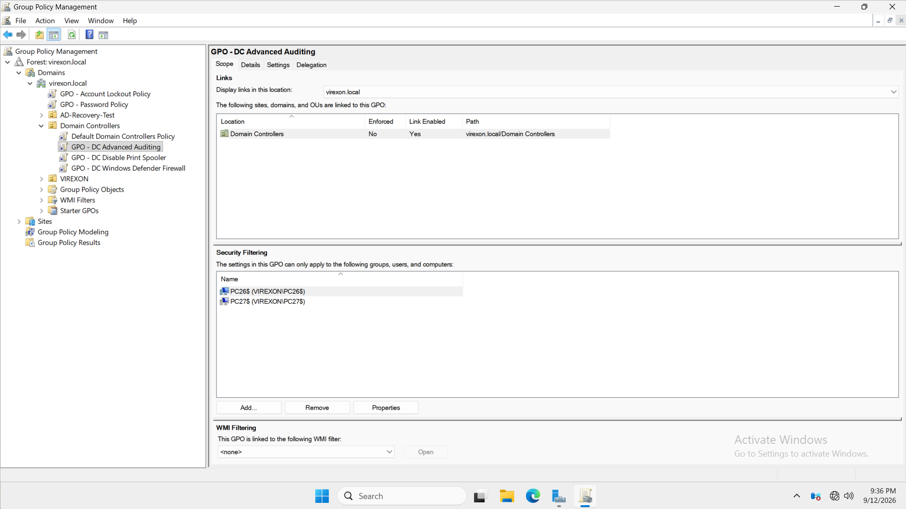

---

## 12. PC26 Group Policy Application

Group Policy was refreshed on PC26.

`gpresult` confirmed that:

`GPO - DC Advanced Auditing`

appeared under:

`Applied Group Policy Objects`

This verified that the auditing configuration was successfully deployed to PC26 after the pilot phase.

The result also showed:

`GPO - DC Windows Defender Firewall`

as denied by Security Filtering.

This was expected because Phase 17 intentionally retained the Firewall GPO as a PC27-only pilot deployment.

The Phase 17 Firewall GPO was not modified during Phase 18.

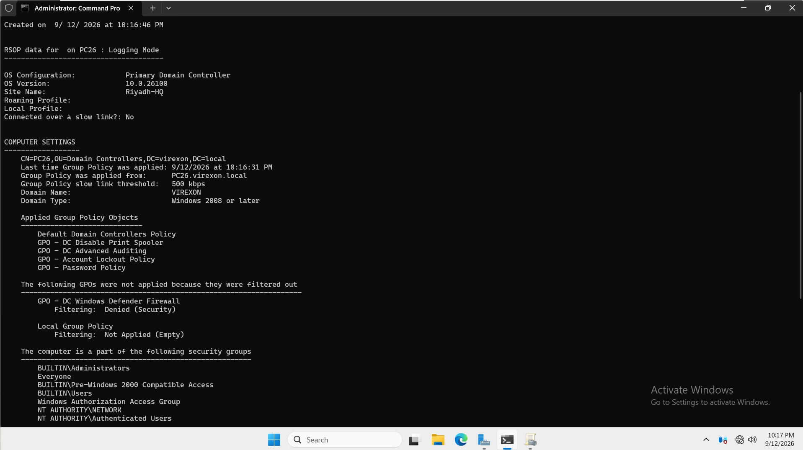

---

## 13. PC26 Effective Audit Policy Verification

The effective audit policy on PC26 was verified using `auditpol`.

The result showed:

- `Logon = Success and Failure`
- `User Account Management = Success and Failure`

This confirmed that the final Advanced Audit Policy configuration was effective on both Domain Controllers.

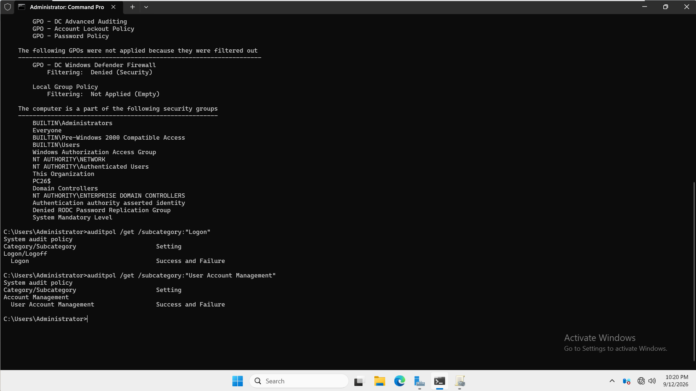

---

## 14. Final Active Directory Replication Health

After the auditing configuration was deployed to both Domain Controllers, a final Active Directory replication validation was performed using:

`repadmin /replsummary`

The final result showed:

### Source DSA

- PC26: `0 / 5` failures.
- PC27: `0 / 5` failures.

### Destination DSA

- PC26: `0 / 5` failures.
- PC27: `0 / 5` failures.

Final failure percentage:

`0%`

No replication errors were present in the final validation.

This confirmed that both Domain Controllers remained healthy after the Phase 18 deployment.

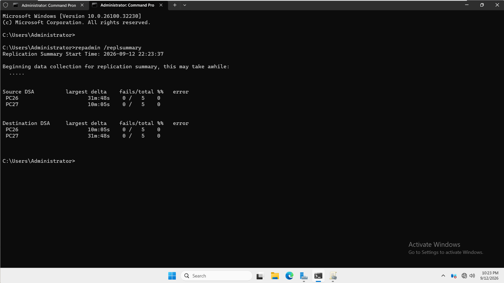

---

## Audit Logon Validation Scope

The following policy was configured and verified as effective on both Domain Controllers:

`Audit Logon = Success and Failure`

Typical related Security events include:

- Event ID `4624` — successful logon.
- Event ID `4625` — failed logon.

However, Phase 18 did **not** deliberately perform dedicated functional test scenarios for both Event ID 4624 and Event ID 4625.

Therefore:

**Audit Logon was configured and verified as effective, but successful and failed logon events were not both deliberately functionally tested during this phase.**

This distinction is intentional and prevents the documentation from claiming testing that was not performed.

---

## GPO Backup Status

A backup of:

`GPO - DC Advanced Auditing`

was included in the original Phase 18 plan before expanding the policy to PC26.

The backup was intentionally **not performed**.

Therefore, this documentation does not claim that a Phase 18 GPO backup exists.

---

## What Was Functionally Tested

| Test | Result |
|---|---|
| Initial AD replication health | Passed |
| PC27 audit-policy baseline reviewed | Completed |
| Dedicated auditing GPO created | Completed |
| PC27 pilot Security Filtering configured | Completed |
| Audit Logon Success and Failure configured | Completed |
| Audit User Account Management Success and Failure configured | Completed |
| Audit subcategory override enabled | Completed |
| Auditing GPO applied to PC27 | Passed |
| Effective Audit Logon policy on PC27 | Passed |
| Effective User Account Management policy on PC27 | Passed |
| Event ID 4720 generated for `audit.test` | Passed |
| Event ID 4726 generated for `audit.test` | Passed |
| Temporary `audit.test` account removed | Passed |
| PC27 pilot replication validation | Passed after temporary RPC failure cleared |
| Final Security Filtering expanded to PC26 and PC27 | Completed |
| Auditing GPO applied to PC26 | Passed |
| Effective Audit Logon policy on PC26 | Passed |
| Effective User Account Management policy on PC26 | Passed |
| Final AD replication validation | Passed |
| Final replication failure percentage | `0%` |

---

## Out of Scope

The following technologies and auditing categories were intentionally excluded from Phase 18:

- File and folder Object Access Auditing
- NTFS SACL configuration
- File Server access auditing
- Audit Process Creation
- Command-line process auditing
- PowerShell Script Block Logging
- PowerShell Transcription
- Registry auditing
- Directory Service Changes / Event ID 5136
- Deep Kerberos auditing
- Windows Event Forwarding
- SIEM integration
- Microsoft Sentinel
- Microsoft Defender for Identity
- Sysmon
- Centralized audit-log forwarding
- Full Microsoft enterprise auditing baseline
- Account lockout testing
- Repeated incorrect-password testing

These items were intentionally excluded to keep Phase 18 focused on practical Windows Server System Administration rather than SOC or SIEM engineering.

---

## Final Configuration

### Group Policy Object

`GPO - DC Advanced Auditing`

### Link Location

`virexon.local/Domain Controllers`

### Final Security Filtering

- `PC26$`
- `PC27$`

### Advanced Audit Policy

- Audit Logon: Success and Failure
- Audit User Account Management: Success and Failure

### Security Option

- Force audit policy subcategory settings to override audit policy category settings: Enabled

### Functionally Verified Security Events

- Event ID `4720` — User account created.
- Event ID `4726` — User account deleted.

### Temporary Test Account

`audit.test`

Final status:

`Deleted`

### Final Active Directory Replication Status

`0 failures`

---

## Result

Phase 18 successfully demonstrated a practical Windows Server auditing workflow:

**Dedicated GPO → Advanced Audit Policy → Effective Policy → Controlled AD Activity → Security Event → Event Viewer Verification**

The auditing configuration was first validated on PC27 and expanded to PC26 only after the pilot succeeded.

Selected Advanced Audit Policy subcategories were centrally configured and verified as effective on both Domain Controllers.

Controlled Active Directory user-account creation and deletion activity was successfully captured through Security Event IDs 4720 and 4726.

The temporary `audit.test` account was removed after testing.

Audit Logon was configured for Success and Failure and verified as effective, but dedicated functional testing of both Event IDs 4624 and 4625 was intentionally not performed.

A temporary RPC replication error was observed during pilot validation, but no root cause was proven. Deployment continued only after Active Directory replication returned to zero failures.

The phase remained focused on practical Windows Server administration and intentionally excluded advanced SOC/SIEM auditing technologies.

Final Active Directory replication validation completed successfully with:

**0 replication failures.**

---

## Phase Status

**Phase 18 — Auditing: COMPLETED**

Next Phase:

**19 — PowerShell Administration**
