# 19 — PowerShell Administration

## Overview

Phase 19 focused on practical PowerShell administration within the VIREXON Windows Server infrastructure.

The objective was to demonstrate common PowerShell tasks expected from a Windows/System Administrator, including Active Directory discovery, user and group queries, replication inspection, controlled account administration, basic scripting, CSV reporting, Windows Event Log querying, cleanup, and final infrastructure validation.

The work was performed primarily from:

- **Server:** PC26.virexon.local
- **Domain:** virexon.local
- **NetBIOS:** VIREXON
- **Active Directory Site:** Riyadh-HQ

PC27 remained online throughout the phase to maintain Active Directory availability and replication.

---

## Objectives

The objectives of this phase were to:

- Validate the installed PowerShell environment.
- Confirm availability of the ActiveDirectory PowerShell module.
- Query the VIREXON domain using PowerShell.
- Discover the available Domain Controllers.
- Query Active Directory users and groups.
- Practice basic pipeline and property-selection concepts.
- Inspect Active Directory replication information using PowerShell.
- Create and validate one temporary Active Directory user.
- Create and execute a small reusable inventory script.
- Export Active Directory information to CSV.
- Validate the generated CSV report.
- Query the Windows System Event Log.
- Remove the temporary Active Directory account.
- Confirm Active Directory replication remained healthy after the phase.

---

## Environment

| Component | Value |
|---|---|
| Primary Administration Server | PC26.virexon.local |
| Additional Domain Controller | PC27.virexon.local |
| Domain | virexon.local |
| NetBIOS | VIREXON |
| Active Directory Site | Riyadh-HQ |
| PC26 IP Address | 192.168.1.2 |
| PC27 IP Address | 192.168.1.3 |

---

# Implementation

## 1. Pre-PowerShell Active Directory Replication Health

Before beginning Phase 19, Active Directory replication health was validated from PC26.

Command:

```powershell
repadmin /replsummary
```

The replication summary showed:

- PC26 Source: **0 / 5 failures**
- PC27 Source: **0 / 5 failures**
- PC26 Destination: **0 / 5 failures**
- PC27 Destination: **0 / 5 failures**
- Failure percentage: **0%**

This confirmed that Active Directory replication was healthy before beginning the PowerShell administration activities.

### Evidence

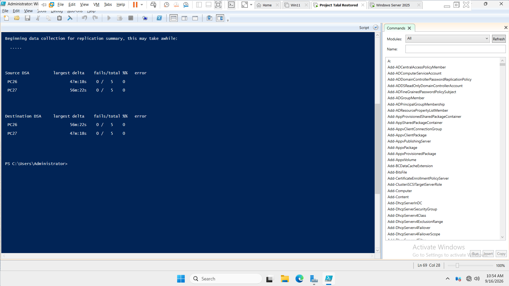

---

## 2. PowerShell Environment and Active Directory Module

The PowerShell environment on PC26 was inspected before performing Active Directory administration.

Commands:

```powershell
$PSVersionTable
```

```powershell
Get-Host
```

```powershell
Get-Module -ListAvailable ActiveDirectory
```

The results confirmed:

- **PowerShell Version:** 5.1.26100.7462
- **Host:** Windows PowerShell ISE Host
- **ActiveDirectory Module:** Available
- **ActiveDirectory Module Version:** 1.0.1.0

The existing Windows PowerShell environment on PC26 was used for the phase.

### Evidence

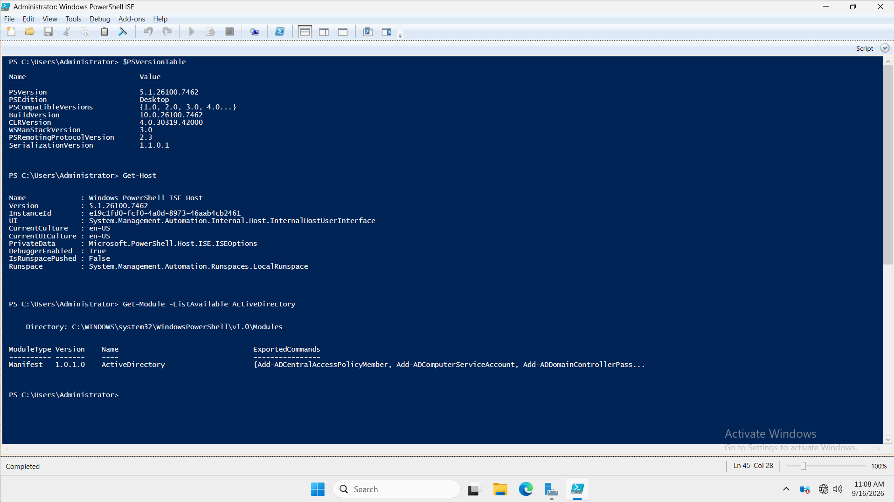

---

## 3. Domain and Domain Controller Discovery

PowerShell was used to retrieve information about the VIREXON Active Directory environment.

Commands:

```powershell
Get-ADDomain
```

```powershell
Get-ADDomainController -Filter *
```

The Domain Controller query returned both VIREXON Domain Controllers.

### PC26

- HostName: `PC26.virexon.local`
- IPv4Address: `192.168.1.2`
- Domain: `virexon.local`
- Site: `Riyadh-HQ`
- Global Catalog: `True`

### PC27

- HostName: `PC27.virexon.local`
- IPv4Address: `192.168.1.3`
- Domain: `virexon.local`
- Site: `Riyadh-HQ`
- Global Catalog: `True`

This confirmed successful Active Directory infrastructure discovery through PowerShell.

### Evidence

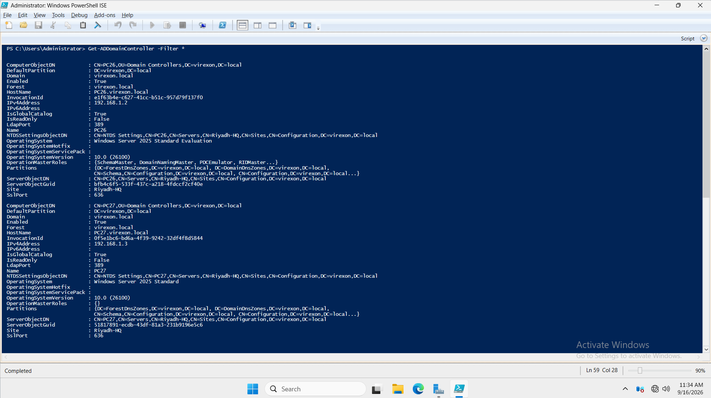

---

## 4. Active Directory User and Group Queries

Existing Active Directory users and groups were queried through PowerShell.

Initial user query:

```powershell
Get-ADUser -Filter *
```

Initial group query:

```powershell
Get-ADGroup -Filter *
```

Basic pipeline and property-selection concepts were then practiced.

User query:

```powershell
Get-ADUser -Filter * | Select-Object Name, Enabled
```

This command retrieves Active Directory users and displays only:

- `Name`
- `Enabled`

A similar query was performed for Active Directory groups:

```powershell
Get-ADGroup -Filter * | Select-Object Name, GroupScope
```

This displayed:

- Group name
- Group scope

The activity demonstrated practical use of:

- `Get-ADUser`
- `Get-ADGroup`
- `-Filter *`
- PowerShell Pipeline (`|`)
- `Select-Object`
- Property selection

No existing Active Directory users or groups were modified during these queries.

### Evidence

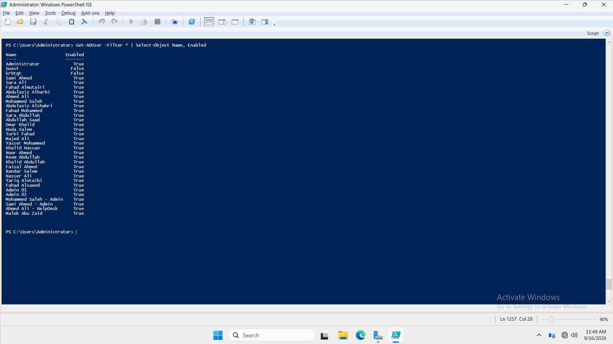

---

## 5. Active Directory Replication Query Using PowerShell

Active Directory replication information was inspected using the ActiveDirectory PowerShell module.

Command:

```powershell
Get-ADReplicationPartnerMetadata -Target PC26 -Scope Server
```

The returned information included:

- Server: `PC26.virexon.local`
- Replication partner information
- Partner type: `Inbound`
- Last replication result: `0`
- Consecutive replication failures: `0`
- Last successful replication timestamp

The command was used as a read-only PowerShell replication query.

### Evidence

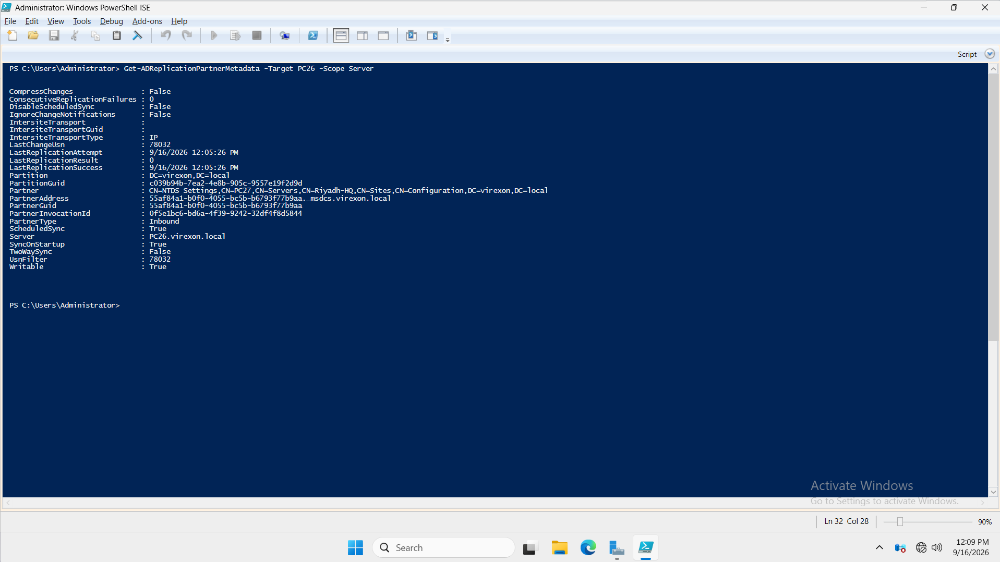

---

# Temporary Active Directory User

## 6. Temporary Account Pre-Validation

Before creating the temporary user, PowerShell was used to verify that the account did not already exist.

Command:

```powershell
Get-ADUser -Identity ps.test
```

PowerShell returned that no object with the identity `ps.test` could be found.

This confirmed that the account name was not already in use.

The target Organizational Unit was then verified.

Command:

```powershell
Get-ADOrganizationalUnit -Filter 'Name -eq "IT"'
```

Two IT Organizational Units were returned:

```text
OU=IT,OU=Users,OU=VIREXON,DC=virexon,DC=local
```

```text
OU=IT,OU=Computers,OU=VIREXON,DC=virexon,DC=local
```

The correct target for the temporary user was confirmed as:

```text
OU=IT,OU=Users,OU=VIREXON,DC=virexon,DC=local
```

---

## 7. Secure Password Input

The temporary account password was entered using secure PowerShell input.

Command:

```powershell
$Password = Read-Host "Enter temporary password" -AsSecureString
```

The password was not displayed in the PowerShell console or included in the documentation.

---

## 8. Temporary User Creation

A temporary Active Directory account was created using PowerShell.

Account details:

| Property | Value |
|---|---|
| Name | PowerShell Test User |
| SamAccountName | ps.test |
| UserPrincipalName | ps.test@virexon.local |
| Target OU | VIREXON → Users → IT |
| Enabled | True |

Command:

```powershell
New-ADUser -Name "PowerShell Test User" -SamAccountName "ps.test" -UserPrincipalName "ps.test@virexon.local" -Path "OU=IT,OU=Users,OU=VIREXON,DC=virexon,DC=local" -AccountPassword $Password -Enabled $true
```

The command completed without displaying an Active Directory creation error.

No privileged-group assignment command was performed for the temporary account during this phase.

### Evidence

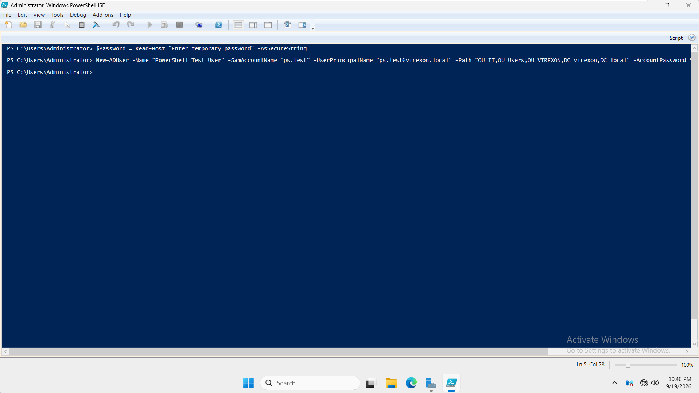

---

## 9. Temporary User Verification

The newly created account was verified using PowerShell.

Command:

```powershell
Get-ADUser -Identity ps.test
```

The returned properties confirmed:

- Name: `PowerShell Test User`
- SamAccountName: `ps.test`
- UserPrincipalName: `ps.test@virexon.local`
- Enabled: `True`
- Distinguished Name:

```text
CN=PowerShell Test User,OU=IT,OU=Users,OU=VIREXON,DC=virexon,DC=local
```

This confirmed that the account existed, was enabled, and had been created in the intended Organizational Unit.

### Evidence

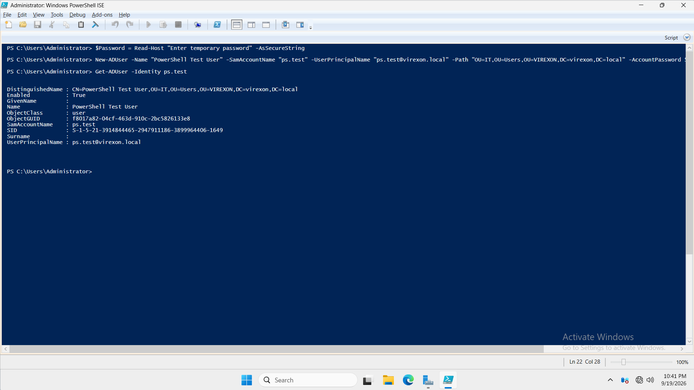

---

# Reusable PowerShell Inventory Script

## 10. Script Creation

A reusable PowerShell inventory script was created.

Script name:

```text
VIREXON-AD-Inventory.ps1
```

Local location:

```text
C:\PowerShell\VIREXON-AD-Inventory.ps1
```

The script contains:

```powershell
Get-ADDomain
Get-ADDomainController -Filter *
Get-ADUser -Filter * | Select-Object Name, Enabled
```

The script performs three read-only administrative tasks:

1. Retrieves Active Directory domain information.
2. Retrieves available Domain Controllers.
3. Retrieves Active Directory users and displays their names and enabled states.

The script does not modify Active Directory.

---

## 11. Inventory Script Execution

The script was executed from PowerShell ISE.

Script executed:

```text
C:\PowerShell\VIREXON-AD-Inventory.ps1
```

The output successfully returned:

- VIREXON domain information.
- Domain Controller information.
- Active Directory user information.

No execution errors were displayed.

### Evidence

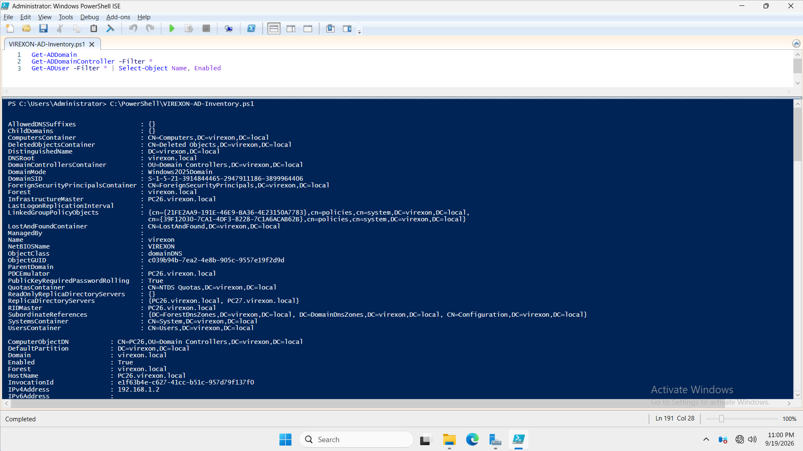

---

# CSV Inventory Report

## 12. Active Directory User Inventory Export

Active Directory user information was exported to a CSV file.

The selected properties were:

- Name
- SamAccountName
- Enabled

Command:

```powershell
Get-ADUser -Filter * | Select-Object Name, SamAccountName, Enabled | Export-Csv "C:\PowerShell\VIREXON-AD-User-Inventory.csv" -NoTypeInformation
```

Generated file:

```text
C:\PowerShell\VIREXON-AD-User-Inventory.csv
```

The report contained only the selected user inventory properties.

---

## 13. CSV Validation

The generated CSV report was validated by importing it back into PowerShell.

Command:

```powershell
Import-Csv "C:\PowerShell\VIREXON-AD-User-Inventory.csv"
```

The output successfully displayed:

- Name
- SamAccountName
- Enabled

The temporary `ps.test` account appeared in the CSV because the report was generated before the cleanup stage.

The account was removed later in the phase.

### Evidence

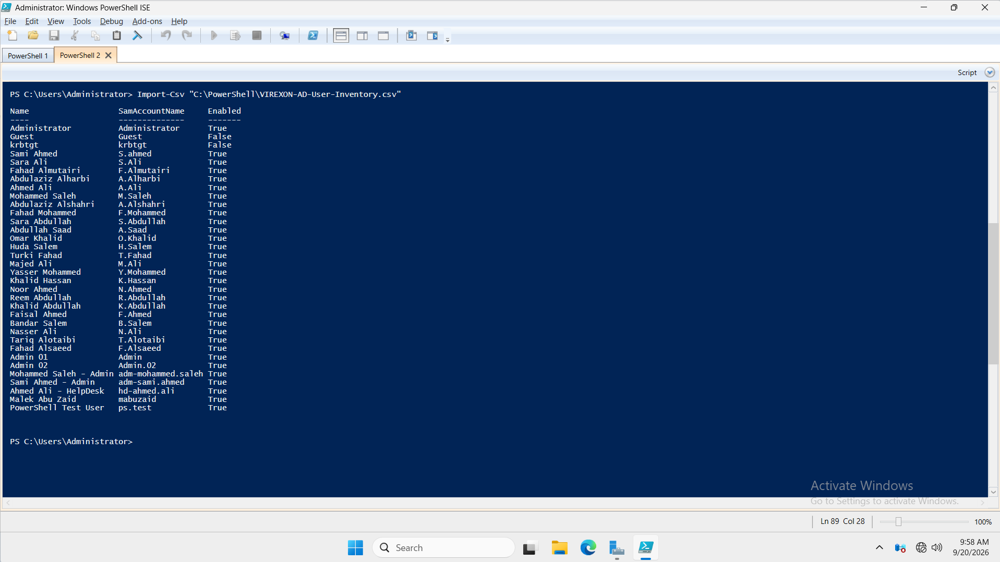

---

# Windows Event Log Query

## 14. System Event Log Query

PowerShell was used to retrieve recent events from the Windows System Event Log.

The final command used was:

```powershell
Get-WinEvent -LogName System -MaxEvents 10
```

The command returned the latest 10 events from the System log.

The output included information such as:

- TimeCreated
- Event ID
- LevelDisplayName
- Message
- Provider information

This was a read-only query and did not change Event Log or auditing configuration.

### Evidence

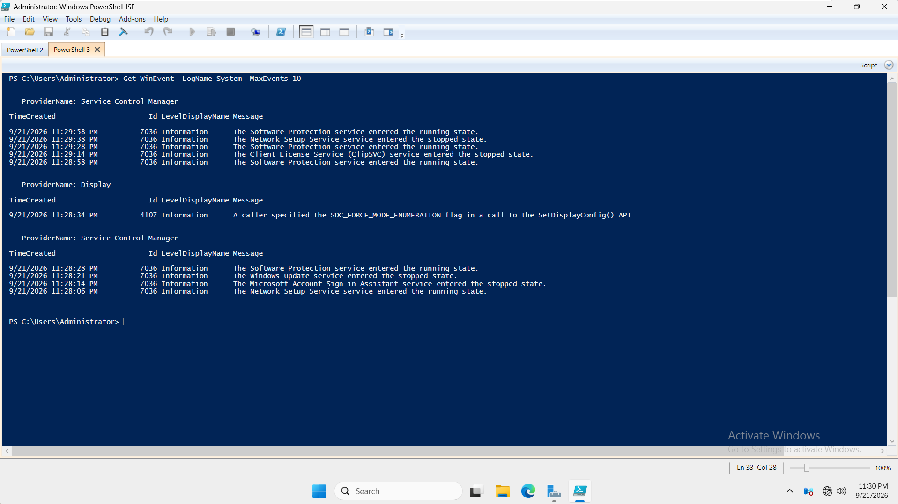

---

# Cleanup

## 15. Temporary User Removal

After completing the PowerShell administration tests, the temporary `ps.test` account was removed.

Command:

```powershell
Remove-ADUser -Identity ps.test
```

PowerShell displayed a confirmation prompt identifying the target object as:

```text
CN=PowerShell Test User,OU=IT,OU=Users,OU=VIREXON,DC=virexon,DC=local
```

The removal was confirmed.

---

## 16. Temporary User Removal Verification

After the deletion, PowerShell was used to verify that the account no longer existed.

Command:

```powershell
Get-ADUser -Identity ps.test
```

PowerShell returned:

```text
Cannot find an object with identity: 'ps.test'
```

In this context, this was the expected result and confirmed that the temporary user had been successfully removed.

### Evidence

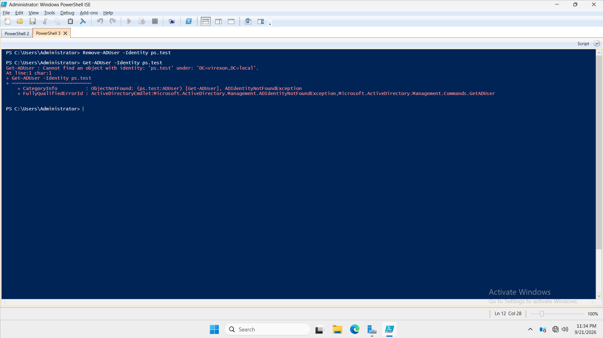

---

# Final Active Directory Validation

## 17. Final Replication Health Check

After all PowerShell administration activities and cleanup were completed, Active Directory replication was validated again.

Command:

```powershell
repadmin /replsummary
```

Final replication status:

### Source DSA

| Domain Controller | Fails / Total | Failure Percentage |
|---|---:|---:|
| PC26 | 0 / 5 | 0% |
| PC27 | 0 / 5 | 0% |

### Destination DSA

| Domain Controller | Fails / Total | Failure Percentage |
|---|---:|---:|
| PC26 | 0 / 5 | 0% |
| PC27 | 0 / 5 | 0% |

The final replication summary confirmed that Active Directory replication remained healthy after Phase 19.

### Evidence

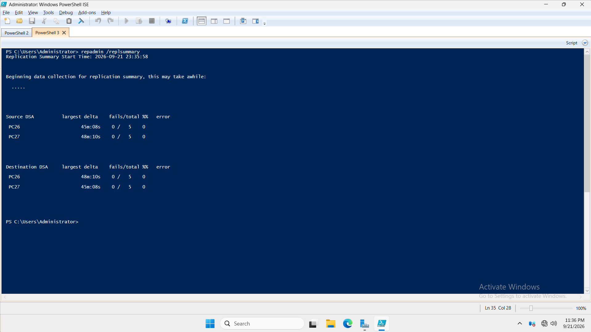

---

# Validation Summary

| Validation | Result |
|---|---|
| Initial AD replication health | Passed |
| PC26 replication failures | 0 |
| PC27 replication failures | 0 |
| PowerShell environment | Verified |
| ActiveDirectory module | Available |
| Domain query | Successful |
| Domain Controller discovery | Successful |
| PC26 discovered | Yes |
| PC27 discovered | Yes |
| Active Directory user query | Successful |
| Active Directory group query | Successful |
| Pipeline usage | Successful |
| Property selection | Successful |
| Replication metadata query | Successful |
| `ps.test` pre-existence check | Confirmed absent |
| Target User OU | Verified |
| Secure password input | Successful |
| `ps.test` creation | Successful |
| `ps.test` enabled state | Verified |
| `ps.test` OU placement | Verified |
| Inventory script created | Yes |
| Inventory script executed | Successful |
| CSV report generated | Successful |
| CSV report validated | Successful |
| Windows System Event Log query | Successful |
| `ps.test` removal | Successful |
| `ps.test` absence after removal | Verified |
| Final AD replication health | Passed |
| Final replication failures | 0 |

---

# Evidence

The following screenshots document Phase 19:

1. `01-Pre-PowerShell-AD-Replication-Health.png`
2. `02-PowerShell-Environment-and-AD-Module.png`
3. `03-PowerShell-Domain-DC-Discovery.png`
4. `04-PowerShell-AD-User-Group-Query.png`
5. `05-PowerShell-AD-Replication-Health-Query.png`
6. `06-PowerShell-Temporary-User-Creation.png`
7. `07-PowerShell-Temporary-User-Verification.png`
8. `08-PowerShell-Inventory-Script-Execution.png`
9. `09-PowerShell-CSV-Inventory-Output.png`
10. `10-PowerShell-System-Event-Log-Query.png`
11. `11-PowerShell-Temporary-User-Removal.png`
12. `12-Final-PowerShell-AD-Replication-Health.png`

---

# Phase Artifacts

The Phase 19 GitHub documentation contains:

```text
19-PowerShell-Administration/
│
├── README.md
├── VIREXON-AD-Inventory.ps1
└── Screenshots/
    ├── 01-Pre-PowerShell-AD-Replication-Health.png
    ├── 02-PowerShell-Environment-and-AD-Module.png
    ├── 03-PowerShell-Domain-DC-Discovery.png
    ├── 04-PowerShell-AD-User-Group-Query.png
    ├── 05-PowerShell-AD-Replication-Health-Query.png
    ├── 06-PowerShell-Temporary-User-Creation.png
    ├── 07-PowerShell-Temporary-User-Verification.png
    ├── 08-PowerShell-Inventory-Script-Execution.png
    ├── 09-PowerShell-CSV-Inventory-Output.png
    ├── 10-PowerShell-System-Event-Log-Query.png
    ├── 11-PowerShell-Temporary-User-Removal.png
    └── 12-Final-PowerShell-AD-Replication-Health.png
```

The generated CSV report was:

```text
VIREXON-AD-User-Inventory.csv
```

It was used as generated administrative output during the phase.

The reusable PowerShell artifact included with the phase is:

```text
VIREXON-AD-Inventory.ps1
```

---

# Final Result

Phase 19 successfully demonstrated practical PowerShell administration within the VIREXON Windows Server environment.

The completed work included:

- PowerShell environment validation.
- ActiveDirectory module verification.
- Active Directory domain discovery.
- Domain Controller discovery.
- Active Directory user and group queries.
- Basic pipeline usage.
- Property selection.
- Active Directory replication metadata inspection.
- Controlled temporary Active Directory user creation.
- Temporary account verification.
- Secure password input.
- Creation of a reusable read-only PowerShell inventory script.
- Successful execution of the inventory script.
- Active Directory user inventory export to CSV.
- CSV validation through PowerShell.
- Windows System Event Log querying.
- Temporary account cleanup.
- Final Active Directory replication validation.

The temporary `ps.test` account was removed before the phase was closed.

The final Active Directory replication summary showed:

**0 replication failures on PC26 and PC27.**

Phase 19 — PowerShell Administration was completed successfully.
